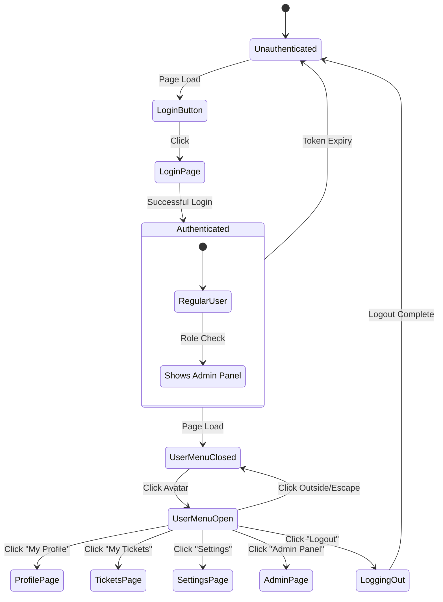

# User Menu Interaction Flow Diagrams

## State Transition Diagram



## User Interaction Flows

### 1. Login Flow
```
┌─────────────┐     ┌──────────────┐     ┌─────────────┐     ┌──────────────┐
│   User      │     │ Login Button │     │ Login Page  │     │ User Menu    │
│ (Anonymous) │     │   (Amber)    │     │             │     │  (Closed)    │
└──────┬──────┘     └──────┬───────┘     └──────┬──────┘     └──────┬───────┘
       │                   │                     │                    │
       │ Sees navbar       │                     │                    │
       ├──────────────────>│                     │                    │
       │                   │                     │                    │
       │ Clicks LOGIN      │                     │                    │
       ├──────────────────>│                     │                    │
       │                   ├────────────────────>│                    │
       │                   │ Navigate to /login │                     │
       │                   │                     │                    │
       │                   │    Enter creds      │                    │
       ├────────────────────────────────────────>│                    │
       │                   │                     │                    │
       │                   │                     │ Auth successful    │
       │                   │                     ├───────────────────>│
       │                   │                     │                    │
       │<────────────────────────────────────────────────────────────┤
       │              Show user menu with avatar                      │
```

### 2. Dropdown Interaction Flow
```
┌──────────┐     ┌─────────────┐     ┌──────────────┐     ┌─────────────┐
│   User   │     │ User Button │     │   Dropdown   │     │    Page     │
│ (Logged) │     │  (Avatar)   │     │    Menu      │     │ Navigation  │
└────┬─────┘     └──────┬──────┘     └──────┬───────┘     └──────┬──────┘
     │                  │                    │                     │
     │ Clicks avatar    │                    │                     │
     ├─────────────────>│                    │                     │
     │                  │                    │                     │
     │                  │ Toggle dropdown   │                     │
     │                  ├───────────────────>│                     │
     │                  │                    │                     │
     │                  │ Show with animation│                     │
     │<──────────────────────────────────────┤                     │
     │                  │                    │                     │
     │ Clicks item      │                    │                     │
     ├──────────────────────────────────────>│                     │
     │                  │                    │                     │
     │                  │                    │ Route to page      │
     │                  │                    ├────────────────────>│
     │                  │                    │                     │
     │                  │ Close dropdown     │                     │
     │                  │<───────────────────┤                     │
```

### 3. Mobile Menu Flow
```
┌──────────┐     ┌────────────┐     ┌─────────────┐     ┌──────────────┐
│   User   │     │ Hamburger  │     │Mobile Menu  │     │   Overlay    │
│ (Mobile) │     │   Icon     │     │  Drawer     │     │              │
└────┬─────┘     └─────┬──────┘     └──────┬──────┘     └──────┬───────┘
     │                 │                    │                    │
     │ Taps ≡         │                    │                    │
     ├───────────────>│                    │                    │
     │                 │                    │                    │
     │                 │ Open drawer       │                    │
     │                 ├──────────────────>│                    │
     │                 │                    ├───────────────────>│
     │                 │                    │ Show overlay       │
     │                 │                    │                    │
     │ See menu        │                    │                    │
     │<─────────────────────────────────────┤                    │
     │                 │                    │                    │
     │ Tap outside     │                    │                    │
     ├──────────────────────────────────────────────────────────>│
     │                 │                    │                    │
     │                 │                    │ Close signal       │
     │                 │                    │<───────────────────┤
     │                 │ Close drawer      │                    │
     │                 │<──────────────────┤                    │
```

## Component State Machine

### User Menu Component States

```
State: INITIAL
├─ Check Authentication
├─ If authenticated → AUTHENTICATED_CLOSED
└─ If not → SHOW_LOGIN_BUTTON

State: SHOW_LOGIN_BUTTON
├─ Display: "LOGIN" button with amber gradient
├─ On hover → Add lift effect
├─ On click → Navigate to /login
└─ On auth change → AUTHENTICATED_CLOSED

State: AUTHENTICATED_CLOSED
├─ Display: Avatar + Name + Chevron
├─ On hover → Show cream background
├─ On click → AUTHENTICATED_OPEN
├─ On logout → SHOW_LOGIN_BUTTON
└─ On token expiry → SHOW_LOGIN_BUTTON

State: AUTHENTICATED_OPEN
├─ Display: Dropdown menu with items
├─ On item click → Navigate + AUTHENTICATED_CLOSED
├─ On outside click → AUTHENTICATED_CLOSED
├─ On escape key → AUTHENTICATED_CLOSED
└─ On scroll → AUTHENTICATED_CLOSED

State: LOGGING_OUT
├─ Display: Loading spinner
├─ Clear tokens
├─ On success → SHOW_LOGIN_BUTTON
└─ On error → Show toast + AUTHENTICATED_CLOSED
```

## Event Flow Sequences

### Click Outside Detection
```javascript
1. User clicks avatar → Dropdown opens
2. Document listener activated
3. User clicks anywhere
4. Event bubbles to document
5. Check if click target is inside menu
6. If outside → Close dropdown
7. If inside → Ignore event
```

### Keyboard Navigation
```
TAB Key Flow:
Login Button → Next focusable element

When dropdown open:
Avatar Button → My Profile → My Tickets → Settings → 
Admin Panel (if admin) → Logout → Next element

ENTER Key:
- On button: Toggle dropdown
- On item: Navigate to page

ESCAPE Key:
- Close dropdown if open
- Return focus to avatar button
```

### Animation Sequences

#### Dropdown Open Animation (300ms)
```
0ms    - opacity: 0, transform: translateY(-10px)
150ms  - opacity: 0.5, transform: translateY(-5px)  
300ms  - opacity: 1, transform: translateY(0)
```

#### Login Button Hover (400ms)
```
0ms    - transform: translateY(0), shadow: normal
200ms  - transform: translateY(-1px), shadow: medium
400ms  - transform: translateY(-2px), shadow: large
```

#### Mobile Menu Slide (300ms)
```
0ms    - right: -100%, overlay: opacity 0
150ms  - right: -50%, overlay: opacity 0.25
300ms  - right: 0%, overlay: opacity 0.5
```

## Error Recovery Flows

### Network Error During Logout
```
1. User clicks Logout
2. Show loading state
3. API call fails
4. Retry once (1s delay)
5. If still fails:
   - Clear local tokens
   - Show warning toast
   - Navigate to home
   - Set state to logged out
```

### Avatar Load Failure
```
1. Attempt to load user avatar
2. Image returns 404/error
3. Immediately show placeholder
4. Log error for monitoring
5. No user-facing error message
6. Continue normal operation
```

## Performance Optimization Flow

### Lazy Loading Sequence
```
1. Initial render: Basic menu structure
2. After mount: Load user data
3. Avatar loads: Async with placeholder
4. Dropdown items: Render on first open
5. Animations: GPU-accelerated CSS only
```

### Memory Management
```
Event Listeners:
- Add on component mount
- Remove on component unmount
- Use passive listeners where applicable
- Debounce scroll events (100ms)

State Updates:
- Batch related updates
- Avoid unnecessary re-renders
- Clean up timers/intervals
```

## Mobile-Specific Flows

### Touch Gesture Handling
```
Touch Start → Record position
Touch Move → If > 50px horizontal → Start close
Touch End → If velocity > threshold → Close menu
           → Else → Snap back open
```

### Responsive Transition
```
Desktop → Mobile (< 768px):
1. Hide desktop nav
2. Show hamburger icon
3. Move user info to mobile menu
4. Adjust touch targets to 44px

Mobile → Desktop (≥ 768px):
1. Close mobile menu if open
2. Show desktop nav
3. Restore dropdown functionality
4. Apply hover states
```

## Security Flow

### Token Validation
```
Every Navigation:
1. Check token expiry
2. If expired → Refresh token
3. If refresh fails → Force logout
4. Update UI state
5. Log security event
```

### Role-Based Rendering
```
On User Data Load:
1. Parse JWT claims
2. Extract roles array
3. Check for "Admin" role
4. Set isAdmin flag
5. Conditionally render admin items
6. Server validates on navigation
```