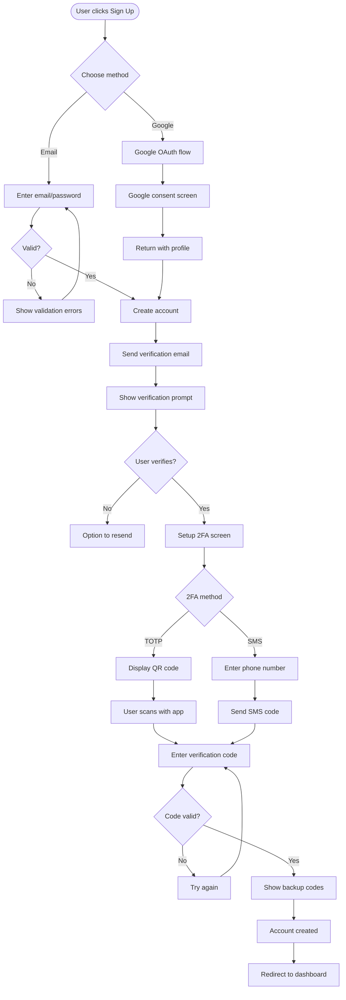
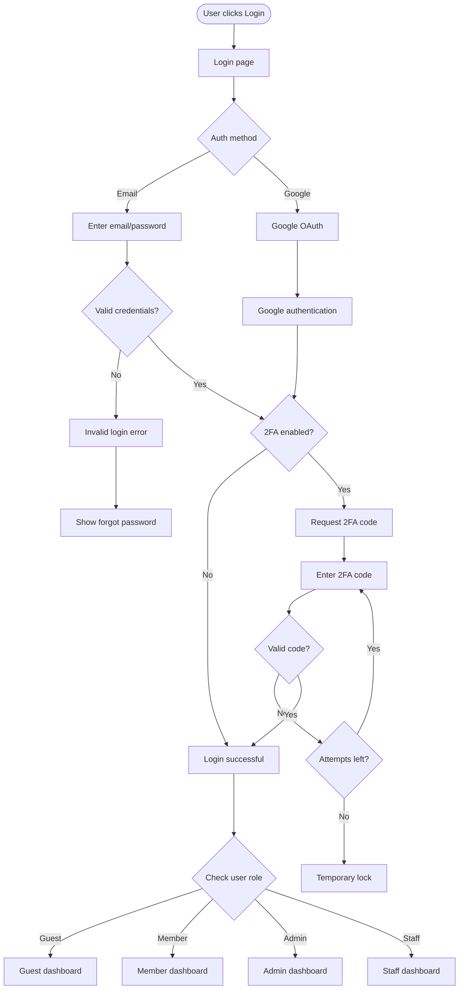
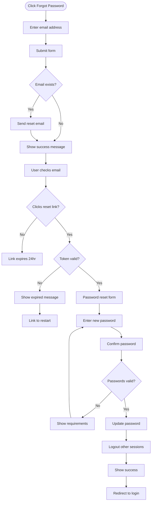
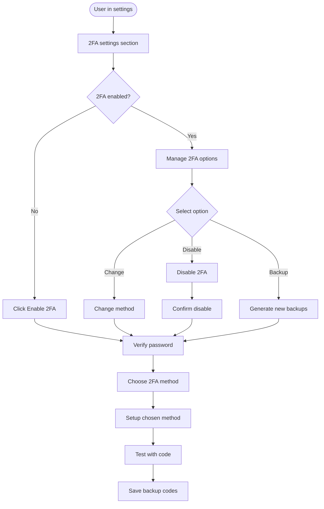
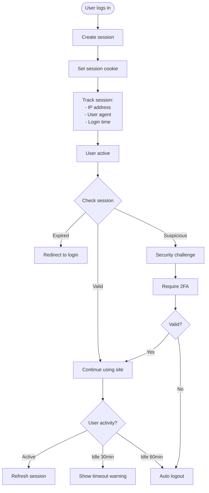
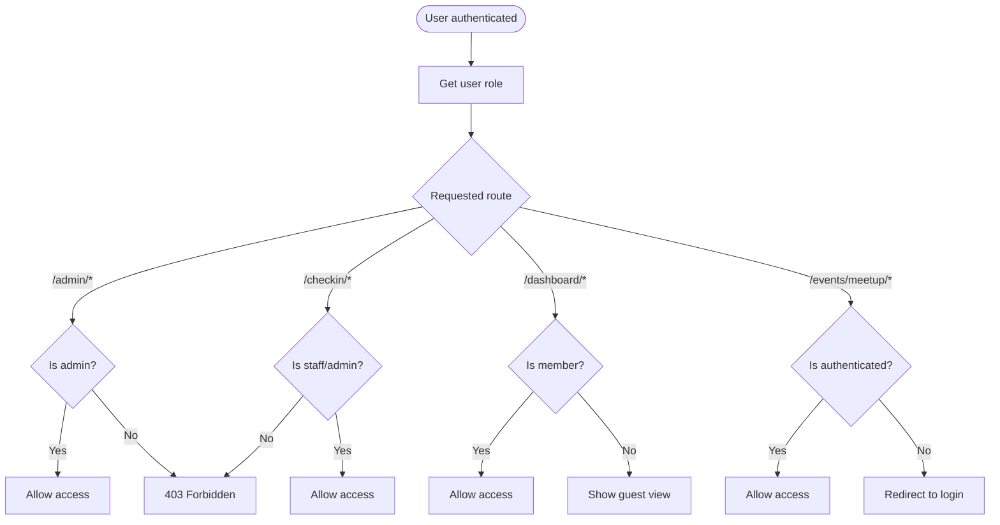

# Authentication & Authorization Flows

## 1. Account Creation Flow

## 2. Login Flow

## 3. Password Reset Flow

## 4. Two-Factor Authentication Management

## 5. Session Management Flow

## Role-Based Access Control (RBAC)

## Security Features

### Password Requirements
- Minimum 12 characters
- Mix of upper/lowercase
- At least one number
- At least one special character
- Not in common password list
- Different from last 5 passwords

### 2FA Options
- TOTP (Google Authenticator, Authy)
- SMS backup (optional)
- Backup codes (10 single-use)
- Recovery email option

### Session Security
- Secure, httpOnly cookies
- CSRF protection
- Session timeout (60 min idle)
- IP address validation
- Concurrent session limits

### Account Security
- Email verification required
- 2FA mandatory for all users
- Account lockout after 5 failed attempts
- Password reset rate limiting
- Login anomaly detection