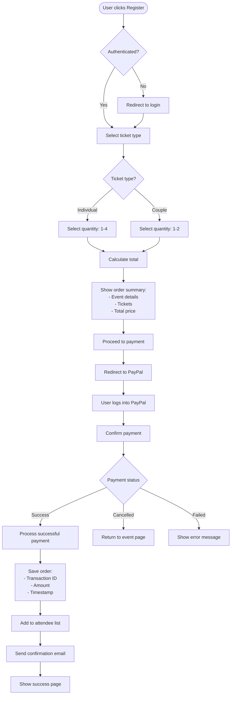
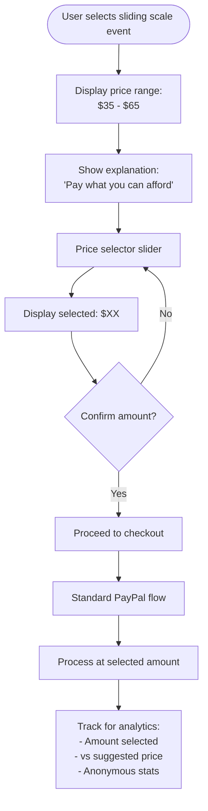
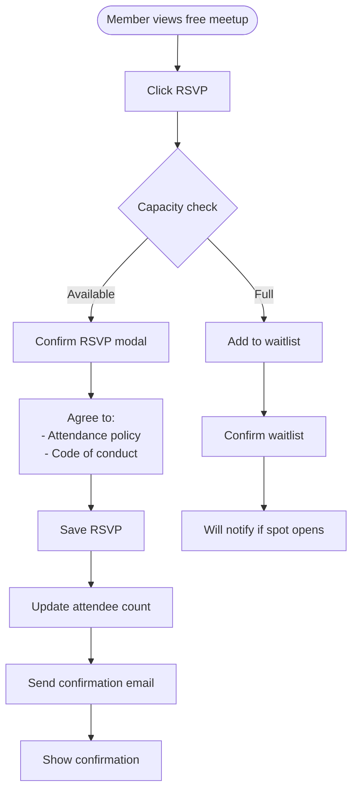
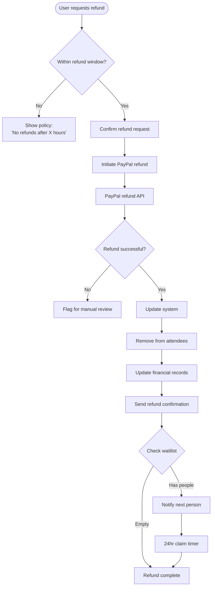
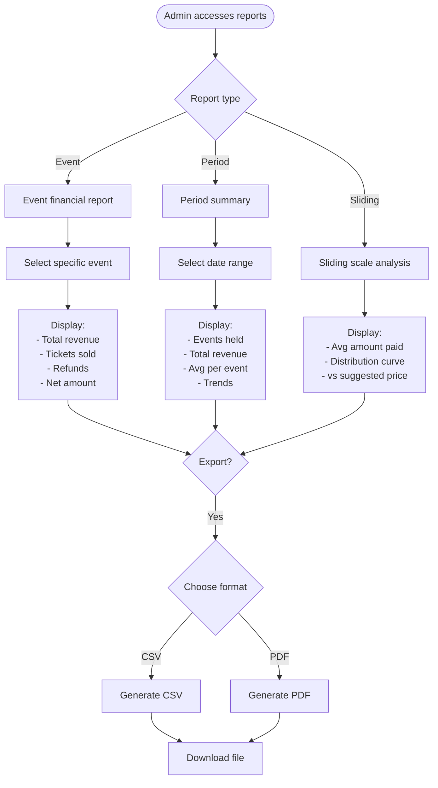
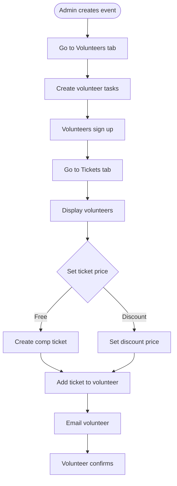

# Payment & Financial Flows

## 1. Ticket Purchase Flow (Fixed Price)

## 2. Sliding Scale Payment Flow

## 3. Free Event RSVP Flow

## 4. Refund Processing Flow

## 5. Financial Reporting Flow (Admin)

## 6. Volunteer Ticket Flow

## Payment Security Features

### PCI Compliance
- No credit card data stored
- All payments through PayPal
- Secure redirect flow
- Transaction IDs only

### Fraud Prevention
- Rate limiting on purchases
- Duplicate payment detection
- Refund abuse monitoring
- IP address tracking

### Financial Controls
- Admin-only refund approval
- Audit trail for all transactions
- Daily reconciliation option
- Automated receipts

## Sliding Scale Guidelines

### Implementation
- Honor system based
- No verification required
- Anonymous tracking only
- Suggested midpoint shown

### Reporting
- Distribution analytics
- No individual tracking
- Aggregate data only
- Helps set future pricing