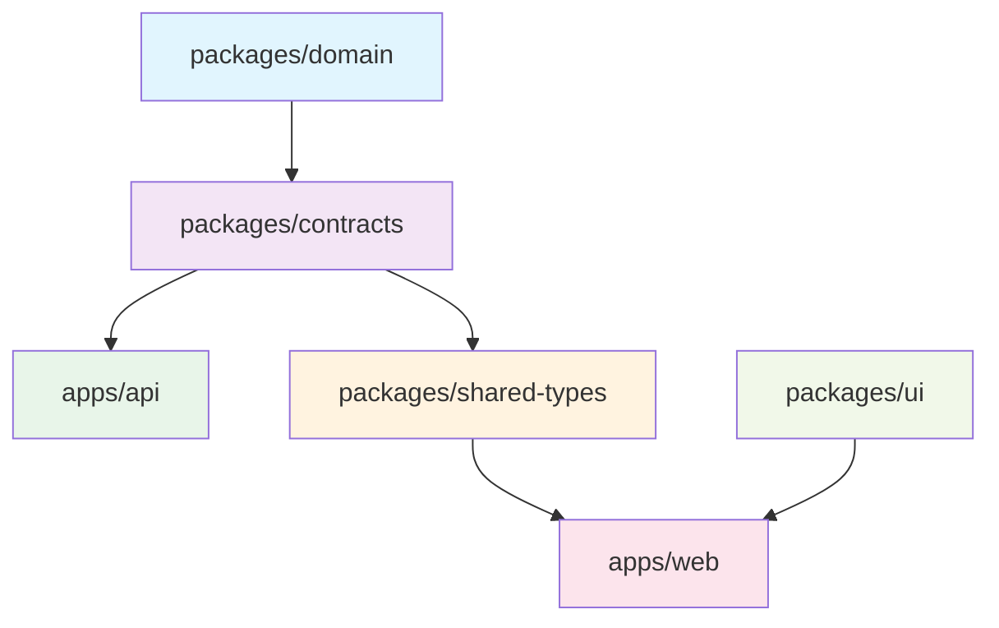

# Domain Layer Architecture: React Migration
<!-- Last Updated: 2025-08-14 -->
<!-- Version: 1.0 -->
<!-- Owner: Migration Team -->
<!-- Status: Active -->

## Executive Summary

This document defines the domain layer architecture for the React migration, establishing clear separation of concerns between domain models, data transfer objects, and API contracts. The architecture ensures proper abstraction layers while enabling efficient type generation between C# and TypeScript.

## A. REVISED REPOSITORY STRUCTURE

### Complete Monorepo Layout

```
WitchCityRope-React/
├── apps/
│   ├── web/                    # Next.js React frontend
│   │   ├── src/
│   │   │   ├── components/     # React components
│   │   │   ├── pages/          # Next.js pages/routing
│   │   │   ├── hooks/          # Custom React hooks
│   │   │   ├── store/          # Zustand state management
│   │   │   ├── services/       # API integration layer
│   │   │   ├── utils/          # Frontend-specific utilities
│   │   │   └── types/          # Frontend-only TypeScript types
│   │   ├── public/             # Static assets
│   │   ├── styles/             # CSS/styling
│   │   ├── next.config.js      # Next.js configuration
│   │   └── package.json
│   └── api/                    # .NET Minimal API
│       ├── Features/           # Feature-based organization
│       │   ├── Auth/           # Authentication endpoints
│       │   ├── Events/         # Event management
│       │   ├── Users/          # User management
│       │   └── Payments/       # Payment processing
│       ├── Infrastructure/     # Configuration and middleware
│       │   ├── Configuration/  # Startup configuration
│       │   ├── Middleware/     # Custom middleware
│       │   └── Database/       # EF Core configuration
│       ├── Services/           # Application services
│       │   ├── Auth/           # Authentication services
│       │   ├── Events/         # Business logic services
│       │   └── Email/          # Email services
│       ├── Program.cs          # Application entry point
│       └── WitchCityRope.Api.csproj
├── packages/
│   ├── domain/                 # Core domain models (C#)
│   │   ├── Entities/          # Rich domain entities
│   │   │   ├── BaseEntity.cs  # Base entity with common properties
│   │   │   ├── User/          # User aggregate root
│   │   │   │   ├── User.cs    # User entity
│   │   │   │   ├── UserAuthentication.cs
│   │   │   │   └── RefreshToken.cs
│   │   │   ├── Events/        # Event aggregate
│   │   │   │   ├── Event.cs   # Event entity
│   │   │   │   ├── Registration.cs
│   │   │   │   ├── Rsvp.cs
│   │   │   │   └── Ticket.cs
│   │   │   ├── Safety/        # Safety aggregate
│   │   │   │   ├── IncidentReport.cs
│   │   │   │   ├── IncidentReview.cs
│   │   │   │   └── IncidentAction.cs
│   │   │   └── Payments/      # Payment aggregate
│   │   │       └── Payment.cs
│   │   ├── ValueObjects/      # Domain value objects
│   │   │   ├── Email.cs       # Email value object
│   │   │   ├── PhoneNumber.cs # Phone number validation
│   │   │   ├── Money.cs       # Money handling
│   │   │   └── DateRange.cs   # Event date ranges
│   │   ├── Enums/            # Shared domain enums
│   │   │   ├── UserRole.cs   # User role enumeration
│   │   │   ├── EventStatus.cs # Event status lifecycle
│   │   │   ├── PaymentStatus.cs
│   │   │   ├── RsvpStatus.cs
│   │   │   └── IncidentSeverity.cs
│   │   ├── Interfaces/        # Domain service interfaces
│   │   │   ├── IUserRepository.cs
│   │   │   ├── IEventRepository.cs
│   │   │   ├── IPaymentService.cs
│   │   │   └── IEmailService.cs
│   │   ├── Specifications/    # Business rules and specifications
│   │   │   ├── UserSpecifications.cs
│   │   │   ├── EventSpecifications.cs
│   │   │   └── PaymentSpecifications.cs
│   │   ├── Events/           # Domain events
│   │   │   ├── UserRegisteredEvent.cs
│   │   │   ├── EventCreatedEvent.cs
│   │   │   └── PaymentProcessedEvent.cs
│   │   └── WitchCityRope.Domain.csproj
│   ├── contracts/              # Shared DTOs & API contracts (C#)
│   │   ├── DTOs/              # Data transfer objects
│   │   │   ├── Users/         # User-related DTOs
│   │   │   │   ├── UserDto.cs
│   │   │   │   ├── UserRegistrationDto.cs
│   │   │   │   └── UserProfileDto.cs
│   │   │   ├── Events/        # Event-related DTOs
│   │   │   │   ├── EventDto.cs
│   │   │   │   ├── EventDetailDto.cs
│   │   │   │   ├── RegistrationDto.cs
│   │   │   │   └── RsvpDto.cs
│   │   │   ├── Payments/      # Payment DTOs
│   │   │   │   ├── PaymentDto.cs
│   │   │   │   └── PaymentRequestDto.cs
│   │   │   └── Common/        # Shared DTOs
│   │   │       ├── PaginatedResult.cs
│   │   │       ├── ErrorDto.cs
│   │   │       └── ValidationErrorDto.cs
│   │   ├── Requests/          # API request models
│   │   │   ├── Auth/          # Authentication requests
│   │   │   │   ├── LoginRequest.cs
│   │   │   │   ├── RegisterRequest.cs
│   │   │   │   └── RefreshTokenRequest.cs
│   │   │   ├── Events/        # Event requests
│   │   │   │   ├── CreateEventRequest.cs
│   │   │   │   ├── UpdateEventRequest.cs
│   │   │   │   └── EventRegistrationRequest.cs
│   │   │   └── Users/         # User requests
│   │   │       ├── UpdateProfileRequest.cs
│   │   │       └── ChangePasswordRequest.cs
│   │   ├── Responses/         # API response models
│   │   │   ├── Auth/          # Authentication responses
│   │   │   │   ├── LoginResponse.cs
│   │   │   │   ├── TokenResponse.cs
│   │   │   │   └── UserProfileResponse.cs
│   │   │   ├── Events/        # Event responses
│   │   │   │   ├── EventListResponse.cs
│   │   │   │   ├── EventDetailResponse.cs
│   │   │   │   └── RegistrationResponse.cs
│   │   │   └── Common/        # Common responses
│   │   │       ├── ApiResponse.cs
│   │   │       ├── ErrorResponse.cs
│   │   │       └── SuccessResponse.cs
│   │   ├── Constants/         # Shared constants
│   │   │   ├── ApiRoutes.cs   # API route constants
│   │   │   ├── Roles.cs       # Role constants
│   │   │   ├── Permissions.cs # Permission constants
│   │   │   └── ValidationMessages.cs
│   │   ├── Validation/        # FluentValidation rules
│   │   │   ├── Auth/          # Auth validation
│   │   │   ├── Events/        # Event validation
│   │   │   └── Users/         # User validation
│   │   └── WitchCityRope.Contracts.csproj
│   ├── shared-types/           # TypeScript types (generated from C#)
│   │   ├── src/
│   │   │   ├── models/        # TS interfaces from DTOs
│   │   │   │   ├── users/     # User type definitions
│   │   │   │   │   ├── user.ts
│   │   │   │   │   ├── userRegistration.ts
│   │   │   │   │   └── userProfile.ts
│   │   │   │   ├── events/    # Event type definitions
│   │   │   │   │   ├── event.ts
│   │   │   │   │   ├── registration.ts
│   │   │   │   │   └── rsvp.ts
│   │   │   │   ├── payments/  # Payment types
│   │   │   │   │   └── payment.ts
│   │   │   │   └── common/    # Shared types
│   │   │   │       ├── apiResponse.ts
│   │   │   │       ├── paginatedResult.ts
│   │   │   │       └── validationError.ts
│   │   │   ├── enums/         # TS enums from C#
│   │   │   │   ├── userRole.ts
│   │   │   │   ├── eventStatus.ts
│   │   │   │   ├── paymentStatus.ts
│   │   │   │   └── rsvpStatus.ts
│   │   │   ├── api/           # API client types
│   │   │   │   ├── auth.ts    # Auth API types
│   │   │   │   ├── events.ts  # Events API types
│   │   │   │   ├── users.ts   # Users API types
│   │   │   │   └── payments.ts # Payments API types
│   │   │   └── validation/    # Client-side validation
│   │   │       ├── schemas/   # Validation schemas
│   │   │       └── messages.ts # Validation messages
│   │   ├── scripts/           # Type generation scripts
│   │   │   ├── generate-types.js # Main generation script
│   │   │   ├── nswag.json    # NSwag configuration
│   │   │   └── post-process.js # Post-processing utilities
│   │   ├── package.json
│   │   └── tsconfig.json
│   └── ui/                     # React component library
│       ├── src/
│       │   ├── components/     # Base UI components
│       │   ├── hooks/          # Reusable hooks
│       │   ├── utils/          # UI utilities
│       │   └── themes/         # Design system
│       ├── stories/            # Storybook stories
│       └── package.json
├── tests/
│   ├── unit/                   # Unit tests
│   │   ├── domain/            # Domain layer tests
│   │   ├── contracts/         # Contract tests
│   │   └── web/               # Frontend tests
│   ├── integration/            # API integration tests
│   ├── e2e/                   # End-to-end tests (Playwright)
│   └── performance/           # Performance tests
├── docs/                      # Complete documentation system (ported)
│   ├── 00-START-HERE.md       # Navigation guide
│   ├── ARCHITECTURE.md        # Updated for React
│   ├── ROADMAP.md            # Migration and future roadmap
│   ├── SECURITY.md           # Security documentation
│   ├── _archive/             # Historical docs migration
│   ├── architecture/         # System design docs
│   │   ├── decisions/        # Architecture decision records
│   │   ├── react-migration/  # Migration-specific docs
│   │   ├── file-registry.md  # File tracking system
│   │   └── site-map.md       # Application structure
│   ├── completed-work-archive/ # Historical work documentation
│   ├── design/               # UI/UX and visual design
│   │   ├── style-guide/      # Design system documentation
│   │   ├── user-flows/       # User journey mapping
│   │   └── wireframes/       # UI wireframes and prototypes
│   ├── functional-areas/     # Feature-specific documentation
│   │   ├── _template/        # Documentation templates
│   │   ├── authentication/   # Auth system docs
│   │   ├── events-management/ # Event management docs
│   │   ├── user-management/  # User management docs
│   │   ├── ai-workflow-orchestration/ # AI workflow docs
│   │   └── [other features]/ # Additional functional areas
│   ├── guides-setup/         # Development and operational guides
│   │   ├── developer-quick-start.md
│   │   ├── docker/           # Docker development guides
│   │   ├── admin-guide/      # Administrator documentation
│   │   └── user-guide/       # End-user documentation
│   ├── history/              # Development history
│   ├── lessons-learned/      # Developer insights and learnings
│   │   ├── orchestration-failures/ # AI workflow learnings
│   │   └── lessons-learned-troubleshooting/
│   └── standards-processes/  # Development standards
│       ├── documentation-process/ # Documentation standards
│       ├── testing/          # Testing standards and guides
│       ├── MCP/             # Claude Code MCP integration
│       └── development-standards/ # Code standards
├── .claude/                   # AI workflow orchestration (ported)
│   ├── agents/               # AI agent definitions (updated for React)
│   ├── CLAUDE.md             # Claude Code configuration
│   └── ORCHESTRATOR-TRIGGERS.md # Workflow triggers
├── infrastructure/            # Infrastructure as code
├── scripts/                   # Build and deployment scripts
├── .github/                   # GitHub Actions workflows
├── package.json              # Root package.json (monorepo)
├── turbo.json               # Turborepo configuration
├── docker-compose.yml       # Development environment
└── README.md                # Project overview
```

## B. DOMAIN LAYER ORGANIZATION

### What Belongs Where

#### packages/domain/ - Pure Business Logic
**Purpose**: Contains the core business rules, entities, and domain logic that is technology-agnostic.

**Contents**:
- **Entities/**: Rich domain objects with behavior
- **ValueObjects/**: Immutable objects representing concepts
- **Enums/**: Business-relevant enumerations
- **Interfaces/**: Contracts for domain services
- **Specifications/**: Business rules and validation logic
- **Events/**: Domain events for decoupled communication

**Key Characteristics**:
- No external dependencies (except basic .NET)
- Pure business logic only
- Technology-agnostic
- Rich behavioral models
- Encapsulates business invariants

#### packages/contracts/ - Data Transfer Layer
**Purpose**: Defines the shape of data moving between layers and external systems.

**Contents**:
- **DTOs/**: Simple data containers for transfer
- **Requests/**: API request models
- **Responses/**: API response models
- **Constants/**: Shared constants and enumerations
- **Validation/**: FluentValidation rules for API contracts

**Key Characteristics**:
- Simple POCOs (Plain Old CLR Objects)
- No business logic
- Designed for serialization
- API-focused structure
- Framework-specific validations

#### packages/shared-types/ - TypeScript Interface Layer
**Purpose**: Provides TypeScript equivalents of C# contracts for frontend consumption.

**Contents**:
- **models/**: TypeScript interfaces generated from DTOs
- **enums/**: TypeScript enums generated from C# enums
- **api/**: API client type definitions
- **validation/**: Client-side validation schemas

**Key Characteristics**:
- Generated from C# contracts
- TypeScript-specific types
- Client-side focused
- Synchronized with backend changes

## C. CURRENT -> NEW MAPPING

### Migration Path for Existing Components

#### WitchCityRope.Core -> packages/domain/
```csharp
// Current: /src/WitchCityRope.Core/Entities/User.cs
// New: /packages/domain/Entities/User/User.cs

// Current structure
namespace WitchCityRope.Core.Entities
{
    public class User : BaseEntity
    {
        // Entity properties and methods
    }
}

// New structure
namespace WitchCityRope.Domain.Entities
{
    public class User : BaseEntity
    {
        // Rich domain model with business methods
        public void UpdateProfile(string sceneName, string email) { }
        public bool CanRegisterForEvent(Event eventEntity) { }
        public void ChangeRole(UserRole newRole, User adminUser) { }
    }
}
```

#### WitchCityRope.Core/DTOs -> packages/contracts/DTOs/
```csharp
// Current: /src/WitchCityRope.Core/DTOs/UserDto.cs
// New: /packages/contracts/DTOs/Users/UserDto.cs

// Current structure
namespace WitchCityRope.Core.DTOs
{
    public class UserDto
    {
        // Simple data properties
    }
}

// New structure
namespace WitchCityRope.Contracts.DTOs.Users
{
    public class UserDto
    {
        public Guid Id { get; set; }
        public string Email { get; set; }
        public string SceneName { get; set; }
        public UserRole Role { get; set; }
        public DateTime CreatedAt { get; set; }
    }
}
```

#### WitchCityRope.Core/Enums -> Dual Location
```csharp
// Domain enums (business concepts)
// Current: /src/WitchCityRope.Core/Enums/UserRole.cs
// New: /packages/domain/Enums/UserRole.cs

namespace WitchCityRope.Domain.Enums
{
    public enum UserRole
    {
        Guest = 0,
        Member = 1,
        VettedMember = 2,
        Teacher = 3,
        Admin = 4
    }
}

// Contract enums (API transfer)
// New: /packages/contracts/DTOs/Common/UserRole.cs (reference to domain)
using WitchCityRope.Domain.Enums;
// Use domain enum in contracts
```

#### WitchCityRope.Application -> Split Between Domain and API
```csharp
// Business Logic -> packages/domain/Services/
// Current: Business logic in Application layer
// New: Pure domain services in domain package

namespace WitchCityRope.Domain.Services
{
    public class EventRegistrationService
    {
        public RegistrationResult RegisterUserForEvent(User user, Event eventEntity)
        {
            // Pure business logic
            if (!user.CanRegisterForEvent(eventEntity))
                return RegistrationResult.NotEligible();
            
            // Business rules
            return RegistrationResult.Success();
        }
    }
}

// Application Services -> apps/api/Services/
// Infrastructure concerns remain in API
namespace WitchCityRope.Api.Services
{
    public class EventApplicationService
    {
        public async Task<EventDto> CreateEventAsync(CreateEventRequest request)
        {
            // Orchestrates domain operations
            // Handles infrastructure concerns
            // Maps between domain and contracts
        }
    }
}
```

### Infrastructure Layer Mapping
```csharp
// Current: /src/WitchCityRope.Infrastructure/
// New: /apps/api/Infrastructure/

// Database configuration, repositories, external services
// Remains in the API app but references domain interfaces
namespace WitchCityRope.Api.Infrastructure.Repositories
{
    public class UserRepository : IUserRepository // Domain interface
    {
        // EF Core implementation
    }
}
```

## D. BUILD & DEPENDENCY FLOW

### Dependency Hierarchy



### Build Process Flow

```yaml
# Build order for CI/CD
build-order:
  1. packages/domain          # Pure C# domain models
  2. packages/contracts       # C# DTOs and API contracts
  3. packages/shared-types    # Generated TypeScript types
  4. packages/ui             # React component library
  5. apps/api               # .NET API (parallel with web)
  6. apps/web               # React frontend
```

### Package Dependencies

```json
// packages/domain/WitchCityRope.Domain.csproj
{
  "dependencies": {
    // No external dependencies except .NET base libraries
  }
}

// packages/contracts/WitchCityRope.Contracts.csproj
{
  "dependencies": {
    "WitchCityRope.Domain": "file:../domain",
    "FluentValidation": "11.8.0"
  }
}

// packages/shared-types/package.json
{
  "dependencies": {},
  "devDependencies": {
    "nswag": "^13.20.0",
    "typescript": "^5.0.0"
  }
}

// apps/api/WitchCityRope.Api.csproj
{
  "dependencies": {
    "WitchCityRope.Domain": "file:../../packages/domain",
    "WitchCityRope.Contracts": "file:../../packages/contracts",
    "Microsoft.EntityFrameworkCore": "8.0.0"
  }
}

// apps/web/package.json
{
  "dependencies": {
    "@witchcityrope/shared-types": "file:../../packages/shared-types",
    "@witchcityrope/ui": "file:../../packages/ui",
    "next": "^14.0.0",
    "react": "^18.0.0"
  }
}
```

## E. EXAMPLES OF WHAT GOES WHERE

### Domain Entity Example

#### packages/domain/Entities/User/User.cs
```csharp
namespace WitchCityRope.Domain.Entities
{
    public class User : BaseEntity
    {
        // Rich domain model with business behavior
        private readonly List<Registration> _registrations = new();
        
        public string Email { get; private set; }
        public string SceneName { get; private set; }
        public UserRole Role { get; private set; }
        public IReadOnlyList<Registration> Registrations => _registrations.AsReadOnly();
        
        // Business methods
        public bool CanRegisterForEvent(Event eventEntity)
        {
            if (Role == UserRole.Guest && eventEntity.RequiresVetting)
                return false;
                
            if (HasActiveRegistrationFor(eventEntity))
                return false;
                
            return true;
        }
        
        public void UpdateProfile(string sceneName, string email)
        {
            if (string.IsNullOrWhiteSpace(sceneName))
                throw new DomainException("Scene name is required");
                
            SceneName = sceneName;
            Email = email;
            
            // Raise domain event
            AddDomainEvent(new UserProfileUpdatedEvent(this));
        }
        
        private bool HasActiveRegistrationFor(Event eventEntity)
        {
            return _registrations.Any(r => 
                r.EventId == eventEntity.Id && 
                r.Status == RegistrationStatus.Confirmed);
        }
    }
}
```

#### packages/contracts/DTOs/Users/UserDto.cs
```csharp
namespace WitchCityRope.Contracts.DTOs.Users
{
    public class UserDto
    {
        // Simple data container - no behavior
        public Guid Id { get; set; }
        public string Email { get; set; }
        public string SceneName { get; set; }
        public UserRole Role { get; set; }
        public DateTime CreatedAt { get; set; }
        public bool IsActive { get; set; }
        
        // No business methods - pure data transfer
    }
}
```

#### packages/shared-types/src/models/users/user.ts
```typescript
// Generated from UserDto
export interface User {
  id: string;
  email: string;
  sceneName: string;
  role: UserRole;
  createdAt: string;
  isActive: boolean;
}

// Additional frontend-specific types
export interface UserProfileFormData {
  sceneName: string;
  email: string;
  phoneNumber?: string;
}

export interface UserListItem {
  id: string;
  sceneName: string;
  role: UserRole;
  lastLoginAt?: string;
}
```

### Enum Example

#### packages/domain/Enums/UserRole.cs
```csharp
namespace WitchCityRope.Domain.Enums
{
    public enum UserRole
    {
        Guest = 0,
        Member = 1,
        VettedMember = 2,
        Teacher = 3,
        Admin = 4
    }
}
```

#### packages/shared-types/src/enums/userRole.ts
```typescript
// Generated from C# enum
export enum UserRole {
  Guest = 0,
  Member = 1,
  VettedMember = 2,
  Teacher = 3,
  Admin = 4
}

// Helper functions for frontend use
export const UserRoleLabels: Record<UserRole, string> = {
  [UserRole.Guest]: 'Guest',
  [UserRole.Member]: 'Member',
  [UserRole.VettedMember]: 'Vetted Member',
  [UserRole.Teacher]: 'Teacher',
  [UserRole.Admin]: 'Administrator'
};

export const isPrivilegedRole = (role: UserRole): boolean => {
  return role >= UserRole.Teacher;
};
```

### Request/Response Example

#### packages/contracts/Requests/Events/CreateEventRequest.cs
```csharp
namespace WitchCityRope.Contracts.Requests.Events
{
    public class CreateEventRequest
    {
        public string Title { get; set; }
        public string Description { get; set; }
        public DateTime StartDate { get; set; }
        public DateTime EndDate { get; set; }
        public EventType Type { get; set; }
        public decimal Price { get; set; }
        public int MaxAttendees { get; set; }
        public bool RequiresVetting { get; set; }
    }
}
```

#### packages/contracts/Responses/Events/EventDetailResponse.cs
```csharp
namespace WitchCityRope.Contracts.Responses.Events
{
    public class EventDetailResponse
    {
        public EventDto Event { get; set; }
        public List<UserDto> Attendees { get; set; }
        public List<UserDto> Waitlist { get; set; }
        public bool CanUserRegister { get; set; }
        public RegistrationDto UserRegistration { get; set; }
    }
}
```

#### packages/shared-types/src/api/events.ts
```typescript
// Generated API types
export interface CreateEventRequest {
  title: string;
  description: string;
  startDate: string;
  endDate: string;
  type: EventType;
  price: number;
  maxAttendees: number;
  requiresVetting: boolean;
}

export interface EventDetailResponse {
  event: Event;
  attendees: User[];
  waitlist: User[];
  canUserRegister: boolean;
  userRegistration?: Registration;
}

// Frontend-specific API client types
export interface EventsApiClient {
  getEvents(params?: EventListParams): Promise<PaginatedResult<Event>>;
  getEventDetails(id: string): Promise<EventDetailResponse>;
  createEvent(request: CreateEventRequest): Promise<Event>;
  registerForEvent(eventId: string): Promise<Registration>;
}
```

## F. TYPE GENERATION STRATEGY

### Tool Selection: NSwag

**Rationale**:
- Excellent C# to TypeScript generation
- OpenAPI 3.0 support
- Customizable output
- Active maintenance
- Good integration with .NET

### Generation Pipeline

#### 1. OpenAPI Specification Generation
```csharp
// In apps/api/Program.cs
builder.Services.AddEndpointsApiExplorer();
builder.Services.AddSwaggerGen(c =>
{
    c.SwaggerDoc("v1", new OpenApiInfo 
    { 
        Title = "WitchCityRope API", 
        Version = "v1" 
    });
    
    // Include XML documentation
    var xmlFile = $"{Assembly.GetExecutingAssembly().GetName().Name}.xml";
    var xmlPath = Path.Combine(AppContext.BaseDirectory, xmlFile);
    c.IncludeXmlComments(xmlPath);
});
```

#### 2. NSwag Configuration
```json
// packages/shared-types/scripts/nswag.json
{
  "runtime": "Net80",
  "defaultVariables": null,
  "documentGenerator": {
    "fromDocument": {
      "url": "http://localhost:5653/swagger/v1/swagger.json",
      "output": null
    }
  },
  "codeGenerators": {
    "openApiToTypeScript": {
      "className": "ApiClient",
      "moduleName": "",
      "namespace": "",
      "typeScriptVersion": 5.0,
      "template": "Fetch",
      "promiseType": "Promise",
      "dateTimeType": "string",
      "nullValue": "Undefined",
      "generateClientClasses": true,
      "generateClientInterfaces": true,
      "generateOptionalParameters": true,
      "exportTypes": true,
      "wrapDtoExceptions": true,
      "exceptionClass": "ApiException",
      "clientBaseClass": null,
      "wrapResponses": false,
      "wrapResponseMethods": [],
      "generateResponseClasses": true,
      "responseClass": "SwaggerResponse",
      "protectedMethods": [],
      "configurationClass": null,
      "useTransformOptionsMethod": false,
      "useTransformResultMethod": false,
      "generateDtoTypes": true,
      "operationGenerationMode": "MultipleClientsFromOperationId",
      "markOptionalProperties": true,
      "generateCloneMethod": false,
      "typeStyle": "Interface",
      "classStyle": "Inpc",
      "arrayType": "Array",
      "dictionaryType": "Record",
      "arrayInstanceType": "Array",
      "dictionaryInstanceType": "{}",
      "arrayBaseType": "Array",
      "dictionaryBaseType": "Record",
      "classTypes": [],
      "extendedClasses": [],
      "extensionCode": null,
      "generateDefaultValues": true,
      "excludedTypeNames": [],
      "excludedParameterNames": [],
      "handleReferences": false,
      "generateConstructorInterface": true,
      "convertConstructorInterfaceData": false,
      "importRequiredTypes": true,
      "useGetBaseUrlMethod": false,
      "baseUrlTokenName": "API_BASE_URL",
      "queryNullValue": "",
      "inlineNamedDictionaries": false,
      "inlineNamedAny": false,
      "templateDirectory": null,
      "typeNameGeneratorType": null,
      "propertyNameGeneratorType": null,
      "enumNameGeneratorType": null,
      "serviceHost": null,
      "serviceSchemes": null,
      "output": "src/generated/api-client.ts"
    }
  }
}
```

#### 3. Generation Script
```bash
#!/bin/bash
# packages/shared-types/scripts/generate-types.sh

echo "🔄 Generating TypeScript types from API..."

# Ensure API is running
echo "📡 Checking API availability..."
curl -f http://localhost:5653/health || {
    echo "❌ API is not running. Please start the API first."
    exit 1
}

# Generate types using NSwag
echo "🏗️ Generating types with NSwag..."
cd packages/shared-types
npx nswag run scripts/nswag.json

# Post-process generated types
echo "🔧 Post-processing generated types..."
node scripts/post-process.js

# Validate TypeScript compilation
echo "✅ Validating generated types..."
npx tsc --noEmit

echo "🎉 Type generation completed successfully!"
```

#### 4. Post-Processing
```javascript
// packages/shared-types/scripts/post-process.js
const fs = require('fs');
const path = require('path');

function postProcessGeneratedTypes() {
    const generatedFile = path.join(__dirname, '../src/generated/api-client.ts');
    let content = fs.readFileSync(generatedFile, 'utf8');
    
    // Add custom headers
    const header = `/* eslint-disable */
/* tslint:disable */
/*
 * Auto-generated by NSwag TypeScript Client Generator
 * Do not modify this file manually
 * Generated on: ${new Date().toISOString()}
 */

`;
    
    // Fix date handling
    content = content.replace(
        /date: Date/g, 
        'date: string'
    );
    
    // Add JSDoc comments for better IDE support
    content = content.replace(
        /export interface (\w+) \{/g,
        '/**\n * Auto-generated interface from C# DTO\n */\nexport interface $1 {'
    );
    
    fs.writeFileSync(generatedFile, header + content);
}

// Split into separate files for better organization
function splitIntoModules() {
    // Logic to split large generated file into smaller modules
    // organized by feature (users, events, payments, etc.)
}

postProcessGeneratedTypes();
splitIntoModules();

console.log('✅ Post-processing completed');
```

### CI/CD Integration

#### GitHub Actions Workflow
```yaml
# .github/workflows/type-generation.yml
name: Generate TypeScript Types

on:
  push:
    paths:
      - 'packages/contracts/**'
      - 'apps/api/**'
  pull_request:
    paths:
      - 'packages/contracts/**'
      - 'apps/api/**'

jobs:
  generate-types:
    runs-on: ubuntu-latest
    
    steps:
      - uses: actions/checkout@v3
      
      - name: Setup .NET
        uses: actions/setup-dotnet@v3
        with:
          dotnet-version: '8.0.x'
          
      - name: Setup Node.js
        uses: actions/setup-node@v3
        with:
          node-version: '18'
          
      - name: Install dependencies
        run: |
          dotnet restore
          npm ci
          
      - name: Build API
        run: dotnet build apps/api --no-restore
        
      - name: Start API for type generation
        run: |
          dotnet run --project apps/api &
          sleep 30  # Wait for API to start
          
      - name: Generate TypeScript types
        run: ./packages/shared-types/scripts/generate-types.sh
        
      - name: Check for changes
        run: |
          if [ -n "$(git status --porcelain packages/shared-types/src)" ]; then
            echo "::error::TypeScript types are out of sync. Run type generation locally."
            git diff packages/shared-types/src
            exit 1
          fi
```

### Version Synchronization

#### Automated Versioning
```json
// packages/shared-types/package.json
{
  "name": "@witchcityrope/shared-types",
  "version": "1.0.0",
  "scripts": {
    "generate": "scripts/generate-types.sh",
    "version": "npm run generate && git add src/",
    "postversion": "git push && git push --tags"
  }
}
```

#### Version Tracking
```typescript
// packages/shared-types/src/version.ts
// Auto-generated during build
export const API_VERSION = 'v1.2.3';
export const GENERATED_AT = '2025-08-14T10:30:00Z';
export const COMMIT_HASH = 'abc123def456';

// Runtime version checking
export function checkApiCompatibility(serverVersion: string): boolean {
  // Semantic version compatibility checking
  return semver.satisfies(serverVersion, `^${API_VERSION}`);
}
```

This comprehensive domain layer architecture provides clear separation of concerns while maintaining efficient type generation and synchronization between the C# backend and TypeScript frontend. The structure supports both current migration needs and future scalability requirements.