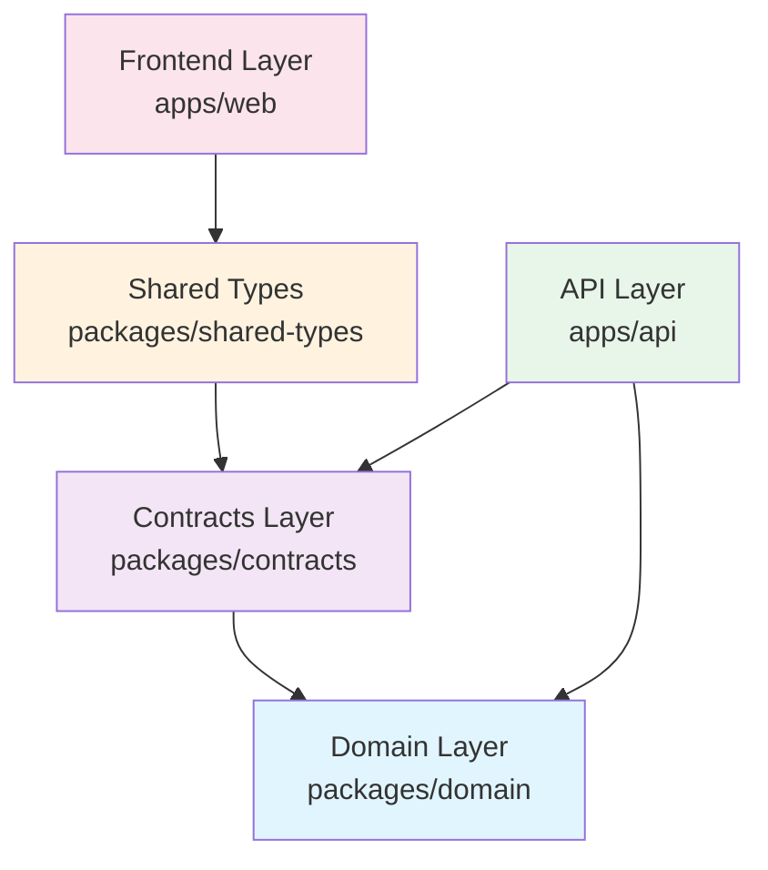

# Separation of Concerns: React Migration Architecture
<!-- Last Updated: 2025-08-14 -->
<!-- Version: 1.0 -->
<!-- Owner: Migration Team -->
<!-- Status: Active -->

## Executive Summary

This document defines clear boundaries and responsibilities for each layer in the React migration architecture. Proper separation of concerns ensures maintainability, testability, and scalability while preventing common architectural pitfalls.

## Layer Responsibilities Overview



## A. DOMAIN LAYER (packages/domain/)

### What Belongs Here: Pure Business Logic

#### ✅ INCLUDES:
- **Rich Domain Entities**: Objects with behavior and business methods
- **Value Objects**: Immutable objects representing business concepts
- **Domain Events**: Business events for decoupled communication
- **Business Rules**: Specifications and validation logic
- **Domain Services**: Complex business operations spanning entities
- **Domain Interfaces**: Contracts for repositories and external services
- **Business Enums**: Enumerations representing business concepts

#### ❌ EXCLUDES:
- Database concerns (EF Core, migrations, queries)
- HTTP/API concerns (controllers, routing, serialization)
- UI concerns (view models, display logic)
- Infrastructure concerns (email, file storage, external APIs)
- Framework-specific code (ASP.NET, React, etc.)

### Examples of Domain Layer Components

#### Rich Domain Entity
```csharp
// ✅ CORRECT: Rich domain model with business behavior
namespace WitchCityRope.Domain.Entities
{
    public class User : BaseEntity
    {
        private readonly List<Registration> _registrations = new();
        
        public string Email { get; private set; }
        public string SceneName { get; private set; }
        public UserRole Role { get; private set; }
        public IReadOnlyList<Registration> Registrations => _registrations.AsReadOnly();
        
        // Business methods
        public bool CanRegisterForEvent(Event eventEntity)
        {
            // Business logic: vetting requirements, capacity, etc.
            if (Role == UserRole.Guest && eventEntity.RequiresVetting)
                return false;
                
            if (HasActiveRegistrationFor(eventEntity))
                return false;
                
            if (!eventEntity.IsRegistrationOpen())
                return false;
                
            return true;
        }
        
        public void PromoteToRole(UserRole newRole, User promotingUser)
        {
            // Business rule: only certain roles can promote
            if (!promotingUser.CanPromoteToRole(newRole))
                throw new DomainException("Insufficient privileges to promote user");
                
            var oldRole = Role;
            Role = newRole;
            
            // Raise domain event
            AddDomainEvent(new UserRoleChangedEvent(this, oldRole, newRole));
        }
        
        private bool HasActiveRegistrationFor(Event eventEntity)
        {
            return _registrations.Any(r => 
                r.EventId == eventEntity.Id && 
                r.Status == RegistrationStatus.Confirmed);
        }
    }
}

// ❌ WRONG: Anemic model without behavior
public class User
{
    public string Email { get; set; }
    public string SceneName { get; set; }
    public UserRole Role { get; set; }
    // No business methods - just a data container
}
```

#### Business Specification
```csharp
// ✅ CORRECT: Business rule encapsulation
namespace WitchCityRope.Domain.Specifications
{
    public class CanRegisterForEventSpecification : ISpecification<User>
    {
        private readonly Event _event;
        
        public CanRegisterForEventSpecification(Event eventEntity)
        {
            _event = eventEntity;
        }
        
        public bool IsSatisfiedBy(User user)
        {
            // Complex business logic
            if (user.Role == UserRole.Guest && _event.RequiresVetting)
                return false;
                
            if (_event.HasWaitingList && _event.IsAtCapacity)
                return user.Role >= UserRole.VettedMember; // Priority access
                
            return _event.IsRegistrationOpen();
        }
        
        public string GetFailureReason(User user)
        {
            if (user.Role == UserRole.Guest && _event.RequiresVetting)
                return "This event requires vetted member status";
                
            if (!_event.IsRegistrationOpen())
                return "Registration is not currently open";
                
            return "Unable to register for this event";
        }
    }
}
```

## B. CONTRACTS LAYER (packages/contracts/)

### What Belongs Here: Data Transfer Objects

#### ✅ INCLUDES:
- **Simple DTOs**: Plain data containers for API transfer
- **Request Models**: API endpoint input models
- **Response Models**: API endpoint output models
- **Validation Rules**: FluentValidation for API contracts
- **API Constants**: Route definitions, role constants
- **Shared Enums**: Referenced from domain layer

#### ❌ EXCLUDES:
- Business logic and behavior
- Database mapping logic
- UI display logic
- Complex validation rules (those belong in domain)
- Framework-specific annotations (except serialization)

### Examples of Contracts Layer Components

#### Data Transfer Object
```csharp
// ✅ CORRECT: Simple data transfer object
namespace WitchCityRope.Contracts.DTOs.Users
{
    public class UserDto
    {
        public Guid Id { get; set; }
        public string Email { get; set; }
        public string SceneName { get; set; }
        public UserRole Role { get; set; } // References domain enum
        public DateTime CreatedAt { get; set; }
        public bool IsActive { get; set; }
        public DateTime? LastLoginAt { get; set; }
        
        // No business methods - pure data
    }
}

// ❌ WRONG: DTO with business logic
public class UserDto
{
    public string Email { get; set; }
    public UserRole Role { get; set; }
    
    // Business logic doesn't belong here
    public bool CanAccessAdminArea()
    {
        return Role >= UserRole.Admin;
    }
}
```

#### API Request Model
```csharp
// ✅ CORRECT: Clean request model with validation
namespace WitchCityRope.Contracts.Requests.Events
{
    public class CreateEventRequest
    {
        public string Title { get; set; }
        public string Description { get; set; }
        public DateTime StartDate { get; set; }
        public DateTime EndDate { get; set; }
        public EventType Type { get; set; }
        public decimal Price { get; set; }
        public int MaxAttendees { get; set; }
        public bool RequiresVetting { get; set; }
        public List<string> Tags { get; set; } = new();
    }
    
    // Separate validation class
    public class CreateEventRequestValidator : AbstractValidator<CreateEventRequest>
    {
        public CreateEventRequestValidator()
        {
            RuleFor(x => x.Title)
                .NotEmpty().WithMessage("Event title is required")
                .MaximumLength(200).WithMessage("Title cannot exceed 200 characters");
                
            RuleFor(x => x.StartDate)
                .GreaterThan(DateTime.UtcNow)
                .WithMessage("Event must be scheduled for the future");
                
            RuleFor(x => x.EndDate)
                .GreaterThan(x => x.StartDate)
                .WithMessage("End date must be after start date");
                
            RuleFor(x => x.Price)
                .GreaterThanOrEqualTo(0)
                .WithMessage("Price cannot be negative");
        }
    }
}
```

## C. API LAYER (apps/api/)

### What Belongs Here: Application Services and Infrastructure

#### ✅ INCLUDES:
- **Controllers/Endpoints**: HTTP request handling
- **Application Services**: Orchestrating domain operations
- **Authentication/Authorization**: Security concerns
- **Database Configuration**: EF Core setup and repositories
- **External Integrations**: Email, payment processing, file storage
- **Middleware**: Logging, error handling, CORS
- **API Documentation**: OpenAPI/Swagger configuration

#### ❌ EXCLUDES:
- Pure business logic (belongs in domain)
- UI concerns (belongs in frontend)
- Complex business rules (domain specifications)

### Examples of API Layer Components

#### Application Service
```csharp
// ✅ CORRECT: Orchestrates domain operations
namespace WitchCityRope.Api.Services.Events
{
    public class EventApplicationService
    {
        private readonly IEventRepository _eventRepository;
        private readonly IUserRepository _userRepository;
        private readonly IEmailService _emailService;
        private readonly IMapper _mapper;
        
        public async Task<EventDto> CreateEventAsync(CreateEventRequest request, Guid creatorId)
        {
            // Validate request using domain
            var creator = await _userRepository.GetByIdAsync(creatorId);
            if (!creator.CanCreateEvents())
                throw new UnauthorizedAccessException("User cannot create events");
            
            // Map to domain entity
            var eventEntity = new Event(
                request.Title,
                request.Description,
                request.StartDate,
                request.EndDate,
                request.Type,
                Money.Create(request.Price),
                request.MaxAttendees,
                request.RequiresVetting,
                creator.Id
            );
            
            // Business validation through domain
            if (!eventEntity.IsValid())
                throw new BusinessRuleException(eventEntity.GetValidationErrors());
            
            // Persist
            await _eventRepository.AddAsync(eventEntity);
            await _eventRepository.SaveChangesAsync();
            
            // Send notifications (infrastructure concern)
            await _emailService.SendEventCreatedNotificationAsync(eventEntity);
            
            // Map back to DTO for response
            return _mapper.Map<EventDto>(eventEntity);
        }
    }
}

// ❌ WRONG: Business logic in application service
public class EventApplicationService
{
    public async Task<EventDto> CreateEventAsync(CreateEventRequest request)
    {
        // Business logic shouldn't be here
        if (request.StartDate <= DateTime.UtcNow)
            throw new ArgumentException("Event must be in the future");
            
        if (request.EndDate <= request.StartDate)
            throw new ArgumentException("End date must be after start date");
        
        // This logic belongs in the domain
    }
}
```

#### Repository Implementation
```csharp
// ✅ CORRECT: Infrastructure implementation of domain interface
namespace WitchCityRope.Api.Infrastructure.Repositories
{
    public class EventRepository : IEventRepository // Domain interface
    {
        private readonly WitchCityRopeDbContext _context;
        
        public EventRepository(WitchCityRopeDbContext context)
        {
            _context = context;
        }
        
        public async Task<Event> GetByIdAsync(Guid id)
        {
            return await _context.Events
                .Include(e => e.Registrations)
                .FirstOrDefaultAsync(e => e.Id == id);
        }
        
        public async Task<IEnumerable<Event>> GetUpcomingEventsAsync()
        {
            return await _context.Events
                .Where(e => e.StartDate > DateTime.UtcNow)
                .OrderBy(e => e.StartDate)
                .ToListAsync();
        }
        
        public async Task AddAsync(Event eventEntity)
        {
            await _context.Events.AddAsync(eventEntity);
        }
        
        public async Task SaveChangesAsync()
        {
            await _context.SaveChangesAsync();
        }
    }
}
```

## D. SHARED TYPES LAYER (packages/shared-types/)

### What Belongs Here: TypeScript Interfaces and Types

#### ✅ INCLUDES:
- **Generated Types**: TypeScript interfaces from C# DTOs
- **API Client Types**: Generated from OpenAPI specs
- **Enum Mappings**: TypeScript enums from C# enums
- **Validation Schemas**: Client-side validation (Zod, Yup)
- **Type Utilities**: Frontend-specific type helpers

#### ❌ EXCLUDES:
- Business logic
- UI components
- React-specific code
- Backend-specific types

### Examples of Shared Types Components

#### Generated TypeScript Interface
```typescript
// ✅ CORRECT: Generated from C# DTO
// packages/shared-types/src/models/users/user.ts
export interface User {
  id: string;
  email: string;
  sceneName: string;
  role: UserRole;
  createdAt: string;
  isActive: boolean;
  lastLoginAt?: string;
}

// Frontend-specific extensions
export interface UserListItem extends Pick<User, 'id' | 'sceneName' | 'role'> {
  registrationCount: number;
  lastActivity: string;
}

export interface UserProfileFormData {
  sceneName: string;
  email: string;
  phoneNumber?: string;
  emergencyContact?: string;
}
```

#### API Client Types
```typescript
// ✅ CORRECT: Generated API client interfaces
// packages/shared-types/src/api/events.ts
export interface EventsApiClient {
  getEvents(params?: EventListParams): Promise<PaginatedResult<Event>>;
  getEventDetails(id: string): Promise<EventDetailResponse>;
  createEvent(request: CreateEventRequest): Promise<Event>;
  updateEvent(id: string, request: UpdateEventRequest): Promise<Event>;
  registerForEvent(eventId: string): Promise<Registration>;
  cancelRegistration(eventId: string): Promise<void>;
}

export interface EventListParams {
  page?: number;
  pageSize?: number;
  type?: EventType;
  startDate?: string;
  endDate?: string;
  includeWaitlisted?: boolean;
}
```

## E. FRONTEND LAYER (apps/web/)

### What Belongs Here: User Interface and Experience

#### ✅ INCLUDES:
- **React Components**: UI components and pages
- **State Management**: Client-side state (Zustand, Redux)
- **UI Logic**: Display formatting, local validation
- **API Integration**: HTTP client services
- **Routing**: Page navigation and route guards
- **Styling**: CSS, styled components, themes

#### ❌ EXCLUDES:
- Business logic (use domain through API)
- Database operations (goes through API)
- Server-side concerns
- Domain entity manipulation

### Examples of Frontend Layer Components

#### React Component with Proper Separation
```typescript
// ✅ CORRECT: Component focuses on UI concerns
// apps/web/src/components/events/EventCard.tsx
interface EventCardProps {
  event: Event;
  canRegister: boolean;
  onRegister: (eventId: string) => void;
  onViewDetails: (eventId: string) => void;
}

export const EventCard: React.FC<EventCardProps> = ({
  event,
  canRegister,
  onRegister,
  onViewDetails
}) => {
  // UI-specific formatting
  const formattedDate = formatEventDate(event.startDate, event.endDate);
  const spotsRemaining = event.maxAttendees - event.currentAttendees;
  const isNearCapacity = spotsRemaining <= 5;
  
  return (
    <Card className="event-card">
      <CardHeader>
        <h3>{event.title}</h3>
        <EventTypeBadge type={event.type} />
      </CardHeader>
      
      <CardContent>
        <p>{event.description}</p>
        <div className="event-details">
          <span>{formattedDate}</span>
          <span>${event.price}</span>
          {isNearCapacity && (
            <Badge variant="warning">Only {spotsRemaining} spots left</Badge>
          )}
        </div>
      </CardContent>
      
      <CardFooter>
        <Button onClick={() => onViewDetails(event.id)}>
          View Details
        </Button>
        {canRegister && (
          <Button 
            variant="primary" 
            onClick={() => onRegister(event.id)}
            disabled={spotsRemaining === 0}
          >
            {spotsRemaining === 0 ? 'Full' : 'Register'}
          </Button>
        )}
      </CardFooter>
    </Card>
  );
};

// ❌ WRONG: Component with business logic
export const EventCard: React.FC<EventCardProps> = ({ event, user }) => {
  // Business logic doesn't belong in UI
  const canRegister = user.role !== UserRole.Guest || !event.requiresVetting;
  const hasRegistered = user.registrations.some(r => r.eventId === event.id);
  
  // This logic should come from the API/domain layer
};
```

#### Service Layer for API Integration
```typescript
// ✅ CORRECT: Service layer handles API communication
// apps/web/src/services/eventsService.ts
export class EventsService {
  constructor(private apiClient: ApiClient) {}
  
  async getEvents(params?: EventListParams): Promise<PaginatedResult<Event>> {
    try {
      const response = await this.apiClient.events.getEvents(params);
      return response.data;
    } catch (error) {
      throw new ServiceError('Failed to fetch events', error);
    }
  }
  
  async registerForEvent(eventId: string): Promise<Registration> {
    try {
      const response = await this.apiClient.events.registerForEvent(eventId);
      return response.data;
    } catch (error) {
      if (error.status === 409) {
        throw new BusinessRuleError('Already registered for this event');
      }
      throw new ServiceError('Failed to register for event', error);
    }
  }
  
  // No business logic - just API communication and error handling
}
```

## F. COMMON ANTI-PATTERNS TO AVOID

### 1. Business Logic in UI Components
```typescript
// ❌ WRONG: Business logic in React component
const EventRegistration = ({ event, user }) => {
  const canRegister = () => {
    if (user.role === 'guest' && event.requiresVetting) return false;
    if (event.registrations.length >= event.maxAttendees) return false;
    // Complex business logic in UI
    return true;
  };
};

// ✅ CORRECT: Business logic in domain, UI gets result
const EventRegistration = ({ event, canRegister }) => {
  // UI only handles display and user interaction
  return (
    <Button disabled={!canRegister}>
      {canRegister ? 'Register' : 'Cannot Register'}
    </Button>
  );
};
```

### 2. Database Concerns in Domain Layer
```csharp
// ❌ WRONG: EF Core in domain entity
public class User : BaseEntity
{
    [Required]
    [MaxLength(100)]
    public string Email { get; set; }
    
    // Database navigation property in domain
    public virtual ICollection<Registration> Registrations { get; set; }
}

// ✅ CORRECT: Pure domain entity
public class User : BaseEntity
{
    private readonly List<Registration> _registrations = new();
    
    public string Email { get; private set; }
    public IReadOnlyList<Registration> Registrations => _registrations.AsReadOnly();
    
    // Pure business methods
    public void AddRegistration(Registration registration) { }
}
```

### 3. UI Concerns in API Layer
```csharp
// ❌ WRONG: UI formatting in API
[HttpGet]
public ActionResult<EventDto> GetEvent(Guid id)
{
    var eventEntity = _repository.GetById(id);
    var dto = _mapper.Map<EventDto>(eventEntity);
    
    // UI formatting doesn't belong in API
    dto.FormattedDate = eventEntity.StartDate.ToString("MMM dd, yyyy");
    dto.DisplayPrice = $"${eventEntity.Price:F2}";
    
    return dto;
}

// ✅ CORRECT: API returns raw data
[HttpGet]
public ActionResult<EventDto> GetEvent(Guid id)
{
    var eventEntity = _repository.GetById(id);
    return _mapper.Map<EventDto>(eventEntity);
    // Formatting happens in frontend
}
```

## G. VALIDATION BOUNDARIES

### Domain Validation
```csharp
// ✅ Domain: Business rule validation
public class Event : BaseEntity
{
    public void UpdateCapacity(int newCapacity, User updatingUser)
    {
        // Business rule: only admins can change capacity
        if (!updatingUser.IsAdmin())
            throw new DomainException("Only administrators can modify event capacity");
            
        // Business rule: cannot reduce below current registrations
        if (newCapacity < _registrations.Count)
            throw new DomainException("Cannot reduce capacity below current registrations");
            
        MaxAttendees = newCapacity;
    }
}
```

### Contract Validation
```csharp
// ✅ Contracts: Input format validation
public class UpdateEventCapacityRequestValidator : AbstractValidator<UpdateEventCapacityRequest>
{
    public UpdateEventCapacityRequestValidator()
    {
        RuleFor(x => x.NewCapacity)
            .GreaterThan(0).WithMessage("Capacity must be positive")
            .LessThanOrEqualTo(1000).WithMessage("Capacity cannot exceed 1000");
    }
}
```

### Frontend Validation
```typescript
// ✅ Frontend: User experience validation
const eventCapacitySchema = z.object({
  newCapacity: z.number()
    .min(1, "Capacity must be at least 1")
    .max(1000, "Maximum capacity is 1000")
});

export const UpdateCapacityForm = () => {
  // Client-side validation for immediate feedback
  const { errors } = useForm({ schema: eventCapacitySchema });
  
  // Server validation still happens via API
};
```

## H. TESTING BOUNDARIES

### Domain Testing
```csharp
// ✅ Test business logic in isolation
[Test]
public void User_CanRegisterForEvent_WhenEligible()
{
    // Arrange
    var user = new User("test@example.com", "TestUser", UserRole.VettedMember);
    var eventEntity = new Event("Test Event", DateTime.UtcNow.AddDays(1), 10, false);
    
    // Act
    var canRegister = user.CanRegisterForEvent(eventEntity);
    
    // Assert
    Assert.IsTrue(canRegister);
}
```

### API Testing
```csharp
// ✅ Test API orchestration and integration
[Test]
public async Task CreateEvent_ReturnsEventDto_WhenValidRequest()
{
    // Arrange
    var request = new CreateEventRequest { /* valid data */ };
    
    // Act
    var result = await _controller.CreateEvent(request);
    
    // Assert
    Assert.IsInstanceOf<EventDto>(result.Value);
    // Verify API behavior, not business logic
}
```

### Frontend Testing
```typescript
// ✅ Test UI behavior and user interaction
test('EventCard displays register button when user can register', () => {
  const event = createMockEvent();
  const canRegister = true;
  
  render(<EventCard event={event} canRegister={canRegister} />);
  
  expect(screen.getByText('Register')).toBeInTheDocument();
  // Test UI behavior, not business logic
});
```

This separation of concerns ensures that each layer has a single responsibility and that changes in one layer don't ripple through the entire application. It also makes testing easier by allowing each layer to be tested in isolation.