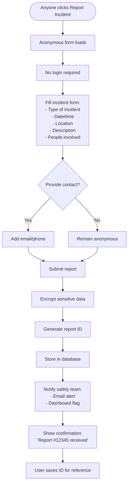
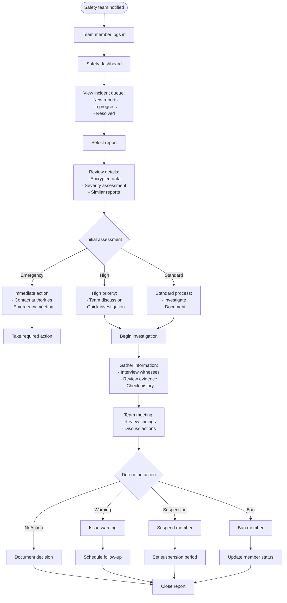
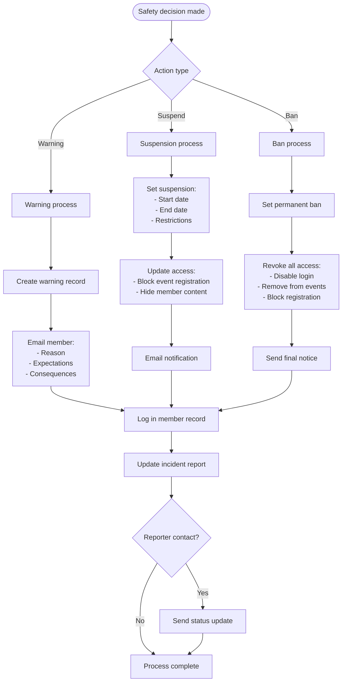
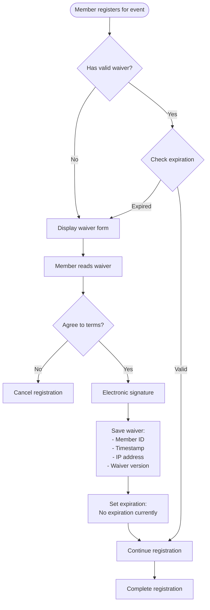
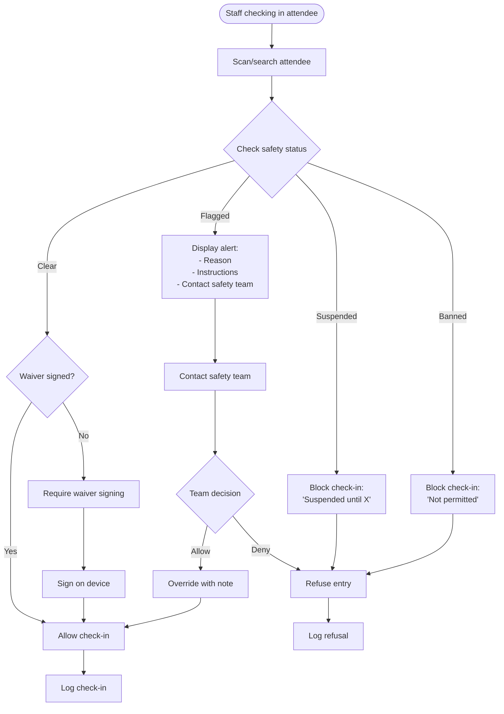

# Safety & Incident Management Flows

## 1. Anonymous Incident Report Flow

## 2. Safety Team Review Flow

## 3. Member Status Change Flow

## 4. Waiver Management Flow

## 5. Check-in Safety Verification

## Safety System Components

### Incident Types
- Consent violations
- Safety concerns
- Code of conduct violations
- Medical emergencies
- Property damage
- Other concerns

### Response Levels
1. **Information Only** - Logged but no action
2. **Monitor** - Watch for patterns
3. **Warning** - Formal warning issued
4. **Suspension** - Temporary removal
5. **Ban** - Permanent removal

### Documentation Requirements
- All reports documented
- All actions logged
- Decision rationale recorded
- Follow-up scheduled
- Patterns tracked

### Privacy Protection
- Report encryption
- Limited access (safety team only)
- Anonymous option
- Secure communication
- Data retention policy

### Communication Templates
- Initial report acknowledgment
- Investigation updates
- Warning notices
- Suspension notifications
- Ban notifications
- Reinstatement (if applicable)