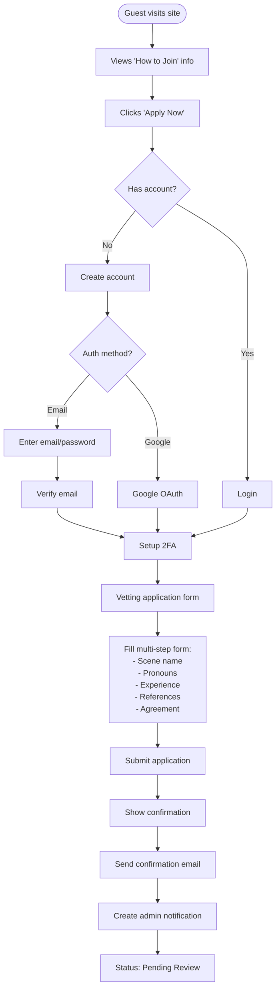
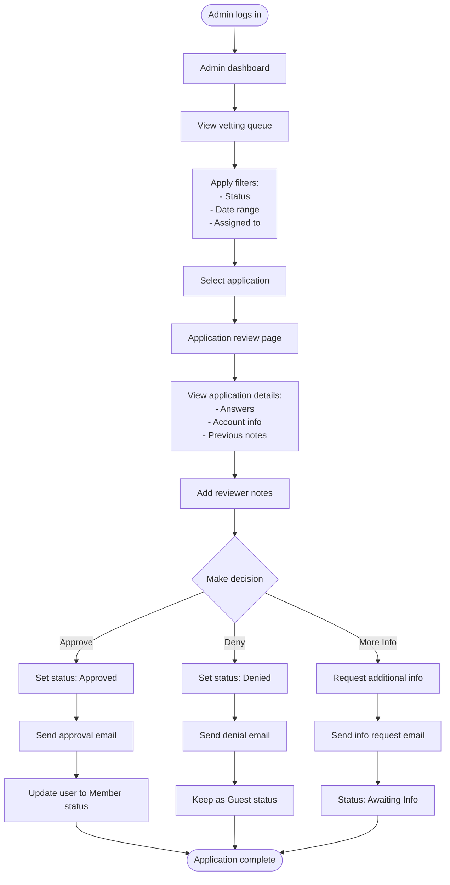
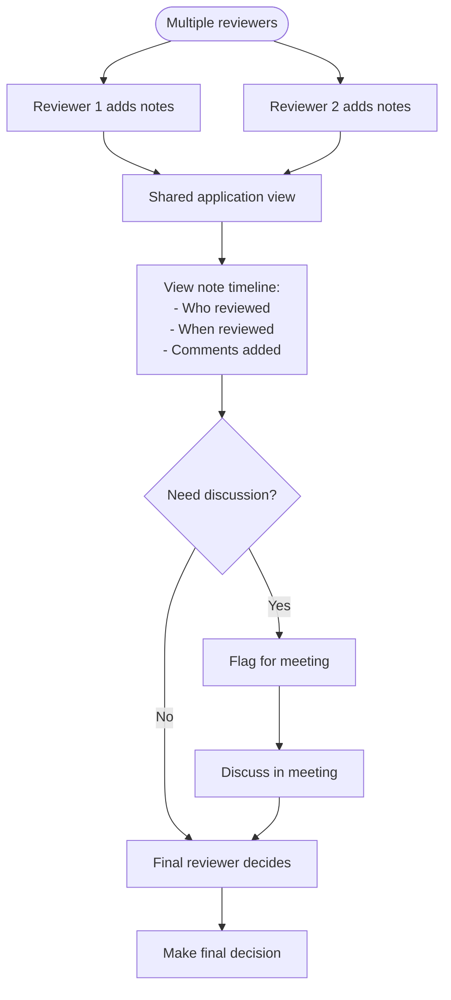
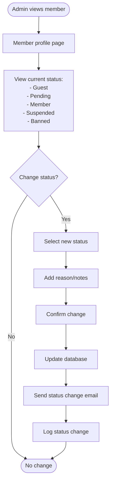
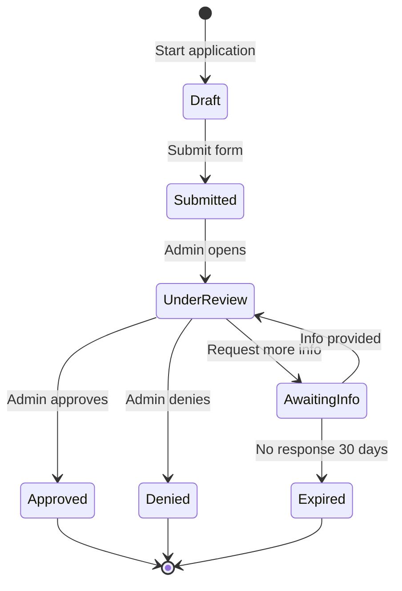

# Vetting System User Flows

## 1. Guest Application Flow

## 2. Admin Review Flow

## 3. Collaborative Review Flow

## 4. Member Status Management Flow

## State Diagram: Application Status

## Key Features

### Application Form
- Multi-step process with progress indicator
- Save draft functionality
- Field validation
- Required fields clearly marked
- Help text for complex questions

### Admin Queue
- Sortable columns
- Bulk actions
- Assignment to reviewers
- Priority flagging
- Search functionality

### Review Interface
- Full application display
- Inline note taking
- Status history
- Quick actions
- Email preview

### Notifications
- Application received (to applicant)
- New application (to admins)
- Status changes (to applicant)
- Notes added (to assigned reviewers)
- Reminder for pending reviews