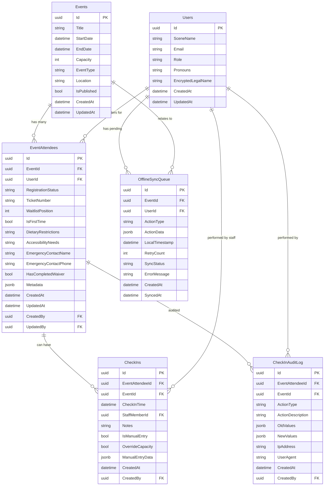

# CheckIn System Database Design - WitchCityRope
<!-- Last Updated: 2025-09-13 -->
<!-- Version: 1.0 -->
<!-- Owner: Database Designer Agent -->
<!-- Status: Initial Design -->

## Overview

This document defines the database schema and Entity Framework Core configuration for the CheckIn System, which manages event attendee check-ins with offline capability and sync functionality. The design integrates with existing Events and Users tables while adding specialized entities for check-in operations.

## Business Context

The CheckIn System provides:
- **Attendee Registration Tracking**: Link pre-registered users to events
- **Real-time Check-In Processing**: Quick staff-driven check-in operations
- **Offline Capability**: Local data sync when connectivity is unreliable
- **Audit Trail**: Complete tracking of who checked in when and by whom
- **Waitlist Management**: Support for over-capacity situations with manual overrides

## Design Principles Applied

### From Database Developer Lessons Learned

1. **PostgreSQL DateTime UTC Handling**: All DateTime properties use `timestamptz` and UTC values
2. **Entity ID Initialization**: All entities initialize `Id = Guid.NewGuid()` in constructors
3. **Audit Fields**: Consistent `CreatedAt`, `UpdatedAt`, `CreatedBy`, `UpdatedBy` patterns
4. **Explicit Constraint Naming**: All PostgreSQL constraints explicitly named
5. **Performance Indexing**: Strategic indexes for quick searches and capacity queries
6. **JSONB Usage**: Flexible metadata storage with GIN indexes

### From Entity Framework Patterns

1. **Separate Configuration Classes**: Each entity has dedicated `IEntityTypeConfiguration<T>`
2. **Navigation Property Management**: Clean relationships without circular dependencies
3. **Timestamptz Column Types**: Explicit PostgreSQL timezone-aware columns
4. **AsNoTracking for Queries**: Read-only operations optimized
5. **Transaction Boundaries**: Atomic operations for data consistency

## Entity Relationship Diagram



## Database Schema (PostgreSQL DDL)

### 1. EventAttendees Table

```sql
-- EventAttendees: Links users to events with registration details
CREATE TABLE "EventAttendees" (
    "Id" uuid NOT NULL DEFAULT gen_random_uuid(),
    "EventId" uuid NOT NULL,
    "UserId" uuid NOT NULL,
    "RegistrationStatus" text NOT NULL CHECK ("RegistrationStatus" IN ('confirmed', 'waitlist', 'checked-in', 'no-show', 'cancelled')),
    "TicketNumber" varchar(50),
    "WaitlistPosition" integer,
    "IsFirstTime" boolean NOT NULL DEFAULT false,
    "DietaryRestrictions" text,
    "AccessibilityNeeds" text,
    "EmergencyContactName" varchar(200),
    "EmergencyContactPhone" varchar(50),
    "HasCompletedWaiver" boolean NOT NULL DEFAULT false,
    "Metadata" jsonb NOT NULL DEFAULT '{}',
    "CreatedAt" timestamptz NOT NULL DEFAULT NOW(),
    "UpdatedAt" timestamptz NOT NULL DEFAULT NOW(),
    "CreatedBy" uuid,
    "UpdatedBy" uuid,
    
    CONSTRAINT "PK_EventAttendees" PRIMARY KEY ("Id"),
    CONSTRAINT "FK_EventAttendees_Events" FOREIGN KEY ("EventId") REFERENCES "Events"("Id") ON DELETE CASCADE,
    CONSTRAINT "FK_EventAttendees_Users" FOREIGN KEY ("UserId") REFERENCES "Users"("Id") ON DELETE CASCADE,
    CONSTRAINT "FK_EventAttendees_CreatedBy" FOREIGN KEY ("CreatedBy") REFERENCES "Users"("Id") ON DELETE SET NULL,
    CONSTRAINT "FK_EventAttendees_UpdatedBy" FOREIGN KEY ("UpdatedBy") REFERENCES "Users"("Id") ON DELETE SET NULL,
    CONSTRAINT "CHK_EventAttendees_WaitlistPosition" CHECK ("WaitlistPosition" > 0 OR "WaitlistPosition" IS NULL),
    CONSTRAINT "UQ_EventAttendees_EventUser" UNIQUE ("EventId", "UserId"),
    CONSTRAINT "UQ_EventAttendees_TicketNumber" UNIQUE ("TicketNumber") -- Only if not null
);

-- Indexes for performance
CREATE INDEX "IX_EventAttendees_EventId" ON "EventAttendees" ("EventId");
CREATE INDEX "IX_EventAttendees_UserId" ON "EventAttendees" ("UserId");
CREATE INDEX "IX_EventAttendees_RegistrationStatus" ON "EventAttendees" ("RegistrationStatus");
CREATE INDEX "IX_EventAttendees_Event_Status" ON "EventAttendees" ("EventId", "RegistrationStatus");
CREATE INDEX "IX_EventAttendees_Event_Waitlist" ON "EventAttendees" ("EventId", "WaitlistPosition") WHERE "RegistrationStatus" = 'waitlist';
CREATE INDEX "IX_EventAttendees_FirstTime" ON "EventAttendees" ("IsFirstTime") WHERE "IsFirstTime" = true;
CREATE INDEX "IX_EventAttendees_Waiver" ON "EventAttendees" ("HasCompletedWaiver") WHERE "HasCompletedWaiver" = false;

-- JSONB GIN index for flexible metadata queries
CREATE INDEX "IX_EventAttendees_Metadata" ON "EventAttendees" USING GIN ("Metadata");

-- Partial unique index for ticket numbers (only when not null)
CREATE UNIQUE INDEX "IX_EventAttendees_TicketNumber_Unique" ON "EventAttendees" ("TicketNumber") WHERE "TicketNumber" IS NOT NULL;
```

### 2. CheckIns Table

```sql
-- CheckIns: Actual check-in records for attendees
CREATE TABLE "CheckIns" (
    "Id" uuid NOT NULL DEFAULT gen_random_uuid(),
    "EventAttendeeId" uuid NOT NULL,
    "EventId" uuid NOT NULL, -- Denormalized for quick queries
    "CheckInTime" timestamptz NOT NULL,
    "StaffMemberId" uuid NOT NULL,
    "Notes" text,
    "IsManualEntry" boolean NOT NULL DEFAULT false,
    "OverrideCapacity" boolean NOT NULL DEFAULT false,
    "ManualEntryData" jsonb,
    "CreatedAt" timestamptz NOT NULL DEFAULT NOW(),
    "CreatedBy" uuid NOT NULL,
    
    CONSTRAINT "PK_CheckIns" PRIMARY KEY ("Id"),
    CONSTRAINT "FK_CheckIns_EventAttendees" FOREIGN KEY ("EventAttendeeId") REFERENCES "EventAttendees"("Id") ON DELETE CASCADE,
    CONSTRAINT "FK_CheckIns_Events" FOREIGN KEY ("EventId") REFERENCES "Events"("Id") ON DELETE CASCADE,
    CONSTRAINT "FK_CheckIns_StaffMember" FOREIGN KEY ("StaffMemberId") REFERENCES "Users"("Id") ON DELETE RESTRICT,
    CONSTRAINT "FK_CheckIns_CreatedBy" FOREIGN KEY ("CreatedBy") REFERENCES "Users"("Id") ON DELETE RESTRICT,
    CONSTRAINT "UQ_CheckIns_EventAttendee" UNIQUE ("EventAttendeeId"), -- One check-in per attendee
    CONSTRAINT "CHK_CheckIns_ManualEntryData" CHECK (
        ("IsManualEntry" = true AND "ManualEntryData" IS NOT NULL) OR
        ("IsManualEntry" = false AND "ManualEntryData" IS NULL)
    )
);

-- Indexes for performance
CREATE INDEX "IX_CheckIns_EventId" ON "CheckIns" ("EventId");
CREATE INDEX "IX_CheckIns_StaffMemberId" ON "CheckIns" ("StaffMemberId");
CREATE INDEX "IX_CheckIns_CheckInTime" ON "CheckIns" ("CheckInTime" DESC);
CREATE INDEX "IX_CheckIns_Event_Time" ON "CheckIns" ("EventId", "CheckInTime" DESC);
CREATE INDEX "IX_CheckIns_ManualEntry" ON "CheckIns" ("IsManualEntry") WHERE "IsManualEntry" = true;
CREATE INDEX "IX_CheckIns_CapacityOverride" ON "CheckIns" ("OverrideCapacity") WHERE "OverrideCapacity" = true;

-- GIN index for manual entry data
CREATE INDEX "IX_CheckIns_ManualEntryData" ON "CheckIns" USING GIN ("ManualEntryData") WHERE "ManualEntryData" IS NOT NULL;
```

### 3. CheckInAuditLog Table

```sql
-- CheckInAuditLog: Complete audit trail for check-in operations
CREATE TABLE "CheckInAuditLog" (
    "Id" uuid NOT NULL DEFAULT gen_random_uuid(),
    "EventAttendeeId" uuid,
    "EventId" uuid NOT NULL,
    "ActionType" varchar(50) NOT NULL CHECK ("ActionType" IN ('check-in', 'manual-entry', 'capacity-override', 'status-change', 'data-update')),
    "ActionDescription" text NOT NULL,
    "OldValues" jsonb,
    "NewValues" jsonb,
    "IpAddress" varchar(45),
    "UserAgent" varchar(500),
    "CreatedAt" timestamptz NOT NULL DEFAULT NOW(),
    "CreatedBy" uuid NOT NULL,
    
    CONSTRAINT "PK_CheckInAuditLog" PRIMARY KEY ("Id"),
    CONSTRAINT "FK_CheckInAuditLog_EventAttendees" FOREIGN KEY ("EventAttendeeId") REFERENCES "EventAttendees"("Id") ON DELETE SET NULL,
    CONSTRAINT "FK_CheckInAuditLog_Events" FOREIGN KEY ("EventId") REFERENCES "Events"("Id") ON DELETE CASCADE,
    CONSTRAINT "FK_CheckInAuditLog_CreatedBy" FOREIGN KEY ("CreatedBy") REFERENCES "Users"("Id") ON DELETE RESTRICT
);

-- Indexes for audit queries
CREATE INDEX "IX_CheckInAuditLog_EventId" ON "CheckInAuditLog" ("EventId");
CREATE INDEX "IX_CheckInAuditLog_EventAttendeeId" ON "CheckInAuditLog" ("EventAttendeeId");
CREATE INDEX "IX_CheckInAuditLog_ActionType" ON "CheckInAuditLog" ("ActionType");
CREATE INDEX "IX_CheckInAuditLog_CreatedAt" ON "CheckInAuditLog" ("CreatedAt" DESC);
CREATE INDEX "IX_CheckInAuditLog_Event_Time" ON "CheckInAuditLog" ("EventId", "CreatedAt" DESC);
CREATE INDEX "IX_CheckInAuditLog_User_Time" ON "CheckInAuditLog" ("CreatedBy", "CreatedAt" DESC);

-- GIN indexes for JSONB columns
CREATE INDEX "IX_CheckInAuditLog_OldValues" ON "CheckInAuditLog" USING GIN ("OldValues") WHERE "OldValues" IS NOT NULL;
CREATE INDEX "IX_CheckInAuditLog_NewValues" ON "CheckInAuditLog" USING GIN ("NewValues") WHERE "NewValues" IS NOT NULL;
```

### 4. OfflineSyncQueue Table

```sql
-- OfflineSyncQueue: Manages offline operations for sync when connectivity returns
CREATE TABLE "OfflineSyncQueue" (
    "Id" uuid NOT NULL DEFAULT gen_random_uuid(),
    "EventId" uuid NOT NULL,
    "UserId" uuid NOT NULL, -- Staff member who performed the action
    "ActionType" varchar(50) NOT NULL CHECK ("ActionType" IN ('check-in', 'manual-entry', 'status-update', 'capacity-override')),
    "ActionData" jsonb NOT NULL,
    "LocalTimestamp" timestamptz NOT NULL,
    "RetryCount" integer NOT NULL DEFAULT 0,
    "SyncStatus" varchar(20) NOT NULL DEFAULT 'pending' CHECK ("SyncStatus" IN ('pending', 'syncing', 'completed', 'failed', 'conflict')),
    "ErrorMessage" text,
    "CreatedAt" timestamptz NOT NULL DEFAULT NOW(),
    "SyncedAt" timestamptz,
    
    CONSTRAINT "PK_OfflineSyncQueue" PRIMARY KEY ("Id"),
    CONSTRAINT "FK_OfflineSyncQueue_Events" FOREIGN KEY ("EventId") REFERENCES "Events"("Id") ON DELETE CASCADE,
    CONSTRAINT "FK_OfflineSyncQueue_Users" FOREIGN KEY ("UserId") REFERENCES "Users"("Id") ON DELETE CASCADE,
    CONSTRAINT "CHK_OfflineSyncQueue_RetryCount" CHECK ("RetryCount" >= 0 AND "RetryCount" <= 10),
    CONSTRAINT "CHK_OfflineSyncQueue_SyncedAt" CHECK (
        ("SyncStatus" = 'completed' AND "SyncedAt" IS NOT NULL) OR
        ("SyncStatus" != 'completed' AND "SyncedAt" IS NULL)
    )
);

-- Indexes for sync operations
CREATE INDEX "IX_OfflineSyncQueue_SyncStatus" ON "OfflineSyncQueue" ("SyncStatus");
CREATE INDEX "IX_OfflineSyncQueue_EventId" ON "OfflineSyncQueue" ("EventId");
CREATE INDEX "IX_OfflineSyncQueue_UserId" ON "OfflineSyncQueue" ("UserId");
CREATE INDEX "IX_OfflineSyncQueue_LocalTimestamp" ON "OfflineSyncQueue" ("LocalTimestamp" DESC);
CREATE INDEX "IX_OfflineSyncQueue_Pending" ON "OfflineSyncQueue" ("CreatedAt") WHERE "SyncStatus" = 'pending';
CREATE INDEX "IX_OfflineSyncQueue_Failed" ON "OfflineSyncQueue" ("RetryCount", "CreatedAt") WHERE "SyncStatus" = 'failed' AND "RetryCount" < 5;

-- GIN index for action data
CREATE INDEX "IX_OfflineSyncQueue_ActionData" ON "OfflineSyncQueue" USING GIN ("ActionData");
```

## Entity Framework Core Entities

### 1. EventAttendee Entity

```csharp
/// <summary>
/// EventAttendee entity - Links users to events with registration and attendee details
/// Supports both pre-registered attendees and walk-in manual entries
/// </summary>
public class EventAttendee
{
    /// <summary>
    /// Unique identifier for the attendee registration
    /// </summary>
    public Guid Id { get; set; }

    /// <summary>
    /// Reference to the event
    /// </summary>
    public Guid EventId { get; set; }

    /// <summary>
    /// Reference to the registered user
    /// </summary>
    public Guid UserId { get; set; }

    /// <summary>
    /// Current registration status
    /// Values: confirmed, waitlist, checked-in, no-show, cancelled
    /// </summary>
    public string RegistrationStatus { get; set; } = "confirmed";

    /// <summary>
    /// Unique ticket/confirmation number for identification
    /// </summary>
    public string? TicketNumber { get; set; }

    /// <summary>
    /// Position on waitlist (null if not waitlisted)
    /// </summary>
    public int? WaitlistPosition { get; set; }

    /// <summary>
    /// Flag indicating if this is the attendee's first event
    /// </summary>
    public bool IsFirstTime { get; set; } = false;

    /// <summary>
    /// Dietary restrictions and allergies (displayed during check-in)
    /// </summary>
    public string? DietaryRestrictions { get; set; }

    /// <summary>
    /// Accessibility needs and accommodations
    /// </summary>
    public string? AccessibilityNeeds { get; set; }

    /// <summary>
    /// Emergency contact name
    /// </summary>
    public string? EmergencyContactName { get; set; }

    /// <summary>
    /// Emergency contact phone number
    /// </summary>
    public string? EmergencyContactPhone { get; set; }

    /// <summary>
    /// Whether the attendee has completed required waivers
    /// </summary>
    public bool HasCompletedWaiver { get; set; } = false;

    /// <summary>
    /// Flexible metadata for additional attendee information
    /// </summary>
    public string Metadata { get; set; } = "{}";

    /// <summary>
    /// When the registration was created
    /// </summary>
    public DateTime CreatedAt { get; set; }

    /// <summary>
    /// When the registration was last updated
    /// </summary>
    public DateTime UpdatedAt { get; set; }

    /// <summary>
    /// User who created this registration
    /// </summary>
    public Guid? CreatedBy { get; set; }

    /// <summary>
    /// User who last updated this registration
    /// </summary>
    public Guid? UpdatedBy { get; set; }

    // Navigation properties
    public Event Event { get; set; } = null!;
    public ApplicationUser User { get; set; } = null!;
    public ApplicationUser? CreatedByUser { get; set; }
    public ApplicationUser? UpdatedByUser { get; set; }
    public ICollection<CheckIn> CheckIns { get; set; } = new List<CheckIn>();
    public ICollection<CheckInAuditLog> AuditLogs { get; set; } = new List<CheckInAuditLog>();

    /// <summary>
    /// Constructor initializes required fields
    /// </summary>
    public EventAttendee()
    {
        Id = Guid.NewGuid();
        CreatedAt = DateTime.UtcNow;
        UpdatedAt = DateTime.UtcNow;
    }

    /// <summary>
    /// Constructor for new registration
    /// </summary>
    public EventAttendee(Guid eventId, Guid userId, string registrationStatus = "confirmed") : this()
    {
        EventId = eventId;
        UserId = userId;
        RegistrationStatus = registrationStatus;
    }
}
```

### 2. CheckIn Entity

```csharp
/// <summary>
/// CheckIn entity - Records actual check-in events for attendees
/// Supports both regular attendees and manual walk-in entries
/// </summary>
public class CheckIn
{
    /// <summary>
    /// Unique identifier for the check-in record
    /// </summary>
    public Guid Id { get; set; }

    /// <summary>
    /// Reference to the attendee being checked in
    /// </summary>
    public Guid EventAttendeeId { get; set; }

    /// <summary>
    /// Reference to the event (denormalized for quick queries)
    /// </summary>
    public Guid EventId { get; set; }

    /// <summary>
    /// Exact timestamp when check-in occurred (in event local time)
    /// </summary>
    public DateTime CheckInTime { get; set; }

    /// <summary>
    /// Staff member who performed the check-in
    /// </summary>
    public Guid StaffMemberId { get; set; }

    /// <summary>
    /// Optional notes added during check-in
    /// </summary>
    public string? Notes { get; set; }

    /// <summary>
    /// Flag indicating if this was a manual entry (walk-in)
    /// </summary>
    public bool IsManualEntry { get; set; } = false;

    /// <summary>
    /// Flag indicating if capacity was overridden for this check-in
    /// </summary>
    public bool OverrideCapacity { get; set; } = false;

    /// <summary>
    /// Manual entry data for walk-in attendees (JSON)
    /// Required when IsManualEntry = true
    /// </summary>
    public string? ManualEntryData { get; set; }

    /// <summary>
    /// When the check-in record was created
    /// </summary>
    public DateTime CreatedAt { get; set; }

    /// <summary>
    /// User who created this check-in record
    /// </summary>
    public Guid CreatedBy { get; set; }

    // Navigation properties
    public EventAttendee EventAttendee { get; set; } = null!;
    public Event Event { get; set; } = null!;
    public ApplicationUser StaffMember { get; set; } = null!;
    public ApplicationUser CreatedByUser { get; set; } = null!;

    /// <summary>
    /// Constructor initializes required fields
    /// </summary>
    public CheckIn()
    {
        Id = Guid.NewGuid();
        CreatedAt = DateTime.UtcNow;
        CheckInTime = DateTime.UtcNow;
    }

    /// <summary>
    /// Constructor for new check-in
    /// </summary>
    public CheckIn(Guid eventAttendeeId, Guid eventId, Guid staffMemberId) : this()
    {
        EventAttendeeId = eventAttendeeId;
        EventId = eventId;
        StaffMemberId = staffMemberId;
        CreatedBy = staffMemberId;
    }
}
```

### 3. CheckInAuditLog Entity

```csharp
/// <summary>
/// CheckInAuditLog entity - Complete audit trail for check-in operations
/// Tracks all changes and actions for compliance and troubleshooting
/// </summary>
public class CheckInAuditLog
{
    /// <summary>
    /// Unique identifier for the audit log entry
    /// </summary>
    public Guid Id { get; set; }

    /// <summary>
    /// Reference to the attendee (null for event-level actions)
    /// </summary>
    public Guid? EventAttendeeId { get; set; }

    /// <summary>
    /// Reference to the event
    /// </summary>
    public Guid EventId { get; set; }

    /// <summary>
    /// Type of action performed
    /// Values: check-in, manual-entry, capacity-override, status-change, data-update
    /// </summary>
    public string ActionType { get; set; } = string.Empty;

    /// <summary>
    /// Human-readable description of the action
    /// </summary>
    public string ActionDescription { get; set; } = string.Empty;

    /// <summary>
    /// JSON representation of old values (before change)
    /// </summary>
    public string? OldValues { get; set; }

    /// <summary>
    /// JSON representation of new values (after change)
    /// </summary>
    public string? NewValues { get; set; }

    /// <summary>
    /// IP address of the user performing the action
    /// </summary>
    public string? IpAddress { get; set; }

    /// <summary>
    /// User agent string for the device/browser
    /// </summary>
    public string? UserAgent { get; set; }

    /// <summary>
    /// When the action occurred
    /// </summary>
    public DateTime CreatedAt { get; set; }

    /// <summary>
    /// User who performed the action
    /// </summary>
    public Guid CreatedBy { get; set; }

    // Navigation properties
    public EventAttendee? EventAttendee { get; set; }
    public Event Event { get; set; } = null!;
    public ApplicationUser CreatedByUser { get; set; } = null!;

    /// <summary>
    /// Constructor initializes required fields
    /// </summary>
    public CheckInAuditLog()
    {
        Id = Guid.NewGuid();
        CreatedAt = DateTime.UtcNow;
    }

    /// <summary>
    /// Constructor for new audit log entry
    /// </summary>
    public CheckInAuditLog(Guid eventId, string actionType, string description, Guid createdBy) : this()
    {
        EventId = eventId;
        ActionType = actionType;
        ActionDescription = description;
        CreatedBy = createdBy;
    }
}
```

### 4. OfflineSyncQueue Entity

```csharp
/// <summary>
/// OfflineSyncQueue entity - Manages offline operations for sync when connectivity returns
/// Ensures data integrity during poor network conditions at events
/// </summary>
public class OfflineSyncQueue
{
    /// <summary>
    /// Unique identifier for the sync queue entry
    /// </summary>
    public Guid Id { get; set; }

    /// <summary>
    /// Reference to the event
    /// </summary>
    public Guid EventId { get; set; }

    /// <summary>
    /// Staff member who performed the action
    /// </summary>
    public Guid UserId { get; set; }

    /// <summary>
    /// Type of action that was performed offline
    /// Values: check-in, manual-entry, status-update, capacity-override
    /// </summary>
    public string ActionType { get; set; } = string.Empty;

    /// <summary>
    /// Complete action data as JSON for replay during sync
    /// </summary>
    public string ActionData { get; set; } = "{}";

    /// <summary>
    /// Local timestamp when the action was performed
    /// </summary>
    public DateTime LocalTimestamp { get; set; }

    /// <summary>
    /// Number of sync retry attempts
    /// </summary>
    public int RetryCount { get; set; } = 0;

    /// <summary>
    /// Current sync status
    /// Values: pending, syncing, completed, failed, conflict
    /// </summary>
    public string SyncStatus { get; set; } = "pending";

    /// <summary>
    /// Error message if sync failed
    /// </summary>
    public string? ErrorMessage { get; set; }

    /// <summary>
    /// When the queue entry was created
    /// </summary>
    public DateTime CreatedAt { get; set; }

    /// <summary>
    /// When the action was successfully synced (null if not synced)
    /// </summary>
    public DateTime? SyncedAt { get; set; }

    // Navigation properties
    public Event Event { get; set; } = null!;
    public ApplicationUser User { get; set; } = null!;

    /// <summary>
    /// Constructor initializes required fields
    /// </summary>
    public OfflineSyncQueue()
    {
        Id = Guid.NewGuid();
        CreatedAt = DateTime.UtcNow;
        LocalTimestamp = DateTime.UtcNow;
    }

    /// <summary>
    /// Constructor for new sync queue entry
    /// </summary>
    public OfflineSyncQueue(Guid eventId, Guid userId, string actionType, string actionData) : this()
    {
        EventId = eventId;
        UserId = userId;
        ActionType = actionType;
        ActionData = actionData;
    }
}
```

## Entity Framework Configuration Classes

### 1. EventAttendeeConfiguration

```csharp
/// <summary>
/// Entity Framework configuration for EventAttendee entity
/// </summary>
public class EventAttendeeConfiguration : IEntityTypeConfiguration<EventAttendee>
{
    public void Configure(EntityTypeBuilder<EventAttendee> builder)
    {
        // Table mapping
        builder.ToTable("EventAttendees", "public");
        builder.HasKey(e => e.Id);

        // Property configurations
        builder.Property(e => e.RegistrationStatus)
               .IsRequired()
               .HasColumnType("text");

        builder.Property(e => e.TicketNumber)
               .HasMaxLength(50);

        builder.Property(e => e.DietaryRestrictions)
               .HasColumnType("text");

        builder.Property(e => e.AccessibilityNeeds)
               .HasColumnType("text");

        builder.Property(e => e.EmergencyContactName)
               .HasMaxLength(200);

        builder.Property(e => e.EmergencyContactPhone)
               .HasMaxLength(50);

        builder.Property(e => e.Metadata)
               .IsRequired()
               .HasColumnType("jsonb")
               .HasDefaultValue("{}");

        // DateTime properties with timestamptz
        builder.Property(e => e.CreatedAt)
               .IsRequired()
               .HasColumnType("timestamptz");

        builder.Property(e => e.UpdatedAt)
               .IsRequired()
               .HasColumnType("timestamptz");

        // Relationships
        builder.HasOne(e => e.Event)
               .WithMany()
               .HasForeignKey(e => e.EventId)
               .OnDelete(DeleteBehavior.Cascade);

        builder.HasOne(e => e.User)
               .WithMany()
               .HasForeignKey(e => e.UserId)
               .OnDelete(DeleteBehavior.Cascade);

        builder.HasOne(e => e.CreatedByUser)
               .WithMany()
               .HasForeignKey(e => e.CreatedBy)
               .OnDelete(DeleteBehavior.SetNull);

        builder.HasOne(e => e.UpdatedByUser)
               .WithMany()
               .HasForeignKey(e => e.UpdatedBy)
               .OnDelete(DeleteBehavior.SetNull);

        builder.HasMany(e => e.CheckIns)
               .WithOne(c => c.EventAttendee)
               .HasForeignKey(c => c.EventAttendeeId)
               .OnDelete(DeleteBehavior.Cascade);

        builder.HasMany(e => e.AuditLogs)
               .WithOne(a => a.EventAttendee)
               .HasForeignKey(a => a.EventAttendeeId)
               .OnDelete(DeleteBehavior.SetNull);

        // Constraints
        builder.HasCheckConstraint("CHK_EventAttendees_WaitlistPosition", 
                "\"WaitlistPosition\" > 0 OR \"WaitlistPosition\" IS NULL");

        builder.HasCheckConstraint("CHK_EventAttendees_RegistrationStatus",
                "\"RegistrationStatus\" IN ('confirmed', 'waitlist', 'checked-in', 'no-show', 'cancelled')");

        // Indexes
        builder.HasIndex(e => e.EventId)
               .HasDatabaseName("IX_EventAttendees_EventId");

        builder.HasIndex(e => e.UserId)
               .HasDatabaseName("IX_EventAttendees_UserId");

        builder.HasIndex(e => e.RegistrationStatus)
               .HasDatabaseName("IX_EventAttendees_RegistrationStatus");

        builder.HasIndex(e => new { e.EventId, e.RegistrationStatus })
               .HasDatabaseName("IX_EventAttendees_Event_Status");

        builder.HasIndex(e => new { e.EventId, e.WaitlistPosition })
               .HasDatabaseName("IX_EventAttendees_Event_Waitlist")
               .HasFilter("\"RegistrationStatus\" = 'waitlist'");

        builder.HasIndex(e => e.IsFirstTime)
               .HasDatabaseName("IX_EventAttendees_FirstTime")
               .HasFilter("\"IsFirstTime\" = true");

        builder.HasIndex(e => e.HasCompletedWaiver)
               .HasDatabaseName("IX_EventAttendees_Waiver")
               .HasFilter("\"HasCompletedWaiver\" = false");

        // JSONB GIN index
        builder.HasIndex(e => e.Metadata)
               .HasDatabaseName("IX_EventAttendees_Metadata")
               .HasMethod("gin");

        // Unique constraints
        builder.HasIndex(e => new { e.EventId, e.UserId })
               .IsUnique()
               .HasDatabaseName("UQ_EventAttendees_EventUser");

        builder.HasIndex(e => e.TicketNumber)
               .IsUnique()
               .HasDatabaseName("IX_EventAttendees_TicketNumber_Unique")
               .HasFilter("\"TicketNumber\" IS NOT NULL");
    }
}
```

### 2. CheckInConfiguration

```csharp
/// <summary>
/// Entity Framework configuration for CheckIn entity
/// </summary>
public class CheckInConfiguration : IEntityTypeConfiguration<CheckIn>
{
    public void Configure(EntityTypeBuilder<CheckIn> builder)
    {
        // Table mapping
        builder.ToTable("CheckIns", "public");
        builder.HasKey(c => c.Id);

        // Property configurations
        builder.Property(c => c.CheckInTime)
               .IsRequired()
               .HasColumnType("timestamptz");

        builder.Property(c => c.Notes)
               .HasColumnType("text");

        builder.Property(c => c.ManualEntryData)
               .HasColumnType("jsonb");

        builder.Property(c => c.CreatedAt)
               .IsRequired()
               .HasColumnType("timestamptz");

        // Relationships
        builder.HasOne(c => c.EventAttendee)
               .WithMany(e => e.CheckIns)
               .HasForeignKey(c => c.EventAttendeeId)
               .OnDelete(DeleteBehavior.Cascade);

        builder.HasOne(c => c.Event)
               .WithMany()
               .HasForeignKey(c => c.EventId)
               .OnDelete(DeleteBehavior.Cascade);

        builder.HasOne(c => c.StaffMember)
               .WithMany()
               .HasForeignKey(c => c.StaffMemberId)
               .OnDelete(DeleteBehavior.Restrict);

        builder.HasOne(c => c.CreatedByUser)
               .WithMany()
               .HasForeignKey(c => c.CreatedBy)
               .OnDelete(DeleteBehavior.Restrict);

        // Constraints
        builder.HasCheckConstraint("CHK_CheckIns_ManualEntryData",
                "(\"IsManualEntry\" = true AND \"ManualEntryData\" IS NOT NULL) OR " +
                "(\"IsManualEntry\" = false AND \"ManualEntryData\" IS NULL)");

        // Unique constraint - one check-in per attendee
        builder.HasIndex(c => c.EventAttendeeId)
               .IsUnique()
               .HasDatabaseName("UQ_CheckIns_EventAttendee");

        // Indexes
        builder.HasIndex(c => c.EventId)
               .HasDatabaseName("IX_CheckIns_EventId");

        builder.HasIndex(c => c.StaffMemberId)
               .HasDatabaseName("IX_CheckIns_StaffMemberId");

        builder.HasIndex(c => c.CheckInTime)
               .HasDatabaseName("IX_CheckIns_CheckInTime");

        builder.HasIndex(c => new { c.EventId, c.CheckInTime })
               .HasDatabaseName("IX_CheckIns_Event_Time");

        builder.HasIndex(c => c.IsManualEntry)
               .HasDatabaseName("IX_CheckIns_ManualEntry")
               .HasFilter("\"IsManualEntry\" = true");

        builder.HasIndex(c => c.OverrideCapacity)
               .HasDatabaseName("IX_CheckIns_CapacityOverride")
               .HasFilter("\"OverrideCapacity\" = true");

        // JSONB GIN index for manual entry data
        builder.HasIndex(c => c.ManualEntryData)
               .HasDatabaseName("IX_CheckIns_ManualEntryData")
               .HasMethod("gin")
               .HasFilter("\"ManualEntryData\" IS NOT NULL");
    }
}
```

### 3. CheckInAuditLogConfiguration

```csharp
/// <summary>
/// Entity Framework configuration for CheckInAuditLog entity
/// </summary>
public class CheckInAuditLogConfiguration : IEntityTypeConfiguration<CheckInAuditLog>
{
    public void Configure(EntityTypeBuilder<CheckInAuditLog> builder)
    {
        // Table mapping
        builder.ToTable("CheckInAuditLog", "public");
        builder.HasKey(a => a.Id);

        // Property configurations
        builder.Property(a => a.ActionType)
               .IsRequired()
               .HasMaxLength(50);

        builder.Property(a => a.ActionDescription)
               .IsRequired()
               .HasColumnType("text");

        builder.Property(a => a.OldValues)
               .HasColumnType("jsonb");

        builder.Property(a => a.NewValues)
               .HasColumnType("jsonb");

        builder.Property(a => a.IpAddress)
               .HasMaxLength(45);

        builder.Property(a => a.UserAgent)
               .HasMaxLength(500);

        builder.Property(a => a.CreatedAt)
               .IsRequired()
               .HasColumnType("timestamptz");

        // Relationships
        builder.HasOne(a => a.EventAttendee)
               .WithMany(e => e.AuditLogs)
               .HasForeignKey(a => a.EventAttendeeId)
               .OnDelete(DeleteBehavior.SetNull);

        builder.HasOne(a => a.Event)
               .WithMany()
               .HasForeignKey(a => a.EventId)
               .OnDelete(DeleteBehavior.Cascade);

        builder.HasOne(a => a.CreatedByUser)
               .WithMany()
               .HasForeignKey(a => a.CreatedBy)
               .OnDelete(DeleteBehavior.Restrict);

        // Constraints
        builder.HasCheckConstraint("CHK_CheckInAuditLog_ActionType",
                "\"ActionType\" IN ('check-in', 'manual-entry', 'capacity-override', 'status-change', 'data-update')");

        // Indexes
        builder.HasIndex(a => a.EventId)
               .HasDatabaseName("IX_CheckInAuditLog_EventId");

        builder.HasIndex(a => a.EventAttendeeId)
               .HasDatabaseName("IX_CheckInAuditLog_EventAttendeeId");

        builder.HasIndex(a => a.ActionType)
               .HasDatabaseName("IX_CheckInAuditLog_ActionType");

        builder.HasIndex(a => a.CreatedAt)
               .HasDatabaseName("IX_CheckInAuditLog_CreatedAt");

        builder.HasIndex(a => new { a.EventId, a.CreatedAt })
               .HasDatabaseName("IX_CheckInAuditLog_Event_Time");

        builder.HasIndex(a => new { a.CreatedBy, a.CreatedAt })
               .HasDatabaseName("IX_CheckInAuditLog_User_Time");

        // JSONB GIN indexes
        builder.HasIndex(a => a.OldValues)
               .HasDatabaseName("IX_CheckInAuditLog_OldValues")
               .HasMethod("gin")
               .HasFilter("\"OldValues\" IS NOT NULL");

        builder.HasIndex(a => a.NewValues)
               .HasDatabaseName("IX_CheckInAuditLog_NewValues")
               .HasMethod("gin")
               .HasFilter("\"NewValues\" IS NOT NULL");
    }
}
```

### 4. OfflineSyncQueueConfiguration

```csharp
/// <summary>
/// Entity Framework configuration for OfflineSyncQueue entity
/// </summary>
public class OfflineSyncQueueConfiguration : IEntityTypeConfiguration<OfflineSyncQueue>
{
    public void Configure(EntityTypeBuilder<OfflineSyncQueue> builder)
    {
        // Table mapping
        builder.ToTable("OfflineSyncQueue", "public");
        builder.HasKey(o => o.Id);

        // Property configurations
        builder.Property(o => o.ActionType)
               .IsRequired()
               .HasMaxLength(50);

        builder.Property(o => o.ActionData)
               .IsRequired()
               .HasColumnType("jsonb")
               .HasDefaultValue("{}");

        builder.Property(o => o.LocalTimestamp)
               .IsRequired()
               .HasColumnType("timestamptz");

        builder.Property(o => o.SyncStatus)
               .IsRequired()
               .HasMaxLength(20)
               .HasDefaultValue("pending");

        builder.Property(o => o.ErrorMessage)
               .HasColumnType("text");

        builder.Property(o => o.CreatedAt)
               .IsRequired()
               .HasColumnType("timestamptz");

        builder.Property(o => o.SyncedAt)
               .HasColumnType("timestamptz");

        // Relationships
        builder.HasOne(o => o.Event)
               .WithMany()
               .HasForeignKey(o => o.EventId)
               .OnDelete(DeleteBehavior.Cascade);

        builder.HasOne(o => o.User)
               .WithMany()
               .HasForeignKey(o => o.UserId)
               .OnDelete(DeleteBehavior.Cascade);

        // Constraints
        builder.HasCheckConstraint("CHK_OfflineSyncQueue_ActionType",
                "\"ActionType\" IN ('check-in', 'manual-entry', 'status-update', 'capacity-override')");

        builder.HasCheckConstraint("CHK_OfflineSyncQueue_SyncStatus",
                "\"SyncStatus\" IN ('pending', 'syncing', 'completed', 'failed', 'conflict')");

        builder.HasCheckConstraint("CHK_OfflineSyncQueue_RetryCount",
                "\"RetryCount\" >= 0 AND \"RetryCount\" <= 10");

        builder.HasCheckConstraint("CHK_OfflineSyncQueue_SyncedAt",
                "(\"SyncStatus\" = 'completed' AND \"SyncedAt\" IS NOT NULL) OR " +
                "(\"SyncStatus\" != 'completed' AND \"SyncedAt\" IS NULL)");

        // Indexes
        builder.HasIndex(o => o.SyncStatus)
               .HasDatabaseName("IX_OfflineSyncQueue_SyncStatus");

        builder.HasIndex(o => o.EventId)
               .HasDatabaseName("IX_OfflineSyncQueue_EventId");

        builder.HasIndex(o => o.UserId)
               .HasDatabaseName("IX_OfflineSyncQueue_UserId");

        builder.HasIndex(o => o.LocalTimestamp)
               .HasDatabaseName("IX_OfflineSyncQueue_LocalTimestamp");

        builder.HasIndex(o => o.CreatedAt)
               .HasDatabaseName("IX_OfflineSyncQueue_Pending")
               .HasFilter("\"SyncStatus\" = 'pending'");

        builder.HasIndex(o => new { o.RetryCount, o.CreatedAt })
               .HasDatabaseName("IX_OfflineSyncQueue_Failed")
               .HasFilter("\"SyncStatus\" = 'failed' AND \"RetryCount\" < 5");

        // JSONB GIN index for action data
        builder.HasIndex(o => o.ActionData)
               .HasDatabaseName("IX_OfflineSyncQueue_ActionData")
               .HasMethod("gin");
    }
}
```

## DbContext Integration

### Updated ApplicationDbContext

```csharp
/// <summary>
/// Updated ApplicationDbContext with CheckIn System entities
/// </summary>
public partial class ApplicationDbContext
{
    // Add CheckIn System DbSets
    public DbSet<EventAttendee> EventAttendees { get; set; }
    public DbSet<CheckIn> CheckIns { get; set; }
    public DbSet<CheckInAuditLog> CheckInAuditLogs { get; set; }
    public DbSet<OfflineSyncQueue> OfflineSyncQueues { get; set; }

    protected override void OnModelCreating(ModelBuilder modelBuilder)
    {
        // Existing configurations...
        base.OnModelCreating(modelBuilder);

        // Apply CheckIn System configurations
        modelBuilder.ApplyConfiguration(new EventAttendeeConfiguration());
        modelBuilder.ApplyConfiguration(new CheckInConfiguration());
        modelBuilder.ApplyConfiguration(new CheckInAuditLogConfiguration());
        modelBuilder.ApplyConfiguration(new OfflineSyncQueueConfiguration());
    }

    /// <summary>
    /// Extended UpdateAuditFields to handle CheckIn entities
    /// </summary>
    private void UpdateAuditFields()
    {
        // Existing entity handling...

        // Handle EventAttendee entities
        var attendeeEntries = ChangeTracker.Entries<EventAttendee>();
        foreach (var entry in attendeeEntries)
        {
            if (entry.State == EntityState.Added)
            {
                entry.Entity.CreatedAt = DateTime.UtcNow;
                entry.Entity.UpdatedAt = DateTime.UtcNow;
            }
            else if (entry.State == EntityState.Modified)
            {
                entry.Entity.UpdatedAt = DateTime.UtcNow;
            }
        }

        // Handle CheckIn entities
        var checkInEntries = ChangeTracker.Entries<CheckIn>();
        foreach (var entry in checkInEntries)
        {
            if (entry.State == EntityState.Added)
            {
                entry.Entity.CreatedAt = DateTime.UtcNow;
                
                // Ensure CheckInTime is UTC
                if (entry.Entity.CheckInTime.Kind != DateTimeKind.Utc)
                {
                    entry.Entity.CheckInTime = DateTime.SpecifyKind(entry.Entity.CheckInTime, DateTimeKind.Utc);
                }
            }
        }

        // Handle CheckInAuditLog entities
        var auditLogEntries = ChangeTracker.Entries<CheckInAuditLog>();
        foreach (var entry in auditLogEntries)
        {
            if (entry.State == EntityState.Added)
            {
                entry.Entity.CreatedAt = DateTime.UtcNow;
            }
        }

        // Handle OfflineSyncQueue entities
        var syncQueueEntries = ChangeTracker.Entries<OfflineSyncQueue>();
        foreach (var entry in syncQueueEntries)
        {
            if (entry.State == EntityState.Added)
            {
                entry.Entity.CreatedAt = DateTime.UtcNow;
                
                // Ensure LocalTimestamp is UTC
                if (entry.Entity.LocalTimestamp.Kind != DateTimeKind.Utc)
                {
                    entry.Entity.LocalTimestamp = DateTime.SpecifyKind(entry.Entity.LocalTimestamp, DateTimeKind.Utc);
                }
            }
        }
    }
}
```

## Migration Strategy

### 1. Creation Migration

```bash
# Generate the initial CheckIn System migration
dotnet ef migrations add CheckInSystem_InitialSchema \
  --project src/WitchCityRope.Infrastructure \
  --startup-project apps/api \
  --context ApplicationDbContext \
  --output-dir Migrations
```

### 2. Phased Migration Approach

The migration will be implemented in phases to minimize downtime and risk:

**Phase 1: Schema Creation**
- Create all tables with constraints
- Add indexes for performance
- Verify schema integrity

**Phase 2: Data Population** (if migrating existing data)
- Populate EventAttendees from existing registration systems
- Create initial audit logs for existing check-ins
- Validate data consistency

**Phase 3: Application Integration**
- Enable CheckIn endpoints
- Deploy UI components
- Test offline sync functionality

**Phase 4: Production Validation**
- Monitor performance metrics
- Validate audit trail completeness
- Test offline/online transition scenarios

### 3. Rollback Strategy

Each migration includes proper `Down()` methods:

```csharp
protected override void Down(MigrationBuilder migrationBuilder)
{
    // Drop tables in reverse dependency order
    migrationBuilder.DropTable("OfflineSyncQueue");
    migrationBuilder.DropTable("CheckInAuditLog");
    migrationBuilder.DropTable("CheckIns");
    migrationBuilder.DropTable("EventAttendees");
}
```

## Performance Considerations

### 1. Index Strategy

**Primary Performance Indexes:**
- `EventAttendees`: Event + Status for quick attendee list filtering
- `CheckIns`: Event + Time for recent activity queries
- `CheckInAuditLog`: Event + Time for audit trail browsing
- `OfflineSyncQueue`: SyncStatus for pending operation processing

**Search Optimization Indexes:**
- `EventAttendees`: Partial indexes on FirstTime and Waiver status for quick filtering
- `CheckIns`: Partial indexes on ManualEntry and CapacityOverride for special cases
- JSONB GIN indexes for flexible metadata queries

### 2. Query Optimization Patterns

**Capacity Queries (Critical for Real-time Updates):**
```sql
-- Optimized capacity check query
SELECT 
    e."Capacity",
    COUNT(ci."Id") as "CheckedInCount",
    (e."Capacity" - COUNT(ci."Id")) as "AvailableSpots"
FROM "Events" e
LEFT JOIN "EventAttendees" ea ON e."Id" = ea."EventId"
LEFT JOIN "CheckIns" ci ON ea."Id" = ci."EventAttendeeId"
WHERE e."Id" = @eventId
GROUP BY e."Id", e."Capacity";
```

**Attendee Search Queries:**
```sql
-- Optimized attendee search with all needed data
SELECT 
    ea."Id",
    ea."RegistrationStatus",
    ea."IsFirstTime",
    ea."DietaryRestrictions",
    ea."AccessibilityNeeds",
    u."SceneName",
    u."Email",
    ci."CheckInTime"
FROM "EventAttendees" ea
JOIN "Users" u ON ea."UserId" = u."Id"
LEFT JOIN "CheckIns" ci ON ea."Id" = ci."EventAttendeeId"
WHERE ea."EventId" = @eventId
  AND (u."SceneName" ILIKE @search OR u."Email" ILIKE @search OR ea."TicketNumber" ILIKE @search)
ORDER BY ea."RegistrationStatus", u."SceneName";
```

### 3. Caching Strategy

**Application-Level Caching:**
- Event capacity data (5-minute cache with real-time invalidation)
- Attendee lists for offline operation (cache until event ends)
- Staff permissions (cache for session duration)

**Database-Level Optimization:**
- Connection pooling configured for peak event load
- Query plan caching for repeated search patterns
- JSONB indexing for metadata queries

## Security Considerations

### 1. Data Privacy

**Personal Information Protection:**
- Encrypted storage for sensitive fields (dietary restrictions, emergency contacts)
- Role-based access to personal information
- Audit logging for all personal data access
- Local data purge after event completion

**Access Control:**
- Role-based permissions: CheckInStaff, EventOrganizer, Administrator
- Session-based authentication with automatic timeout
- API endpoint protection with role validation

### 2. Audit Trail

**Complete Activity Logging:**
- All check-in actions logged with staff member identification
- IP address and user agent tracking for security analysis
- Old/new value tracking for data changes
- Immutable audit log design (no updates or deletes)

**Compliance Features:**
- GDPR-compliant data handling and export
- Data retention policies for audit logs
- Secure data deletion for cancelled attendees

## Monitoring and Health Checks

### 1. Database Health Checks

```csharp
/// <summary>
/// CheckIn System database health check
/// </summary>
public class CheckInDatabaseHealthCheck : IHealthCheck
{
    private readonly ApplicationDbContext _context;

    public async Task<HealthCheckResult> CheckHealthAsync(
        HealthCheckContext context,
        CancellationToken cancellationToken = default)
    {
        try
        {
            // Test database connectivity
            await _context.Database.CanConnectAsync(cancellationToken);

            // Verify critical tables exist
            var tableCount = await _context.Database.SqlQueryRaw<int>(
                "SELECT COUNT(*) FROM information_schema.tables WHERE table_name IN ('EventAttendees', 'CheckIns', 'CheckInAuditLog', 'OfflineSyncQueue')")
                .FirstAsync(cancellationToken);

            if (tableCount != 4)
            {
                return HealthCheckResult.Degraded("CheckIn system tables missing or incomplete");
            }

            // Check for pending sync operations
            var pendingSyncCount = await _context.OfflineSyncQueues
                .AsNoTracking()
                .CountAsync(q => q.SyncStatus == "pending", cancellationToken);

            var data = new Dictionary<string, object>
            {
                ["tablesVerified"] = tableCount,
                ["pendingSyncOperations"] = pendingSyncCount
            };

            return HealthCheckResult.Healthy("CheckIn system database operational", data);
        }
        catch (Exception ex)
        {
            return HealthCheckResult.Unhealthy("CheckIn system database check failed", ex);
        }
    }
}
```

### 2. Performance Monitoring

**Key Metrics to Track:**
- Check-in processing time (target: <1 second)
- Database query performance for attendee searches
- Offline sync success rate (target: >99%)
- Concurrent check-in operations during peak times

**Alerting Thresholds:**
- Check-in operations taking >3 seconds
- Failed sync operations >5 retries
- Database connection failures
- Audit log write failures

## Testing Strategy

### 1. Database Integration Tests

```csharp
[Collection("Database Integration Tests")]
public class CheckInDatabaseTests : IClassFixture<PostgreSqlFixture>
{
    [Fact]
    public async Task EventAttendee_CreateWithValidData_ShouldSucceed()
    {
        // Arrange
        var eventId = Guid.NewGuid();
        var userId = Guid.NewGuid();
        var attendee = new EventAttendee(eventId, userId);

        // Act
        _context.EventAttendees.Add(attendee);
        await _context.SaveChangesAsync();

        // Assert
        var saved = await _context.EventAttendees.FindAsync(attendee.Id);
        Assert.NotNull(saved);
        Assert.Equal(attendee.EventId, saved.EventId);
        Assert.Equal(attendee.UserId, saved.UserId);
    }

    [Fact]
    public async Task CheckIn_DuplicateAttendee_ShouldThrowConstraintException()
    {
        // Test unique constraint on EventAttendeeId
        // Ensures one check-in per attendee business rule
    }

    [Fact]
    public async Task OfflineSyncQueue_RetryLimitExceeded_ShouldBeHandledGracefully()
    {
        // Test retry count constraint and error handling
    }
}
```

### 2. Performance Tests

```csharp
[Fact]
public async Task AttendeeSearch_With500Attendees_ShouldCompleteUnder500ms()
{
    // Test search performance with realistic data volumes
    var stopwatch = Stopwatch.StartNew();
    
    var results = await _context.EventAttendees
        .AsNoTracking()
        .Where(ea => ea.EventId == testEventId && 
                     (ea.User.SceneName.Contains(searchTerm) || 
                      ea.User.Email.Contains(searchTerm)))
        .OrderBy(ea => ea.User.SceneName)
        .Take(10)
        .ToListAsync();
    
    stopwatch.Stop();
    Assert.True(stopwatch.ElapsedMilliseconds < 500, 
                $"Search took {stopwatch.ElapsedMilliseconds}ms, expected <500ms");
}
```

### 3. Offline Sync Tests

```csharp
[Fact]
public async Task OfflineSync_ConflictResolution_ShouldPreserveLocalTimestamp()
{
    // Test conflict resolution when same attendee checked in offline and online
    // Verify audit trail captures conflict resolution
}
```

## Sync Conflict Resolution Strategy

### 1. Conflict Detection

**Common Conflict Scenarios:**
- Duplicate check-ins (same attendee checked in offline and online)
- Capacity exceeded (offline check-ins exceed online capacity)
- Attendee not found (offline manual entry conflicts with registration)
- Status changes (attendee cancelled after offline check-in)

### 2. Resolution Patterns

**Duplicate Check-In Resolution:**
```csharp
/// <summary>
/// Resolves duplicate check-in conflicts by preserving earliest timestamp
/// </summary>
public async Task<ConflictResolution> ResolveDuplicateCheckIn(
    OfflineSyncQueue pendingAction, 
    CheckIn existingCheckIn)
{
    var pendingCheckIn = JsonSerializer.Deserialize<CheckInData>(pendingAction.ActionData);
    
    // Preserve earliest check-in time
    if (pendingCheckIn.CheckInTime < existingCheckIn.CheckInTime)
    {
        // Update existing check-in with earlier time and offline staff member
        existingCheckIn.CheckInTime = pendingCheckIn.CheckInTime;
        existingCheckIn.StaffMemberId = pendingAction.UserId;
        existingCheckIn.Notes = $"Offline check-in time preserved. Original online check-in by {existingCheckIn.StaffMemberId}";
        
        await _context.SaveChangesAsync();
        
        // Log resolution in audit trail
        await CreateAuditLog(existingCheckIn.EventAttendeeId, "conflict-resolution", 
            "Duplicate check-in resolved - offline timestamp preserved");
    }
    
    return new ConflictResolution
    {
        Action = ConflictAction.PreserveEarliest,
        Resolution = "Offline check-in time preserved",
        RequiresManualReview = false
    };
}
```

### 3. Manual Resolution Interface

For complex conflicts requiring human judgment:
- Staff dashboard showing conflict details
- Side-by-side comparison of conflicting data
- Resolution action selection with reason tracking
- Automatic audit log creation

## Future Enhancement Considerations

### 1. Scalability Improvements

**Database Partitioning:**
- Partition CheckInAuditLog by event date for large volumes
- Archive completed events to separate tables
- Implement read replicas for reporting queries

**Caching Enhancements:**
- Redis cache for real-time capacity data
- Event-driven cache invalidation
- Distributed caching for multi-server deployments

### 2. Additional Features

**QR Code Integration:**
- QR codes for faster attendee identification
- Mobile camera integration for staff devices
- Offline QR code validation

**Analytics and Reporting:**
- Check-in timing analytics
- Staff performance metrics
- Attendance pattern analysis
- Waitlist conversion tracking

**Integration Points:**
- Email confirmation system integration
- Mobile app for attendee self-check-in
- Badge printing system integration
- Real-time notification system

## Conclusion

This database design provides a robust foundation for the CheckIn System with the following key strengths:

1. **PostgreSQL Optimized**: Leverages PostgreSQL-specific features (JSONB, timestamptz, partial indexes)
2. **Offline-Capable**: Comprehensive sync queue system for unreliable network conditions
3. **Performance-Focused**: Strategic indexing for sub-second check-in operations
4. **Audit-Complete**: Full audit trail for compliance and troubleshooting
5. **Conflict-Resilient**: Built-in conflict detection and resolution mechanisms
6. **Scalable**: Designed to handle 500+ attendee events with room for growth

The design follows established patterns from the existing WitchCityRope codebase while introducing specialized functionality for event check-in operations. All entities include proper UTC DateTime handling, audit fields, and performance optimizations critical for real-time event management.