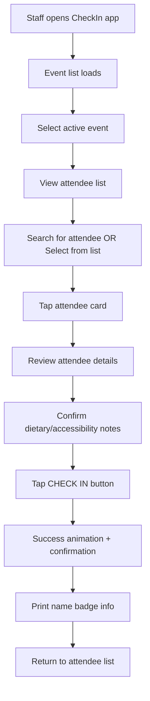
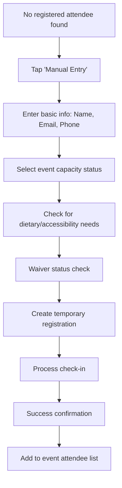
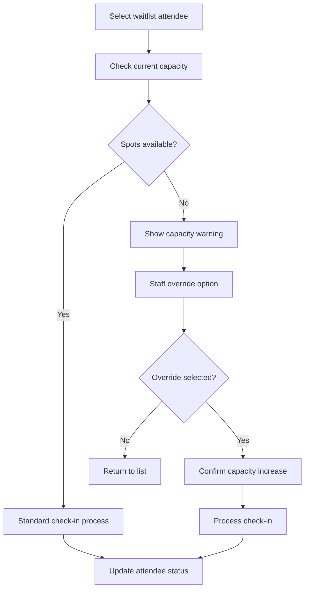

# CheckIn System UI Design - WitchCityRope
<!-- Last Updated: 2025-09-12 -->
<!-- Version: 1.0 -->
<!-- Owner: UI Designer Agent -->
<!-- Status: Initial Design -->

## Design Overview

This document provides comprehensive UI/UX design for the CheckIn System, identified as HIGH PRIORITY for managing event attendee check-ins at rope bondage community events. The system prioritizes mobile-first design for volunteer staff using phones/tablets at event entrances, with emphasis on quick processing and offline capability.

## Business Context

**Primary Driver**: Event entrance management and attendee tracking
**Current Status**: NOT IMPLEMENTED in modern API - must be designed from scratch
**Target Users**: Event staff (volunteers), event organizers, attendees (self check-in)
**Critical Requirements**: Mobile-first, offline capable, simple volunteer interface, quick processing

## User Personas

- **Volunteer Staff**: Community volunteers managing event entrance on phones/tablets
- **Event Organizer**: Staff coordinating check-in process and monitoring capacity
- **Event Administrator**: Staff with override capabilities and full event management
- **Attendee**: Community member checking themselves in at event (stretch goal)
- **Walk-in Guest**: Non-registered person seeking event entry

## Design System Integration (v7)

### Color Palette
- **Primary**: #880124 (burgundy) - Status indicators, urgent actions
- **Accent**: #B76D75 (rose-gold) - Form borders, secondary elements
- **CTA Primary**: #FFBF00 (amber) - Check-in buttons, positive actions
- **Background**: #FAF6F2 (cream) - Page backgrounds
- **Cards**: #FFF8F0 (ivory) - Content containers
- **Success**: #228B22 (forest green) - Checked-in status
- **Warning**: #DAA520 (gold) - Waitlist, limited spots
- **Error**: #DC143C (crimson) - Full events, check-in issues

### Typography
- **Headlines**: 'Bodoni Moda', serif
- **Navigation/Buttons**: 'Montserrat', sans-serif  
- **Body Text**: 'Source Sans 3', sans-serif

### Animation Patterns
- **Floating Labels**: ALL form inputs use floating label animation
- **Button Morphing**: Asymmetric corner transitions (12px 6px ↔ 6px 12px)
- **Card Hover**: translateY(-4px) with enhanced shadow (desktop only)
- **Success Animation**: Scale pulse for check-in confirmation

## UI Wireframes

### 1. Staff Check-In Interface (Mobile-First 375px)

#### Primary Mobile Layout
```
+------------------+
|  ☰  WCR CheckIn  |
| Event: Rope 101  |
| Checked: 12/20   |
+------------------+
| 🔍 Find Attendee |
| [Search Input]   |
| Name or Email... |
+------------------+
| 📋 EXPECTED (8)  |
+------------------+
| ✅ Jane Smith    |
| jane@email.com   |
| Checked: 6:30pm  |
+------------------+
| ⏳ Mike Johnson  |
| mike@email.com   |
| Ticket: #12345   |
| [CHECK IN]       |
+------------------+
| ⏳ Sarah Wilson  |
| sarah@email.com  |
| Dietary: Vegan   |
| [CHECK IN]       |
+------------------+
| ⚠️ WAITLIST (3)   |
+------------------+
| ⏳ Tom Davis     |
| tom@email.com    |
| Waitlist #1      |
| [CHECK IN]       |
+------------------+
| ➕ Manual Entry  |
+------------------+
```

#### Check-In Action Flow (Mobile)
```
+------------------+
| Checking In:     |
| Sarah Wilson     |
+------------------+
| 👤 ATTENDEE INFO |
| sarah@email.com  |
| First time: Yes  |
| Dietary: Vegan   |
| Pronouns: She/Her|
+------------------+
| 🚨 NOTES         |
| • Waiver signed  |
| • Emergency:     |
|   Contact Mom    |
|   555-1234      |
+------------------+
| ✅ Confirm       |
| ❌ Cancel        |
+------------------+
```

#### Check-In Success (Mobile)
```
+------------------+
|       ✅         |
|   CHECK-IN       |
|   SUCCESSFUL     |
+------------------+
| Sarah Wilson     |
| sarah@email.com  |
| Time: 6:45 PM    |
+------------------+
| Welcome message  |
| printed for      |
| name badge       |
+------------------+
| [Continue] [New] |
+------------------+
```

### 2. Event Dashboard (Mobile 375px)

```
+------------------+
|  ☰  Dashboard    |
| Rope 101 Workshop|
+------------------+
| 📊 CAPACITY      |
| 12 / 20 Spots    |
| ████████░░  60%  |
+------------------+
| ⏱️ STATUS        |
| Event: Active    |
| Check-in: Open   |
| Started: 6:30 PM |
+------------------+
| 📋 RECENT        |
+------------------+
| ✅ Sarah W. 6:45 |
| ✅ Mike J.  6:43 |
| ✅ Jane S.  6:30 |
+------------------+
| 🔍 Search All    |
| [Search Box]     |
+------------------+
| 📤 Export List   |
| 📧 Email Report  |
+------------------+
```

### 3. Tablet Layout (768px)

#### Staff Check-In Interface (Tablet)
```
+------------------------------------------------------------+
|  ☰ WCR CheckIn        Rope 101 Workshop     Checked: 12/20|
+------------------------------------------------------------+
| 🔍 FIND ATTENDEE                            📊 OVERVIEW   |
| +----------------------------------+       +-------------+ |
| | Search: Name, Email, Ticket #    |       | Total: 20   | |
| | [Search Input Field]              |       | Checked: 12 | |
| | [Quick Scan QR] [Manual Entry]    |       | Waitlist: 3 | |
| +----------------------------------+       | Available:5 | |
|                                             +-------------+ |
| 📋 ATTENDEE LIST                                           |
| +--------------------------------------------------------+ |
| | Status | Name          | Contact        | Notes  | Action| |
| |--------|---------------|----------------|--------|-------| |
| | ✅     | Jane Smith    | jane@email.com | First  | View  | |
| | ⏳     | Mike Johnson  | mike@email.com | Vegan  |[Check]| |
| | ⏳     | Sarah Wilson  | sarah@email.com| Dairy  |[Check]| |
| | ⚠️     | Tom Davis     | tom@email.com  | Wait#1 |[Check]| |
| +--------------------------------------------------------+ |
|                                                             |
| [Refresh List] [Export] [Event Settings]                   |
+------------------------------------------------------------+
```

### 4. Desktop Layout (1200px+)

#### Full Desktop Dashboard
```
+------------------------------------------------------------------+
|  🏠 Admin > Events > Check-In Dashboard         👤 Staff Member|
+------------------------------------------------------------------+
|                                                                  |
|  📋 Rope 101 Workshop Check-In Management                       |
|  Location: Main Studio | Time: 7:00-9:00 PM | Date: 09/12/2025|
|                                                                  |
+----------------------------------+-------------------------------+
| 🔍 SEARCH & ACTIONS             | 📊 EVENT OVERVIEW            |
| +------------------------------+ | +---------------------------+ |
| | Quick Search:                | | | Capacity: 12/20 (60%)     | |
| | [Name, Email, Ticket#]       | | | ████████░░░░  Available: 8| |
| | [🔍] [QR Scan] [Manual]      | | |                           | |
| +------------------------------+ | | Waitlist: 3 people       | |
|                                  | | Check-in Status: OPEN     | |
| 🚀 QUICK ACTIONS                | | Started: 6:30 PM          | |
| [📧 Email Report]               | | Last Check-in: 6:45 PM    | |
| [📤 Export Attendance]          | +---------------------------+ |
| [⚙️ Event Settings]             |                               |
+----------------------------------+ 🕒 RECENT CHECK-INS           |
|                                  | Sarah Wilson - 6:45 PM      |
| 📋 ATTENDEE MANAGEMENT           | Mike Johnson - 6:43 PM      |
| +------------------------------+ | Jane Smith - 6:30 PM        |
| |Status|Name         |Contact  |                               |
| |------|-------------|---------|-------------------------------+
| |✅    |Jane Smith   |jane@... | 📝 EVENT NOTES               |
| |⏳    |Mike Johnson |mike@... | +---------------------------+ |
| |⏳    |Sarah Wilson |sarah@...| | • All waivers signed      | |
| |⚠️    |Tom Davis    |tom@...  | | • First-timers: 3 people  | |
| |⏳    |Amy Brown    |amy@...  | | • Dietary needs: 2 people | |
| |⏳    |Bob Wilson   |bob@...  | | • Accessibility: 1 person | |
| +------------------------------+ +---------------------------+ |
|              [Previous] [Next]   |                               |
+----------------------------------+-------------------------------+
```

## Component Specifications

### Mantine Components Used

| Component | Purpose | Configuration |
|-----------|---------|--------------|
| **Search & Input** | | |
| TextInput | Search attendee names/emails | Floating labels, instant search |
| Button | Check-in actions | Large touch targets (48px+) |
| ActionIcon | Quick actions, menu toggles | Touch-optimized 44px minimum |
| **Data Display** | | |
| Table | Attendee listings (desktop) | Sortable, responsive |
| Card | Attendee info (mobile) | Hover effects, status indicators |
| Badge | Status indicators | Color-coded, accessibility labels |
| Progress | Capacity visualization | Real-time updates |
| **Layout** | | |
| Container | Page layout | Max-width responsive |
| Stack | Vertical spacing | Mobile-optimized gaps |
| Group | Horizontal elements | Space-between alignment |
| Grid | Desktop multi-column | Responsive collapse |
| **Feedback** | | |
| Modal | Check-in confirmation | Mobile-friendly size |
| Notification | Success/error messages | Toast-style, auto-dismiss |
| Alert | Important notices | Color-coded, prominent |
| Loader | Processing states | Overlay with message |

### Mobile-First Touch Optimization

#### Touch Targets
- **Minimum Size**: 44px × 44px for all interactive elements
- **Button Spacing**: 8px minimum between touch targets
- **Check-In Buttons**: 48px height, full-width on mobile
- **Search Input**: 56px height for comfortable typing

#### Gesture Support
```jsx
// Swipe-to-refresh for attendee list
const SwipeRefresh = () => (
  <div 
    className="swipe-refresh"
    onTouchStart={handleTouchStart}
    onTouchMove={handleTouchMove}
    onTouchEnd={handleRefresh}
  >
    <AttendeeList />
  </div>
);

// Long-press for additional options
const LongPressActions = () => (
  <div
    onTouchStart={startLongPress}
    onTouchEnd={clearLongPress}
    onContextMenu={showActions}
  >
    <AttendeeCard />
  </div>
);
```

## User Flow Diagrams

### 1. Standard Check-In Flow



### 2. Manual Entry Flow



### 3. Waitlist Check-In Flow



## Responsive Design Patterns

### Mobile Portrait (375px)
- **Single Column**: All content stacks vertically
- **Full-Width Buttons**: Check-in actions span full width
- **Compressed Cards**: Essential info only, expandable details
- **Sticky Header**: Event info and capacity always visible
- **Bottom Actions**: Primary actions in thumb-reach zone

### Mobile Landscape (667px)
- **Two-Column**: Search + attendee list side by side
- **Horizontal Scrolling**: Table view with fixed first column
- **Compact Header**: Reduced height, condensed information
- **Side Panel**: Attendee details in slide-out panel

### Tablet (768px+)
- **Three-Column**: Search, list, details/overview
- **Table View**: Full table with all attendee information
- **Modal Dialogs**: Check-in confirmation in centered modal
- **Multi-Select**: Staff can select multiple attendees

### Desktop (1200px+)
- **Dashboard Layout**: Full admin interface with analytics
- **Data Tables**: Sortable, filterable, paginated attendee lists
- **Real-Time Updates**: Live capacity and check-in notifications
- **Export Features**: CSV, PDF reports accessible

## Offline Capability Design

### Local Storage Strategy
```typescript
interface OfflineData {
  eventId: string;
  attendees: Attendee[];
  checkIns: CheckInRecord[];
  lastSync: timestamp;
  pendingActions: PendingAction[];
}

// Sync when connection restored
const syncPendingCheckIns = async () => {
  const pending = getPendingActions();
  for (const action of pending) {
    try {
      await submitCheckIn(action);
      removePendingAction(action.id);
    } catch (error) {
      markActionFailed(action.id);
    }
  }
};
```

### Offline UI Indicators
- **Connection Status**: Prominent indicator in header
- **Pending Actions**: Badge showing unsyncned check-ins
- **Sync Button**: Manual sync trigger when connection restored
- **Data Freshness**: Timestamp of last successful sync

## Component Styling Examples

### Mobile Check-In Button
```jsx
const CheckInButton = ({ attendee, onCheckIn, loading }) => (
  <Button
    size="lg"
    fullWidth
    loading={loading}
    onClick={() => onCheckIn(attendee)}
    style={{
      background: 'linear-gradient(135deg, #FFBF00 0%, #DAA520 100%)',
      borderRadius: '12px 6px 12px 6px',
      transition: 'all 0.3s ease',
      fontFamily: 'Montserrat, sans-serif',
      fontWeight: 600,
      minHeight: '48px',
      fontSize: '16px',
      textTransform: 'uppercase',
      letterSpacing: '1px',
      '&:hover': {
        borderRadius: '6px 12px 6px 12px',
        transform: 'translateY(-2px)',
        boxShadow: '0 4px 12px rgba(255, 191, 0, 0.3)'
      }
    }}
  >
    ✅ Check In
  </Button>
);
```

### Status Badge Component
```jsx
const StatusBadge = ({ status, count }) => {
  const statusConfig = {
    'checked-in': { color: '#228B22', icon: '✅', label: 'Checked In' },
    'expected': { color: '#DAA520', icon: '⏳', label: 'Expected' },
    'waitlist': { color: '#DC143C', icon: '⚠️', label: 'Waitlist' },
    'no-show': { color: '#8B8680', icon: '❌', label: 'No Show' }
  };
  
  const config = statusConfig[status];
  
  return (
    <Badge
      color={config.color}
      variant="filled"
      size="lg"
      style={{
        borderRadius: '12px 6px 12px 6px',
        fontFamily: 'Montserrat, sans-serif',
        fontWeight: 600,
        textTransform: 'uppercase',
        letterSpacing: '0.5px'
      }}
    >
      {config.icon} {config.label} {count && `(${count})`}
    </Badge>
  );
};
```

### Floating Search Input
```jsx
const AttendeeSearch = ({ value, onChange, onScan }) => (
  <Box style={{ position: 'relative', marginBottom: '24px' }}>
    <TextInput
      value={value}
      onChange={onChange}
      placeholder=" "
      size="lg"
      style={{
        paddingTop: '24px',
        paddingBottom: '12px',
        paddingLeft: '16px',
        paddingRight: '60px' // Space for scan button
      }}
      styles={{
        input: {
          borderColor: '#B76D75',
          borderRadius: '12px',
          fontSize: '16px',
          minHeight: '56px', // Touch-optimized
          transition: 'all 0.3s ease',
          '&:focus': {
            borderColor: '#880124',
            transform: 'translateY(-2px)',
            boxShadow: '0 0 0 3px rgba(183, 109, 117, 0.2)'
          }
        }
      }}
    />
    <Text
      style={{
        position: 'absolute',
        left: '16px',
        top: value ? '6px' : '50%',
        transform: value ? 'translateY(0) scale(0.8)' : 'translateY(-50%)',
        transition: 'all 0.3s ease',
        fontSize: value ? '12px' : '16px',
        color: value ? '#880124' : '#868E96',
        backgroundColor: value ? '#FAF6F2' : 'transparent',
        padding: value ? '0 4px' : '0',
        pointerEvents: 'none'
      }}
    >
      🔍 Search Name, Email, or Ticket #
    </Text>
    <ActionIcon
      size="lg"
      variant="subtle"
      onClick={onScan}
      style={{
        position: 'absolute',
        right: '12px',
        top: '50%',
        transform: 'translateY(-50%)'
      }}
    >
      📱
    </ActionIcon>
  </Box>
);
```

## Performance Considerations

### Mobile Performance Optimizations
- **Virtual Scrolling**: For large attendee lists (100+ people)
- **Lazy Loading**: Load attendee details on demand
- **Image Optimization**: Compress attendee photos
- **Caching**: Local storage for frequently accessed data
- **Debounced Search**: 300ms delay to reduce API calls

### Offline Performance
```typescript
// Service Worker for offline capability
const CACHE_NAME = 'checkin-v1';
const CACHE_URLS = [
  '/checkin',
  '/api/events/active',
  '/api/attendees/list',
  '/static/js/checkin.js',
  '/static/css/checkin.css'
];

// Cache-first strategy for static assets
self.addEventListener('fetch', event => {
  if (isStaticAsset(event.request)) {
    event.respondWith(cacheFirst(event.request));
  } else if (isAPICall(event.request)) {
    event.respondWith(networkFirst(event.request));
  }
});
```

### Battery Life Considerations
- **Screen Wake Lock**: Keep screen active during check-in periods
- **Reduced Animations**: Option to disable animations for battery saving
- **Background Sync**: Minimize background processing
- **Efficient Polling**: Smart polling intervals based on event activity

## Accessibility Features

### Visual Accessibility
- **High Contrast Mode**: Toggle for bright outdoor conditions
- **Large Text Mode**: 150% scaling option for staff with vision needs
- **Color Independence**: Status conveyed through icons + colors
- **Focus Indicators**: High-contrast focus rings for keyboard navigation

### Motor Accessibility
- **Large Touch Targets**: 44px minimum, 48px preferred
- **Gesture Alternatives**: All swipe actions have button alternatives
- **Voice Commands**: "Check in [name]" voice recognition
- **Switch Navigation**: External switch support for accessibility devices

### Cognitive Accessibility
- **Simple Language**: Clear, jargon-free instructions
- **Progress Indicators**: Clear steps in check-in process
- **Error Prevention**: Confirmation dialogs for critical actions
- **Undo Actions**: Ability to reverse accidental check-ins

## Security Considerations

### Data Privacy
- **Local Data**: Minimal sensitive data stored locally
- **Auto-Logout**: Session timeout after inactivity
- **Screen Lock**: Automatic screen lock when app backgrounded
- **Audit Trail**: Log all check-in actions with timestamps

### Access Control
```typescript
// Role-based component rendering
const CheckInInterface = () => {
  const { user } = useAuth();
  const canOverrideCapacity = user.roles.includes('EventOrganizer') || user.roles.includes('Administrator');
  const canExportData = user.roles.includes('CheckInStaff') || canOverrideCapacity;
  
  return (
    <Stack>
      <AttendeeList />
      {canOverrideCapacity && <CapacityOverride />}
      {canExportData && <ExportTools />}
    </Stack>
  );
};
```

## Testing Strategy

### Mobile Testing
- **Device Testing**: iPhone 12/13, Samsung Galaxy, iPad
- **Touch Testing**: Gesture accuracy, button responsiveness
- **Network Testing**: 3G/4G/WiFi conditions
- **Battery Testing**: Performance under low battery conditions

### Offline Testing
- **Connection Loss**: Airplane mode during check-in process
- **Sync Testing**: Recovery when connection restored
- **Data Integrity**: Pending actions preserved across app restarts
- **Conflict Resolution**: Handling duplicate check-ins

### Accessibility Testing
- **Screen Reader**: VoiceOver (iOS) and TalkBack (Android)
- **Keyboard Navigation**: Tab order, focus management
- **Color Vision**: Testing with color blindness simulators
- **Motor Impairment**: Switch control, voice control testing

## Quality Validation Checklist

### Design System Compliance
- [ ] Colors match Design System v7 exactly (#880124, #B76D75, #FFBF00, #FAF6F2)
- [ ] Typography uses correct font families (Bodoni Moda, Montserrat, Source Sans 3)
- [ ] ALL form inputs use floating label animation
- [ ] Button corner morphing implemented (12px 6px ↔ 6px 12px)
- [ ] No vertical button movement (translateY forbidden on buttons)
- [ ] Card hover animations use translateY(-4px) for desktop only

### Mobile-First Requirements
- [ ] Touch targets minimum 44px, preferred 48px
- [ ] Single column layout on mobile (375px)
- [ ] Thumb-zone optimization for primary actions
- [ ] Swipe gestures implemented with fallback buttons
- [ ] Landscape mode properly handled
- [ ] Keyboard avoidance on iOS

### Offline Capability
- [ ] Service Worker registered for offline assets
- [ ] Local storage strategy implemented
- [ ] Pending actions queue functional
- [ ] Sync indicators visible
- [ ] Data freshness timestamps shown
- [ ] Connection status clearly displayed

### Performance Standards
- [ ] Initial load under 3 seconds on 3G
- [ ] Check-in action under 1 second locally
- [ ] Virtual scrolling for large lists (100+ attendees)
- [ ] Battery life considerations implemented
- [ ] Memory usage optimized for mobile

### Accessibility Compliance
- [ ] WCAG 2.1 AA color contrast ratios met
- [ ] Screen reader compatibility verified
- [ ] Keyboard navigation fully functional
- [ ] High contrast mode available
- [ ] Voice command support implemented
- [ ] Motor accessibility accommodations

## Implementation Architecture

### Component Structure
```
/src/features/checkin/
├── components/
│   ├── StaffCheckInInterface.tsx    # Main mobile interface
│   ├── AttendeeCard.tsx            # Individual attendee display
│   ├── CheckInButton.tsx           # Check-in action button
│   ├── AttendeeSearch.tsx          # Search with QR scan
│   ├── EventDashboard.tsx          # Event overview/stats
│   ├── ManualEntryModal.tsx        # Walk-in registration
│   ├── CheckInConfirmation.tsx     # Success confirmation
│   └── OfflineIndicator.tsx        # Connection status
├── hooks/
│   ├── useCheckIn.tsx              # Check-in business logic
│   ├── useAttendeeSearch.tsx       # Search functionality
│   ├── useOfflineSync.tsx          # Offline synchronization
│   └── useEventCapacity.tsx        # Real-time capacity tracking
├── types/
│   ├── checkin.types.ts            # CheckIn-related types
│   └── attendee.types.ts           # Attendee data types
└── utils/
    ├── offlineStorage.ts           # Local storage management
    ├── qrScanner.ts                # QR code scanning
    └── syncManager.ts              # Online/offline sync
```

### API Integration Points
```typescript
// Check-in submission endpoint
POST /api/checkin/attendee
{
  eventId: string,
  attendeeId: string,
  checkInTime: timestamp,
  staffMemberId: string,
  notes?: string,
  overrideCapacity?: boolean
}

// Attendee search endpoint
GET /api/checkin/attendees/search?eventId={id}&query={query}
{
  attendees: AttendeeSearchResult[],
  totalCount: number,
  eventCapacity: CapacityInfo
}

// Real-time event status
GET /api/checkin/events/{eventId}/status
{
  totalCapacity: number,
  checkedInCount: number,
  waitlistCount: number,
  recentCheckIns: RecentCheckIn[],
  eventStatus: 'active' | 'closed' | 'full'
}
```

## Key Design Decisions

### Simplification Based on Requirements
- **Manual Check-In Only**: No QR code scanning initially (reduces complexity)
- **Simple Attendee List**: Basic name/email search without complex ticketing
- **Basic Check-In/Out**: Single action, no multi-session tracking
- **Email Confirmations**: No SMS complexity
- **Volunteer-Friendly**: Minimal training required, intuitive interface

### Mobile-First Priorities
1. **Touch Optimization**: Large, accessible touch targets
2. **Quick Processing**: Minimal steps to complete check-in
3. **Offline Resilience**: Works with poor venue WiFi
4. **Battery Efficiency**: Long event duration support
5. **Simple Navigation**: Minimal cognitive load for volunteers

### Performance Trade-offs
- **Local Caching**: Aggressive caching for attendee data
- **Simplified Animations**: Reduced motion for battery life
- **Progressive Enhancement**: Core functionality first, enhancements second
- **Lazy Loading**: Only load visible attendee information

This comprehensive UI design provides a robust foundation for implementing the CheckIn System that prioritizes mobile usability, volunteer simplicity, and reliable event entrance management for the rope bondage community events.