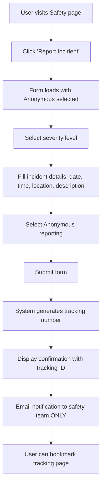
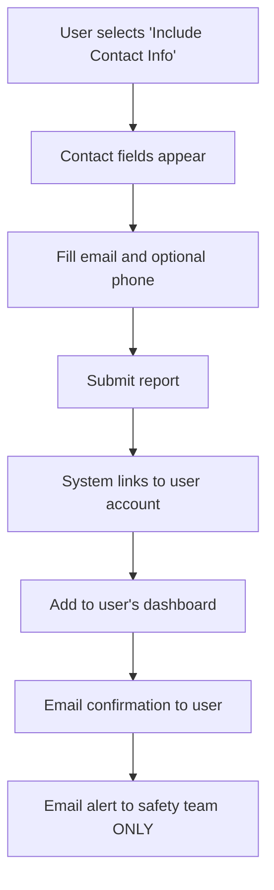
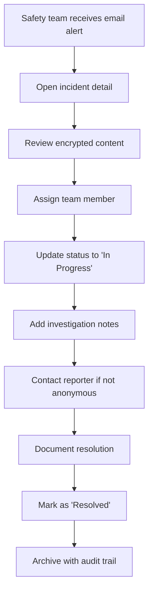

# Safety System UI Design - WitchCityRope
<!-- Last Updated: 2025-09-12 -->
<!-- Version: 2.0 -->
<!-- Owner: UI Designer Agent -->
<!-- Status: Updated based on stakeholder feedback -->

## Design Overview

This document provides comprehensive UI/UX design for the Safety incident reporting system, identified as CRITICAL priority due to legal compliance requirements. The system enables anonymous incident reporting, administrative management, and user safety portals while maintaining the highest standards for sensitive data privacy.

**UPDATED**: Based on stakeholder feedback - removed incident type categorization, simplified to email notifications only, clarified data retention policies.

## Business Context

**Primary Driver**: Legal compliance for community safety
**Current Status**: Completely missing from modern API - must be designed from scratch
**Target Users**: Community members (anonymous/identified), safety team administrators, general members
**Data Sensitivity**: HIGH - Requires encryption, privacy protection, audit trails

## User Personas

- **Anonymous Reporter**: Community member submitting incident without identification
- **Identified Reporter**: Community member submitting with contact info for follow-up
- **Safety Team Member**: Staff managing incident reports and investigations
- **Safety Administrator**: Senior staff with full access to safety system
- **General Member**: Community member accessing safety resources and their own reports

## Design System Integration

### Color Palette (Design System v7)
- **Primary**: #880124 (burgundy) - Critical actions, severity indicators
- **Accent**: #B76D75 (rose-gold) - Form borders, secondary elements
- **CTA Primary**: #FFBF00 (amber) - Submit buttons, positive actions
- **Background**: #FAF6F2 (cream) - Page backgrounds
- **Cards**: #FFF8F0 (ivory) - Form containers, content cards
- **Critical Alert**: #DC143C (crimson) - High/Critical severity indicators
- **Warning**: #DAA520 (gold) - Medium severity indicators
- **Success**: #228B22 (forest green) - Low severity, completed items

### Typography
- **Headlines**: 'Bodoni Moda', serif
- **Navigation/Buttons**: 'Montserrat', sans-serif  
- **Body Text**: 'Source Sans 3', sans-serif

### Animation Patterns
- **Floating Labels**: ALL form inputs use floating label animation
- **Button Morphing**: Asymmetric corner transitions (12px 6px ↔ 6px 12px)
- **Card Hover**: translateY(-4px) with enhanced shadow
- **Input Focus**: translateY(-2px) + rose-gold glow

## UI Wireframes

### 1. Incident Reporting Form (UPDATED - No Incident Types)

#### Desktop Layout (1200px+)
```
+------------------------------------------------------------------+
|  🏠 Home > Safety > Report Incident                             |
+------------------------------------------------------------------+
|                                                                  |
|  📋 Report a Safety Incident                                    |
|  Complete confidentiality available - Anonymous reporting       |
|                                                                  |
+----------------------------------+-------------------------------+
| INCIDENT DETAILS                 | PRIVACY & CONTACT             |
| +------------------------------+ | +---------------------------+ |
| | 🚨 Severity Level           | | | 👤 Reporter Information   | |
| | ○ Low    ○ Medium           | | | +----------------------+  | |
| | ○ High   ○ Critical         | | | | ○ Anonymous Report   |  | |
| |                              | | | | ○ Include My Contact |  | |
| | 📅 When did this happen?    | | | | (for follow-up)      |  | |
| | [Date Picker] [Time Picker] | | | +----------------------+  | |
| |                              | | |                           | |
| | 📍 Where did this happen?   | | | 📧 Contact Email           | |
| | [Floating Input]             | | | [Floating Input]           | |
| +------------------------------+ | |                           | |
|                                  | | 📱 Phone (Optional)       | |
| 📝 INCIDENT DESCRIPTION          | | [Floating Input]           | |
| +------------------------------+ | +---------------------------+ |
| | [Rich Text Editor]           | |                               |
| | Describe what happened...     | | 🔐 PRIVACY NOTICE            |
| |                              | | Your report will be:          |
| |                              | | ✓ Encrypted immediately       |
| |                              | | ✓ Accessible only to safety   |
| |                              | |   team                        |
| |                              | | ✓ Assigned tracking number    |
| |                              | | ✓ Anonymous if selected       |
| +------------------------------+ |                               |
|                                  |                               |
| 👥 INVOLVED PARTIES (Optional)   |                               |
| [Text Area: Names/Descriptions]  |                               |
|                                  |                               |
| 👁️ WITNESSES (Optional)          |                               |
| [Text Area: Names/Contact Info]  |                               |
|                                  |                               |
| +------------------------------+ |                               |
| | ✓ I understand this report   | |                               |
| |   may trigger safety team    | |                               |
| |   investigation              | |                               |
| +------------------------------+ |                               |
|                                  |                               |
|              [Submit Report]     |                               |
+----------------------------------+-------------------------------+
```

#### Mobile Layout (375px)
```
+------------------+
| ☰ Menu  | Logo   |
+------------------+
| 📋 Report        |
| Safety Incident  |
+------------------+
| 🚨 Severity      |
| ○ Low ○ Medium   |
| ○ High ○ Critical|
+------------------+
| 📅 Date & Time   |
| [Date] [Time]    |
+------------------+
| 📍 Location      |
| [Input Field]    |
+------------------+
| 📝 Description   |
| [Text Area]      |
+------------------+
| 👤 Privacy       |
| ○ Anonymous      |
| ○ Include Contact|
+------------------+
| 📧 Contact       |
| [Email Input]    |
+------------------+
| 📱 Phone         |
| [Phone Input]    |
+------------------+
| 👥 Involved      |
| [Text Area]      |
+------------------+
| 👁️ Witnesses     |
| [Text Area]      |
+------------------+
| ✓ Agreement      |
+------------------+
| [Submit Report]  |
+------------------+
```

### 2. Admin Safety Dashboard (UPDATED - No Incident Type Filters)

#### Desktop Layout
```
+------------------------------------------------------------------+
|  🏠 Admin > Safety Dashboard                         👤 Admin   |
+------------------------------------------------------------------+
|                                                                  |
|  🚨 Safety Incident Management                                  |
|                                                                  |
+----------------+----------------+----------------+---------------+
| 📊 STATISTICS  | 🔥 CRITICAL    | ⚠️ HIGH        | 📋 TOTAL     |
| This Month     | Requires Action | Needs Review   | All Time     |
| +------------+ | +------------+ | +------------+ | +-----------+ |
| |     8      | | |     2      | | |     3      | | |    156    | |
| |  Reports   | | | Incidents  | | | Incidents  | | | Reports   | |
| +------------+ | +------------+ | +------------+ | +-----------+ |
+----------------+----------------+----------------+---------------+
|                                                                  |
| 🔍 FILTERS & SEARCH                               [+ New Alert] |
| +-------------------------------------------------------------+  |
| | Severity: [All ⌄] Status: [All ⌄] Date: [Last 30 Days ⌄] |  |
| | Search: [Type incident ID, keywords...]                   |  |
| +-------------------------------------------------------------+  |
|                                                                  |
| 📋 INCIDENT REPORTS                                             |
| +-------------------------------------------------------------+  |
| | ID        | Date     | Severity | Status   | Actions        |  |
| |-----------|----------|----------|----------|----------------|  |
| | SAF-240912| 09/12    | 🔴 CRIT  | New      | [View]        |  |
| | -1234     |          |          |          |               |  |
| |-----------|----------|----------|----------|----------------|  |
| | SAF-240911| 09/11    | 🟡 HIGH  | Review   | [View]        |  |
| | -5678     |          |          |          |               |  |
| |-----------|----------|----------|----------|----------------|  |
| | SAF-240910| 09/10    | 🟡 HIGH  | Progress | [View]        |  |
| | -9012     |          |          |          |               |  |
| |-----------|----------|----------|----------|----------------|  |
| | SAF-240909| 09/09    | 🟢 MED   | Resolved | [View]        |  |
| | -3456     |          |          |          |               |  |
| +-------------------------------------------------------------+  |
|                                                                  |
|                    [Previous] [1] [2] [3] [Next]                |
+------------------------------------------------------------------+
```

### 3. Incident Detail View (Admin) (UPDATED - No Incident Type)

```
+------------------------------------------------------------------+
|  🏠 Admin > Safety > Incident SAF-240912-1234         [Actions⌄]|
+------------------------------------------------------------------+
|                                                                  |
|  🚨 CRITICAL Safety Incident Report                             |
|  Status: New | Submitted: 09/12/2025 14:30 | Reference: SAF-... |
|                                                                  |
+----------------------------------+-------------------------------+
| 📋 INCIDENT DETAILS              | 👤 ASSIGNMENT & STATUS        |
| +------------------------------+ | +---------------------------+ |
| | Severity: 🔴 Critical        | | | Assigned To:              | |
| | Date: 09/12/2025, 19:30     | | | [Select Team Member ⌄]    | |
| | Location: Main Workshop Room | | |                           | |
| +------------------------------+ | | Priority Level:           | |
|                                  | | [Critical ⌄]              | |
| 📝 DESCRIPTION                   | |                           | |
| [Encrypted content displayed     | | Status:                   | |
|  to authorized safety team only] | | [New ⌄] → [In Progress]   | |
|                                  | |                           | |
| 👥 INVOLVED PARTIES             | | 📧 Email Notifications:   | |
| [Encrypted names/details]        | | ☑️ Safety Team Alerted     | |
|                                  | | ☑️ On-Call Notified        | |
| 👁️ WITNESSES                    | | ☐ Follow-up Scheduled     | |
| [Encrypted witness information]  | +---------------------------+ |
|                                  |                               |
| 📧 REPORTER CONTACT             | 📊 INCIDENT TRACKING          |
| [Contact information if          | +---------------------------+ |
|  not anonymous]                 | | Created: 09/12 14:30      | |
+----------------------------------+ | First View: 09/12 14:32   | |
|                                  | | Last Update: 09/12 15:45  | |
| 📝 SAFETY TEAM NOTES            | | Views: 3 team members     | |
| +------------------------------+ +---------------------------+ |
| | [Rich Text Editor]           |                               |
| | Internal investigation notes  | 🔐 AUDIT TRAIL               |
| | and action items...          | 14:30 - Report submitted     | |
| +------------------------------+ | 14:32 - Auto-assigned to team| |
|                                  | 15:45 - Viewed by J.Smith    | |
|              [Update] [Archive]  | 15:47 - Status updated       | |
+----------------------------------+-------------------------------+
```

### 4. User Safety Portal (No Changes)

```
+------------------------------------------------------------------+
|  🏠 Dashboard > My Safety Reports                    👤 Member  |
+------------------------------------------------------------------+
|                                                                  |
|  🛡️ Safety & Well-being                                         |
|  Your safety is our top priority                                |
|                                                                  |
+----------------------------------+-------------------------------+
| 📋 MY REPORTS                    | 🆘 NEED HELP?                |
| +------------------------------+ | +---------------------------+ |
| | SAF-240801-5555             | | | 📞 Crisis Support:        | |
| | Status: Resolved            | | | [Phone Number]            | |
| | Submitted: 08/01/2025       | | |                           | |
| | [View Status]               | | | 📧 Safety Team:           | |
| |                             | | | safety@witchcityrope.com  | |
| | SAF-240715-7777             | | |                           | |
| | Status: In Progress         | | | 🔗 Resources:             | |
| | Submitted: 07/15/2025       | | | • Community Guidelines    | |
| | [View Status]               | | | • Consent Education       | |
| +------------------------------+ | | • Conflict Resolution     | |
|                                  | +---------------------------+ |
| +------------------------------+ |                               |
| |     [Report New Incident]    | | 📚 SAFETY RESOURCES           |
| +------------------------------+ | +---------------------------+ |
|                                  | | • Safety Best Practices   | |
| 📊 COMMUNITY SAFETY UPDATES     | | • Event Safety Guidelines  | |
| +------------------------------+ | | • Consent Workshops       | |
| | Latest from Safety Team:     | | | • Anonymous Support       | |
| |                              | | +---------------------------+ |
| | "Thank you to everyone who   | |                               |
| | reported the equipment issue | | 🔒 PRIVACY REMINDER           |
| | at last week's workshop..."  | | Your reports remain           |
| +------------------------------+ | confidential and secure.      |
+----------------------------------+-------------------------------+
```

## Component Specifications

### Mantine Components Used

| Component | Purpose | Configuration |
|-----------|---------|--------------|
| **Form & Inputs** | | |
| TextInput | Basic text fields | Floating labels, validation states |
| Textarea | Multi-line descriptions | Auto-resize, character limits |
| Select | Dropdown selections | Searchable, custom options |
| DateTimePicker | Date/time selection | Combined picker, validation |
| Radio | Anonymous/Identified choice | Custom styling, clear labels |
| Checkbox | Agreements, confirmations | Custom validation |
| **Layout** | | |
| Container | Page layout | Max-width 1200px, responsive |
| Grid | Two-column layouts | Responsive collapse |
| Stack | Vertical spacing | Consistent gaps |
| Group | Horizontal elements | Space-between, center alignment |
| **Feedback** | | |
| Alert | Privacy notices | Custom colors, icons |
| Badge | Severity indicators | Color-coded, hover effects |
| Loader | Form submission | Overlay style |
| Notification | Success/error states | Toast-style, auto-dismiss |
| **Navigation** | | |
| Breadcrumbs | Page navigation | Consistent with site nav |
| Tabs | Dashboard sections | Smooth transitions |
| Pagination | Report listings | Standard page controls |
| **Data Display** | | |
| Table | Report listings | Sortable, filterable |
| Card | Content grouping | Hover animations |
| Timeline | Audit trail | Chronological display |

### Form Validation Patterns (UPDATED - No Incident Types)

#### Severity Level Configuration (Only categorization used)
```typescript
const severityLevels = [
  { 
    value: 'low', 
    label: 'Low', 
    color: '#228B22',
    description: 'Minor issue, no immediate danger',
    icon: '🟢'
  },
  { 
    value: 'medium', 
    label: 'Medium', 
    color: '#DAA520',
    description: 'Concerning issue requiring attention',
    icon: '🟡' 
  },
  { 
    value: 'high', 
    label: 'High', 
    color: '#DC143C',
    description: 'Serious issue requiring immediate review',
    icon: '🔴'
  },
  { 
    value: 'critical', 
    label: 'Critical', 
    color: '#8B0000',
    description: 'Emergency requiring immediate action',
    icon: '🚨'
  }
];
```

### Responsive Breakpoints

- **Mobile (xs)**: 0px - 575px - Single column layout, stacked components
- **Small (sm)**: 576px - 767px - Tablet adjustments, larger touch targets
- **Medium (md)**: 768px - 991px - Two-column collapse point
- **Large (lg)**: 992px - 1199px - Full desktop layout
- **Extra Large (xl)**: 1200px+ - Maximum width container

### Accessibility Requirements

#### WCAG 2.1 Compliance
- **Keyboard Navigation**: Full keyboard support for all interactive elements
- **Screen Reader Labels**: Comprehensive aria-labels and descriptions
- **Color Contrast**: 4.5:1 minimum ratio for all text
- **Focus Indicators**: Visible focus states with high contrast borders
- **Error Handling**: Clear error messages with correction guidance

#### Specific Implementations
```jsx
// Severity Badge Accessibility
<Badge 
  color={severityColor}
  aria-label={`Severity level: ${severity.label}. ${severity.description}`}
  role="status"
>
  {severity.icon} {severity.label}
</Badge>

// Form Field Accessibility
<TextInput
  label="Incident Location"
  description="Where did this incident occur? (Building, room, specific area)"
  placeholder="Enter location details"
  aria-required="true"
  error={errors.location}
  aria-describedby={errors.location ? 'location-error' : 'location-description'}
/>
```

## User Flow Diagrams (UPDATED)

### 1. Anonymous Incident Reporting Flow (Simplified)



### 2. Identified Reporter Flow (Simplified)



### 3. Admin Investigation Flow (Simplified)



## Privacy and Security Considerations

### Data Encryption
- **At Rest**: All sensitive fields encrypted in database
- **In Transit**: HTTPS for all communications
- **Display**: Authorized access only, audit logged

### Anonymous Protection
- **No IP Logging**: Anonymous reports don't log user IP
- **Session Isolation**: No session cookies for anonymous reports
- **Tracking Numbers**: Generated without user identifiers

### Audit Trail Requirements
- **All Views**: Log who accessed what report and when
- **Status Changes**: Track all status updates with timestamps
- **Note Additions**: Log safety team notes and actions
- **Data Retention**: Database records kept indefinitely for legal compliance
  - **NOTE**: Only temporary session data and logs have shorter retention periods
  - Incident reports themselves are permanent legal compliance records

## Performance Considerations

### Lazy Loading
- **Rich Text Editor**: Load only when form is opened
- **Large Data Sets**: Paginate admin tables (25 items per page)
- **Image Uploads**: Progressive loading for evidence attachments

### Caching Strategy
- **Form Options**: Cache severity levels
- **User Permissions**: Cache safety team roles
- **Static Content**: Cache safety resources and guidelines

## Mobile-First Design Patterns

### Touch Optimization
- **Button Sizes**: Minimum 44px touch targets
- **Spacing**: Increased padding for thumb navigation
- **Swipe Actions**: Table row swipe for quick actions

### Layout Adaptations
- **Form Stack**: Single column on mobile
- **Admin Tables**: Horizontal scroll with fixed columns
- **Navigation**: Collapse to hamburger menu at 768px

## Component Styling Examples

### Floating Label Implementation
```jsx
const FloatingInput = ({ label, value, onChange, ...props }) => (
  <Box style={{ position: 'relative', marginBottom: '24px' }}>
    <TextInput
      {...props}
      value={value}
      onChange={onChange}
      placeholder=" "
      style={{
        paddingTop: '24px',
        paddingBottom: '8px',
        paddingLeft: '12px',
        paddingRight: '12px'
      }}
      styles={{
        input: {
          borderColor: '#B76D75',
          borderRadius: '12px',
          fontSize: '16px',
          transition: 'all 0.3s ease',
          '&:focus': {
            borderColor: '#880124',
            transform: 'translateY(-2px)',
            boxShadow: '0 0 0 3px rgba(183, 109, 117, 0.2)'
          }
        }
      }}
    />
    <Text
      style={{
        position: 'absolute',
        left: '12px',
        top: value ? '4px' : '50%',
        transform: value ? 'translateY(0) scale(0.8)' : 'translateY(-50%)',
        transition: 'all 0.3s ease',
        fontSize: value ? '12px' : '16px',
        color: value ? '#880124' : '#868E96',
        backgroundColor: value ? '#FAF6F2' : 'transparent',
        padding: value ? '0 4px' : '0',
        pointerEvents: 'none'
      }}
    >
      {label}
    </Text>
  </Box>
);
```

### Severity Badge Styling
```jsx
const SeverityBadge = ({ severity }) => {
  const config = severityLevels[severity];
  
  return (
    <Badge
      color={config.color}
      variant="filled"
      size="lg"
      style={{
        borderRadius: '12px 6px 12px 6px',
        transition: 'all 0.3s ease',
        cursor: 'pointer',
        '&:hover': {
          borderRadius: '6px 12px 6px 12px',
          transform: 'scale(1.05)'
        }
      }}
    >
      {config.icon} {config.label}
    </Badge>
  );
};
```

### Action Button Styling
```jsx
const SubmitButton = ({ children, loading, ...props }) => (
  <Button
    {...props}
    loading={loading}
    size="lg"
    style={{
      background: 'linear-gradient(135deg, #FFBF00 0%, #DAA520 100%)',
      borderRadius: '12px 6px 12px 6px',
      transition: 'all 0.3s ease',
      fontFamily: 'Montserrat, sans-serif',
      fontWeight: 600,
      minHeight: '48px',
      '&:hover': {
        borderRadius: '6px 12px 6px 12px',
        transform: 'translateY(-2px)',
        boxShadow: '0 4px 12px rgba(255, 191, 0, 0.3)'
      },
      '&:disabled': {
        opacity: 0.6,
        transform: 'none'
      }
    }}
  >
    {children}
  </Button>
);
```

## Quality Validation Checklist

### Design System Compliance
- [ ] Colors match Design System v7 exactly (#880124, #B76D75, #FFBF00, #FAF6F2, #FFF8F0)
- [ ] Typography uses correct font families (Bodoni Moda, Montserrat, Source Sans 3)
- [ ] ALL form inputs use floating label animation
- [ ] Button corner morphing implemented (12px 6px ↔ 6px 12px)
- [ ] No vertical button movement (translateY forbidden)
- [ ] Card hover animations use translateY(-4px)

### Functionality Requirements (UPDATED)
- [ ] Anonymous reporting fully supported
- [ ] Severity-based color coding consistent (NO incident type categorization)
- [ ] Privacy notices prominent and clear
- [ ] Contact information conditionally displayed
- [ ] Audit trail visible to authorized users
- [ ] Mobile responsive at 768px breakpoint
- [ ] Email notifications ONLY (no SMS functionality)

### Security & Privacy
- [ ] Sensitive data encryption requirements documented
- [ ] Anonymous protection measures specified
- [ ] Audit trail logging requirements clear
- [ ] Role-based access control defined
- [ ] Data retention policies clarified (database records permanent, other data temporary)

### Accessibility Standards
- [ ] WCAG 2.1 AA compliance
- [ ] Keyboard navigation support
- [ ] Screen reader compatibility
- [ ] Color contrast 4.5:1 minimum
- [ ] Focus indicators visible and high contrast
- [ ] Error messages clear and actionable

### Mobile Responsiveness
- [ ] Touch targets minimum 44px
- [ ] Single column layout on mobile
- [ ] Thumb-zone optimization
- [ ] Horizontal scroll for data tables
- [ ] Navigation collapse at 768px

## Implementation Notes

### Component Architecture (UPDATED)
```
/src/components/safety/
├── IncidentReportForm.tsx        # Main reporting form
├── AdminSafetyDashboard.tsx      # Admin overview page
├── IncidentDetailView.tsx        # Individual incident view
├── UserSafetyPortal.tsx          # User's safety section
├── components/
│   ├── SeverityBadge.tsx         # Reusable severity indicator
│   ├── PrivacyNotice.tsx         # Privacy information component
│   ├── AuditTrail.tsx            # Audit logging display
│   └── AnonymousToggle.tsx       # Anonymous reporting toggle
└── hooks/
    ├── useSafetyReports.tsx      # Data fetching hook
    ├── useIncidentSubmission.tsx # Form submission logic
    └── useSafetyPermissions.tsx  # Role-based access control
```

### API Integration Points (UPDATED - No Incident Types)
```typescript
// Incident submission endpoint (SIMPLIFIED)
POST /api/safety/incidents
{
  reporterId?: string,
  severity: 'low' | 'medium' | 'high' | 'critical',
  incidentDate: string,
  location: string,
  description: string,
  involvedParties?: string[],
  witnesses?: string[],
  isAnonymous: boolean,
  requestFollowUp: boolean
}

// Admin dashboard data (UPDATED)
GET /api/safety/admin/dashboard
{
  statistics: { critical: number, high: number, medium: number, low: number, total: number },
  recentIncidents: IncidentSummary[],
  pendingActions: ActionItem[]
}

// User safety portal (No changes)
GET /api/safety/user/{userId}/reports
{
  userReports: UserReport[],
  safetyResources: Resource[],
  communityUpdates: Update[]
}
```

## Key Changes Summary

### Removed Elements
- ❌ Incident type selection dropdown
- ❌ All incident categorization features  
- ❌ SMS notification options
- ❌ References to 2-year database retention for incident reports

### Simplified Elements
- ✅ Incident form now only has: Anonymous/Identified toggle, Severity level, Date/time, Location, Description, Optional contact
- ✅ Admin dashboard filters by severity only (no type filters)
- ✅ Email notifications only for critical incidents
- ✅ Simplified reporting categories

### Updated Clarifications
- ✅ Database incident records kept indefinitely for legal compliance
- ✅ Only temporary session data or logs have shorter retention periods
- ✅ Teacher and Event Coordinator roles noted for future reference but not needed now

This updated UI design provides a streamlined foundation for implementing the Safety incident reporting system that aligns with stakeholder requirements while maintaining legal compliance and community safety standards.