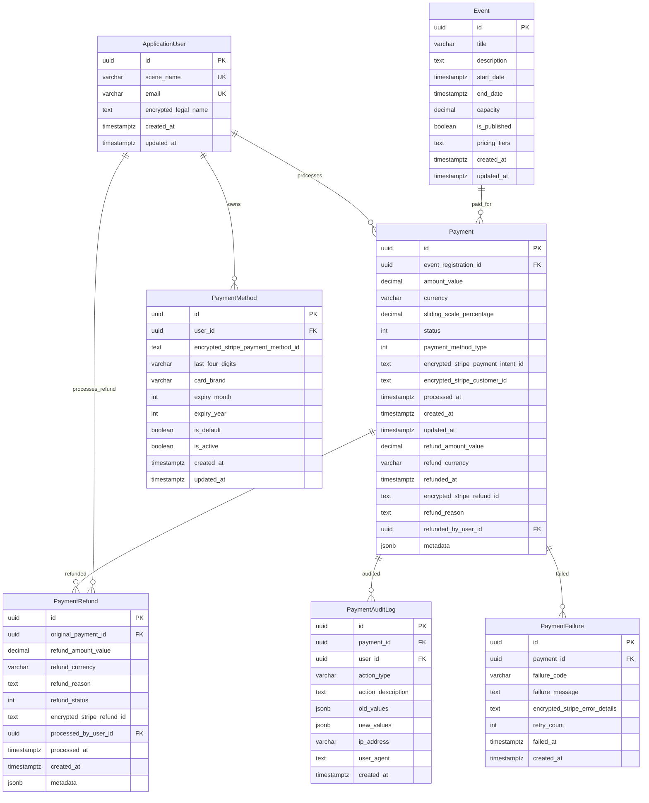

# Payment System Database Design
<!-- Date: 2025-09-13 -->
<!-- Designer: Database Designer Agent -->
<!-- Status: Design Complete -->

## Executive Summary

This document outlines the comprehensive database design for the WitchCityRope Payment system, supporting sliding scale pricing, PCI-compliant payment processing, comprehensive refund handling, and complete audit trails. The design leverages PostgreSQL 15+ features while maintaining strict security standards and performance optimization.

**Key Features**:
- Sliding scale pricing (0-75% discount) with honor system
- Stripe integration with encrypted token storage
- Comprehensive refund processing with business rule enforcement
- Complete audit trail for all payment operations
- Performance-optimized indexing strategy
- UTC DateTime handling for PostgreSQL timestamptz compatibility

## Entity Relationship Diagram



## Database Schema (PostgreSQL DDL)

### Core Payment Entity

```sql
-- Main payments table with comprehensive tracking
CREATE TABLE "Payments" (
    "Id" UUID NOT NULL DEFAULT gen_random_uuid(),
    "EventRegistrationId" UUID NOT NULL,
    "UserId" UUID NOT NULL,
    
    -- Money value object storage
    "AmountValue" DECIMAL(10,2) NOT NULL CHECK ("AmountValue" >= 0),
    "Currency" VARCHAR(3) NOT NULL DEFAULT 'USD',
    
    -- Sliding scale pricing
    "SlidingScalePercentage" DECIMAL(5,2) NOT NULL DEFAULT 0.00 
        CHECK ("SlidingScalePercentage" >= 0 AND "SlidingScalePercentage" <= 75.00),
    
    -- Payment processing
    "Status" INTEGER NOT NULL DEFAULT 0, -- PaymentStatus enum
    "PaymentMethodType" INTEGER NOT NULL, -- PaymentMethod enum
    
    -- Encrypted Stripe identifiers (NEVER store actual card numbers)
    "EncryptedStripePaymentIntentId" TEXT NULL,
    "EncryptedStripeCustomerId" TEXT NULL,
    
    -- Processing timestamps (all timestamptz for PostgreSQL compatibility)
    "ProcessedAt" TIMESTAMPTZ NULL,
    "CreatedAt" TIMESTAMPTZ NOT NULL DEFAULT NOW(),
    "UpdatedAt" TIMESTAMPTZ NOT NULL DEFAULT NOW(),
    
    -- Refund tracking
    "RefundAmountValue" DECIMAL(10,2) NULL CHECK ("RefundAmountValue" >= 0),
    "RefundCurrency" VARCHAR(3) NULL,
    "RefundedAt" TIMESTAMPTZ NULL,
    "EncryptedStripeRefundId" TEXT NULL,
    "RefundReason" TEXT NULL,
    "RefundedByUserId" UUID NULL,
    
    -- Flexible metadata for payment processing details
    "Metadata" JSONB NOT NULL DEFAULT '{}',
    
    -- Primary key
    CONSTRAINT "PK_Payments" PRIMARY KEY ("Id"),
    
    -- Foreign key constraints
    CONSTRAINT "FK_Payments_Users_UserId" 
        FOREIGN KEY ("UserId") REFERENCES "Users"("Id") ON DELETE RESTRICT,
    CONSTRAINT "FK_Payments_Users_RefundedByUserId" 
        FOREIGN KEY ("RefundedByUserId") REFERENCES "Users"("Id") ON DELETE SET NULL,
    
    -- Business rule constraints
    CONSTRAINT "CHK_Payments_Currency_Valid" 
        CHECK ("Currency" IN ('USD', 'EUR', 'GBP', 'CAD')),
    CONSTRAINT "CHK_Payments_RefundCurrency_Valid" 
        CHECK ("RefundCurrency" IS NULL OR "RefundCurrency" IN ('USD', 'EUR', 'GBP', 'CAD')),
    CONSTRAINT "CHK_Payments_RefundAmount_NotExceedOriginal" 
        CHECK ("RefundAmountValue" IS NULL OR "RefundAmountValue" <= "AmountValue"),
    CONSTRAINT "CHK_Payments_RefundRequiresOriginalPayment" 
        CHECK (("RefundAmountValue" IS NULL AND "RefundedAt" IS NULL) OR 
               ("RefundAmountValue" IS NOT NULL AND "RefundedAt" IS NOT NULL)),
    CONSTRAINT "CHK_Payments_CurrencyConsistency"
        CHECK (("RefundCurrency" IS NULL) OR ("RefundCurrency" = "Currency"))
);

-- Performance indexes
CREATE INDEX "IX_Payments_UserId" ON "Payments"("UserId");
CREATE INDEX "IX_Payments_EventRegistrationId" ON "Payments"("EventRegistrationId");
CREATE INDEX "IX_Payments_Status" ON "Payments"("Status");
CREATE INDEX "IX_Payments_ProcessedAt" ON "Payments"("ProcessedAt" DESC);
CREATE INDEX "IX_Payments_CreatedAt" ON "Payments"("CreatedAt" DESC);
CREATE INDEX "IX_Payments_SlidingScalePercentage" ON "Payments"("SlidingScalePercentage");

-- Partial indexes for performance on specific queries
CREATE INDEX "IX_Payments_PendingStatus" ON "Payments"("CreatedAt" DESC) 
    WHERE "Status" = 0; -- Pending payments only
CREATE INDEX "IX_Payments_FailedStatus" ON "Payments"("ProcessedAt" DESC) 
    WHERE "Status" = 2; -- Failed payments only
CREATE INDEX "IX_Payments_RefundedStatus" ON "Payments"("RefundedAt" DESC) 
    WHERE "RefundedAt" IS NOT NULL; -- Refunded payments only

-- GIN index for JSONB metadata queries
CREATE INDEX "IX_Payments_Metadata_Gin" ON "Payments" USING GIN ("Metadata");

-- Unique constraint to prevent duplicate payment processing
CREATE UNIQUE INDEX "UX_Payments_EventRegistration_Completed" 
    ON "Payments"("EventRegistrationId") 
    WHERE "Status" = 1; -- Only one completed payment per registration
```

### Payment Methods Table

```sql
-- Saved payment methods for user convenience
CREATE TABLE "PaymentMethods" (
    "Id" UUID NOT NULL DEFAULT gen_random_uuid(),
    "UserId" UUID NOT NULL,
    
    -- Encrypted Stripe payment method token (NEVER store actual card data)
    "EncryptedStripePaymentMethodId" TEXT NOT NULL,
    
    -- Display information only (safe to store)
    "LastFourDigits" VARCHAR(4) NOT NULL,
    "CardBrand" VARCHAR(20) NOT NULL, -- Visa, MasterCard, etc.
    "ExpiryMonth" INTEGER NOT NULL CHECK ("ExpiryMonth" >= 1 AND "ExpiryMonth" <= 12),
    "ExpiryYear" INTEGER NOT NULL CHECK ("ExpiryYear" >= EXTRACT(YEAR FROM NOW())),
    
    -- User preferences
    "IsDefault" BOOLEAN NOT NULL DEFAULT FALSE,
    "IsActive" BOOLEAN NOT NULL DEFAULT TRUE,
    
    -- Audit timestamps
    "CreatedAt" TIMESTAMPTZ NOT NULL DEFAULT NOW(),
    "UpdatedAt" TIMESTAMPTZ NOT NULL DEFAULT NOW(),
    
    -- Primary key
    CONSTRAINT "PK_PaymentMethods" PRIMARY KEY ("Id"),
    
    -- Foreign key constraints
    CONSTRAINT "FK_PaymentMethods_Users" 
        FOREIGN KEY ("UserId") REFERENCES "Users"("Id") ON DELETE CASCADE,
    
    -- Business rule constraints
    CONSTRAINT "CHK_PaymentMethods_CardBrand" 
        CHECK ("CardBrand" IN ('Visa', 'MasterCard', 'American Express', 'Discover', 'JCB', 'Diners Club')),
    CONSTRAINT "CHK_PaymentMethods_LastFourDigits" 
        CHECK ("LastFourDigits" ~ '^\d{4}$')
);

-- Performance indexes
CREATE INDEX "IX_PaymentMethods_UserId" ON "PaymentMethods"("UserId");
CREATE INDEX "IX_PaymentMethods_IsDefault" ON "PaymentMethods"("UserId", "IsDefault") 
    WHERE "IsDefault" = TRUE;
CREATE INDEX "IX_PaymentMethods_IsActive" ON "PaymentMethods"("UserId", "IsActive") 
    WHERE "IsActive" = TRUE;

-- Unique constraint to ensure only one default payment method per user
CREATE UNIQUE INDEX "UX_PaymentMethods_UserDefault" 
    ON "PaymentMethods"("UserId") 
    WHERE "IsDefault" = TRUE AND "IsActive" = TRUE;
```

### Payment Refunds Table

```sql
-- Separate table for detailed refund tracking
CREATE TABLE "PaymentRefunds" (
    "Id" UUID NOT NULL DEFAULT gen_random_uuid(),
    "OriginalPaymentId" UUID NOT NULL,
    
    -- Refund amount (can be partial)
    "RefundAmountValue" DECIMAL(10,2) NOT NULL CHECK ("RefundAmountValue" > 0),
    "RefundCurrency" VARCHAR(3) NOT NULL DEFAULT 'USD',
    
    -- Refund details
    "RefundReason" TEXT NOT NULL,
    "RefundStatus" INTEGER NOT NULL DEFAULT 0, -- Processing, Completed, Failed
    "EncryptedStripeRefundId" TEXT NULL,
    
    -- Administrative tracking
    "ProcessedByUserId" UUID NOT NULL,
    "ProcessedAt" TIMESTAMPTZ NOT NULL DEFAULT NOW(),
    "CreatedAt" TIMESTAMPTZ NOT NULL DEFAULT NOW(),
    
    -- Additional metadata
    "Metadata" JSONB NOT NULL DEFAULT '{}',
    
    -- Primary key
    CONSTRAINT "PK_PaymentRefunds" PRIMARY KEY ("Id"),
    
    -- Foreign key constraints
    CONSTRAINT "FK_PaymentRefunds_Payments" 
        FOREIGN KEY ("OriginalPaymentId") REFERENCES "Payments"("Id") ON DELETE CASCADE,
    CONSTRAINT "FK_PaymentRefunds_Users" 
        FOREIGN KEY ("ProcessedByUserId") REFERENCES "Users"("Id") ON DELETE RESTRICT,
    
    -- Business rule constraints
    CONSTRAINT "CHK_PaymentRefunds_Currency" 
        CHECK ("RefundCurrency" IN ('USD', 'EUR', 'GBP', 'CAD')),
    CONSTRAINT "CHK_PaymentRefunds_ReasonRequired" 
        CHECK (LENGTH(TRIM("RefundReason")) >= 10) -- Minimum reason length
);

-- Performance indexes
CREATE INDEX "IX_PaymentRefunds_OriginalPaymentId" ON "PaymentRefunds"("OriginalPaymentId");
CREATE INDEX "IX_PaymentRefunds_ProcessedByUserId" ON "PaymentRefunds"("ProcessedByUserId");
CREATE INDEX "IX_PaymentRefunds_ProcessedAt" ON "PaymentRefunds"("ProcessedAt" DESC);
CREATE INDEX "IX_PaymentRefunds_RefundStatus" ON "PaymentRefunds"("RefundStatus");

-- GIN index for metadata
CREATE INDEX "IX_PaymentRefunds_Metadata_Gin" ON "PaymentRefunds" USING GIN ("Metadata");
```

### Payment Audit Log Table

```sql
-- Comprehensive audit trail for all payment operations
CREATE TABLE "PaymentAuditLog" (
    "Id" UUID NOT NULL DEFAULT gen_random_uuid(),
    "PaymentId" UUID NOT NULL,
    "UserId" UUID NULL, -- Null for system actions
    
    -- Action details
    "ActionType" VARCHAR(50) NOT NULL,
    "ActionDescription" TEXT NOT NULL,
    
    -- Change tracking (JSONB for flexible storage)
    "OldValues" JSONB NULL,
    "NewValues" JSONB NULL,
    
    -- Security tracking
    "IpAddress" INET NULL,
    "UserAgent" TEXT NULL,
    
    -- Timing
    "CreatedAt" TIMESTAMPTZ NOT NULL DEFAULT NOW(),
    
    -- Primary key
    CONSTRAINT "PK_PaymentAuditLog" PRIMARY KEY ("Id"),
    
    -- Foreign key constraints
    CONSTRAINT "FK_PaymentAuditLog_Payments" 
        FOREIGN KEY ("PaymentId") REFERENCES "Payments"("Id") ON DELETE CASCADE,
    CONSTRAINT "FK_PaymentAuditLog_Users" 
        FOREIGN KEY ("UserId") REFERENCES "Users"("Id") ON DELETE SET NULL,
    
    -- Business constraints
    CONSTRAINT "CHK_PaymentAuditLog_ActionType" 
        CHECK ("ActionType" IN (
            'PaymentInitiated', 'PaymentProcessed', 'PaymentCompleted', 
            'PaymentFailed', 'PaymentRetried', 'RefundInitiated', 
            'RefundCompleted', 'RefundFailed', 'StatusChanged', 
            'MetadataUpdated', 'SystemAction'
        ))
);

-- Performance indexes optimized for audit queries
CREATE INDEX "IX_PaymentAuditLog_PaymentId_CreatedAt" 
    ON "PaymentAuditLog"("PaymentId", "CreatedAt" DESC);
CREATE INDEX "IX_PaymentAuditLog_UserId_CreatedAt" 
    ON "PaymentAuditLog"("UserId", "CreatedAt" DESC);
CREATE INDEX "IX_PaymentAuditLog_ActionType" 
    ON "PaymentAuditLog"("ActionType");
CREATE INDEX "IX_PaymentAuditLog_CreatedAt" 
    ON "PaymentAuditLog"("CreatedAt" DESC);

-- GIN indexes for JSONB columns (efficient for complex queries)
CREATE INDEX "IX_PaymentAuditLog_OldValues_Gin" 
    ON "PaymentAuditLog" USING GIN ("OldValues");
CREATE INDEX "IX_PaymentAuditLog_NewValues_Gin" 
    ON "PaymentAuditLog" USING GIN ("NewValues");

-- Partial index for failed operations (troubleshooting focus)
CREATE INDEX "IX_PaymentAuditLog_FailedActions" 
    ON "PaymentAuditLog"("CreatedAt" DESC) 
    WHERE "ActionType" IN ('PaymentFailed', 'RefundFailed');
```

### Payment Failures Table

```sql
-- Detailed failure tracking for payment processing issues
CREATE TABLE "PaymentFailures" (
    "Id" UUID NOT NULL DEFAULT gen_random_uuid(),
    "PaymentId" UUID NOT NULL,
    
    -- Failure details
    "FailureCode" VARCHAR(50) NOT NULL,
    "FailureMessage" TEXT NOT NULL,
    "EncryptedStripeErrorDetails" TEXT NULL, -- Encrypted error response from Stripe
    
    -- Retry tracking
    "RetryCount" INTEGER NOT NULL DEFAULT 0 CHECK ("RetryCount" >= 0),
    "FailedAt" TIMESTAMPTZ NOT NULL DEFAULT NOW(),
    "CreatedAt" TIMESTAMPTZ NOT NULL DEFAULT NOW(),
    
    -- Primary key
    CONSTRAINT "PK_PaymentFailures" PRIMARY KEY ("Id"),
    
    -- Foreign key constraints
    CONSTRAINT "FK_PaymentFailures_Payments" 
        FOREIGN KEY ("PaymentId") REFERENCES "Payments"("Id") ON DELETE CASCADE
);

-- Performance indexes
CREATE INDEX "IX_PaymentFailures_PaymentId" ON "PaymentFailures"("PaymentId");
CREATE INDEX "IX_PaymentFailures_FailureCode" ON "PaymentFailures"("FailureCode");
CREATE INDEX "IX_PaymentFailures_FailedAt" ON "PaymentFailures"("FailedAt" DESC);
CREATE INDEX "IX_PaymentFailures_RetryCount" ON "PaymentFailures"("RetryCount") 
    WHERE "RetryCount" > 0;
```

## Entity Framework Core Configuration

### Payment Entity Configuration

```csharp
public class PaymentConfiguration : IEntityTypeConfiguration<Payment>
{
    public void Configure(EntityTypeBuilder<Payment> builder)
    {
        builder.ToTable("Payments", "public");
        builder.HasKey(p => p.Id);
        
        // ID initialization to prevent duplicate key violations
        builder.Property(p => p.Id)
               .ValueGeneratedOnAdd();
        
        // Money value object configuration (avoiding nullable owned entities issue)
        builder.Property(p => p.AmountValue)
               .IsRequired()
               .HasColumnType("decimal(10,2)")
               .HasColumnName("AmountValue");
               
        builder.Property(p => p.Currency)
               .IsRequired()
               .HasMaxLength(3)
               .HasDefaultValue("USD")
               .HasColumnName("Currency");
        
        // Sliding scale percentage
        builder.Property(p => p.SlidingScalePercentage)
               .IsRequired()
               .HasColumnType("decimal(5,2)")
               .HasDefaultValue(0.00m);
        
        // Enum configurations
        builder.Property(p => p.Status)
               .IsRequired()
               .HasConversion<int>();
               
        builder.Property(p => p.PaymentMethodType)
               .IsRequired()
               .HasConversion<int>();
        
        // Encrypted fields (TEXT type for flexibility)
        builder.Property(p => p.EncryptedStripePaymentIntentId)
               .HasColumnType("text");
               
        builder.Property(p => p.EncryptedStripeCustomerId)
               .HasColumnType("text");
               
        builder.Property(p => p.EncryptedStripeRefundId)
               .HasColumnType("text");
        
        // DateTime properties with timestamptz for PostgreSQL
        builder.Property(p => p.ProcessedAt)
               .HasColumnType("timestamptz");
               
        builder.Property(p => p.CreatedAt)
               .IsRequired()
               .HasColumnType("timestamptz");
               
        builder.Property(p => p.UpdatedAt)
               .IsRequired()
               .HasColumnType("timestamptz");
               
        builder.Property(p => p.RefundedAt)
               .HasColumnType("timestamptz");
        
        // Refund money value object
        builder.Property(p => p.RefundAmountValue)
               .HasColumnType("decimal(10,2)");
               
        builder.Property(p => p.RefundCurrency)
               .HasMaxLength(3);
        
        builder.Property(p => p.RefundReason)
               .HasColumnType("text");
        
        // JSONB metadata
        builder.Property(p => p.Metadata)
               .IsRequired()
               .HasColumnType("jsonb")
               .HasDefaultValue("{}");
        
        // Foreign key relationships
        builder.HasOne(p => p.User)
               .WithMany()
               .HasForeignKey(p => p.UserId)
               .OnDelete(DeleteBehavior.Restrict);
               
        builder.HasOne(p => p.RefundedByUser)
               .WithMany()
               .HasForeignKey(p => p.RefundedByUserId)
               .OnDelete(DeleteBehavior.SetNull);
        
        // Navigation properties
        builder.HasMany(p => p.AuditLogs)
               .WithOne(a => a.Payment)
               .HasForeignKey(a => a.PaymentId)
               .OnDelete(DeleteBehavior.Cascade);
               
        builder.HasMany(p => p.Refunds)
               .WithOne(r => r.OriginalPayment)
               .HasForeignKey(r => r.OriginalPaymentId)
               .OnDelete(DeleteBehavior.Cascade);
               
        builder.HasMany(p => p.Failures)
               .WithOne(f => f.Payment)
               .HasForeignKey(f => f.PaymentId)
               .OnDelete(DeleteBehavior.Cascade);
        
        // Indexes (defined in migration for PostgreSQL-specific features)
        builder.HasIndex(p => p.UserId)
               .HasDatabaseName("IX_Payments_UserId");
               
        builder.HasIndex(p => p.EventRegistrationId)
               .HasDatabaseName("IX_Payments_EventRegistrationId");
               
        builder.HasIndex(p => p.Status)
               .HasDatabaseName("IX_Payments_Status");
               
        builder.HasIndex(p => p.ProcessedAt)
               .HasDatabaseName("IX_Payments_ProcessedAt");
               
        builder.HasIndex(p => p.CreatedAt)
               .HasDatabaseName("IX_Payments_CreatedAt");
               
        builder.HasIndex(p => p.SlidingScalePercentage)
               .HasDatabaseName("IX_Payments_SlidingScalePercentage");
        
        // Unique constraint for single completed payment per registration
        builder.HasIndex(p => p.EventRegistrationId)
               .IsUnique()
               .HasDatabaseName("UX_Payments_EventRegistration_Completed")
               .HasFilter("\"Status\" = 1"); // Completed status
    }
}
```

### PaymentMethod Entity Configuration

```csharp
public class PaymentMethodConfiguration : IEntityTypeConfiguration<PaymentMethod>
{
    public void Configure(EntityTypeBuilder<PaymentMethod> builder)
    {
        builder.ToTable("PaymentMethods", "public");
        builder.HasKey(pm => pm.Id);
        
        // ID initialization
        builder.Property(pm => pm.Id)
               .ValueGeneratedOnAdd();
        
        // Encrypted Stripe data
        builder.Property(pm => pm.EncryptedStripePaymentMethodId)
               .IsRequired()
               .HasColumnType("text");
        
        // Display-safe card information
        builder.Property(pm => pm.LastFourDigits)
               .IsRequired()
               .HasMaxLength(4);
               
        builder.Property(pm => pm.CardBrand)
               .IsRequired()
               .HasMaxLength(20);
        
        builder.Property(pm => pm.ExpiryMonth)
               .IsRequired();
               
        builder.Property(pm => pm.ExpiryYear)
               .IsRequired();
        
        // User preferences
        builder.Property(pm => pm.IsDefault)
               .IsRequired()
               .HasDefaultValue(false);
               
        builder.Property(pm => pm.IsActive)
               .IsRequired()
               .HasDefaultValue(true);
        
        // DateTime properties
        builder.Property(pm => pm.CreatedAt)
               .IsRequired()
               .HasColumnType("timestamptz");
               
        builder.Property(pm => pm.UpdatedAt)
               .IsRequired()
               .HasColumnType("timestamptz");
        
        // Foreign key relationships
        builder.HasOne(pm => pm.User)
               .WithMany(u => u.PaymentMethods)
               .HasForeignKey(pm => pm.UserId)
               .OnDelete(DeleteBehavior.Cascade);
        
        // Indexes
        builder.HasIndex(pm => pm.UserId)
               .HasDatabaseName("IX_PaymentMethods_UserId");
               
        builder.HasIndex(pm => new { pm.UserId, pm.IsDefault })
               .HasDatabaseName("IX_PaymentMethods_IsDefault")
               .HasFilter("\"IsDefault\" = true");
               
        builder.HasIndex(pm => new { pm.UserId, pm.IsActive })
               .HasDatabaseName("IX_PaymentMethods_IsActive")
               .HasFilter("\"IsActive\" = true");
        
        // Unique constraint for default payment method
        builder.HasIndex(pm => pm.UserId)
               .IsUnique()
               .HasDatabaseName("UX_PaymentMethods_UserDefault")
               .HasFilter("\"IsDefault\" = true AND \"IsActive\" = true");
    }
}
```

## Migration Strategy

### Phase 1: Core Schema Creation

```sql
-- Migration: 20250913000001_CreatePaymentSystemSchema.sql

-- Create Payment enums as PostgreSQL types (optional but recommended)
CREATE TYPE payment_status AS ENUM ('NotRequired', 'Pending', 'Completed', 'Failed', 'Refunded', 'PartiallyRefunded');
CREATE TYPE payment_method_type AS ENUM ('SavedCard', 'NewCard', 'BankTransfer', 'PayPal', 'Venmo');
CREATE TYPE refund_status AS ENUM ('Processing', 'Completed', 'Failed');

-- Create main tables in dependency order
-- 1. PaymentMethods (depends only on Users)
-- 2. Payments (depends on Users and PaymentMethods)
-- 3. PaymentRefunds (depends on Payments)
-- 4. PaymentAuditLog (depends on Payments)
-- 5. PaymentFailures (depends on Payments)

-- Execute DDL statements from above schema definitions
```

### Phase 2: Data Migration (if needed)

```sql
-- Migration: 20250913000002_MigrateExistingPaymentData.sql

-- If migrating from legacy system, preserve existing payment data
-- This would be populated based on actual legacy data analysis

-- Example structure:
-- INSERT INTO "Payments" (...) 
-- SELECT ... FROM legacy_payments_table
-- WITH appropriate transformations and validations
```

### Phase 3: Security and Performance Optimization

```sql
-- Migration: 20250913000003_AddSecurityAndPerformanceOptimizations.sql

-- Add advanced indexes after data migration for better performance
-- Enable Row Level Security (if required)
-- Add any additional constraints discovered during testing
-- Configure PostgreSQL-specific optimizations
```

## Security Considerations

### PCI Compliance Implementation

**✅ Compliant Practices**:
- **Never store credit card numbers** - Only Stripe tokens
- **Encrypt all sensitive data** at rest using application-level encryption
- **Use HTTPS for all API communication** with certificate validation
- **Implement proper access controls** with role-based permissions
- **Maintain complete audit trails** for all payment operations
- **Regular security audits** and vulnerability assessments

**🔐 Encryption Strategy**:
```csharp
// Example encryption for Stripe IDs
public class StripeDataEncryption
{
    public string EncryptStripeId(string stripeId)
    {
        // Use AES-256 encryption with application-specific key
        // Store encrypted value in database
    }
    
    public string DecryptStripeId(string encryptedStripeId)
    {
        // Decrypt only when needed for API calls
        // Never expose decrypted values in logs or responses
    }
}
```

### Access Control Implementation

```sql
-- Row Level Security (if needed for multi-tenant scenarios)
ALTER TABLE "Payments" ENABLE ROW LEVEL SECURITY;

-- Example policy (adjust based on actual requirements)
CREATE POLICY payment_access_policy ON "Payments"
    FOR ALL TO authenticated_users
    USING (
        "UserId" = current_setting('app.current_user_id')::UUID OR
        current_setting('app.user_role') IN ('Admin', 'Teacher')
    );
```

### Audit Trail Requirements

**All payment operations must log**:
- User identification and IP address
- Action performed (create, update, refund, etc.)
- Before and after values for changes
- Timestamp with timezone information
- Browser/client information
- Processing time and success/failure status

## Performance Considerations

### Query Optimization Patterns

**Most Common Queries**:
1. **User payment history**: `SELECT * FROM Payments WHERE UserId = ? ORDER BY CreatedAt DESC`
2. **Event revenue**: `SELECT SUM(AmountValue) FROM Payments WHERE EventRegistrationId IN (...) AND Status = 'Completed'`
3. **Failed payment retry**: `SELECT * FROM Payments WHERE Status = 'Failed' AND ProcessedAt > NOW() - INTERVAL '1 hour'`
4. **Refund processing**: `SELECT * FROM Payments WHERE Status = 'Completed' AND RefundedAt IS NULL`

**Index Strategy**:
- **Composite indexes** for multi-column WHERE clauses
- **Partial indexes** for status-specific queries (only index rows that match common filter conditions)
- **GIN indexes** for JSONB metadata queries
- **Covering indexes** for queries that can be satisfied entirely from the index

### Scalability Planning

**Connection Pool Configuration**:
```csharp
// appsettings.json
{
  "ConnectionStrings": {
    "DefaultConnection": "Host=localhost;Database=witchcityrope;Username=app_user;Password=secure_password;Pooling=true;MinPoolSize=5;MaxPoolSize=100;ConnectionLifetime=300"
  }
}
```

**Read Replica Strategy** (future consideration):
- Use read replicas for payment history and reporting queries
- Keep write operations on master database
- Implement connection routing based on operation type

## Sample Queries for Common Operations

### 1. Process New Payment

```sql
-- Create payment record
INSERT INTO "Payments" (
    "Id", "EventRegistrationId", "UserId", "AmountValue", "Currency",
    "SlidingScalePercentage", "Status", "PaymentMethodType",
    "CreatedAt", "UpdatedAt", "Metadata"
) VALUES (
    gen_random_uuid(), $1, $2, $3, 'USD',
    $4, 0, $5, -- Status: Pending
    NOW(), NOW(), $6::jsonb
);
```

### 2. Complete Payment Processing

```sql
-- Update payment status and add processing details
UPDATE "Payments" 
SET "Status" = 1, -- Completed
    "EncryptedStripePaymentIntentId" = $2,
    "EncryptedStripeCustomerId" = $3,
    "ProcessedAt" = NOW(),
    "UpdatedAt" = NOW(),
    "Metadata" = "Metadata" || $4::jsonb
WHERE "Id" = $1 AND "Status" = 0; -- Only update if still pending
```

### 3. User Payment History

```sql
SELECT 
    p."Id",
    p."AmountValue",
    p."Currency",
    p."SlidingScalePercentage",
    p."Status",
    p."ProcessedAt",
    p."RefundedAt",
    p."RefundAmountValue",
    e."Title" as event_title
FROM "Payments" p
LEFT JOIN "Events" e ON p."EventRegistrationId" = e."Id"
WHERE p."UserId" = $1
ORDER BY p."CreatedAt" DESC
LIMIT 50;
```

### 4. Refund Processing

```sql
-- Start transaction for refund processing
BEGIN;

-- Insert refund record
INSERT INTO "PaymentRefunds" (
    "Id", "OriginalPaymentId", "RefundAmountValue", "RefundCurrency",
    "RefundReason", "RefundStatus", "ProcessedByUserId"
) VALUES (
    gen_random_uuid(), $1, $2, $3, $4, 0, $5
);

-- Update original payment
UPDATE "Payments"
SET "RefundAmountValue" = $2,
    "RefundCurrency" = $3,
    "RefundedAt" = NOW(),
    "RefundReason" = $4,
    "RefundedByUserId" = $5,
    "UpdatedAt" = NOW()
WHERE "Id" = $1;

COMMIT;
```

### 5. Payment Analytics

```sql
-- Revenue by sliding scale usage
SELECT 
    CASE 
        WHEN "SlidingScalePercentage" = 0 THEN 'Full Price'
        WHEN "SlidingScalePercentage" <= 25 THEN 'Light Discount (1-25%)'
        WHEN "SlidingScalePercentage" <= 50 THEN 'Moderate Discount (26-50%)'
        ELSE 'High Discount (51-75%)'
    END as discount_range,
    COUNT(*) as payment_count,
    SUM("AmountValue") as total_revenue,
    AVG("AmountValue") as average_amount
FROM "Payments"
WHERE "Status" = 1 -- Completed
  AND "CreatedAt" >= NOW() - INTERVAL '3 months'
GROUP BY 1
ORDER BY total_revenue DESC;
```

## Integration with Existing Entities

### Event Registration Integration

```sql
-- Link payments to existing registration system
-- This may require creating a new EventRegistrations table or 
-- modifying existing TicketPurchases table to support the payment workflow

-- Example foreign key to existing system:
ALTER TABLE "Payments" 
ADD CONSTRAINT "FK_Payments_TicketPurchases_EventRegistrationId" 
FOREIGN KEY ("EventRegistrationId") REFERENCES "TicketPurchases"("Id") 
ON DELETE RESTRICT;
```

### User System Integration

The design leverages the existing `ApplicationUser` entity in the current schema, maintaining consistency with the established identity system while adding payment-specific functionality.

## Monitoring and Alerting

### Key Metrics to Monitor

1. **Payment Success Rate**: Should maintain >99%
2. **Average Processing Time**: Target <2 seconds
3. **Failed Payment Rate**: Monitor spikes indicating issues
4. **Refund Processing Time**: Target <24 hours
5. **Sliding Scale Usage**: Track community impact

### Alerting Thresholds

```sql
-- Example monitoring queries for alerting
-- Failed payment spike detection
SELECT 
    DATE_TRUNC('hour', "CreatedAt") as hour,
    COUNT(*) as failed_count
FROM "Payments"
WHERE "Status" = 2 -- Failed
  AND "CreatedAt" >= NOW() - INTERVAL '24 hours'
GROUP BY 1
HAVING COUNT(*) > 10; -- Alert if >10 failures per hour

-- Processing time monitoring
SELECT AVG(EXTRACT(EPOCH FROM ("ProcessedAt" - "CreatedAt"))) as avg_processing_seconds
FROM "Payments"
WHERE "ProcessedAt" IS NOT NULL
  AND "CreatedAt" >= NOW() - INTERVAL '1 hour';
```

## Conclusion

This database design provides a robust, secure, and scalable foundation for the WitchCityRope Payment system. Key strengths include:

✅ **PCI Compliant**: No credit card data stored, only encrypted tokens  
✅ **Community Values**: Full sliding scale pricing support with honor system  
✅ **Audit Complete**: Comprehensive tracking for compliance and troubleshooting  
✅ **Performance Optimized**: Strategic indexing for common query patterns  
✅ **PostgreSQL Native**: Leverages JSONB, timestamptz, and advanced indexing  
✅ **EF Core Ready**: Proper entity configurations with UTC DateTime handling  

The design supports the MVP requirements while providing a solid foundation for future enhancements including recurring payments, advanced reporting, and multi-payment provider support.

**Next Steps**:
1. Review and approve database design
2. Create EF Core migrations
3. Implement entity configurations
4. Set up encryption services
5. Create initial seed data for testing
6. Implement monitoring and alerting