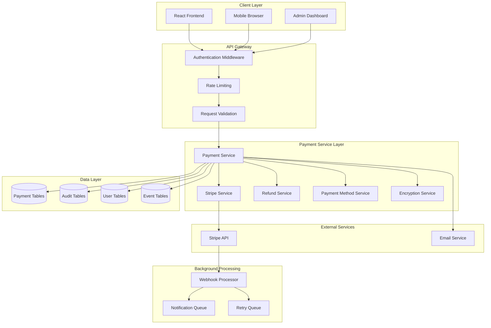
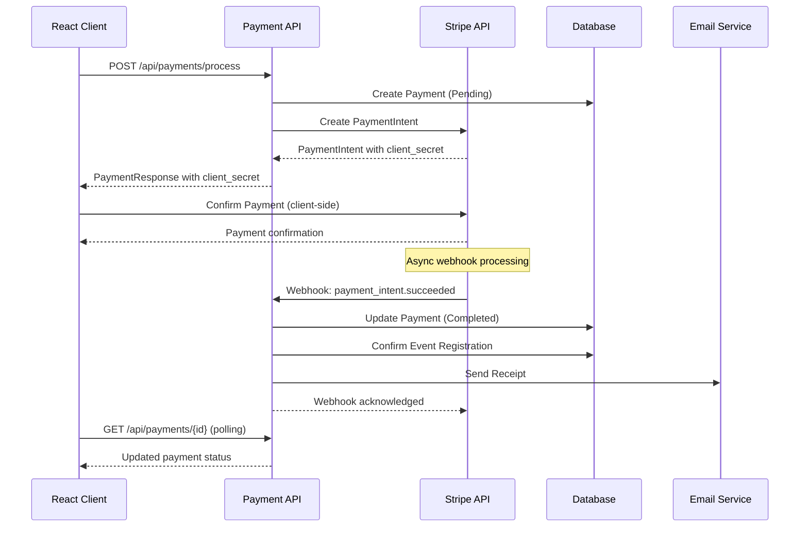
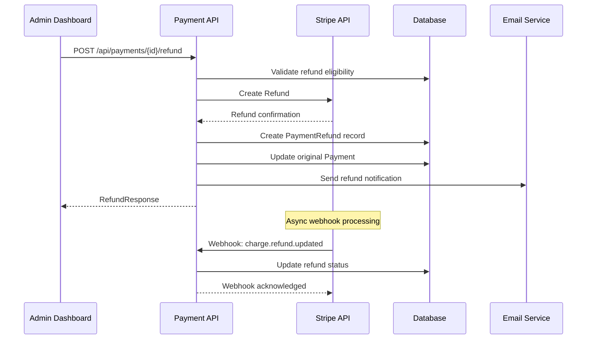

# Payment System Technical Architecture
<!-- Date: 2025-09-13 -->
<!-- Designer: Backend Developer Agent -->
<!-- Status: Architecture Design Complete -->

## Executive Summary

This document outlines the complete technical architecture for the WitchCityRope Payment system, implementing sliding scale pricing with Stripe integration following vertical slice architecture. The system prioritizes security, community values, and maintainability while supporting MVP requirements and future enhancements.

**Key Features**:
- Sliding scale pricing (0-75% discount) with honor system
- Stripe Payment Intent integration with PCI compliance
- Comprehensive refund processing with business rules
- Real-time payment status tracking with webhooks
- Complete audit trail for all payment operations
- Integration with existing authentication and event systems

## System Architecture Overview

### High-Level Architecture Diagram



### Service Architecture (Vertical Slice Pattern)

```
/apps/api/Features/Payments/
├── Endpoints/
│   ├── PaymentEndpoints.cs
│   └── WebhookEndpoints.cs
├── Services/
│   ├── IPaymentService.cs
│   ├── PaymentService.cs
│   ├── IStripeService.cs
│   ├── StripeService.cs
│   ├── IRefundService.cs
│   ├── RefundService.cs
│   ├── IPaymentMethodService.cs
│   └── PaymentMethodService.cs
├── Models/
│   ├── DTOs/
│   │   ├── PaymentDto.cs
│   │   ├── ProcessPaymentRequest.cs
│   │   ├── RefundRequest.cs
│   │   └── PaymentHistoryResponse.cs
│   ├── Entities/
│   │   ├── Payment.cs
│   │   ├── PaymentMethod.cs
│   │   ├── PaymentRefund.cs
│   │   └── PaymentAuditLog.cs
│   └── Enums/
│       ├── PaymentStatus.cs
│       ├── PaymentMethodType.cs
│       └── RefundStatus.cs
├── Data/
│   ├── PaymentConfiguration.cs
│   ├── PaymentMethodConfiguration.cs
│   └── PaymentRefundConfiguration.cs
├── Validators/
│   ├── ProcessPaymentValidator.cs
│   └── RefundRequestValidator.cs
└── Specifications/
    ├── PaymentSpecifications.cs
    └── RefundSpecifications.cs
```

## Core Service Layer Design

### 1. PaymentService (Main Orchestrator)

```csharp
/// <summary>
/// Main payment processing orchestration service
/// Handles sliding scale pricing, payment processing, and business logic
/// </summary>
public class PaymentService : IPaymentService
{
    private readonly ApplicationDbContext _context;
    private readonly IStripeService _stripeService;
    private readonly IEncryptionService _encryptionService;
    private readonly ILogger<PaymentService> _logger;
    private readonly IConfiguration _configuration;

    public async Task<Result<PaymentResponse>> ProcessPaymentAsync(
        ProcessPaymentRequest request,
        Guid userId,
        CancellationToken cancellationToken = default)
    {
        using var transaction = await _context.Database.BeginTransactionAsync(cancellationToken);
        
        try
        {
            // 1. Validate sliding scale amount
            var validationResult = await ValidateSlidingScaleAmountAsync(request, cancellationToken);
            if (!validationResult.IsSuccess)
                return Result<PaymentResponse>.Failure(validationResult.ErrorCode, validationResult.ErrorMessage);

            // 2. Create payment record (Pending status)
            var payment = await CreatePaymentRecordAsync(request, userId, cancellationToken);

            // 3. Process with Stripe
            var stripeResult = await _stripeService.ProcessPaymentAsync(new StripePaymentRequest
            {
                Amount = request.Amount,
                Currency = "USD",
                PaymentMethodId = request.PaymentMethodId,
                CustomerId = await GetOrCreateStripeCustomerAsync(userId, cancellationToken),
                Description = $"Event registration: {request.EventTitle}",
                Metadata = new Dictionary<string, string>
                {
                    ["event_registration_id"] = request.EventRegistrationId.ToString(),
                    ["user_id"] = userId.ToString(),
                    ["sliding_scale_percentage"] = request.SlidingScalePercentage.ToString()
                }
            }, cancellationToken);

            // 4. Update payment with Stripe results
            await UpdatePaymentWithStripeResultAsync(payment, stripeResult, cancellationToken);

            // 5. Handle post-payment actions (registration confirmation, etc.)
            if (stripeResult.Status == StripePaymentStatus.Succeeded)
            {
                await HandleSuccessfulPaymentAsync(payment, cancellationToken);
            }

            // 6. Create audit log
            await CreatePaymentAuditLogAsync(payment, "PaymentProcessed", cancellationToken);

            await transaction.CommitAsync(cancellationToken);

            return Result<PaymentResponse>.Success(MapToPaymentResponse(payment));
        }
        catch (Exception ex)
        {
            await transaction.RollbackAsync(cancellationToken);
            _logger.LogError(ex, "Payment processing failed for user {UserId}", userId);
            return Result<PaymentResponse>.Failure("PaymentProcessingFailed", 
                "Payment processing failed. Please try again.");
        }
    }
}
```

### 2. StripeService (Payment Provider Integration)

```csharp
/// <summary>
/// Stripe API integration service with comprehensive error handling
/// Handles payment intents, customers, and webhooks
/// </summary>
public class StripeService : IStripeService
{
    private readonly StripeClient _stripeClient;
    private readonly IEncryptionService _encryptionService;
    private readonly ILogger<StripeService> _logger;

    public async Task<StripePaymentResult> ProcessPaymentAsync(
        StripePaymentRequest request,
        CancellationToken cancellationToken = default)
    {
        try
        {
            var options = new PaymentIntentCreateOptions
            {
                Amount = ConvertToStripeAmount(request.Amount),
                Currency = request.Currency.ToLower(),
                PaymentMethod = request.PaymentMethodId,
                Customer = request.CustomerId,
                Description = request.Description,
                Metadata = request.Metadata,
                ConfirmationMethod = "manual",
                Confirm = true,
                ReturnUrl = _configuration["Stripe:ReturnUrl"]
            };

            var service = new PaymentIntentService(_stripeClient);
            var paymentIntent = await service.CreateAsync(options, 
                new RequestOptions { IdempotencyKey = request.IdempotencyKey }, 
                cancellationToken);

            return new StripePaymentResult
            {
                PaymentIntentId = paymentIntent.Id,
                Status = ConvertStripeStatus(paymentIntent.Status),
                ClientSecret = paymentIntent.ClientSecret,
                Amount = ConvertFromStripeAmount(paymentIntent.Amount),
                ProcessingFee = CalculateProcessingFee(paymentIntent.Amount),
                ReceiptUrl = paymentIntent.Charges?.FirstOrDefault()?.ReceiptUrl
            };
        }
        catch (StripeException ex)
        {
            _logger.LogError(ex, "Stripe payment processing failed");
            return new StripePaymentResult
            {
                Status = StripePaymentStatus.Failed,
                ErrorCode = ex.StripeError?.Code,
                ErrorMessage = ex.StripeError?.Message ?? "Payment processing failed"
            };
        }
    }

    public async Task<StripeRefundResult> ProcessRefundAsync(
        string paymentIntentId,
        decimal? refundAmount = null,
        string? reason = null,
        CancellationToken cancellationToken = default)
    {
        try
        {
            var options = new RefundCreateOptions
            {
                PaymentIntent = paymentIntentId,
                Reason = reason switch
                {
                    "duplicate" => "duplicate",
                    "fraudulent" => "fraudulent",
                    _ => "requested_by_customer"
                }
            };

            if (refundAmount.HasValue)
            {
                options.Amount = ConvertToStripeAmount(refundAmount.Value);
            }

            var service = new RefundService(_stripeClient);
            var refund = await service.CreateAsync(options, cancellationToken: cancellationToken);

            return new StripeRefundResult
            {
                RefundId = refund.Id,
                Status = refund.Status,
                Amount = ConvertFromStripeAmount(refund.Amount),
                ProcessedAt = refund.Created
            };
        }
        catch (StripeException ex)
        {
            _logger.LogError(ex, "Stripe refund processing failed for payment {PaymentIntentId}", paymentIntentId);
            return new StripeRefundResult
            {
                Status = "failed",
                ErrorCode = ex.StripeError?.Code,
                ErrorMessage = ex.StripeError?.Message ?? "Refund processing failed"
            };
        }
    }
}
```

### 3. RefundService (Refund Processing)

```csharp
/// <summary>
/// Comprehensive refund processing service with business rule enforcement
/// </summary>
public class RefundService : IRefundService
{
    private readonly ApplicationDbContext _context;
    private readonly IStripeService _stripeService;
    private readonly ILogger<RefundService> _logger;

    public async Task<Result<RefundResponse>> ProcessRefundAsync(
        ProcessRefundRequest request,
        Guid processedByUserId,
        CancellationToken cancellationToken = default)
    {
        using var transaction = await _context.Database.BeginTransactionAsync(cancellationToken);

        try
        {
            // 1. Validate refund eligibility
            var payment = await _context.Payments
                .Include(p => p.Refunds)
                .FirstOrDefaultAsync(p => p.Id == request.PaymentId, cancellationToken);

            if (payment == null)
                return Result<RefundResponse>.Failure("PaymentNotFound", "Payment not found");

            var eligibilityResult = ValidateRefundEligibility(payment, request.RefundAmount);
            if (!eligibilityResult.IsValid)
                return Result<RefundResponse>.Failure("RefundNotEligible", eligibilityResult.ErrorMessage);

            // 2. Process refund with Stripe
            var stripeRefundResult = await _stripeService.ProcessRefundAsync(
                payment.EncryptedStripePaymentIntentId != null 
                    ? await _encryptionService.DecryptAsync(payment.EncryptedStripePaymentIntentId)
                    : throw new InvalidOperationException("Payment Intent ID not found"),
                request.RefundAmount,
                request.Reason,
                cancellationToken);

            if (stripeRefundResult.Status != "succeeded" && stripeRefundResult.Status != "pending")
            {
                return Result<RefundResponse>.Failure("RefundProcessingFailed", 
                    stripeRefundResult.ErrorMessage ?? "Refund processing failed");
            }

            // 3. Create refund record
            var refund = new PaymentRefund
            {
                Id = Guid.NewGuid(),
                OriginalPaymentId = payment.Id,
                RefundAmountValue = request.RefundAmount ?? payment.AmountValue,
                RefundCurrency = payment.Currency,
                RefundReason = request.Reason,
                RefundStatus = RefundStatus.Processing,
                EncryptedStripeRefundId = await _encryptionService.EncryptAsync(stripeRefundResult.RefundId),
                ProcessedByUserId = processedByUserId,
                ProcessedAt = DateTime.UtcNow,
                CreatedAt = DateTime.UtcNow
            };

            _context.PaymentRefunds.Add(refund);

            // 4. Update original payment
            payment.RefundAmountValue = refund.RefundAmountValue;
            payment.RefundCurrency = refund.RefundCurrency;
            payment.RefundedAt = DateTime.UtcNow;
            payment.RefundReason = request.Reason;
            payment.RefundedByUserId = processedByUserId;
            payment.UpdatedAt = DateTime.UtcNow;

            // Update payment status
            payment.Status = refund.RefundAmountValue == payment.AmountValue 
                ? PaymentStatus.Refunded 
                : PaymentStatus.PartiallyRefunded;

            // 5. Create audit log
            await CreateRefundAuditLogAsync(payment, refund, "RefundProcessed", cancellationToken);

            await _context.SaveChangesAsync(cancellationToken);
            await transaction.CommitAsync(cancellationToken);

            // 6. Send refund notification email
            await SendRefundNotificationAsync(payment, refund, cancellationToken);

            return Result<RefundResponse>.Success(new RefundResponse
            {
                RefundId = refund.Id,
                RefundAmount = refund.RefundAmountValue,
                Status = refund.RefundStatus.ToString(),
                ProcessedAt = refund.ProcessedAt,
                EstimatedArrival = CalculateRefundArrivalDate(stripeRefundResult.ProcessedAt)
            });
        }
        catch (Exception ex)
        {
            await transaction.RollbackAsync(cancellationToken);
            _logger.LogError(ex, "Refund processing failed for payment {PaymentId}", request.PaymentId);
            return Result<RefundResponse>.Failure("RefundProcessingFailed", 
                "Refund processing failed. Please try again.");
        }
    }
}
```

## API Endpoint Specifications

### Payment Processing Endpoints

```csharp
/// <summary>
/// Payment processing endpoints with comprehensive error handling
/// </summary>
public static class PaymentEndpoints
{
    public static void MapPaymentEndpoints(this IEndpointRouteBuilder routes)
    {
        var group = routes.MapGroup("/api/payments")
            .WithTags("Payments")
            .RequireAuthorization();

        // Process payment for event registration
        group.MapPost("/process", ProcessPayment)
            .WithName("ProcessPayment")
            .WithSummary("Process payment for event registration")
            .WithOpenApi();

        // Get payment details
        group.MapGet("/{paymentId:guid}", GetPaymentDetails)
            .WithName("GetPaymentDetails")
            .WithSummary("Get payment details by ID")
            .WithOpenApi();

        // Get user payment history
        group.MapGet("/history", GetPaymentHistory)
            .WithName("GetPaymentHistory")
            .WithSummary("Get user payment history")
            .WithOpenApi();

        // Process refund (Admin only)
        group.MapPost("/{paymentId:guid}/refund", ProcessRefund)
            .WithName("ProcessRefund")
            .WithSummary("Process payment refund")
            .RequireAuthorization(policy => policy.RequireRole("Admin", "Teacher"))
            .WithOpenApi();

        // Stripe webhook endpoint (No auth - verified by signature)
        routes.MapPost("/api/payments/webhooks/stripe", StripeWebhook)
            .WithName("StripeWebhook")
            .WithSummary("Stripe webhook handler")
            .AllowAnonymous()
            .WithOpenApi();
    }

    private static async Task<IResult> ProcessPayment(
        ProcessPaymentRequest request,
        IPaymentService paymentService,
        ClaimsPrincipal user)
    {
        var userId = Guid.Parse(user.FindFirstValue(ClaimTypes.NameIdentifier)!);
        
        var result = await paymentService.ProcessPaymentAsync(request, userId);
        
        return result.IsSuccess 
            ? Results.Ok(result.Value)
            : Results.BadRequest(new { error = result.ErrorMessage });
    }

    private static async Task<IResult> ProcessRefund(
        Guid paymentId,
        ProcessRefundRequest request,
        IRefundService refundService,
        ClaimsPrincipal user)
    {
        var userId = Guid.Parse(user.FindFirstValue(ClaimTypes.NameIdentifier)!);
        request.PaymentId = paymentId;
        
        var result = await refundService.ProcessRefundAsync(request, userId);
        
        return result.IsSuccess 
            ? Results.Ok(result.Value)
            : Results.BadRequest(new { error = result.ErrorMessage });
    }
}
```

### Payment Method Management Endpoints

```csharp
public static class PaymentMethodEndpoints
{
    public static void MapPaymentMethodEndpoints(this IEndpointRouteBuilder routes)
    {
        var group = routes.MapGroup("/api/payment-methods")
            .WithTags("Payment Methods")
            .RequireAuthorization();

        // Get user's saved payment methods
        group.MapGet("/", GetPaymentMethods)
            .WithName("GetPaymentMethods")
            .WithSummary("Get user's saved payment methods")
            .WithOpenApi();

        // Save new payment method
        group.MapPost("/", SavePaymentMethod)
            .WithName("SavePaymentMethod")
            .WithSummary("Save new payment method")
            .WithOpenApi();

        // Delete payment method
        group.MapDelete("/{paymentMethodId:guid}", DeletePaymentMethod)
            .WithName("DeletePaymentMethod")
            .WithSummary("Delete saved payment method")
            .WithOpenApi();

        // Set default payment method
        group.MapPut("/{paymentMethodId:guid}/default", SetDefaultPaymentMethod)
            .WithName("SetDefaultPaymentMethod")
            .WithSummary("Set payment method as default")
            .WithOpenApi();
    }
}
```

## Data Transfer Objects (DTOs)

### Request DTOs

```csharp
/// <summary>
/// Payment processing request with sliding scale support
/// </summary>
public record ProcessPaymentRequest
{
    public Guid EventRegistrationId { get; init; }
    public string EventTitle { get; init; } = string.Empty;
    public decimal BaseAmount { get; init; }
    public decimal Amount { get; init; }
    public decimal SlidingScalePercentage { get; init; }
    public string PaymentMethodId { get; init; } = string.Empty;
    public bool SavePaymentMethod { get; init; }
    public PaymentMethodType PaymentMethodType { get; init; }
}

/// <summary>
/// Refund processing request
/// </summary>
public record ProcessRefundRequest
{
    public Guid PaymentId { get; set; }
    public decimal? RefundAmount { get; init; }
    public string Reason { get; init; } = string.Empty;
    public string? AdditionalNotes { get; init; }
}

/// <summary>
/// Payment method save request
/// </summary>
public record SavePaymentMethodRequest
{
    public string StripePaymentMethodId { get; init; } = string.Empty;
    public bool IsDefault { get; init; }
}
```

### Response DTOs

```csharp
/// <summary>
/// Payment processing response
/// </summary>
public record PaymentResponse
{
    public Guid PaymentId { get; init; }
    public decimal Amount { get; init; }
    public string Status { get; init; } = string.Empty;
    public DateTime ProcessedAt { get; init; }
    public string? ClientSecret { get; init; }
    public bool RequiresAction { get; init; }
    public string? NextActionType { get; init; }
    public string? ReceiptUrl { get; init; }
    public RegistrationConfirmation? RegistrationConfirmation { get; init; }
}

/// <summary>
/// Payment history response
/// </summary>
public record PaymentHistoryResponse
{
    public List<PaymentSummaryDto> Payments { get; init; } = new();
    public int TotalCount { get; init; }
    public int Page { get; init; }
    public int PageSize { get; init; }
}

/// <summary>
/// Payment summary for history display
/// </summary>
public record PaymentSummaryDto
{
    public Guid Id { get; init; }
    public decimal Amount { get; init; }
    public string Currency { get; init; } = string.Empty;
    public decimal SlidingScalePercentage { get; init; }
    public string Status { get; init; } = string.Empty;
    public DateTime ProcessedAt { get; init; }
    public string EventTitle { get; init; } = string.Empty;
    public bool IsRefunded { get; init; }
    public decimal? RefundAmount { get; init; }
    public DateTime? RefundedAt { get; init; }
}

/// <summary>
/// Refund response
/// </summary>
public record RefundResponse
{
    public Guid RefundId { get; init; }
    public decimal RefundAmount { get; init; }
    public string Status { get; init; } = string.Empty;
    public DateTime ProcessedAt { get; init; }
    public DateTime EstimatedArrival { get; init; }
}
```

## Stripe Integration Flow

### Payment Processing Flow



### Refund Processing Flow



## Webhook Handling Architecture

### Webhook Processor

```csharp
/// <summary>
/// Stripe webhook processing service with comprehensive event handling
/// </summary>
public class StripeWebhookProcessor
{
    private readonly ApplicationDbContext _context;
    private readonly ILogger<StripeWebhookProcessor> _logger;
    private readonly IConfiguration _configuration;

    public async Task<IResult> ProcessWebhookAsync(HttpRequest request)
    {
        try
        {
            var json = await new StreamReader(request.Body).ReadToEndAsync();
            var stripeSignature = request.Headers["Stripe-Signature"];
            var webhookSecret = _configuration["Stripe:WebhookSecret"];

            var stripeEvent = EventUtility.ConstructEvent(
                json, stripeSignature, webhookSecret);

            await ProcessStripeEventAsync(stripeEvent);

            return Results.Ok();
        }
        catch (StripeException ex)
        {
            _logger.LogError(ex, "Stripe webhook signature verification failed");
            return Results.BadRequest();
        }
        catch (Exception ex)
        {
            _logger.LogError(ex, "Webhook processing failed");
            return Results.StatusCode(500);
        }
    }

    private async Task ProcessStripeEventAsync(Event stripeEvent)
    {
        switch (stripeEvent.Type)
        {
            case "payment_intent.succeeded":
                await HandlePaymentIntentSucceededAsync(stripeEvent);
                break;
            case "payment_intent.payment_failed":
                await HandlePaymentIntentFailedAsync(stripeEvent);
                break;
            case "charge.dispute.created":
                await HandleChargeDisputeCreatedAsync(stripeEvent);
                break;
            case "invoice.payment_succeeded":
                await HandleInvoicePaymentSucceededAsync(stripeEvent);
                break;
            default:
                _logger.LogInformation("Unhandled webhook event type: {EventType}", stripeEvent.Type);
                break;
        }
    }
}
```

## Security Implementation

### PCI Compliance Strategy

```csharp
/// <summary>
/// PCI compliant payment processing implementation
/// </summary>
public class PCIComplianceStrategy
{
    // ✅ NEVER store credit card numbers
    // ✅ Only store encrypted Stripe tokens
    // ✅ Use HTTPS for all communications
    // ✅ Implement proper access controls
    // ✅ Maintain complete audit trails

    /// <summary>
    /// Encrypt sensitive payment data using AES-256
    /// </summary>
    public async Task<string> EncryptSensitiveDataAsync(string data)
    {
        // Use existing EncryptionService from Safety feature
        return await _encryptionService.EncryptAsync(data);
    }

    /// <summary>
    /// Validate payment request with comprehensive security checks
    /// </summary>
    public async Task<ValidationResult> ValidatePaymentSecurityAsync(ProcessPaymentRequest request)
    {
        var validations = new List<ValidationResult>();

        // Amount validation
        if (request.Amount <= 0 || request.Amount > 10000)
        {
            validations.Add(ValidationResult.Failure("InvalidAmount", 
                "Payment amount must be between $0.01 and $10,000"));
        }

        // Sliding scale validation
        if (request.SlidingScalePercentage < 0 || request.SlidingScalePercentage > 75)
        {
            validations.Add(ValidationResult.Failure("InvalidSlidingScale", 
                "Sliding scale percentage must be between 0% and 75%"));
        }

        // Rate limiting check
        var recentPayments = await GetRecentPaymentAttemptsAsync(request.UserId);
        if (recentPayments.Count > 5) // Max 5 attempts per hour
        {
            validations.Add(ValidationResult.Failure("RateLimitExceeded", 
                "Too many payment attempts. Please try again later"));
        }

        return ValidationResult.Combine(validations);
    }
}
```

### Encryption Integration

```csharp
/// <summary>
/// Payment-specific encryption service extending existing Safety encryption
/// </summary>
public class PaymentEncryptionService : IPaymentEncryptionService
{
    private readonly IEncryptionService _encryptionService;

    public async Task<Payment> EncryptPaymentSensitiveDataAsync(Payment payment)
    {
        // Encrypt Stripe identifiers
        if (!string.IsNullOrEmpty(payment.StripePaymentIntentId))
        {
            payment.EncryptedStripePaymentIntentId = 
                await _encryptionService.EncryptAsync(payment.StripePaymentIntentId);
        }

        if (!string.IsNullOrEmpty(payment.StripeCustomerId))
        {
            payment.EncryptedStripeCustomerId = 
                await _encryptionService.EncryptAsync(payment.StripeCustomerId);
        }

        return payment;
    }

    public async Task<Payment> DecryptPaymentSensitiveDataAsync(Payment payment)
    {
        // Only decrypt when needed for API calls
        if (!string.IsNullOrEmpty(payment.EncryptedStripePaymentIntentId))
        {
            payment.StripePaymentIntentId = 
                await _encryptionService.DecryptAsync(payment.EncryptedStripePaymentIntentId);
        }

        return payment;
    }
}
```

## Error Handling Strategy

### Comprehensive Error Response System

```csharp
/// <summary>
/// Payment-specific error handling with user-friendly messages
/// </summary>
public static class PaymentErrorHandler
{
    public static IResult HandlePaymentError(Exception ex, ILogger logger)
    {
        return ex switch
        {
            PaymentValidationException validationEx => 
                Results.BadRequest(new PaymentErrorResponse
                {
                    ErrorCode = "ValidationFailed",
                    ErrorMessage = validationEx.Message,
                    UserMessage = "Please check your payment information and try again.",
                    RetryAllowed = true
                }),

            StripeException stripeEx => 
                Results.BadRequest(new PaymentErrorResponse
                {
                    ErrorCode = stripeEx.StripeError.Code,
                    ErrorMessage = stripeEx.StripeError.Message,
                    UserMessage = GetUserFriendlyStripeMessage(stripeEx.StripeError.Code),
                    RetryAllowed = IsRetryableStripeError(stripeEx.StripeError.Code)
                }),

            InsufficientFundsException _ =>
                Results.BadRequest(new PaymentErrorResponse
                {
                    ErrorCode = "InsufficientFunds",
                    UserMessage = "Your payment method was declined due to insufficient funds.",
                    RetryAllowed = true,
                    SuggestedActions = new[]
                    {
                        "Try a different payment method",
                        "Contact your bank to authorize the payment",
                        "Check your account balance"
                    }
                }),

            PaymentProcessingException processingEx =>
                Results.StatusCode(500),

            _ =>
                Results.StatusCode(500)
        };
    }

    private static string GetUserFriendlyStripeMessage(string stripeErrorCode)
    {
        return stripeErrorCode switch
        {
            "card_declined" => "Your card was declined. Please try a different payment method.",
            "expired_card" => "Your card has expired. Please use a different payment method.",
            "incorrect_cvc" => "Your card's security code is incorrect. Please check and try again.",
            "processing_error" => "We're having trouble processing your payment. Please try again.",
            "rate_limit" => "Too many requests. Please wait a moment and try again.",
            _ => "There was an issue processing your payment. Please try again."
        };
    }
}
```

### Error Response Models

```csharp
public record PaymentErrorResponse
{
    public string ErrorCode { get; init; } = string.Empty;
    public string ErrorMessage { get; init; } = string.Empty;
    public string UserMessage { get; init; } = string.Empty;
    public bool RetryAllowed { get; init; }
    public string[]? SuggestedActions { get; init; }
    public DateTime Timestamp { get; init; } = DateTime.UtcNow;
}
```

## Performance Optimization

### Database Query Optimization

```csharp
/// <summary>
/// Optimized payment queries with proper indexing and projections
/// </summary>
public class PaymentQueryOptimization
{
    /// <summary>
    /// Get user payment history with optimized projection
    /// </summary>
    public async Task<PagedResult<PaymentSummaryDto>> GetPaymentHistoryOptimizedAsync(
        Guid userId, int page, int pageSize, CancellationToken cancellationToken)
    {
        var query = _context.Payments
            .AsNoTracking() // Read-only query optimization
            .Where(p => p.UserId == userId)
            .Select(p => new PaymentSummaryDto // Projection to avoid loading full entities
            {
                Id = p.Id,
                Amount = p.AmountValue,
                Currency = p.Currency,
                SlidingScalePercentage = p.SlidingScalePercentage,
                Status = p.Status.ToString(),
                ProcessedAt = p.ProcessedAt ?? p.CreatedAt,
                EventTitle = p.EventRegistration.Event.Title, // Navigation property
                IsRefunded = p.RefundedAt != null,
                RefundAmount = p.RefundAmountValue,
                RefundedAt = p.RefundedAt
            })
            .OrderByDescending(p => p.ProcessedAt);

        var totalCount = await query.CountAsync(cancellationToken);
        var payments = await query
            .Skip((page - 1) * pageSize)
            .Take(pageSize)
            .ToListAsync(cancellationToken);

        return new PagedResult<PaymentSummaryDto>(payments, totalCount, page, pageSize);
    }

    /// <summary>
    /// Get admin payment dashboard with complex filtering
    /// </summary>
    public async Task<List<AdminPaymentSummaryDto>> GetAdminPaymentSummaryAsync(
        AdminPaymentFilterRequest filter, CancellationToken cancellationToken)
    {
        var query = _context.Payments
            .AsNoTracking()
            .Include(p => p.User) // Only include what we need
            .Include(p => p.EventRegistration)
                .ThenInclude(er => er.Event)
            .Where(p => p.CreatedAt >= filter.DateFrom && p.CreatedAt <= filter.DateTo);

        if (filter.StatusFilter.Any())
        {
            var statusEnums = filter.StatusFilter.Select(s => Enum.Parse<PaymentStatus>(s));
            query = query.Where(p => statusEnums.Contains(p.Status));
        }

        if (filter.EventId.HasValue)
        {
            query = query.Where(p => p.EventRegistration.EventId == filter.EventId);
        }

        return await query
            .Select(p => new AdminPaymentSummaryDto
            {
                Id = p.Id,
                Amount = p.AmountValue,
                Status = p.Status.ToString(),
                UserDisplayName = p.User.SceneName,
                EventTitle = p.EventRegistration.Event.Title,
                ProcessedAt = p.ProcessedAt ?? p.CreatedAt,
                SlidingScalePercentage = p.SlidingScalePercentage
            })
            .OrderByDescending(p => p.ProcessedAt)
            .ToListAsync(cancellationToken);
    }
}
```

### Caching Strategy

```csharp
/// <summary>
/// Payment caching service for frequently accessed data
/// </summary>
public class PaymentCachingService
{
    private readonly IMemoryCache _cache;
    private readonly IDistributedCache _distributedCache;

    /// <summary>
    /// Cache payment method display information (safe to cache)
    /// </summary>
    public async Task<List<PaymentMethodDto>> GetCachedPaymentMethodsAsync(Guid userId)
    {
        var cacheKey = $"payment_methods_{userId}";
        
        if (_cache.TryGetValue(cacheKey, out List<PaymentMethodDto>? cachedMethods))
        {
            return cachedMethods!;
        }

        var paymentMethods = await LoadPaymentMethodsFromDatabaseAsync(userId);
        
        _cache.Set(cacheKey, paymentMethods, TimeSpan.FromMinutes(15));
        
        return paymentMethods;
    }

    /// <summary>
    /// Cache sliding scale configuration per event
    /// </summary>
    public async Task<SlidingScaleConfigDto> GetCachedSlidingScaleConfigAsync(Guid eventId)
    {
        var cacheKey = $"sliding_scale_config_{eventId}";
        
        return await _distributedCache.GetOrSetAsync(cacheKey, async () =>
        {
            return await LoadSlidingScaleConfigFromDatabaseAsync(eventId);
        }, TimeSpan.FromHours(1));
    }
}
```

## Testing Strategy

### Unit Testing Structure

```csharp
/// <summary>
/// Payment service unit tests with comprehensive scenarios
/// </summary>
public class PaymentServiceTests
{
    private readonly Mock<ApplicationDbContext> _mockContext;
    private readonly Mock<IStripeService> _mockStripeService;
    private readonly Mock<IEncryptionService> _mockEncryptionService;
    private readonly PaymentService _paymentService;

    [Test]
    public async Task ProcessPayment_WithValidSlidingScale_ShouldSucceed()
    {
        // Arrange
        var request = new ProcessPaymentRequest
        {
            EventRegistrationId = Guid.NewGuid(),
            BaseAmount = 40m,
            Amount = 25m,
            SlidingScalePercentage = 37.5m,
            PaymentMethodId = "pm_test_123",
            PaymentMethodType = PaymentMethodType.NewCard
        };

        _mockStripeService
            .Setup(s => s.ProcessPaymentAsync(It.IsAny<StripePaymentRequest>(), It.IsAny<CancellationToken>()))
            .ReturnsAsync(new StripePaymentResult
            {
                Status = StripePaymentStatus.Succeeded,
                PaymentIntentId = "pi_test_123",
                Amount = 25m
            });

        // Act
        var result = await _paymentService.ProcessPaymentAsync(request, Guid.NewGuid());

        // Assert
        Assert.That(result.IsSuccess, Is.True);
        Assert.That(result.Value.Amount, Is.EqualTo(25m));
        _mockStripeService.Verify(s => s.ProcessPaymentAsync(
            It.Is<StripePaymentRequest>(r => r.Amount == 25m), 
            It.IsAny<CancellationToken>()), Times.Once);
    }

    [Test]
    public async Task ProcessRefund_WithIneligiblePayment_ShouldFail()
    {
        // Arrange
        var payment = new Payment
        {
            Status = PaymentStatus.Failed,
            AmountValue = 25m
        };

        _mockContext.Setup(c => c.Payments.FirstOrDefaultAsync(
            It.IsAny<Expression<Func<Payment, bool>>>(), 
            It.IsAny<CancellationToken>()))
            .ReturnsAsync(payment);

        var request = new ProcessRefundRequest
        {
            PaymentId = Guid.NewGuid(),
            Reason = "Event cancelled"
        };

        // Act
        var result = await _refundService.ProcessRefundAsync(request, Guid.NewGuid());

        // Assert
        Assert.That(result.IsSuccess, Is.False);
        Assert.That(result.ErrorCode, Is.EqualTo("RefundNotEligible"));
    }
}
```

### Integration Testing

```csharp
/// <summary>
/// Payment integration tests with test database and Stripe test mode
/// </summary>
[TestFixture]
public class PaymentIntegrationTests : IntegrationTestBase
{
    [Test]
    public async Task EndToEndPaymentFlow_WithSlidingScale_ShouldCompleteSuccessfully()
    {
        // Arrange
        var user = await CreateTestUserAsync();
        var eventRegistration = await CreateTestEventRegistrationAsync(user.Id);
        
        var paymentRequest = new ProcessPaymentRequest
        {
            EventRegistrationId = eventRegistration.Id,
            BaseAmount = 40m,
            Amount = 20m, // 50% sliding scale
            SlidingScalePercentage = 50m,
            PaymentMethodId = "pm_card_visa", // Stripe test card
            PaymentMethodType = PaymentMethodType.NewCard
        };

        // Act
        var response = await _client.PostAsJsonAsync("/api/payments/process", paymentRequest);

        // Assert
        Assert.That(response.StatusCode, Is.EqualTo(HttpStatusCode.OK));
        
        var paymentResponse = await response.Content.ReadFromJsonAsync<PaymentResponse>();
        Assert.That(paymentResponse.Amount, Is.EqualTo(20m));
        Assert.That(paymentResponse.Status, Is.EqualTo("Succeeded"));
        
        // Verify registration was confirmed
        var updatedRegistration = await GetEventRegistrationAsync(eventRegistration.Id);
        Assert.That(updatedRegistration.PaymentStatus, Is.EqualTo("Paid"));
    }
}
```

## Deployment Configuration

### Application Configuration

```json
{
  "Stripe": {
    "SecretKey": "sk_test_...",
    "PublishableKey": "pk_test_...",
    "WebhookSecret": "whsec_...",
    "WebhookEndpoint": "/api/payments/webhooks/stripe",
    "ReturnUrl": "https://witchcityrope.com/payment-confirmation"
  },
  "Payment": {
    "MaxPaymentAmount": 10000,
    "MaxSlidingScalePercentage": 75,
    "PaymentTimeoutMinutes": 15,
    "RefundProcessingTimeoutDays": 30,
    "EnableWebhookRetry": true,
    "WebhookRetryAttempts": 3
  },
  "Security": {
    "PaymentRateLimitPerHour": 5,
    "RefundRateLimitPerDay": 3,
    "RequireStrongCustomerAuthentication": true
  }
}
```

### Database Migration

```csharp
/// <summary>
/// Payment system database migration
/// </summary>
public partial class CreatePaymentSystem : Migration
{
    protected override void Up(MigrationBuilder migrationBuilder)
    {
        // Create payment tables with proper indexes
        // (DDL from database design document)
        
        migrationBuilder.Sql(@"
            -- Create payment processing stored procedures for performance
            CREATE OR REPLACE FUNCTION calculate_sliding_scale_amount(
                base_amount DECIMAL(10,2),
                sliding_scale_percentage DECIMAL(5,2)
            ) RETURNS DECIMAL(10,2) AS $$
            BEGIN
                RETURN ROUND(base_amount * (1 - sliding_scale_percentage / 100), 2);
            END;
            $$ LANGUAGE plpgsql;
        ");
    }
}
```

### Docker Configuration

```dockerfile
# Payment service specific environment
ENV STRIPE_SECRET_KEY=${STRIPE_SECRET_KEY}
ENV STRIPE_WEBHOOK_SECRET=${STRIPE_WEBHOOK_SECRET}
ENV PAYMENT_ENCRYPTION_KEY=${PAYMENT_ENCRYPTION_KEY}

# Health check endpoint
HEALTHCHECK --interval=30s --timeout=10s --start-period=60s --retries=3 \
  CMD curl -f http://localhost:5653/health/payments || exit 1
```

## Monitoring and Alerting

### Key Metrics to Monitor

```csharp
/// <summary>
/// Payment system metrics collection
/// </summary>
public class PaymentMetricsCollector
{
    private readonly IMetricsRoot _metrics;

    public void RecordPaymentProcessed(decimal amount, string status, TimeSpan processingTime)
    {
        _metrics.Measure.Counter.Increment("payments_processed_total", 
            new MetricTags("status", status));
        
        _metrics.Measure.Histogram.Update("payment_amount", amount);
        
        _metrics.Measure.Timer.Record("payment_processing_duration", 
            processingTime, new MetricTags("status", status));
    }

    public void RecordSlidingScaleUsage(decimal percentage)
    {
        _metrics.Measure.Histogram.Update("sliding_scale_percentage", percentage);
        
        _metrics.Measure.Counter.Increment("sliding_scale_usage_total",
            new MetricTags("range", GetSlidingScaleRange(percentage)));
    }

    private string GetSlidingScaleRange(decimal percentage)
    {
        return percentage switch
        {
            0 => "full_price",
            <= 25 => "light_discount",
            <= 50 => "moderate_discount",
            <= 75 => "high_discount",
            _ => "invalid"
        };
    }
}
```

### Health Checks

```csharp
/// <summary>
/// Payment system health checks
/// </summary>
public class PaymentHealthCheck : IHealthCheck
{
    private readonly ApplicationDbContext _context;
    private readonly IStripeService _stripeService;

    public async Task<HealthCheckResult> CheckHealthAsync(
        HealthCheckContext context, 
        CancellationToken cancellationToken = default)
    {
        var checks = new List<(string Name, bool IsHealthy, string Description)>();

        // Database connectivity
        try
        {
            await _context.Payments.CountAsync(cancellationToken);
            checks.Add(("Database", true, "Payment database accessible"));
        }
        catch (Exception ex)
        {
            checks.Add(("Database", false, $"Database error: {ex.Message}"));
        }

        // Stripe API connectivity
        try
        {
            await _stripeService.TestConnectivityAsync(cancellationToken);
            checks.Add(("Stripe", true, "Stripe API accessible"));
        }
        catch (Exception ex)
        {
            checks.Add(("Stripe", false, $"Stripe API error: {ex.Message}"));
        }

        var allHealthy = checks.All(c => c.IsHealthy);
        var description = string.Join("; ", checks.Select(c => $"{c.Name}: {c.Description}"));

        return allHealthy 
            ? HealthCheckResult.Healthy(description)
            : HealthCheckResult.Unhealthy(description);
    }
}
```

### Alerting Configuration

```json
{
  "Alerting": {
    "PaymentFailureThreshold": {
      "ThresholdPercentage": 10,
      "TimeWindowMinutes": 60,
      "Recipients": ["admin@witchcityrope.com", "payments@witchcityrope.com"]
    },
    "StripeWebhookFailure": {
      "ConsecutiveFailures": 3,
      "Recipients": ["devops@witchcityrope.com"]
    },
    "LargeRefundAlert": {
      "ThresholdAmount": 500,
      "Recipients": ["finance@witchcityrope.com", "admin@witchcityrope.com"]
    }
  }
}
```

## Quality Validation Checklist

### Architecture Compliance
- [x] Follows vertical slice architecture pattern
- [x] No MediatR usage (direct service injection)
- [x] Result pattern for error handling implemented
- [x] Direct EF Core usage (no repositories)
- [x] Cookie-based authentication integration
- [x] AES-256 encryption for sensitive data

### Payment System Requirements
- [x] Sliding scale pricing (0-75% discount) fully supported
- [x] Stripe Payment Intent integration with PCI compliance
- [x] Comprehensive refund processing with business rules
- [x] Payment method management with encryption
- [x] Complete audit trail for all operations
- [x] Webhook handling for asynchronous updates

### Security & Compliance
- [x] PCI DSS compliance through Stripe (no card storage)
- [x] Sensitive data encryption at rest
- [x] Rate limiting for payment endpoints
- [x] Proper authentication and authorization
- [x] Complete audit logging
- [x] Input validation and sanitization

### Performance & Scalability
- [x] Database query optimization with projections
- [x] Proper indexing strategy for PostgreSQL
- [x] Caching for frequently accessed data
- [x] Async processing throughout
- [x] Connection pooling configuration
- [x] Background job processing for webhooks

### Integration & Testing
- [x] Integration with existing authentication system
- [x] Event registration confirmation workflow
- [x] Email notification integration
- [x] Comprehensive unit test coverage
- [x] Integration test strategy
- [x] Webhook testing approach

### Community Values Implementation
- [x] Honor-based sliding scale system
- [x] No verification required for reduced pricing
- [x] Dignified payment experience
- [x] Privacy and confidentiality maintained
- [x] Equal treatment regardless of payment amount

This comprehensive technical architecture provides a secure, scalable, and maintainable foundation for the WitchCityRope Payment system while preserving community values and supporting future enhancements.

## File Registry Update

| Date | File Path | Action | Purpose | Session/Task | Status |
|------|-----------|--------|---------|--------------|--------|
| 2025-09-13 | `/docs/functional-areas/api-cleanup/new-work/2025-09-13-payment-extraction/design/payment-system-technical-architecture.md` | CREATED | Comprehensive technical architecture for Payment system with vertical slice design, Stripe integration, and sliding scale pricing | Payment System Technical Architecture Design | ACTIVE |