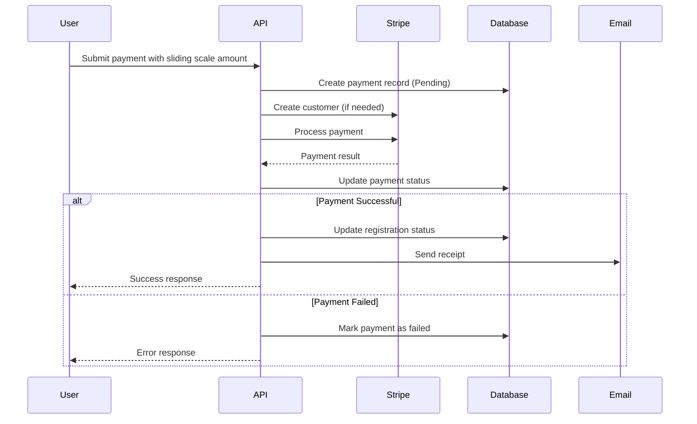
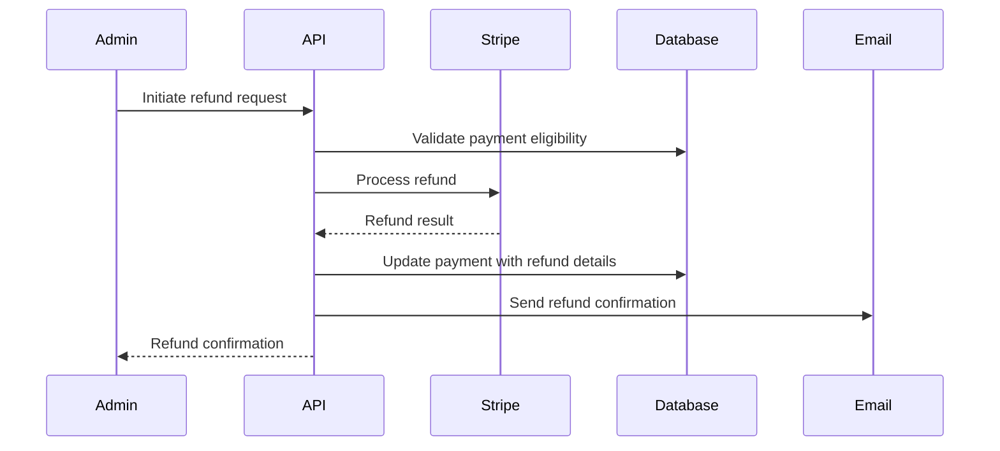

# Payment System Analysis - Legacy to Modern API Extraction

**Date**: September 13, 2025  
**Analyst**: Backend Developer Agent  
**Objective**: Analyze legacy Payment system to guide modern API implementation

## Executive Summary

The legacy WitchCityRope system contains a comprehensive payment processing system that needs to be extracted and modernized. The modern API currently has **ZERO payment functionality**, making this a complete greenfield implementation. 

The legacy system supports:
- Sliding scale pricing (critical business requirement)  
- Stripe payment processing with full workflow
- Comprehensive refund handling with business rules
- Multiple payment methods (Credit Card, PayPal, Venmo, Cash)
- Rich domain modeling with strong business rule enforcement

## 1. Feature Inventory

### 1.1 Core Payment Features

#### Payment Processing
```csharp
// From ProcessPaymentCommand.cs - Full Stripe integration
public enum PaymentType
{
    EventRegistration,     // Primary use case
    MembershipFee,        // Recurring payments  
    Merchandise,          // Online store
    Donation,            // Community support
    Other                // Flexible category
}

public enum PaymentMethod
{
    SavedCard,           // Stored payment methods
    NewCard,            // One-time cards  
    BankTransfer,       // Direct bank transfer
    PayPal,             // PayPal integration
    Venmo              // Popular peer-to-peer payments
}
```

#### Payment States & Lifecycle
```csharp
// From PaymentStatus.cs - Comprehensive status tracking
public enum PaymentStatus
{
    NotRequired,         // Free events, RSVP only
    Pending,            // Payment initiated but not processed
    Completed,          // Payment successfully completed  
    Failed,             // Payment failed or declined
    Refunded,           // Payment was refunded
    PartiallyRefunded   // Partial refund issued
}
```

### 1.2 Business Rules Implementation

#### Sliding Scale Pricing (CRITICAL)
- Honor-system based pricing allowing users to pay what they can afford
- Supports 0-75% discount based on financial circumstances
- Core community value ensuring accessibility

#### Refund Processing
```csharp
// From Payment.cs - Rich refund business logic
public void InitiateRefund(Money? refundAmount = null, string? reason = null)
{
    if (Status != PaymentStatus.Completed)
        throw new DomainException("Only completed payments can be refunded");
        
    if (RefundedAt.HasValue)
        throw new DomainException("Payment has already been refunded");
        
    RefundAmount = refundAmount ?? Amount;
    
    if (RefundAmount.Amount > Amount.Amount)
        throw new DomainException("Refund amount cannot exceed original payment amount");
}
```

#### Payment-Registration Relationship
- 1:1 relationship between Payment and Registration
- Payment required for registration confirmation
- Automatic registration status updates on payment success

### 1.3 External Integrations

#### Stripe Integration
```csharp
// From ProcessPaymentCommandHandler - Full Stripe workflow
- Customer creation and management
- Payment method storage and reuse  
- Idempotent payment processing
- Webhook handling for async updates
- Receipt generation and email delivery
- Processing fee tracking
- Metadata support for order tracking
```

#### Email Integration
- Payment receipt emails
- Refund confirmation emails  
- Failed payment notifications

### 1.4 Data Models

#### Core Payment Entity
```csharp
public class Payment
{
    public Guid Id { get; private set; }
    public Guid RegistrationId { get; private set; }
    public Registration Registration { get; private set; }
    public Money Amount { get; private set; }           // Sliding scale amount
    public PaymentStatus Status { get; private set; }
    public string PaymentMethod { get; private set; }
    public string TransactionId { get; private set; }   // Stripe transaction ID
    public DateTime ProcessedAt { get; private set; }
    public DateTime UpdatedAt { get; private set; }
    
    // Refund support
    public Money RefundAmount { get; private set; }
    public DateTime? RefundedAt { get; private set; }
    public string RefundTransactionId { get; private set; }
    public string RefundReason { get; private set; }
}
```

#### Money Value Object (Rich Domain Model)
```csharp
// From Money.cs - Currency-safe monetary operations
public class Money : IEquatable<Money>, IComparable<Money>
{
    public decimal Amount { get; }
    public string Currency { get; }
    
    // Business rule enforcement
    public static Money Create(decimal amount, string currency = "USD")
    {
        if (amount < 0)
            throw new DomainException("Money amount cannot be negative");
        // ... currency validation
    }
    
    // Safe monetary operations  
    public Money Add(Money other) { /* currency validation */ }
    public Money Subtract(Money other) { /* insufficient funds check */ }
    public Money Multiply(decimal factor) { /* factor validation */ }
}
```

## 2. Business Logic Analysis

### 2.1 Payment Workflow



### 2.2 Refund Workflow



### 2.3 Key Business Rules

1. **Sliding Scale Validation**: Selected amount must be within event's allowed range
2. **Refund Eligibility**: Only completed payments can be refunded
3. **Registration Status**: Payment success automatically confirms registration
4. **Currency Consistency**: All monetary operations enforce currency matching
5. **Idempotency**: Duplicate payment attempts prevented via idempotency keys

## 3. Modern API Gap Analysis

### 3.1 Current State
- **ZERO payment functionality in modern API**
- No payment endpoints exist  
- No payment data models
- No Stripe integration
- Complete greenfield implementation required

### 3.2 Required Features for Extraction

#### Critical (P0) - Event Registration Payments
- Payment processing for event registrations
- Sliding scale pricing support
- Basic Stripe integration  
- Payment status tracking
- Registration-payment linking

#### Important (P1) - Enhanced Payment Features  
- Refund processing capabilities
- Multiple payment method support
- Webhook handling for async updates
- Receipt generation and email
- Payment history and reporting

#### Nice to Have (P2) - Advanced Features
- Saved payment methods
- Recurring payment support (memberships)
- Merchandise payment support
- Advanced reporting and analytics

## 4. Technical Considerations

### 4.1 Database Schema Requirements

```sql
-- Core payment table
CREATE TABLE Payments (
    Id UNIQUEIDENTIFIER PRIMARY KEY,
    RegistrationId UNIQUEIDENTIFIER NOT NULL,
    Amount DECIMAL(18,2) NOT NULL,
    Currency VARCHAR(3) NOT NULL DEFAULT 'USD',
    Status VARCHAR(50) NOT NULL,
    PaymentMethod VARCHAR(50) NOT NULL,
    TransactionId VARCHAR(100) NOT NULL UNIQUE,
    ProcessedAt DATETIME2 NOT NULL,
    UpdatedAt DATETIME2 NOT NULL,
    
    -- Refund fields
    RefundAmount DECIMAL(18,2) NULL,
    RefundCurrency VARCHAR(3) NULL,
    RefundedAt DATETIME2 NULL,
    RefundTransactionId VARCHAR(100) NULL,
    RefundReason VARCHAR(500) NULL,
    
    -- Indexes
    INDEX IX_Payments_TransactionId (TransactionId),
    INDEX IX_Payments_Status (Status),
    INDEX IX_Payments_ProcessedAt (ProcessedAt),
    
    -- Foreign keys  
    CONSTRAINT FK_Payments_Registrations 
        FOREIGN KEY (RegistrationId) REFERENCES Registrations(Id)
        ON DELETE RESTRICT
);
```

### 4.2 External Service Dependencies

#### Stripe Integration Requirements
- Stripe .NET SDK integration
- Webhook endpoint for async payment updates
- Customer management for saved payment methods
- Payment intent creation for client-side processing
- Refund processing capabilities

#### Configuration Requirements
```json
{
  "Stripe": {
    "SecretKey": "sk_test_...",
    "PublishableKey": "pk_test_...",
    "WebhookSecret": "whsec_...",
    "WebhookEndpoint": "/api/payments/webhooks/stripe"
  }
}
```

### 4.3 Security Considerations

#### PCI Compliance
- Never store credit card information directly
- Use Stripe's secure vaults for payment method storage
- Implement proper encryption for sensitive payment metadata
- Audit logging for all payment transactions

#### Input Validation
- Strict amount validation (positive numbers only)
- Currency code validation (ISO 4217)
- Payment method validation against allowed methods
- Rate limiting to prevent payment abuse

### 4.4 Performance Requirements

#### Response Time Targets
- Payment processing: < 2000ms end-to-end
- Payment status queries: < 200ms
- Refund processing: < 1000ms
- Webhook processing: < 500ms

#### Scalability Considerations
- Async payment processing where possible
- Proper database indexing for payment queries
- Caching for frequently accessed payment data
- Queue-based processing for high-volume scenarios

## 5. Implementation Recommendations

### 5.1 Phase 1: Core Payment Processing (Sprint 1-2)
**Priority: P0 - Critical**

#### Features to Implement:
1. **Payment Entity & Domain Model**
   - Port Payment entity from legacy system
   - Port Money value object with business rules
   - Implement payment status enum and lifecycle

2. **Basic Stripe Integration**
   - Payment processing for new cards
   - Customer creation and management  
   - Basic error handling and validation

3. **Registration Integration**
   - Link payments to event registrations
   - Update registration status on payment success
   - Basic payment validation rules

#### Implementation Steps:
```csharp
// 1. Create domain models
/apps/api/Features/Payments/Models/
├── Payment.cs
├── PaymentStatus.cs  
├── PaymentMethod.cs
└── Money.cs

// 2. Create service interfaces
/apps/api/Features/Payments/Services/
├── IPaymentService.cs
└── IStripePaymentProvider.cs

// 3. Create API endpoints
/apps/api/Features/Payments/Endpoints/
└── PaymentEndpoints.cs

// 4. Database configuration
/apps/api/Features/Payments/Data/
└── PaymentConfiguration.cs
```

#### Acceptance Criteria:
- [ ] User can pay for event registration with credit card
- [ ] Payment amount respects sliding scale selection
- [ ] Payment failure prevents registration confirmation
- [ ] Payment success confirms registration automatically
- [ ] Basic error handling and user feedback

### 5.2 Phase 2: Enhanced Features (Sprint 3-4)
**Priority: P1 - Important**

#### Features to Implement:
1. **Refund Processing**
   - Admin-initiated refunds
   - Partial and full refund support
   - Refund business rule validation
   - Email notifications for refunds

2. **Payment Method Management**
   - Save payment methods for future use
   - Multiple payment method support (PayPal, etc.)
   - Payment method validation

3. **Webhook Integration**
   - Stripe webhook handling
   - Async payment status updates
   - Failed payment retry logic

#### Implementation Complexity: **Medium-High**
- Requires secure webhook endpoint implementation
- Complex refund workflow with business rules
- Multiple payment provider integrations

### 5.3 Phase 3: Advanced Features (Sprint 5+)
**Priority: P2 - Nice to Have**

#### Features to Implement:
1. **Payment History & Reporting**
   - User payment history dashboard
   - Admin payment reporting
   - Financial reconciliation tools

2. **Recurring Payments**
   - Membership fee automation
   - Subscription management
   - Payment failure handling

3. **Advanced Integration**
   - Merchandise payment support
   - Donation processing  
   - Advanced Stripe features (payment links, etc.)

### 5.4 Migration Strategy

#### Data Migration Approach
1. **Analyze existing payment data** in legacy system
2. **Create migration scripts** to port historical payments
3. **Validate data integrity** post-migration
4. **Test payment workflows** with migrated data

#### Rollout Strategy
1. **Parallel Testing**: Run both systems during transition
2. **Feature Flagging**: Gradual rollout of payment features
3. **Monitoring**: Comprehensive payment transaction monitoring
4. **Rollback Plan**: Ability to revert to legacy system if needed

## 6. Risk Assessment

### 6.1 High Risks
- **Payment Processing Failures**: Risk of lost revenue or broken registration flow
  - *Mitigation*: Comprehensive testing, fallback mechanisms
- **Data Security**: PCI compliance and sensitive data protection
  - *Mitigation*: Follow Stripe security best practices, regular audits
- **Integration Complexity**: Multiple payment providers and webhook handling
  - *Mitigation*: Phase implementation, extensive testing

### 6.2 Medium Risks  
- **User Experience**: Payment flow complexity affecting conversions
  - *Mitigation*: User testing, gradual feature rollout
- **Performance**: Payment processing latency impacting user satisfaction
  - *Mitigation*: Performance testing, async processing where possible

### 6.3 Low Risks
- **Feature Parity**: Missing edge case features from legacy system
  - *Mitigation*: Thorough legacy system analysis, user feedback

## 7. Success Metrics

### 7.1 Technical Metrics
- Payment processing success rate > 99%
- Average payment processing time < 2 seconds
- API response times within target thresholds
- Zero payment data security incidents

### 7.2 Business Metrics  
- Registration completion rate maintained or improved
- Refund processing time reduced vs legacy system
- User satisfaction with payment experience
- Admin efficiency in payment management tasks

## 8. Conclusion

The Payment system extraction represents a critical component of the API modernization effort. While the legacy system provides a solid foundation with rich business logic and comprehensive features, the modern API implementation offers opportunities to:

1. **Improve Performance**: Faster payment processing and better scalability
2. **Enhance Security**: Modern security practices and PCI compliance
3. **Better User Experience**: Streamlined payment flows and error handling  
4. **Maintainability**: Clean architecture and modern development practices

The phased approach ensures that critical payment functionality is available quickly while allowing time for comprehensive testing and feature development. The sliding scale pricing model, being a core community value, must be preserved and enhanced in the modern implementation.

**Recommendation**: Proceed with Phase 1 implementation immediately, focusing on core event registration payment processing while establishing the foundation for future enhancements.