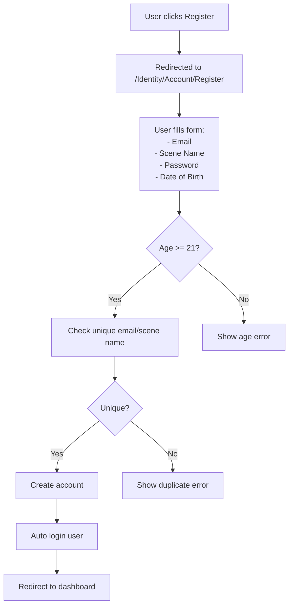
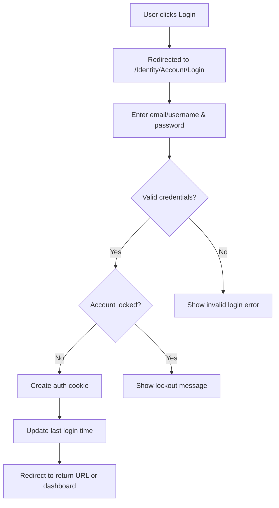
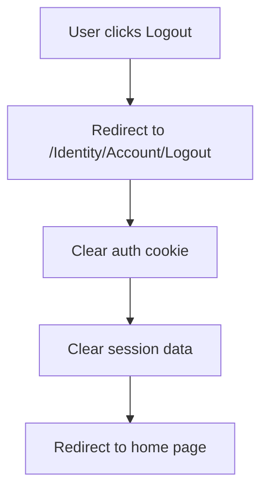
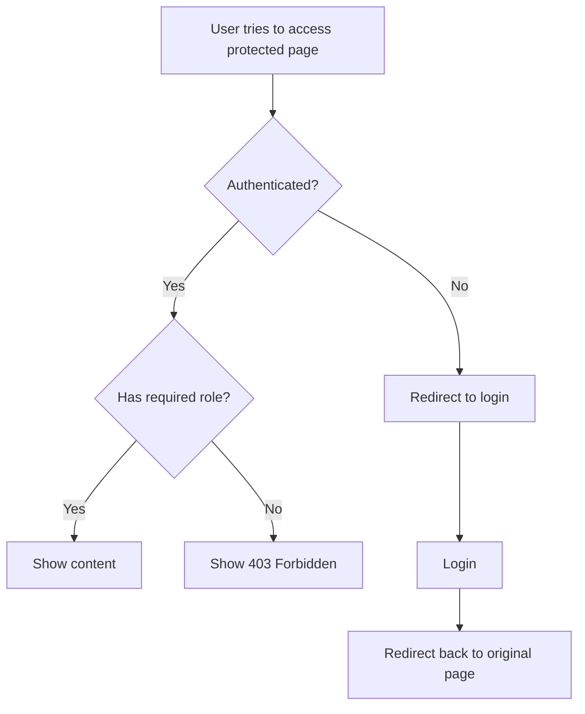
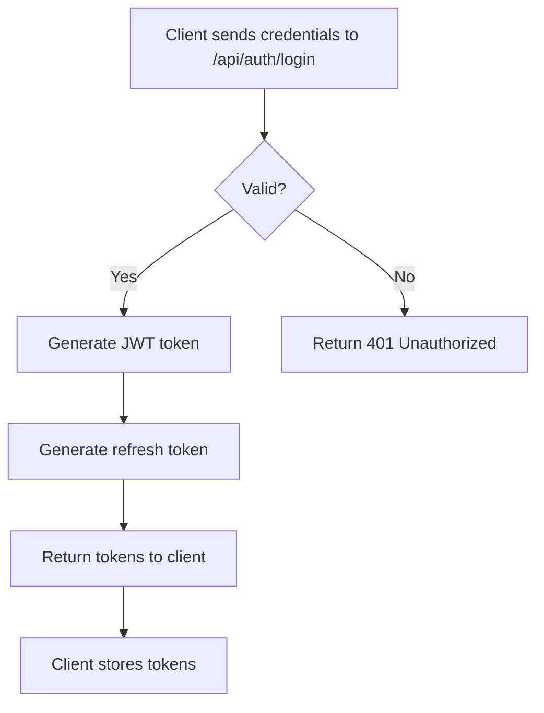
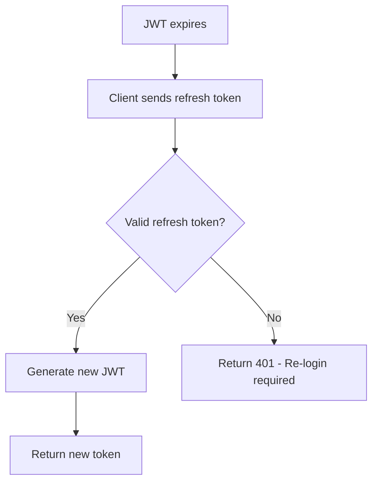

# Authentication System - User Flows
<!-- Last Updated: 2025-08-04 -->
<!-- Version: 2.0 -->
<!-- Owner: Authentication Team -->
<!-- Status: Active -->

## Overview
This document describes the current user interaction flows for authentication in the WitchCityRope system.

## Registration Flow

### Happy Path


### Form Validation
- Email format validation (client & server)
- Password complexity shown in real-time
- Scene name uniqueness checked on submit
- Age calculated from date of birth
- All fields required

### Error Messages
- "You must be 21 or older to register"
- "Email is already registered"
- "Scene name is already taken"
- "Password must meet complexity requirements"

## Login Flow

### Standard Login


### Remember Me Option
- When checked: 7-day persistent cookie
- When unchecked: Session cookie
- Sliding expiration refreshes on activity

### Account Lockout
- After 5 failed attempts
- Locked for 15 minutes
- Shows: "Account locked. Try again in X minutes"

## Logout Flow

### Simple Logout


## Authorization Flows

### Accessing Protected Content


### Event Access Flow
```mermaid
graph TD
    A[User views event] --> B{Event type?}
    B -->|Educational| C[All authenticated can buy tickets]
    B -->|Social| D{User vetted?}
    D -->|Yes| E[Can RSVP/buy tickets]
    D -->|No| F[Show "Vetting required" message]
```

## Profile Management Flows

### Update Profile
1. User navigates to profile settings
2. Can update:
   - Email (requires re-verification when enabled)
   - Scene name (if not taken)
   - Password (requires current password)
   - Profile information
3. Changes saved immediately
4. Success message displayed

### Apply for Vetting
1. Authenticated user clicks "Apply for Vetting"
2. Fills vetting application form
3. Submits for admin review
4. Receives confirmation email
5. Status shown as "Pending" in dashboard

## API Authentication Flow

### Initial Login


### Token Refresh


## Edge Cases

### Concurrent Login
- Multiple sessions allowed
- Each device maintains own cookie/token
- Logout affects only current session

### Password Changed
- Web: Existing sessions remain valid
- API: Old tokens remain valid until expiry

### Account Deactivated
- Immediate lockout on next request
- Cannot login even with valid credentials
- Shows "Account has been deactivated"

### Browser Back Button
- After logout: Cannot access protected pages
- Login page: Redirects to dashboard if already logged in

## Mobile Considerations

### Responsive Design
- All auth pages mobile-friendly
- Touch-friendly form inputs
- Clear error messages on small screens

### Session Persistence
- Remember me works across browser restarts
- App switching maintains session
- Background refresh for API tokens

## Security Considerations

### CSRF Protection
- Antiforgery tokens on all forms
- Automatic validation in Blazor
- SameSite cookie policy

### Secure Communication
- HTTPS required in production
- Secure cookie flag set
- No credentials in URLs

---

*This document describes current user flows. For technical implementation, see [functional-design.md](functional-design.md)*