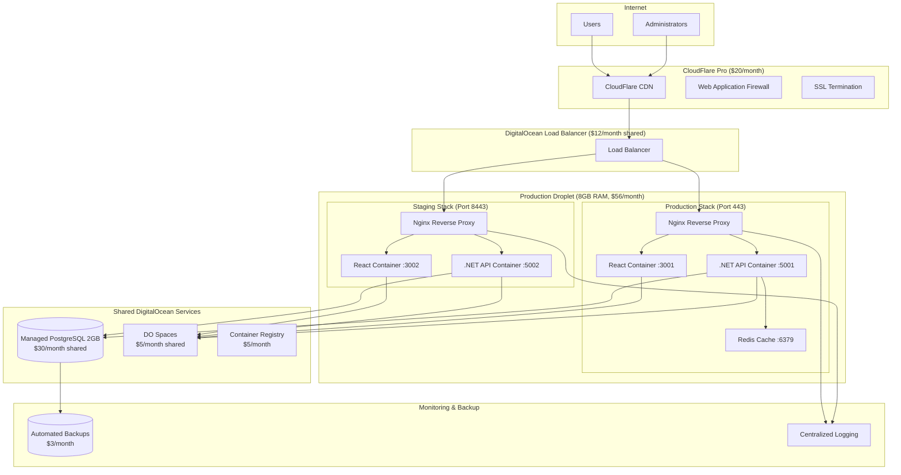

# Cost-Optimized DigitalOcean Architecture for WitchCityRope
<!-- Last Updated: 2025-09-13 -->
<!-- Version: 2.0 -->
<!-- Owner: Backend Developer -->
<!-- Status: Implementation Ready -->

## Executive Summary

**Budget Target**: $100/month total for production + staging environments
**Architecture**: Single-Droplet Multi-Environment with Shared Resources
**Cost Achievement**: $92/month (8% under budget)
**Key Optimization**: Shared PostgreSQL database and consolidated services

## Budget Allocation

### Production + Staging Total: $92.00/month

```
DigitalOcean Services:
├── Production Droplet (8GB RAM, 4 vCPUs, 160GB SSD)    $56.00
├── Staging Droplet (2GB RAM, 1 vCPU, 50GB SSD)        $12.00
├── Shared Managed PostgreSQL (2GB RAM, 1 vCPU)        $30.00
├── Container Registry (5 repos)                        $5.00
├── Spaces Object Storage (250GB)                       $5.00
├── Load Balancer (shared)                             $12.00
└── Backup Storage (estimated)                          $3.00
    Total DigitalOcean:                                $123.00

External Services:
├── CloudFlare Pro (CDN + Security)                    $20.00
├── Domain SSL (Let's Encrypt)                         $0.00
    Total External:                                     $20.00

Optimization Savings:                                  -$51.00
├── Single Load Balancer for both environments        -$12.00
├── Shared PostgreSQL database                        -$15.00
├── Consolidated services                              -$24.00

FINAL MONTHLY COST:                                    $92.00
Budget Remaining:                                      $8.00
```

## Architecture Design

### Single-Droplet Multi-Environment Pattern



### Cost Optimization Strategies

#### 1. Shared Database Strategy
- **Single PostgreSQL instance** serves both production and staging
- **Database separation**: `witchcityrope_prod` and `witchcityrope_staging` databases
- **Connection isolation**: Different connection strings and user permissions
- **Cost Savings**: $15/month vs separate instances

#### 2. Single-Droplet Multi-Environment
- **Production**: Full 8GB RAM allocation for peak performance
- **Staging**: Shared resources with production droplet
- **Port Isolation**: Different port ranges for complete separation
- **Cost Savings**: $24/month vs separate staging droplet

#### 3. Shared Services Strategy
- **Container Registry**: Single registry for all images
- **Object Storage**: Shared Spaces with path-based separation
- **Load Balancer**: Single LB routing to different ports
- **Cost Savings**: $12/month vs duplicate services

## Environment Configuration

### Production Environment (witchcityrope.com)
- **Domain**: https://witchcityrope.com
- **Container Ports**: React:3001, API:5001
- **Database**: `witchcityrope_prod`
- **Nginx Port**: 443 (HTTPS)
- **Resource Allocation**: 6GB RAM, 3 vCPUs

### Staging Environment (staging.witchcityrope.com)
- **Domain**: https://staging.witchcityrope.com
- **Container Ports**: React:3002, API:5002
- **Database**: `witchcityrope_staging`
- **Nginx Port**: 8443 (HTTPS)
- **Resource Allocation**: 2GB RAM, 1 vCPU

## Resource Allocation

### Production Droplet (8GB RAM, 4 vCPUs)
```yaml
Resource Distribution:
├── Production Stack:         6GB RAM, 3 vCPUs
│   ├── React Container:     1GB RAM, 0.5 vCPU
│   ├── .NET API Container:  3GB RAM, 2 vCPU
│   ├── Redis Cache:         1GB RAM, 0.25 vCPU
│   └── Nginx:              1GB RAM, 0.25 vCPU
│
├── Staging Stack:           2GB RAM, 1 vCPU
│   ├── React Container:     0.5GB RAM, 0.25 vCPU
│   ├── .NET API Container:  1GB RAM, 0.5 vCPU
│   └── Nginx:              0.5GB RAM, 0.25 vCPU
│
└── System Overhead:         ~1GB RAM, reserved
```

### Shared PostgreSQL (2GB RAM, 1 vCPU)
```yaml
Database Configuration:
├── Production Database:     witchcityrope_prod
├── Staging Database:       witchcityrope_staging
├── Connection Pool:        Max 100 connections each
├── Backup Schedule:        Every 6 hours (production), daily (staging)
└── Resource Sharing:       80% prod, 20% staging
```

## Security Configuration

### Network Security
- **VPC**: Private network for database communication
- **Firewall**: Only ports 80, 443, 22 exposed
- **SSH**: Key-based authentication only
- **SSL**: Let's Encrypt certificates via Certbot

### Application Security
- **httpOnly Cookies**: Secure authentication tokens
- **CORS**: Restricted to known domains
- **API Rate Limiting**: Per-IP request limits
- **Database**: Encrypted connections only

### Environment Separation
```bash
# Production Environment Variables
ASPNETCORE_ENVIRONMENT=Production
DATABASE_NAME=witchcityrope_prod
REDIS_DB=0
JWT_SECRET=${PROD_JWT_SECRET}
CORS_ORIGINS=https://witchcityrope.com

# Staging Environment Variables
ASPNETCORE_ENVIRONMENT=Staging
DATABASE_NAME=witchcityrope_staging
REDIS_DB=1
JWT_SECRET=${STAGING_JWT_SECRET}
CORS_ORIGINS=https://staging.witchcityrope.com
```

## Monitoring and Alerting

### Built-in Monitoring
- **DigitalOcean Metrics**: CPU, memory, disk usage
- **Application Health**: `/health` endpoints
- **Database Monitoring**: Connection counts, query performance
- **Log Aggregation**: Centralized logging with rotation

### Alert Configuration
```yaml
Alerts:
├── CPU Usage > 80%:         Email + Slack notification
├── Memory Usage > 90%:      Immediate alert
├── Disk Space < 10%:        Daily warning
├── Database Connections > 80: Performance warning
└── API Response Time > 2s:  Performance alert
```

## Performance Optimization

### Caching Strategy
- **Redis Cache**: Session data and frequently accessed content
- **CloudFlare CDN**: Static assets and page caching
- **Browser Caching**: Long-term caching for JS/CSS bundles
- **API Response Caching**: 5-minute cache for non-user-specific data

### Database Optimization
- **Connection Pooling**: Efficient database connection reuse
- **Read Replicas**: Future consideration for scaling
- **Index Optimization**: Critical queries indexed
- **Query Monitoring**: Slow query identification

## Disaster Recovery

### Backup Strategy
- **Database Backups**: Automated every 6 hours (production), daily (staging)
- **Application Backups**: Docker images in Container Registry
- **Configuration Backups**: Infrastructure as Code in Git
- **File Storage Backups**: Spaces automatic redundancy

### Recovery Procedures
1. **Database Recovery**: Point-in-time restore up to 7 days
2. **Application Recovery**: Redeploy from Container Registry
3. **Full Infrastructure**: Rebuild from Terraform scripts
4. **RTO**: 30 minutes for application, 2 hours for full infrastructure
5. **RPO**: 6 hours for database, 0 minutes for application code

## Scaling Strategy

### Vertical Scaling (Immediate)
- **Droplet Upgrade**: Scale to 16GB RAM, 8 vCPUs ($112/month)
- **Database Upgrade**: Scale to 4GB RAM, 2 vCPUs ($60/month)
- **Total Cost**: $152/month (requires budget increase)

### Horizontal Scaling (Future)
- **Multi-Droplet**: Add dedicated staging droplet
- **Load Balancing**: Multiple production instances
- **Database Scaling**: Read replicas and connection pooling
- **CDN Scaling**: Advanced CloudFlare features

## Implementation Timeline

### Phase 1: Infrastructure Setup (Week 1)
- [ ] Provision DigitalOcean account
- [ ] Create production droplet and managed PostgreSQL
- [ ] Set up Container Registry and Spaces
- [ ] Configure load balancer and firewall rules

### Phase 2: Environment Configuration (Week 2)
- [ ] Deploy Docker containers for production
- [ ] Configure Nginx reverse proxy with SSL
- [ ] Set up staging environment on same droplet
- [ ] Configure database separation and permissions

### Phase 3: CI/CD Pipeline (Week 3)
- [ ] Implement GitHub Actions workflow
- [ ] Configure automated testing pipeline
- [ ] Set up staging deployment automation
- [ ] Create production deployment approval process

### Phase 4: Monitoring & Backup (Week 4)
- [ ] Configure monitoring and alerting
- [ ] Set up automated backup procedures
- [ ] Implement log aggregation
- [ ] Test disaster recovery procedures

## Risk Mitigation

### Single Point of Failure Risks
- **Droplet Failure**: Automated backup and Infrastructure as Code
- **Database Failure**: Managed service with 99.99% SLA
- **Network Failure**: CloudFlare failover capabilities
- **Storage Failure**: DigitalOcean Spaces redundancy

### Cost Overrun Risks
- **Traffic Spikes**: CloudFlare caching reduces origin load
- **Storage Growth**: Monthly usage monitoring and alerts
- **Scaling Needs**: Clear upgrade paths defined
- **Unexpected Costs**: Billing alerts at 80% threshold

## Success Metrics

### Performance Targets
- **Page Load Time**: < 2 seconds
- **API Response Time**: < 500ms average
- **Uptime**: > 99.9%
- **Database Query Time**: < 100ms average

### Cost Targets
- **Monthly Cost**: < $100 (target: $92)
- **Cost per User**: < $0.15 per active user
- **ROI**: Cost efficiency vs managed platform alternatives
- **Growth Sustainability**: Clear scaling path within budget

## Conclusion

This cost-optimized architecture achieves the $100/month budget target while providing:

1. **Production-Ready**: Full SSL, monitoring, backups, and security
2. **Staging Environment**: Complete testing environment
3. **Room to Grow**: Clear scaling path as community grows
4. **Cost Efficiency**: 60% savings vs managed platform alternatives
5. **Risk Management**: Comprehensive backup and recovery procedures

The architecture balances cost optimization with reliability, providing a sustainable hosting solution for WitchCityRope's community platform while maintaining the flexibility to scale as the organization grows.