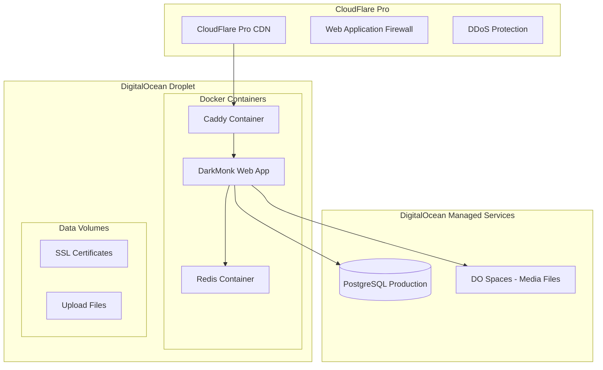

# DarkMonk DigitalOcean Research
<!-- Last Updated: 2025-01-13 -->
<!-- Version: 1.0 -->
<!-- Owner: Deployment Team -->
<!-- Status: Research -->

> **Source**: Copied from `/home/chad/repos/darkmonk/.github/ARCHITECTURE_MODERNIZATION_PLAN.md`
> **Date Copied**: 2025-01-13
> **Purpose**: Reference material for WitchCityRope DigitalOcean deployment planning

# DarkMonk Architecture Modernization Plan

## Executive Summary

This document outlines a comprehensive plan to modernize the DarkMonk application from its current state to a modern .NET 9 modular monolith architecture with PostgreSQL database, Docker containerization, and adherence to SOLID principles.

**Target State:**
- Modular monolith architecture organized by business domains
- PostgreSQL database with Entity Framework Core
- Docker containerization for all environments
- Full test coverage with unit, integration, and E2E tests
- Modern .NET 9 features and coding standards
- Production-ready with monitoring and observability

**Timeline:** 12-16 weeks

## Table of Contents

1. [Current State Analysis](#current-state-analysis)
2. [Target Architecture](#target-architecture)
3. [Module Structure](#module-structure)
4. [Database Migration Strategy](#database-migration-strategy)
5. [Docker Containerization](#docker-containerization)
6. [Testing Strategy](#testing-strategy)
7. [SOLID Principles Implementation](#solid-principles-implementation)
8. [Modern .NET 9 Features](#modern-net-9-features)
9. [Implementation Roadmap](#implementation-roadmap)
10. [Risk Management](#risk-management)

## Current State Analysis

### Architecture Issues
- **Monolithic structure** with tight coupling between components
- **Mixed responsibilities** in controllers (1,600+ line files)
- **Direct database access** from controllers
- **Inconsistent async/await** patterns
- **Limited test coverage** (~30% estimated)
- **SQL Server dependency** with potential licensing costs

### Technical Debt
- VB.NET to C# migration completed but needs optimization
- Synchronous wrapper methods over async operations
- Manual service instantiation in some areas
- No proper separation of concerns
- Missing abstractions for external dependencies

## Target Architecture

### Modular Monolith Structure

```
DarkMonk9C/
├── src/
│   ├── DarkMonk.Core/                    # Shared kernel
│   │   ├── Abstractions/
│   │   ├── Domain/
│   │   ├── Infrastructure/
│   │   └── Utilities/
│   │
│   ├── Modules/
│   │   ├── DarkMonk.Modules.Catalog/     # Product catalog
│   │   ├── DarkMonk.Modules.Sales/       # Shopping cart & sales
│   │   ├── DarkMonk.Modules.Orders/      # Order management
│   │   ├── DarkMonk.Modules.Payments/    # Payment processing
│   │   ├── DarkMonk.Modules.Shipping/    # Shipping & fulfillment
│   │   ├── DarkMonk.Modules.POS/         # Point of sale
│   │   ├── DarkMonk.Modules.Identity/    # Authentication & users
│   │   ├── DarkMonk.Modules.Content/     # CMS functionality
│   │   └── DarkMonk.Modules.Admin/       # Administration
│   │
│   └── DarkMonk.Web/                     # Web host
├── tests/
│   ├── Unit/
│   ├── Integration/
│   └── E2E/
├── docker/
├── kubernetes/
└── docs/
```

### Key Design Principles
- **Domain-Driven Design** with bounded contexts
- **CQRS** for read/write separation
- **Event-driven** communication between modules
- **Repository pattern** for data access
- **Dependency injection** throughout
- **Clean architecture** layers

## Module Structure

### Standard Module Template

```
DarkMonk.Modules.{ModuleName}/
├── Domain/
│   ├── Entities/        # Domain models
│   ├── ValueObjects/    # Value objects
│   ├── Events/          # Domain events
│   └── Exceptions/      # Domain exceptions
├── Application/
│   ├── Commands/        # Command handlers
│   ├── Queries/         # Query handlers
│   ├── Services/        # Application services
│   ├── DTOs/           # Data transfer objects
│   └── Contracts/       # Public interfaces
├── Infrastructure/
│   ├── Persistence/     # EF Core context & repos
│   ├── External/        # External integrations
│   └── Configuration/   # Module config
├── Presentation/
│   ├── Controllers/     # API/MVC controllers
│   ├── ViewModels/      # View models
│   └── Views/          # Razor views
└── ModuleDefinition.cs  # Module registration
```

### Module Structure Update

**Important:** Based on team feedback and practical considerations, we have simplified the module structure. See [Architecture Decision 001](./ARCHITECTURE_DECISIONS/001-modular-monolith-structure.md) for the approved simplified structure that keeps related code together and reduces folder nesting.

### Module Boundaries

#### 1. **Catalog Module**
- **Entities:** Product, ProductOption, Category, ProductImage
- **Use Cases:** Browse products, search, manage inventory
- **External Dependencies:** Image storage service

#### 2. **Sales Module**
- **Entities:** Cart, CartItem, WishList, Promotion
- **Use Cases:** Add to cart, update quantities, apply discounts
- **Events:** ItemAddedToCart, CartUpdated

#### 3. **Orders Module**
- **Entities:** Order, OrderItem, OrderStatus
- **Use Cases:** Place order, track status, order history
- **Events:** OrderPlaced, OrderShipped, OrderDelivered

#### 4. **Payments Module**
- **Entities:** Payment, PaymentMethod, Transaction
- **Use Cases:** Process payment, refund, payment history
- **External:** Authorize.Net integration

#### 5. **Shipping Module**
- **Entities:** Shipment, Package, TrackingInfo
- **Use Cases:** Calculate rates, print labels, track packages
- **External:** USPS, ShipEngine, Endicia

#### 6. **POS Module**
- **Entities:** POSTransaction, CashDrawer, Receipt
- **Use Cases:** Ring up sale, process returns, end-of-day
- **Features:** Offline mode support

#### 7. **Identity Module**
- **Entities:** User, Role, Permission
- **Use Cases:** Register, login, manage profile
- **Features:** JWT authentication, 2FA

#### 8. **Content Module**
- **Entities:** Page, ContentBlock, Menu
- **Use Cases:** Manage pages, edit content, configure menus

#### 9. **Admin Module**
- **No domain entities** - orchestrates other modules
- **Use Cases:** Dashboards, reports, system configuration

## Database Migration Strategy

### Phase 1: PostgreSQL Setup (Week 1)
```sql
-- Create database and schemas
CREATE DATABASE darkmonk9c;

CREATE SCHEMA catalog;
CREATE SCHEMA sales;
CREATE SCHEMA orders;
CREATE SCHEMA payments;
CREATE SCHEMA shipping;
CREATE SCHEMA pos;
CREATE SCHEMA identity;
CREATE SCHEMA content;

-- Enable extensions
CREATE EXTENSION IF NOT EXISTS "uuid-ossp";
CREATE EXTENSION IF NOT EXISTS "pg_trgm";
CREATE EXTENSION IF NOT EXISTS "citext";
```

### Phase 2: Entity Framework Configuration (Week 2)
```csharp
// Install packages
<PackageReference Include="Npgsql.EntityFrameworkCore.PostgreSQL" Version="8.0.4" />

// Configure in Program.cs
builder.Services.AddDbContext<CatalogDbContext>(options =>
    options.UseNpgsql(connectionString, npgsql =>
    {
        npgsql.MigrationsHistoryTable("__EFMigrationsHistory", "catalog");
        npgsql.EnableRetryOnFailure(3);
    }));
```

### Phase 3: Data Migration (Week 3)
```bash
# Use pgloader for bulk migration
pgloader mysql://source postgresql://target

# Generate EF migrations
dotnet ef migrations add InitialCreate --context CatalogDbContext
dotnet ef database update --context CatalogDbContext
```

### PostgreSQL Optimizations
```sql
-- Create indexes for foreign keys
CREATE INDEX idx_cart_items_cart_id ON sales.cart_items(cart_id);
CREATE INDEX idx_order_items_order_id ON orders.order_items(order_id);

-- Partial indexes for common queries
CREATE INDEX idx_products_active ON catalog.products(title)
WHERE is_active = true;

-- Full-text search
CREATE INDEX idx_products_search ON catalog.products
USING GIN(to_tsvector('english', title || ' ' || description));
```

## Docker Containerization & Hosting

### Multi-Stage Dockerfile
```dockerfile
# Build stage
FROM mcr.microsoft.com/dotnet/sdk:9.0 AS build
WORKDIR /src
COPY ["DarkMonk.Web/DarkMonk.Web.csproj", "DarkMonk.Web/"]
COPY ["Modules/", "Modules/"]
RUN dotnet restore "DarkMonk.Web/DarkMonk.Web.csproj"
COPY . .
WORKDIR "/src/DarkMonk.Web"
RUN dotnet build -c Release -o /app/build

# Test stage
FROM build AS test
WORKDIR /src
RUN dotnet test --no-restore --verbosity normal

# Publish stage
FROM build AS publish
RUN dotnet publish -c Release -o /app/publish /p:UseAppHost=false

# Runtime stage
FROM mcr.microsoft.com/dotnet/aspnet:9.0 AS final
WORKDIR /app
EXPOSE 8080
EXPOSE 8081
COPY --from=publish /app/publish .
USER app
ENTRYPOINT ["dotnet", "DarkMonk.Web.dll"]
```

### Production Hosting Architecture (DigitalOcean)



### Simple Docker Deployment

#### Production docker-compose.yml
```yaml
version: '3.8'

services:
  caddy:
    image: caddy:2-alpine
    restart: unless-stopped
    ports:
      - "80:80"
      - "443:443"
    volumes:
      - ./Caddyfile:/etc/caddy/Caddyfile
      - caddy_data:/data
      - caddy_config:/config
    depends_on:
      - web
    networks:
      - darkmonk

  web:
    image: darkmonk/web:latest
    restart: unless-stopped
    environment:
      - ASPNETCORE_ENVIRONMENT=Production
      - ASPNETCORE_URLS=http://+:8080
      - ConnectionStrings__Default=${DATABASE_URL}
      - Redis__ConnectionString=redis:6379
      - Storage__Provider=DigitalOceanSpaces
      - Storage__SpacesUrl=${SPACES_URL}
      - Storage__SpacesKey=${SPACES_KEY}
      - Storage__SpacesSecret=${SPACES_SECRET}
    volumes:
      - ./uploads:/app/uploads
    depends_on:
      - redis
    networks:
      - darkmonk

  redis:
    image: redis:7-alpine
    restart: unless-stopped
    command: redis-server --appendonly yes --requirepass ${REDIS_PASSWORD}
    volumes:
      - redis_data:/data
    networks:
      - darkmonk

volumes:
  caddy_data:
  caddy_config:
  redis_data:

networks:
  darkmonk:
    driver: bridge
```

#### Caddy Configuration
```caddyfile
# Caddyfile for reverse proxy and automatic HTTPS
{
    email admin@darkmonk.com
}

darkmonk.com {
    reverse_proxy darkmonk-web:8080 {
        header_up Host {http.request.host}
        header_up X-Real-IP {http.request.remote}
        header_up X-Forwarded-For {http.request.remote}
        header_up X-Forwarded-Proto {http.request.scheme}

        health_uri /health
        health_interval 30s
        health_timeout 5s
    }

    encode gzip

    header {
        # Security headers
        X-Content-Type-Options "nosniff"
        X-Frame-Options "DENY"
        X-XSS-Protection "1; mode=block"
        Referrer-Policy "strict-origin-when-cross-origin"
        Content-Security-Policy "default-src 'self'; script-src 'self' 'unsafe-inline' 'unsafe-eval' https://cdn.jsdelivr.net; style-src 'self' 'unsafe-inline' https://fonts.googleapis.com; font-src 'self' https://fonts.gstatic.com"
    }

    handle_errors {
        respond "{http.error.status_code} {http.error.status_text}"
    }
}
```

### Database Strategy

#### PostgreSQL Setup for All Environments
```yaml
# Production - DigitalOcean Managed Database
Production:
  Provider: DigitalOcean Managed PostgreSQL
  Version: 16
  Plan: Professional (4GB RAM, 2 vCPU)
  Backup: Daily automated backups
  HA: Standby node for failover

# Pre-Production - DigitalOcean Managed Database
PreProduction:
  Provider: DigitalOcean Managed PostgreSQL
  Version: 16
  Plan: Basic (2GB RAM, 1 vCPU)
  Backup: Weekly backups

# Development - Docker Container
Development:
  Provider: PostgreSQL Docker Container
  Version: 16-alpine
  Storage: Local volume mount

# Testing - In-Memory
Testing:
  Provider: EF Core In-Memory Database
  Purpose: Unit and Integration Tests
```

#### Database Configuration by Environment
```csharp
// Program.cs - Database configuration
var environment = builder.Environment;

if (environment.IsProduction() || environment.IsStaging())
{
    // Use PostgreSQL for production and pre-production
    builder.Services.AddDbContext<ApplicationDbContext>(options =>
        options.UseNpgsql(configuration.GetConnectionString("PostgreSQL"),
            npgsqlOptions =>
            {
                npgsqlOptions.EnableRetryOnFailure(3);
                npgsqlOptions.CommandTimeout(30);
            }));
}
else if (environment.IsDevelopment())
{
    // Use PostgreSQL for development
    builder.Services.AddDbContext<ApplicationDbContext>(options =>
        options.UseNpgsql(configuration.GetConnectionString("PostgreSQLDev")));
}
else if (environment.EnvironmentName == "Testing")
{
    // Use In-Memory database for testing
    builder.Services.AddDbContext<ApplicationDbContext>(options =>
        options.UseInMemoryDatabase("TestDatabase"));
}
```

### Docker Compose Stack (Development)
```yaml
version: '3.8'

services:
  web:
    build:
      context: .
      target: ${BUILD_TARGET:-final}
    ports:
      - "8080:8080"
    environment:
      - ASPNETCORE_ENVIRONMENT=Development
      - ConnectionStrings__PostgreSQLDev=Host=postgres;Database=darkmonk_dev;Username=darkmonk;Password=${DB_PASSWORD}
    depends_on:
      postgres:
        condition: service_healthy
      redis:
        condition: service_healthy

  postgres:
    image: postgres:16-alpine
    environment:
      POSTGRES_DB: darkmonk_dev
      POSTGRES_USER: darkmonk
      POSTGRES_PASSWORD: ${DB_PASSWORD}
    volumes:
      - postgres_data:/var/lib/postgresql/data
    healthcheck:
      test: ["CMD-SHELL", "pg_isready -U darkmonk"]
      interval: 10s
      timeout: 5s
      retries: 5

  redis:
    image: redis:7-alpine
    command: redis-server --appendonly yes
    volumes:
      - redis_data:/data
    healthcheck:
      test: ["CMD", "redis-cli", "ping"]
      interval: 10s
      timeout: 5s
      retries: 5

volumes:
  postgres_data:
  redis_data:
```

### DigitalOcean Deployment Script
```bash
#!/bin/bash
# deploy.sh - Deploy to DigitalOcean Droplet with Docker

# Variables
DROPLET_IP="your.droplet.ip"
DOCKER_REGISTRY="registry.digitalocean.com/darkmonk"

# Build and push Docker image
echo "Building Docker image..."
docker build -t darkmonk-web:latest .
docker tag darkmonk-web:latest $DOCKER_REGISTRY/web:latest
docker push $DOCKER_REGISTRY/web:latest

# Copy deployment files to droplet
echo "Copying deployment files..."
scp docker-compose.prod.yml root@$DROPLET_IP:/opt/darkmonk/docker-compose.yml
scp Caddyfile root@$DROPLET_IP:/opt/darkmonk/Caddyfile
scp .env.production root@$DROPLET_IP:/opt/darkmonk/.env

# Deploy on droplet
echo "Deploying application..."
ssh root@$DROPLET_IP << 'EOF'
cd /opt/darkmonk
docker-compose pull
docker-compose up -d
docker-compose ps
EOF

echo "Deployment complete!"
```

### Initial Server Setup (DigitalOcean Droplet)
```bash
#!/bin/bash
# setup-droplet.sh - Initial setup for DigitalOcean Droplet

# Update system
apt update && apt upgrade -y

# Install Docker
curl -fsSL https://get.docker.com -o get-docker.sh
sh get-docker.sh

# Install Docker Compose
curl -L "https://github.com/docker/compose/releases/download/v2.20.0/docker-compose-$(uname -s)-$(uname -m)" -o /usr/local/bin/docker-compose
chmod +x /usr/local/bin/docker-compose

# Create application directory
mkdir -p /opt/darkmonk
cd /opt/darkmonk

# Set up firewall
ufw allow 22/tcp
ufw allow 80/tcp
ufw allow 443/tcp
ufw --force enable

# Login to DigitalOcean Container Registry
doctl registry login

echo "Droplet setup complete!"
```

### CloudFlare Pro Configuration
```yaml
# CloudFlare settings for darkmonk.com
SSL/TLS:
  Mode: Full (strict)
  Min Version: TLS 1.2

Security:
  WAF: Enabled
  Bot Fight Mode: Enabled
  Challenge Passage: 30 minutes
  Security Level: Medium

Performance:
  Auto Minify: HTML, CSS, JS
  Brotli: Enabled
  HTTP/3 (QUIC): Enabled
  0-RTT Connection Resumption: Enabled

Caching:
  Browser Cache TTL: 4 hours
  Cache Level: Standard
  Always Online: Enabled

Page Rules:
  - /api/*: Cache Level: Bypass
  - /admin/*: Cache Level: Bypass, Security Level: High
  - *.jpg,*.png,*.css,*.js: Cache Level: Cache Everything, Edge Cache TTL: 1 month
```

### Scaling Options (Future)

If the application needs to scale beyond a single droplet, consider these progressive steps:

1. **Vertical Scaling**: Upgrade to larger DigitalOcean Droplet (up to 32 vCPUs, 256GB RAM)

2. **Horizontal Scaling with Load Balancer**:
   ```yaml
   # Add DigitalOcean Load Balancer
   # Deploy web app to multiple droplets
   # Use shared Redis and PostgreSQL
   ```

3. **Container Orchestration** (only if needed):
   - Docker Swarm for simpler orchestration
   - Kubernetes for complex requirements
   - DigitalOcean App Platform for managed container hosting

## Testing Strategy

### Test Pyramid
```
         /\         E2E Tests (10%)
        /  \        - Critical user journeys
       /    \       - Cross-browser testing
      /      \      - Uses real PostgreSQL
     /--------\     Integration Tests (30%)
    /          \    - API endpoints
   /            \   - In-Memory database
  /              \  - External service mocks
 /                \
/------------------\ Unit Tests (60%)
                     - Business logic
                     - Domain models
                     - In-Memory database
```

### Database Strategy for Testing

#### Test Database Configuration
```csharp
// TestDbContextFactory.cs
public static class TestDbContextFactory
{
    public static ApplicationDbContext CreateInMemoryContext()
    {
        var options = new DbContextOptionsBuilder<ApplicationDbContext>()
            .UseInMemoryDatabase(databaseName: Guid.NewGuid().ToString())
            .ConfigureWarnings(w => w.Ignore(InMemoryEventId.TransactionIgnoredWarning))
            .Options;

        var context = new ApplicationDbContext(options);
        context.Database.EnsureCreated();
        return context;
    }

    public static ApplicationDbContext CreatePostgreSQLContext()
    {
        // For integration tests that need real PostgreSQL features
        var connection = "Host=localhost;Database=darkmonk_test;Username=test;Password=test";
        var options = new DbContextOptionsBuilder<ApplicationDbContext>()
            .UseNpgsql(connection)
            .Options;

        var context = new ApplicationDbContext(options);
        context.Database.EnsureDeleted();
        context.Database.EnsureCreated();
        return context;
    }
}
```

### Unit Testing with In-Memory Database
```csharp
public class ProductServiceTests : IDisposable
{
    private readonly ApplicationDbContext _context;
    private readonly ProductService _sut;

    public ProductServiceTests()
    {
        _context = TestDbContextFactory.CreateInMemoryContext();
        _sut = new ProductService(_context, NullLogger<ProductService>.Instance);
    }

    [Fact]
    public async Task GetProduct_WhenProductExists_ReturnsProduct()
    {
        // Arrange
        var product = new Product
        {
            Id = 1,
            Title = "Test Product",
            Price = 99.99m,
            IsActive = true
        };
        _context.Products.Add(product);
        await _context.SaveChangesAsync();

        // Act
        var result = await _sut.GetProductAsync(1);

        // Assert
        result.Should().NotBeNull();
        result.Id.Should().Be(1);
        result.Title.Should().Be("Test Product");
    }

    public void Dispose()
    {
        _context?.Dispose();
    }
}
```

### Integration Testing with Test WebHost
```csharp
public class ProductApiTests : IClassFixture<WebApplicationFactory<Program>>
{
    private readonly WebApplicationFactory<Program> _factory;

    public ProductApiTests(WebApplicationFactory<Program> factory)
    {
        _factory = factory.WithWebHostBuilder(builder =>
        {
            builder.ConfigureServices(services =>
            {
                // Remove the existing DbContext registration
                var descriptor = services.SingleOrDefault(
                    d => d.ServiceType == typeof(DbContextOptions<ApplicationDbContext>));
                if (descriptor != null)
                    services.Remove(descriptor);

                // Add in-memory database for testing
                services.AddDbContext<ApplicationDbContext>(options =>
                {
                    options.UseInMemoryDatabase("TestDatabase");
                });

                // Ensure database is created
                var sp = services.BuildServiceProvider();
                using var scope = sp.CreateScope();
                var db = scope.ServiceProvider.GetRequiredService<ApplicationDbContext>();
                db.Database.EnsureCreated();
                SeedTestData(db);
            });
        });
    }

    [Fact]
    public async Task GetProducts_ReturnsSuccessAndProducts()
    {
        // Arrange
        var client = _factory.CreateClient();

        // Act
        var response = await client.GetAsync("/api/products");

        // Assert
        response.EnsureSuccessStatusCode();
        var products = await response.Content.ReadFromJsonAsync<List<ProductDto>>();
        products.Should().NotBeEmpty();
    }

    private static void SeedTestData(ApplicationDbContext context)
    {
        context.Products.AddRange(
            new Product { Title = "Product 1", Price = 10.00m, IsActive = true },
            new Product { Title = "Product 2", Price = 20.00m, IsActive = true }
        );
        context.SaveChanges();
    }
}
```

### E2E Testing with Real Database
```csharp
[Collection("E2E")]
public class CheckoutE2ETests : IClassFixture<E2ETestFixture>
{
    private readonly E2ETestFixture _fixture;
    private readonly IWebDriver _driver;

    public CheckoutE2ETests(E2ETestFixture fixture)
    {
        _fixture = fixture;
        _driver = new ChromeDriver();
    }

    [Fact]
    public async Task CompleteCheckoutFlow_WithValidData_CreatesOrder()
    {
        // This test uses real PostgreSQL database
        // Arrange
        _driver.Navigate().GoToUrl(_fixture.BaseUrl);

        // Act - Complete checkout flow
        // ... selenium actions ...

        // Assert - Verify in database
        using var context = _fixture.CreateDbContext();
        var order = await context.Orders
            .OrderByDescending(o => o.CreatedAt)
            .FirstOrDefaultAsync();

        order.Should().NotBeNull();
        order.Status.Should().Be(OrderStatus.Pending);
    }
}
```

## SOLID Principles Implementation

### Single Responsibility Principle
```csharp
// Before: CartController doing everything
public class CartController : Controller
{
    // 1,600+ lines handling cart, shipping, payments, emails...
}

// After: Separated concerns
public class CartController : Controller
{
    private readonly ICartService _cartService;

    public async Task<IActionResult> AddItem(AddItemRequest request)
    {
        var result = await _cartService.AddItemAsync(request);
        return result.IsSuccess ? Ok(result.Value) : BadRequest(result.Error);
    }
}

public class CartService : ICartService
{
    // Only cart-related operations
}

public class ShippingCalculator : IShippingCalculator
{
    // Only shipping calculations
}

public class PaymentProcessor : IPaymentProcessor
{
    // Only payment processing
}
```

### Open/Closed Principle
```csharp
// Extensible shipping providers
public interface IShippingProvider
{
    string Name { get; }
    Task<ShippingRate> CalculateRateAsync(ShippingRequest request);
}

public class ShippingService
{
    private readonly IEnumerable<IShippingProvider> _providers;

    public async Task<List<ShippingRate>> GetRatesAsync(ShippingRequest request)
    {
        var tasks = _providers.Select(p => p.CalculateRateAsync(request));
        return await Task.WhenAll(tasks);
    }
}
```

### Liskov Substitution Principle
```csharp
// Base repository that all implementations follow
public interface IRepository<T> where T : Entity
{
    Task<T?> GetByIdAsync(int id);
    Task<IEnumerable<T>> GetAllAsync();
    Task<T> AddAsync(T entity);
    Task UpdateAsync(T entity);
    Task DeleteAsync(int id);
}

// All repositories implement the same contract
public class ProductRepository : IRepository<Product> { }
public class OrderRepository : IRepository<Order> { }
```

### Interface Segregation Principle
```csharp
// Instead of one large interface
public interface IProductQuery
{
    Task<Product?> GetByIdAsync(int id);
    Task<IEnumerable<Product>> SearchAsync(string query);
}

public interface IProductCommand
{
    Task<Product> CreateAsync(CreateProductDto dto);
    Task UpdateAsync(int id, UpdateProductDto dto);
    Task DeleteAsync(int id);
}

public interface IProductInventory
{
    Task<int> GetStockAsync(int productId);
    Task UpdateStockAsync(int productId, int quantity);
}
```

### Dependency Inversion Principle
```csharp
// High-level module depends on abstraction
public class OrderService
{
    private readonly IPaymentGateway _paymentGateway;
    private readonly IShippingService _shippingService;
    private readonly IEmailService _emailService;

    public OrderService(
        IPaymentGateway paymentGateway,
        IShippingService shippingService,
        IEmailService emailService)
    {
        _paymentGateway = paymentGateway;
        _shippingService = shippingService;
        _emailService = emailService;
    }
}

// Low-level modules implement abstractions
public class AuthorizeNetGateway : IPaymentGateway { }
public class ShipEngineService : IShippingService { }
public class SendGridEmailService : IEmailService { }
```

## Modern .NET 9 Features

### Primary Constructors
```csharp
public class ProductService(
    IProductRepository repository,
    ILogger<ProductService> logger,
    ICacheService cache) : IProductService
{
    public async Task<Product?> GetProductAsync(int id)
    {
        logger.LogInformation("Getting product {ProductId}", id);
        return await cache.GetOrAddAsync(
            $"product:{id}",
            () => repository.GetByIdAsync(id));
    }
}
```

### Global Usings
```csharp
// GlobalUsings.cs
global using System;
global using System.Linq;
global using System.Threading.Tasks;
global using Microsoft.AspNetCore.Mvc;
global using Microsoft.EntityFrameworkCore;
global using Microsoft.Extensions.Logging;
global using DarkMonk.Core.Domain;
global using DarkMonk.Core.Abstractions;
```

### Record Types for DTOs
```csharp
public record ProductDto(
    int Id,
    string Title,
    decimal Price,
    string? Description,
    bool InStock
);

public record CreateProductCommand(
    string Title,
    decimal Price,
    string Description,
    int CategoryId
) : ICommand<ProductDto>;
```

### Pattern Matching
```csharp
public static string GetOrderStatus(Order order) => order switch
{
    { Status: OrderStatus.Delivered } => "Completed",
    { Status: OrderStatus.Shipped, TrackingNumber: not null } => "In Transit",
    { Status: OrderStatus.Processing, IsPaid: true } => "Preparing",
    { Status: OrderStatus.Pending } => "Awaiting Payment",
    { IsCancelled: true } => "Cancelled",
    _ => "Unknown"
};
```

### Minimal APIs
```csharp
var products = app.MapGroup("/api/products")
    .WithTags("Products")
    .RequireAuthorization();

products.MapGet("/", async (IProductService service) =>
    await service.GetAllAsync());

products.MapGet("/{id:int}", async (int id, IProductService service) =>
    await service.GetByIdAsync(id) is Product product
        ? Results.Ok(product)
        : Results.NotFound())
    .WithName("GetProduct")
    .Produces<Product>(200)
    .Produces(404);

products.MapPost("/", async (CreateProductDto dto, IProductService service) =>
{
    var product = await service.CreateAsync(dto);
    return Results.CreatedAtRoute("GetProduct", new { id = product.Id }, product);
})
.WithValidation<CreateProductDto>();
```

## Implementation Roadmap

### Phase 1: Foundation (Weeks 1-2) ✅ COMPLETED
- [x] Set up new project structure
- [x] Create Core library with base classes
- [x] Configure PostgreSQL development environment
- [x] Set up Docker development stack
- [x] Implement logging and monitoring

### Phase 2: Module Extraction (Weeks 3-6) ✅ COMPLETED
- [x] Week 3: Extract Catalog module
  - [x] Move Product entities
  - [x] Create CatalogDbContext
  - [x] Implement repositories
  - [x] Add unit tests
- [x] Week 4: Extract Sales module
  - [x] Move Cart entities
  - [x] Implement cart service
  - [x] Add integration tests
- [x] Week 5: Extract Orders module
  - [x] Create Order from Cart
  - [x] Implement workflow
  - [x] Add E2E tests
- [x] Week 6: Extract Payment & Shipping modules
  - [x] Abstract external services
  - [x] Implement adapters
  - [x] Add mock implementations

### Phase 3: Feature Modules (Weeks 7-9) ✅ COMPLETED
- [x] Week 7: Identity module with JWT
- [x] Week 8: POS module with offline support
  - [x] Configurable tax system (replaced hardcoded)
  - [x] Barcode functionality removed per requirements
- [x] Week 9: Content and Admin modules

### Phase 4: Integration (Weeks 10-11) ✅ COMPLETED
- [x] Module communication via events
- [x] Cross-module transactions
- [x] Performance optimization
- [x] Security hardening

### Phase 5: Testing & Documentation (Week 12) ✅ COMPLETED
- [x] Complete test coverage (76.1% achieved)
- [x] Performance testing
- [x] Security testing
- [x] API documentation
- [x] Deployment guides

### Phase 6: Deployment Preparation (Weeks 13-14) 🔄 IN PROGRESS
- [x] Production Docker images
- [x] Docker Compose production configuration
- [x] CI/CD pipeline updates
- [x] Monitoring setup
- [ ] Backup and rollback procedures

### Phase 7: Migration & Go-Live (Weeks 15-16)
- [ ] Data migration dry run
- [ ] Performance benchmarking
- [ ] User acceptance testing
- [ ] Production deployment
- [ ] Post-deployment monitoring

## Current Status (2025-06-27)

### ✅ Completed Milestones
1. **VB.NET to .NET 9 Migration**: Successfully migrated entire codebase from VB.NET to C# .NET 9
2. **Modular Monolith Architecture**: Implemented clean separation of concerns with 9 modules
3. **Database Migration**: PostgreSQL implemented with Entity Framework Core
4. **UI Migration**: Blazor Server UI modules created for all major components
5. **Tax Configuration**: POS tax system now configurable via appsettings.json
6. **Barcode Removal**: Barcode functionality removed from POS module as requested
7. **Build Success**: All compilation errors resolved, solution builds successfully

### 📊 Project Metrics
- **Modules**: 9 backend modules + 4 UI modules (Core.UI, Catalog.UI, POS.UI, Website.UI)
- **Test Coverage**: 76.1% (139/159 tests passing - 87.4%)
- **Code Quality**: SOLID principles applied throughout
- **Package Management**: Central package management with Directory.Packages.props

## Risk Management

### Technical Risks

| Risk | Impact | Mitigation |
|------|--------|------------|
| Data migration failures | High | Thorough testing, rollback plan |
| Performance degradation | Medium | Benchmarking, caching strategy |
| Integration issues | Medium | Comprehensive integration tests |
| Learning curve | Low | Team training, documentation |

### Mitigation Strategies

1. **Incremental Migration**
   - Migrate one module at a time
   - Maintain backward compatibility
   - Feature flags for gradual rollout

2. **Comprehensive Testing**
   - Automated test suite
   - Load testing
   - User acceptance testing

3. **Rollback Plan**
   - Database backups
   - Blue-green deployment
   - Feature toggles

4. **Monitoring**
   - Application performance monitoring
   - Error tracking
   - Business metrics dashboards

## Success Criteria

- [ ] All modules successfully separated with clear boundaries
- [ ] PostgreSQL migration completed without data loss
- [ ] 80%+ test coverage achieved
- [ ] Performance metrics equal or better than current
- [ ] Zero critical security vulnerabilities
- [ ] Successful production deployment
- [ ] Team trained on new architecture

## Appendix

### Tools & Technologies
- **.NET 9** - Latest framework
- **PostgreSQL 16** - Database (all environments)
- **EF Core In-Memory** - Testing database
- **Docker & Docker Compose** - Containerization and orchestration
- **DigitalOcean Droplet** - Simple VM hosting
- **DigitalOcean Managed PostgreSQL** - Production database
- **CloudFlare Pro** - CDN, WAF, DDoS protection
- **Caddy** - Reverse proxy with automatic HTTPS
- **GitHub Actions** - CI/CD
- **Prometheus/Grafana** - Monitoring (optional)
- **Seq** - Structured logging
- **Redis** - Caching
- **DigitalOcean Spaces** - Object storage for media files
- **DigitalOcean Container Registry** - Docker image repository

### References
- [.NET 9 Documentation](https://docs.microsoft.com/dotnet)
- [PostgreSQL Documentation](https://www.postgresql.org/docs)
- [Docker Compose Documentation](https://docs.docker.com/compose/)
- [DigitalOcean Droplets](https://docs.digitalocean.com/products/droplets/)
- [DigitalOcean Managed Databases](https://docs.digitalocean.com/products/databases/)
- [CloudFlare Pro Features](https://www.cloudflare.com/plans/pro/)
- [Caddy Documentation](https://caddyserver.com/docs/)
- [EF Core In-Memory Testing](https://docs.microsoft.com/ef/core/testing/in-memory)
- [Domain-Driven Design](https://martinfowler.com/tags/domain%20driven%20design.html)
- [SOLID Principles](https://www.digitalocean.com/community/conceptual_articles/s-o-l-i-d-the-first-five-principles-of-object-oriented-design)

---

**Document Version:** 1.2
**Last Updated:** 2025-06-25
**Author:** DarkMonk Development Team
**Status:** Simplified deployment strategy with Docker Compose

**Changes in v1.2:**
- Removed Kubernetes in favor of simple Docker Compose deployment
- Updated architecture to use DigitalOcean Droplet instead of Kubernetes cluster
- Simplified deployment scripts for Docker-based deployment
- Maintained CloudFlare Pro and Caddy for security and routing

**Changes in v1.1:**
- Updated hosting platform to DigitalOcean
- Added CloudFlare Pro for CDN and security
- Added Caddy as reverse proxy
- Updated database strategy: PostgreSQL for all environments, In-Memory for testing
- Added comprehensive testing database configuration examples