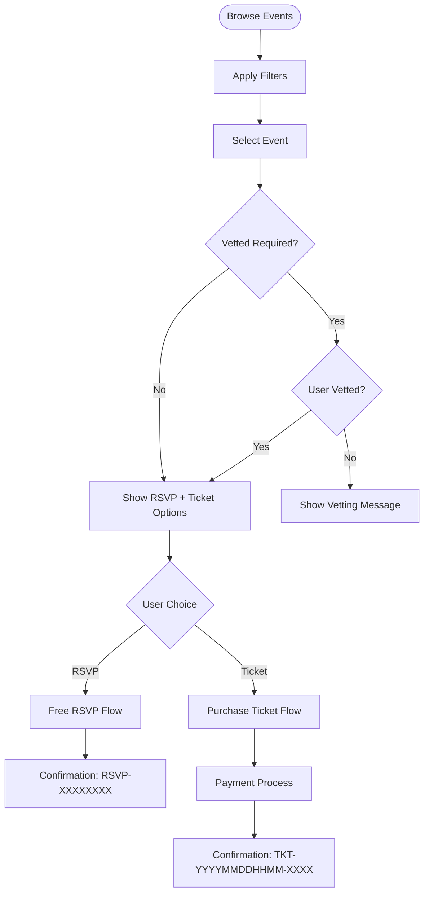
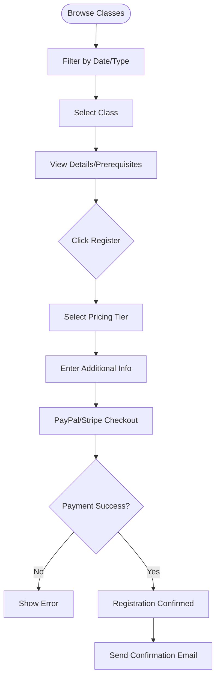
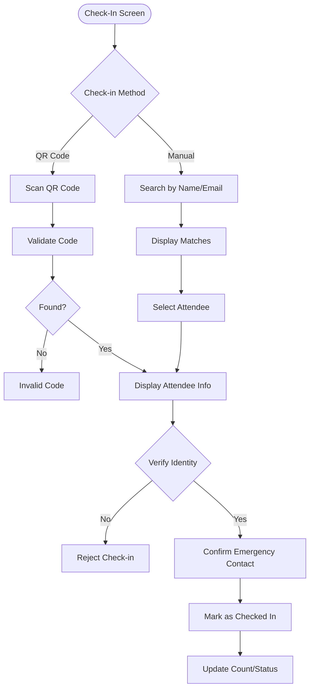
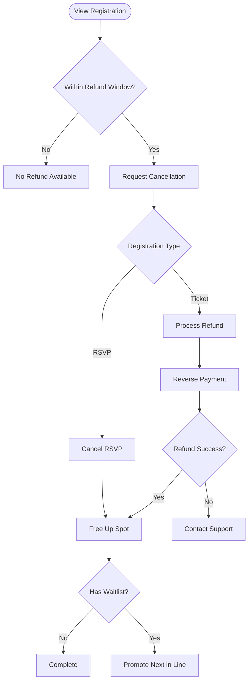

# Events Management - User Flows
<!-- Last Updated: 2025-08-04 -->
<!-- Version: 2.0 -->
<!-- Owner: Events Team -->
<!-- Status: Active -->

## Overview
This document outlines the key user flows for event management, covering the journey from event creation through check-in. Each flow represents a complete user task with all decision points and edge cases.

## 1. Event Creation Flow (Admin/Organizer)

### Flow Overview
Admins and designated organizers can create new events through a multi-tab interface.

### Steps
1. **Access Creation Interface**
   - Navigate to Admin Dashboard → Events → Create New Event
   - System checks organizer permissions

2. **Select Event Type**
   - Choose between Class (educational) or Social (community)
   - System auto-configures vetting requirements based on type

3. **Fill Basic Information** (Tab 1)
   ```
   Required Fields:
   - Title (max 200 chars)
   - Description (rich text)
   - Event Type
   - Start/End DateTime
   - Capacity
   - Location (physical/online)
   
   Optional Fields:
   - Prerequisites
   - What to bring
   - Parking info
   - Accessibility notes
   ```

4. **Configure Pricing** (Tab 2)
   - For Classes: Set required pricing tiers
   - For Social Events: Set optional suggested donation
   - Configure sliding scale if applicable

5. **Setup Email Templates** (Tab 3)
   - Customize confirmation email
   - Set reminder schedule (default: 24hr before)
   - Create custom messages if needed

6. **Assign Volunteers** (Tab 4)
   - Define volunteer tasks
   - Assign staff members
   - Set task schedules

7. **Review and Publish**
   - Preview event page
   - Confirm all details
   - Publish or save as draft

### Edge Cases
- Validation prevents publishing without required fields
- Draft events auto-save every 30 seconds
- Published events require confirmation before going live

## 2. Event Registration Flow (Members)

### Flow Overview
Members discover and register for events based on their membership status and event requirements.

### Social Event Registration



### Class Registration



### Key Features
- Real-time capacity updates
- Waitlist auto-enrollment when full
- Emergency contact collection
- Dietary/accessibility needs capture

## 3. Event Check-In Flow (Staff)

### Pre-Event Setup
1. Staff logs in with check-in privileges
2. Selects event from today's events
3. System loads attendee list

### Check-In Process



### Check-In Features
- Works offline with sync later
- Photo display for identity verification
- Emergency contact confirmation
- Real-time attendance tracking
- Late arrival handling

## 4. Event Management Flow (Organizers)

### Ongoing Management

1. **Monitor Registration**
   - View real-time capacity
   - Check waitlist status
   - Review attendee demographics

2. **Communicate with Attendees**
   - Send bulk emails
   - Post updates
   - Answer questions

3. **Handle Changes**
   - Update event details
   - Manage capacity increases
   - Process special requests

4. **Day-of Management**
   - Print attendee lists
   - Generate check-in codes
   - Monitor check-in progress

### Post-Event

1. **Attendance Report**
   - Actual vs registered
   - No-show analysis
   - Revenue summary

2. **Follow-up**
   - Thank you emails
   - Feedback surveys
   - Photo sharing

## 5. Cancellation and Refund Flows

### Member-Initiated Cancellation



### Admin-Initiated Cancellation

1. **Partial Cancellation** (reduce capacity)
   - Identify affected attendees
   - Process refunds
   - Send notifications

2. **Full Event Cancellation**
   - Confirm cancellation
   - Auto-refund all tickets
   - Email all registrants
   - Mark event as cancelled

## 6. Special Scenarios

### Waitlist Promotion
- Automatic when spot opens
- 24-hour claim window
- Email notification sent
- Auto-skip if not claimed

### Group Registration (Future)
- Not currently supported
- Each person registers individually
- Planned enhancement for workshops

### Accessibility Accommodations
- Collected during registration
- Visible to organizers
- Special check-in notes
- Venue preparation info

## Error Handling

### Common Error Scenarios
1. **Payment Failures**
   - Retry with different method
   - Hold spot for 10 minutes
   - Clear cart after timeout

2. **Capacity Conflicts**
   - Race condition handling
   - Clear messaging
   - Automatic waitlist offer

3. **Technical Issues**
   - Graceful degradation
   - Offline check-in capability
   - Manual override options

## Mobile Considerations

### Responsive Design
- All flows work on mobile
- Touch-optimized interfaces
- Simplified navigation
- Offline capability for check-in

### Mobile-Specific Features
- One-thumb navigation
- Large touch targets
- Swipe gestures
- Camera integration for QR

---

*For technical implementation details, see [functional-design.md](functional-design.md)*