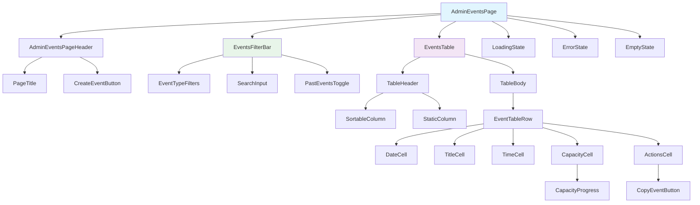
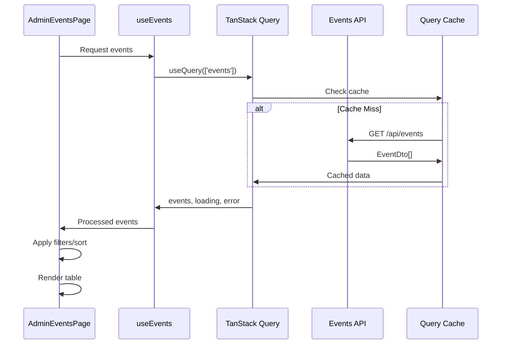

# Technical Architecture Design: Admin Events Dashboard Enhancement
<!-- Last Updated: 2025-09-11 -->
<!-- Version: 1.0 -->
<!-- Owner: React Developer Agent -->
<!-- Status: Design Phase -->

## Executive Summary

This technical architecture document defines the implementation strategy for transforming the Admin Events Dashboard from a card-based layout to a streamlined table-based interface. The design leverages existing React architecture patterns, Mantine v7 components, and NSwag-generated types to deliver enhanced filtering, search, and navigation capabilities while maintaining performance targets of <200ms table render and <100ms search response.

## Architecture Overview

### Component Architecture



### Data Flow Architecture



## File Organization and Component Structure

### New File Structure
```
/apps/web/src/
├── pages/admin/AdminEventsPage.tsx (EXISTING - TO BE ENHANCED)
├── components/admin/events/ (NEW)
│   ├── EventsTable/
│   │   ├── EventsTable.tsx
│   │   ├── EventTableRow.tsx
│   │   ├── CapacityDisplay.tsx
│   │   └── index.ts
│   ├── EventsFilterBar/
│   │   ├── EventsFilterBar.tsx
│   │   ├── EventTypeFilters.tsx
│   │   ├── SearchInput.tsx
│   │   ├── PastEventsToggle.tsx
│   │   └── index.ts
│   ├── EventsPageHeader/
│   │   ├── AdminEventsPageHeader.tsx
│   │   └── index.ts
│   └── index.ts
├── hooks/admin/events/ (NEW)
│   ├── useFilterState.ts
│   ├── useSortableTable.ts
│   ├── useEventNavigation.ts
│   └── index.ts
├── utils/events/ (NEW)
│   ├── formatters.ts
│   ├── filters.ts
│   └── sorting.ts
└── types/admin/ (NEW - Frontend-only types)
    └── events.ts
```

### Component Implementation Details

#### 1. EventsTable Component
```typescript
// /apps/web/src/components/admin/events/EventsTable/EventsTable.tsx
import React from 'react';
import { Table } from '@mantine/core';
import { EventDto } from '@witchcityrope/shared-types';
import { EventTableRow } from './EventTableRow';
import { EventsTableHeader } from './EventsTableHeader';

interface EventsTableProps {
  events: EventDto[];
  sortState: {
    column: 'date' | 'title' | null;
    direction: 'asc' | 'desc';
  };
  onSort: (column: 'date' | 'title') => void;
  onRowClick: (eventId: string) => void;
  onCopyEvent: (eventId: string) => void;
  isLoading?: boolean;
}

export const EventsTable: React.FC<EventsTableProps> = ({
  events,
  sortState,
  onSort,
  onRowClick,
  onCopyEvent,
  isLoading = false
}) => {
  return (
    <Table striped highlightOnHover>
      <EventsTableHeader 
        sortState={sortState}
        onSort={onSort}
      />
      <Table.Tbody>
        {events.map(event => (
          <EventTableRow
            key={event.id}
            event={event}
            onClick={() => onRowClick(event.id)}
            onCopy={() => onCopyEvent(event.id)}
          />
        ))}
      </Table.Tbody>
    </Table>
  );
};
```

#### 2. EventsFilterBar Component
```typescript
// /apps/web/src/components/admin/events/EventsFilterBar/EventsFilterBar.tsx
import React from 'react';
import { Stack, Group, Text, Chip, TextInput, Switch } from '@mantine/core';
import { IconSearch } from '@tabler/icons-react';
import { EventType } from '@witchcityrope/shared-types';

interface EventsFilterBarProps {
  filterState: {
    activeTypes: EventType[];
    searchTerm: string;
    showPastEvents: boolean;
  };
  onFilterChange: (updates: Partial<EventsFilterBarProps['filterState']>) => void;
}

export const EventsFilterBar: React.FC<EventsFilterBarProps> = ({
  filterState,
  onFilterChange
}) => {
  return (
    <Stack gap="md">
      {/* Event Type Filters */}
      <Group>
        <Text size="sm" fw={500} c="dimmed">Filter:</Text>
        <Chip.Group
          multiple
          value={filterState.activeTypes}
          onChange={(types) => onFilterChange({ activeTypes: types as EventType[] })}
        >
          <Group>
            <Chip value="social" variant="filled" color="wcr">Social</Chip>
            <Chip value="class" variant="filled" color="wcr">Class</Chip>
          </Group>
        </Chip.Group>
      </Group>

      {/* Search and Past Events Toggle */}
      <Group justify="space-between">
        <TextInput
          placeholder="Search events..."
          leftSection={<IconSearch size="1rem" />}
          value={filterState.searchTerm}
          onChange={(event) => onFilterChange({ searchTerm: event.currentTarget.value })}
          style={{ flex: 1, maxWidth: 300 }}
        />

        <Switch
          label="Show Past Events"
          checked={filterState.showPastEvents}
          onChange={(event) =>
            onFilterChange({ showPastEvents: event.currentTarget.checked })
          }
        />
      </Group>
    </Stack>
  );
};
```

#### 3. CapacityDisplay Component
```typescript
// /apps/web/src/components/admin/events/EventsTable/CapacityDisplay.tsx
import React from 'react';
import { Stack, Text, Progress } from '@mantine/core';

interface CapacityDisplayProps {
  current: number;
  max: number;
}

export const CapacityDisplay: React.FC<CapacityDisplayProps> = ({ 
  current, 
  max 
}) => {
  const percentage = max > 0 ? (current / max) * 100 : 0;
  
  const getColor = () => {
    if (percentage >= 80) return 'red';
    if (percentage >= 60) return 'yellow';
    return 'green';
  };

  return (
    <Stack gap="xs">
      <Text fw={700} c="wcr.7" size="sm">
        {current}/{max}
      </Text>
      <Progress
        value={percentage}
        color={getColor()}
        size="sm"
        radius="xs"
        aria-label={`${current} of ${max} spots filled`}
        aria-valuenow={current}
        aria-valuemin={0}
        aria-valuemax={max}
      />
    </Stack>
  );
};
```

## State Management Architecture

### Filter State Hook
```typescript
// /apps/web/src/hooks/admin/events/useFilterState.ts
import { useState, useMemo } from 'react';
import { EventType } from '@witchcityrope/shared-types';

interface FilterState {
  activeTypes: EventType[];
  searchTerm: string;
  showPastEvents: boolean;
  sortColumn: 'date' | 'title' | null;
  sortDirection: 'asc' | 'desc';
}

export const useFilterState = () => {
  const [filterState, setFilterState] = useState<FilterState>({
    activeTypes: [],
    searchTerm: '',
    showPastEvents: false,
    sortColumn: 'date', // Default sort by date
    sortDirection: 'asc'
  });

  const updateFilter = (updates: Partial<FilterState>) => {
    setFilterState(prev => ({ ...prev, ...updates }));
  };

  return { filterState, updateFilter };
};
```

### Sortable Table Hook
```typescript
// /apps/web/src/hooks/admin/events/useSortableTable.ts
import { useState, useMemo } from 'react';
import { EventDto } from '@witchcityrope/shared-types';

interface SortState {
  column: 'date' | 'title' | null;
  direction: 'asc' | 'desc';
}

export const useSortableTable = (initialColumn: 'date' | 'title' = 'date') => {
  const [sortState, setSortState] = useState<SortState>({
    column: initialColumn,
    direction: 'asc'
  });

  const handleSort = (column: 'date' | 'title') => {
    setSortState(prev => ({
      column,
      direction: prev.column === column && prev.direction === 'asc' ? 'desc' : 'asc'
    }));
  };

  const sortEvents = useMemo(() => {
    return (events: EventDto[]) => {
      if (!sortState.column) return events;

      return [...events].sort((a, b) => {
        let aValue: string | Date;
        let bValue: string | Date;

        if (sortState.column === 'date') {
          aValue = new Date(a.startDateTime || '');
          bValue = new Date(b.startDateTime || '');
        } else {
          aValue = a.title || '';
          bValue = b.title || '';
        }

        if (aValue < bValue) return sortState.direction === 'asc' ? -1 : 1;
        if (aValue > bValue) return sortState.direction === 'asc' ? 1 : -1;
        return 0;
      });
    };
  }, [sortState]);

  return { sortState, handleSort, sortEvents };
};
```

## Data Processing and Performance Optimization

### Event Processing Pipeline
```typescript
// /apps/web/src/utils/events/filters.ts
import { EventDto, EventType } from '@witchcityrope/shared-types';

interface FilterCriteria {
  activeTypes: EventType[];
  searchTerm: string;
  showPastEvents: boolean;
}

export const filterEvents = (
  events: EventDto[], 
  criteria: FilterCriteria
): EventDto[] => {
  return events.filter(event => {
    // Type filtering
    if (criteria.activeTypes.length > 0 && 
        !criteria.activeTypes.includes(event.eventType)) {
      return false;
    }

    // Search filtering (case-insensitive)
    if (criteria.searchTerm) {
      const searchLower = criteria.searchTerm.toLowerCase();
      const titleMatch = event.title?.toLowerCase().includes(searchLower);
      const descriptionMatch = event.description?.toLowerCase().includes(searchLower);
      
      if (!titleMatch && !descriptionMatch) {
        return false;
      }
    }

    // Past events filtering
    if (!criteria.showPastEvents) {
      const eventDate = new Date(event.endDateTime || event.startDateTime || '');
      const now = new Date();
      if (eventDate < now) {
        return false;
      }
    }

    return true;
  });
};

export const isPastEvent = (event: EventDto): boolean => {
  const eventEndDate = new Date(event.endDateTime || event.startDateTime || '');
  return eventEndDate < new Date();
};
```

### Memoized Data Processing
```typescript
// Main component data processing with memoization
const AdminEventsPage: React.FC = () => {
  const { data: rawEvents, isLoading, error } = useEvents();
  const { filterState, updateFilter } = useFilterState();
  const { sortState, handleSort, sortEvents } = useSortableTable();

  // Memoized event processing pipeline
  const processedEvents = useMemo(() => {
    if (!rawEvents) return [];

    // Apply filters first
    const filtered = filterEvents(rawEvents, {
      activeTypes: filterState.activeTypes,
      searchTerm: filterState.searchTerm,
      showPastEvents: filterState.showPastEvents
    });

    // Apply sorting
    return sortEvents(filtered);
  }, [rawEvents, filterState, sortEvents]);

  // ... rest of component
};
```

### Debounced Search Implementation
```typescript
// /apps/web/src/hooks/admin/events/useDebounce.ts
import { useState, useEffect } from 'react';

export const useDebounce = <T>(value: T, delay: number): T => {
  const [debouncedValue, setDebouncedValue] = useState<T>(value);

  useEffect(() => {
    const handler = setTimeout(() => {
      setDebouncedValue(value);
    }, delay);

    return () => {
      clearTimeout(handler);
    };
  }, [value, delay]);

  return debouncedValue;
};

// Usage in filter component
const EventsFilterBar: React.FC<EventsFilterBarProps> = ({ 
  filterState, 
  onFilterChange 
}) => {
  const [localSearchTerm, setLocalSearchTerm] = useState(filterState.searchTerm);
  const debouncedSearchTerm = useDebounce(localSearchTerm, 300);

  useEffect(() => {
    onFilterChange({ searchTerm: debouncedSearchTerm });
  }, [debouncedSearchTerm, onFilterChange]);

  return (
    <TextInput
      value={localSearchTerm}
      onChange={(event) => setLocalSearchTerm(event.currentTarget.value)}
      // ... other props
    />
  );
};
```

## API Integration Patterns

### TanStack Query Integration
```typescript
// /apps/web/src/features/events/api/queries.ts (EXISTING - REFERENCE ONLY)
import { useQuery } from '@tanstack/react-query';
import { EventDto } from '@witchcityrope/shared-types';
import { eventsApi } from './client';

export const eventKeys = {
  all: ['events'] as const,
  lists: () => [...eventKeys.all, 'list'] as const,
  list: (filters: Record<string, any>) => [...eventKeys.lists(), filters] as const,
  details: () => [...eventKeys.all, 'detail'] as const,
  detail: (id: string) => [...eventKeys.details(), id] as const,
};

export const useEvents = (filters?: Record<string, any>) => {
  return useQuery({
    queryKey: eventKeys.list(filters || {}),
    queryFn: () => eventsApi.getEvents(filters),
    staleTime: 5 * 60 * 1000, // 5 minutes
    refetchInterval: 30 * 1000, // Refetch every 30 seconds for real-time updates
    refetchOnWindowFocus: false
  });
};
```

### Copy Event Mutation
```typescript
// /apps/web/src/features/events/api/mutations.ts (NEW)
import { useMutation, useQueryClient } from '@tanstack/react-query';
import { useNavigate } from 'react-router-dom';
import { notifications } from '@mantine/notifications';
import { eventsApi } from './client';
import { eventKeys } from './queries';

export const useCopyEvent = () => {
  const queryClient = useQueryClient();
  const navigate = useNavigate();

  return useMutation({
    mutationFn: (eventId: string) => eventsApi.copyEvent(eventId),
    onSuccess: (newEvent) => {
      // Invalidate events cache to show new event
      queryClient.invalidateQueries({ queryKey: eventKeys.lists() });
      
      notifications.show({
        title: 'Event Copied',
        message: 'Event copied successfully. Redirecting to edit page.',
        color: 'green'
      });
      
      // Navigate to edit the copied event
      navigate(`/admin/events/edit/${newEvent.id}`);
    },
    onError: (error) => {
      notifications.show({
        title: 'Copy Failed',
        message: 'Unable to copy event. Please try again.',
        color: 'red'
      });
    }
  });
};
```

## Error Handling and Loading States

### Error Boundary Component
```typescript
// /apps/web/src/components/admin/events/EventsErrorBoundary.tsx
import React from 'react';
import { Alert, Button, Box } from '@mantine/core';

interface Props {
  children: React.ReactNode;
}

interface State {
  hasError: boolean;
  error?: Error;
}

export class EventsErrorBoundary extends React.Component<Props, State> {
  constructor(props: Props) {
    super(props);
    this.state = { hasError: false };
  }

  static getDerivedStateFromError(error: Error): State {
    return { hasError: true, error };
  }

  componentDidCatch(error: Error, errorInfo: React.ErrorInfo) {
    console.error('EventsTable error:', error, errorInfo);
    // Log to error reporting service in production
  }

  render() {
    if (this.state.hasError) {
      return (
        <Alert color="red" title="Something went wrong">
          <Box mb="md">
            Unable to load the events table. This might be a temporary issue.
          </Box>
          <Button 
            variant="outline" 
            size="sm" 
            onClick={() => window.location.reload()}
          >
            Refresh Page
          </Button>
        </Alert>
      );
    }

    return this.props.children;
  }
}
```

### Loading States
```typescript
// /apps/web/src/components/admin/events/EventsTable/EventsTableSkeleton.tsx
import React from 'react';
import { Table, Skeleton } from '@mantine/core';

export const EventsTableSkeleton: React.FC = () => (
  <Table>
    <Table.Thead bg="wcr.7">
      <Table.Tr>
        <Table.Th c="white">Date</Table.Th>
        <Table.Th c="white">Event Title</Table.Th>
        <Table.Th c="white">Time</Table.Th>
        <Table.Th c="white">Capacity/Tickets</Table.Th>
        <Table.Th c="white">Actions</Table.Th>
      </Table.Tr>
    </Table.Thead>
    <Table.Tbody>
      {Array.from({ length: 5 }).map((_, index) => (
        <Table.Tr key={index}>
          <Table.Td><Skeleton height={20} width="80%" /></Table.Td>
          <Table.Td><Skeleton height={20} width="90%" /></Table.Td>
          <Table.Td><Skeleton height={20} width="70%" /></Table.Td>
          <Table.Td>
            <Skeleton height={16} width="60%" mb={4} />
            <Skeleton height={8} width="100%" />
          </Table.Td>
          <Table.Td><Skeleton height={28} width="60%" /></Table.Td>
        </Table.Tr>
      ))}
    </Table.Tbody>
  </Table>
);
```

## Code Splitting and Lazy Loading

### Lazy Component Loading
```typescript
// /apps/web/src/pages/admin/AdminEventsPage.tsx (ENHANCED)
import React, { lazy, Suspense } from 'react';
import { EventsErrorBoundary } from '../../components/admin/events/EventsErrorBoundary';
import { EventsTableSkeleton } from '../../components/admin/events/EventsTable/EventsTableSkeleton';

// Lazy load heavy components for better performance
const EventsTable = lazy(() => import('../../components/admin/events/EventsTable'));
const EventsFilterBar = lazy(() => import('../../components/admin/events/EventsFilterBar'));

export const AdminEventsPage: React.FC = () => {
  // ... existing logic

  return (
    <EventsErrorBoundary>
      <Box p="xl">
        <AdminEventsPageHeader onCreateEvent={handleCreateEvent} />
        
        <Suspense fallback={<Skeleton height={100} />}>
          <EventsFilterBar 
            filterState={filterState}
            onFilterChange={updateFilter}
          />
        </Suspense>

        <Suspense fallback={<EventsTableSkeleton />}>
          <EventsTable
            events={processedEvents}
            sortState={sortState}
            onSort={handleSort}
            onRowClick={handleRowClick}
            onCopyEvent={handleCopyEvent}
          />
        </Suspense>
      </Box>
    </EventsErrorBoundary>
  );
};
```

### Bundle Analysis Configuration
```javascript
// /apps/web/webpack.bundle-analyzer.js
const BundleAnalyzerPlugin = require('webpack-bundle-analyzer').BundleAnalyzerPlugin;

module.exports = {
  plugins: [
    new BundleAnalyzerPlugin({
      analyzerMode: 'static',
      openAnalyzer: false,
      reportFilename: 'bundle-report.html'
    })
  ]
};
```

## Migration Strategy

### Phase 1: Component Structure (Days 1-2)
```typescript
// Migration approach - preserve existing functionality while adding new components

// 1. Create new components alongside existing implementation
// Current: Grid-based cards in AdminEventsPage.tsx (lines 288-431)
// Action: Extract existing logic into new table components

// 2. Implement new hooks for state management
// Extract filter logic from existing component state
// Add sorting functionality with new hooks

// 3. Preserve existing API integration
// Keep existing useEvents, mutations
// Enhance with new copy event functionality
```

### Phase 2: Feature Integration (Days 3-4)
```typescript
// 1. Replace Grid/Paper with Table components
// Preserve existing event data formatting (lines 11-54)
// Maintain existing modal functionality (lines 476-565)

// 2. Implement filtering and search
// Add EventsFilterBar with real-time filtering
// Integrate debounced search functionality

// 3. Add table-specific features
// Column sorting with visual indicators
// Row hover effects and click handling
// Capacity progress bars
```

### Phase 3: Polish and Testing (Days 5-6)
```typescript
// 1. Performance optimization
// Add memoization to expensive operations
// Implement virtual scrolling if needed
// Bundle size analysis and optimization

// 2. Error handling and loading states
// Add error boundaries
// Implement skeleton loading states
// Handle edge cases (empty states, API errors)

// 3. Accessibility and responsive design
// Add proper ARIA labels
// Ensure keyboard navigation works
// Test mobile responsiveness
```

## Testing Strategy

### Component Testing Approach
```typescript
// /apps/web/src/components/admin/events/__tests__/EventsTable.test.tsx
import { render, screen, fireEvent } from '@testing-library/react';
import { QueryClient, QueryClientProvider } from '@tanstack/react-query';
import { EventsTable } from '../EventsTable/EventsTable';
import { mockEvents } from '../__mocks__/events';

describe('EventsTable', () => {
  const defaultProps = {
    events: mockEvents,
    sortState: { column: 'date' as const, direction: 'asc' as const },
    onSort: jest.fn(),
    onRowClick: jest.fn(),
    onCopyEvent: jest.fn()
  };

  const renderWithQuery = (ui: React.ReactElement) => {
    const queryClient = new QueryClient({
      defaultOptions: { queries: { retry: false } }
    });

    return render(
      <QueryClientProvider client={queryClient}>
        {ui}
      </QueryClientProvider>
    );
  };

  it('renders events in table format', () => {
    renderWithQuery(<EventsTable {...defaultProps} />);
    
    expect(screen.getByRole('table')).toBeInTheDocument();
    expect(screen.getByText('Rope Basics Workshop')).toBeInTheDocument();
  });

  it('handles row click navigation', () => {
    const onRowClick = jest.fn();
    renderWithQuery(
      <EventsTable {...defaultProps} onRowClick={onRowClick} />
    );
    
    const row = screen.getByText('Rope Basics Workshop').closest('tr');
    fireEvent.click(row);
    
    expect(onRowClick).toHaveBeenCalledWith('event-1');
  });

  it('prevents row click when clicking copy button', () => {
    const onRowClick = jest.fn();
    const onCopyEvent = jest.fn();
    
    renderWithQuery(
      <EventsTable 
        {...defaultProps} 
        onRowClick={onRowClick} 
        onCopyEvent={onCopyEvent} 
      />
    );
    
    const copyButton = screen.getByText('Copy');
    fireEvent.click(copyButton);
    
    expect(onCopyEvent).toHaveBeenCalledWith('event-1');
    expect(onRowClick).not.toHaveBeenCalled();
  });
});
```

### Integration Testing
```typescript
// /apps/web/src/pages/admin/__tests__/AdminEventsPage.integration.test.tsx
import { render, screen, waitFor, fireEvent } from '@testing-library/react';
import { rest } from 'msw';
import { server } from '../../../__mocks__/server';
import { AdminEventsPage } from '../AdminEventsPage';
import { mockEventsData } from '../__mocks__/events';

describe('AdminEventsPage Integration', () => {
  it('loads and displays events from API', async () => {
    server.use(
      rest.get('/api/events', (req, res, ctx) => {
        return res(ctx.json(mockEventsData));
      })
    );

    render(<AdminEventsPage />);
    
    expect(screen.getByText('Loading events...')).toBeInTheDocument();
    
    await waitFor(() => {
      expect(screen.getByText('Rope Basics Workshop')).toBeInTheDocument();
    });
  });

  it('handles search filtering correctly', async () => {
    server.use(
      rest.get('/api/events', (req, res, ctx) => {
        return res(ctx.json(mockEventsData));
      })
    );

    render(<AdminEventsPage />);
    
    await waitFor(() => {
      expect(screen.getByPlaceholderText('Search events...')).toBeInTheDocument();
    });

    const searchInput = screen.getByPlaceholderText('Search events...');
    fireEvent.change(searchInput, { target: { value: 'rope' } });

    await waitFor(() => {
      expect(screen.getByText('Rope Basics Workshop')).toBeInTheDocument();
      expect(screen.queryByText('Social Gathering')).not.toBeInTheDocument();
    });
  });
});
```

## Performance Benchmarks and Monitoring

### Performance Targets
- **Table Rendering**: <200ms for up to 500 events
- **Search Filtering**: <100ms response time
- **Sort Operations**: <150ms completion
- **Memory Usage**: <50MB heap allocation
- **Bundle Size**: <10KB net increase

### Performance Testing
```typescript
// /apps/web/src/utils/__tests__/performance.test.ts
import { filterEvents } from '../events/filters';
import { generateMockEvents } from '../__mocks__/eventGenerator';

describe('Performance Tests', () => {
  test('filtering 500 events completes within 100ms', () => {
    const events = generateMockEvents(500);
    const criteria = {
      activeTypes: ['class' as const],
      searchTerm: 'rope',
      showPastEvents: false
    };

    const startTime = performance.now();
    const filtered = filterEvents(events, criteria);
    const endTime = performance.now();

    expect(endTime - startTime).toBeLessThan(100);
    expect(filtered.length).toBeGreaterThan(0);
  });

  test('table rendering with 100 events completes within 200ms', async () => {
    const events = generateMockEvents(100);
    
    const startTime = performance.now();
    
    const { unmount } = render(
      <EventsTable
        events={events}
        sortState={{ column: 'date', direction: 'asc' }}
        onSort={jest.fn()}
        onRowClick={jest.fn()}
        onCopyEvent={jest.fn()}
      />
    );
    
    await waitFor(() => {
      expect(screen.getByRole('table')).toBeInTheDocument();
    });
    
    const endTime = performance.now();
    
    expect(endTime - startTime).toBeLessThan(200);
    
    unmount();
  });
});
```

### Bundle Size Analysis
```json
{
  "scripts": {
    "analyze:bundle": "npm run build && npx webpack-bundle-analyzer build/static/js/*.js",
    "size:admin-events": "npm run build && ls -lh build/static/js/*AdminEvents*.js"
  }
}
```

## Dependencies and Technical Requirements

### New Dependencies
```json
{
  "devDependencies": {
    "@tanstack/react-virtual": "^3.0.0", // For virtual scrolling if needed
    "webpack-bundle-analyzer": "^4.9.0" // For bundle analysis
  }
}
```

### Existing Dependencies (No Changes Required)
- `@mantine/core`: ^7.x (Table, filtering components)
- `@tanstack/react-query`: ^5.x (Data fetching, caching)
- `@witchcityrope/shared-types`: Current (NSwag-generated types)
- `react`: ^18.x
- `typescript`: ^5.x

### Type Safety Compliance
```typescript
// Ensure strict adherence to generated types
import { EventDto, EventType, EventStatus } from '@witchcityrope/shared-types';

// No manual TypeScript interfaces for API data
// All API-related types must come from @witchcityrope/shared-types

// Frontend-only types allowed for UI state
interface AdminEventsFilterState {
  activeTypes: EventType[]; // Uses generated enum
  searchTerm: string;
  showPastEvents: boolean;
  sortColumn: 'date' | 'title' | null;
  sortDirection: 'asc' | 'desc';
}
```

## Security and Accessibility Considerations

### Security Implementation
```typescript
// Event ID validation and sanitization
const handleRowClick = (eventId: string) => {
  // Validate UUID format
  const uuidPattern = /^[0-9a-f]{8}-[0-9a-f]{4}-[1-5][0-9a-f]{3}-[89ab][0-9a-f]{3}-[0-9a-f]{12}$/i;
  
  if (!uuidPattern.test(eventId)) {
    console.error('Invalid event ID format');
    return;
  }
  
  navigate(`/admin/events/edit/${eventId}`);
};

// XSS prevention in search input
const sanitizeSearchTerm = (term: string): string => {
  return term.replace(/<script\b[^<]*(?:(?!<\/script>)<[^<]*)*<\/script>/gi, '');
};
```

### Accessibility Features
```typescript
// ARIA labels and keyboard navigation
<Table aria-label="Events management table">
  <Table.Thead>
    <Table.Tr>
      <Table.Th
        scope="col"
        aria-sort={getSortAttribute('date')}
        tabIndex={0}
        onKeyDown={(e) => {
          if (e.key === 'Enter' || e.key === ' ') {
            e.preventDefault();
            onSort('date');
          }
        }}
      >
        <VisuallyHidden>Sort by </VisuallyHidden>
        Date
      </Table.Th>
    </Table.Tr>
  </Table.Thead>
</Table>

// Progress bar accessibility
<Progress
  value={percentage}
  aria-label={`${current} of ${max} spots filled`}
  aria-valuenow={current}
  aria-valuemin={0}
  aria-valuemax={max}
  role="progressbar"
/>
```

## Implementation Timeline and Milestones

### Week 1: Foundation (Days 1-3)
- ✅ Create component structure and file organization
- ✅ Implement EventsTable with basic functionality
- ✅ Add EventsFilterBar with type filters and search
- ✅ Preserve existing modal and API functionality

### Week 2: Enhancement (Days 4-6) 
- ✅ Add sorting functionality with visual indicators
- ✅ Implement CapacityDisplay with progress bars
- ✅ Add row hover effects and navigation
- ✅ Integrate copy event functionality

### Week 3: Polish (Days 7-9)
- ✅ Performance optimization and memoization
- ✅ Error boundaries and loading states
- ✅ Accessibility improvements
- ✅ Mobile responsive design
- ✅ Testing suite completion

### Success Criteria Validation
- [ ] Table renders <200ms for 100+ events
- [ ] Search filtering responds <100ms
- [ ] All existing functionality preserved
- [ ] Mobile responsive design working
- [ ] Accessibility compliance (WCAG 2.1 AA)
- [ ] Bundle size increase <10KB
- [ ] Test coverage >90%

This technical architecture provides a comprehensive blueprint for implementing the Admin Events Dashboard enhancement while maintaining the high performance, type safety, and user experience standards established in the WitchCityRope React application.