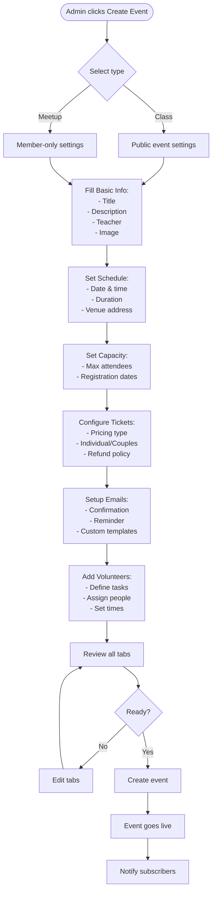
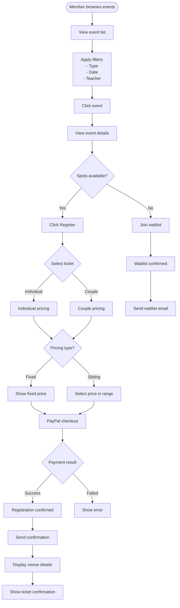
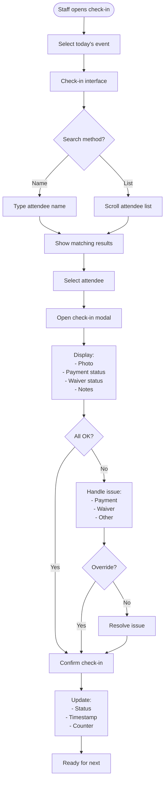
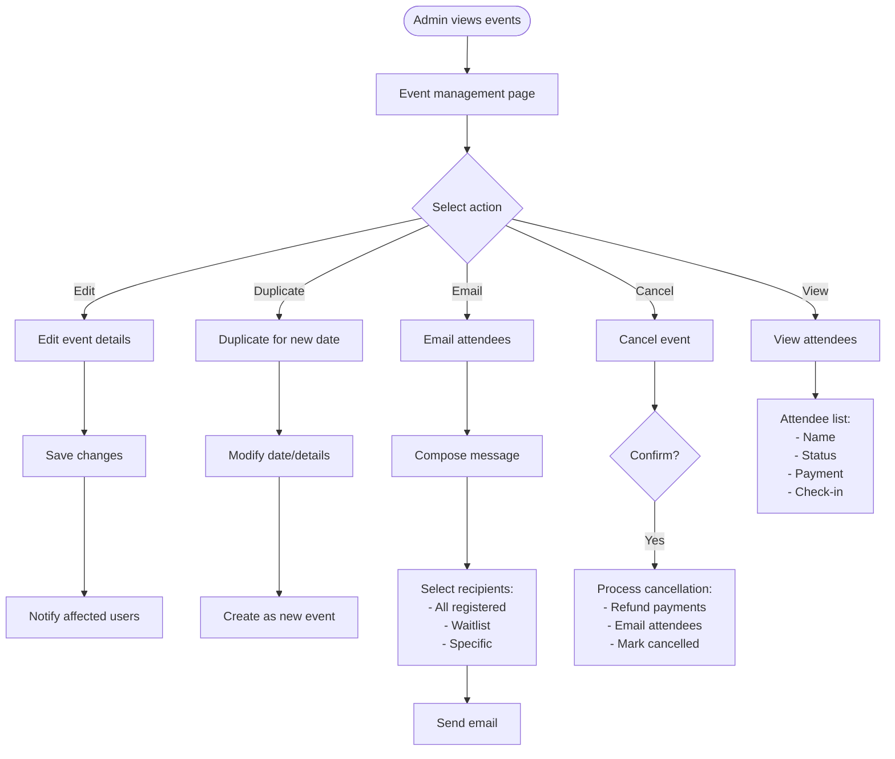
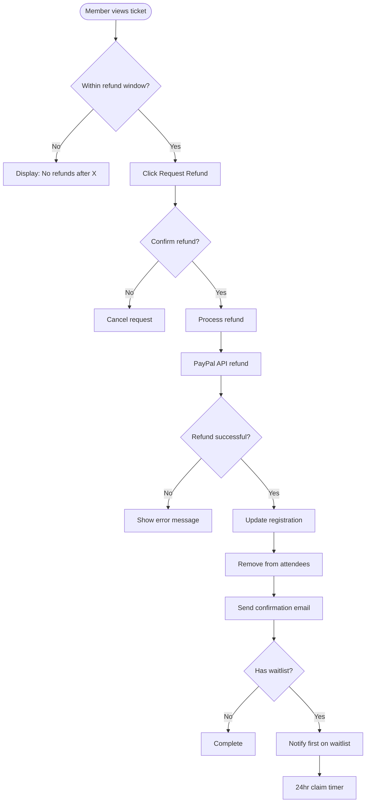
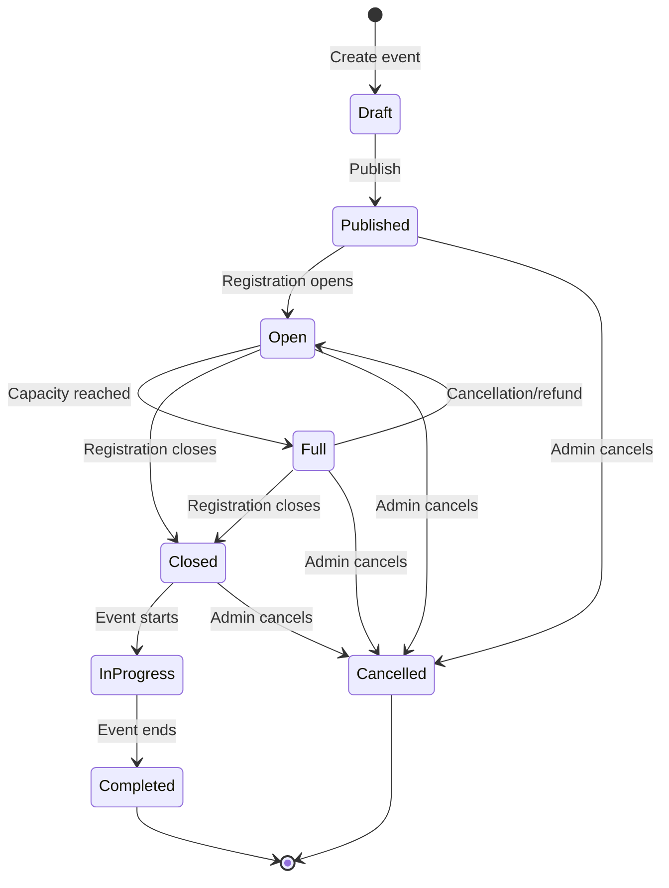

# Event Management User Flows

## 1. Event Creation Flow (Admin)

## 2. Event Registration Flow (Member)

## 3. Event Check-in Flow (Staff)

## 4. Event Management Flow (Admin)

## 5. Refund Flow

## State Diagram: Event Lifecycle

## Key Features

### Event Creation
- Multi-tab interface
- Save draft functionality
- Preview before publish
- Template system for repeated events
- Rich text editor for descriptions

### Registration
- Real-time capacity updates
- Sliding scale honor system
- Couples ticket option
- Automatic waitlist management
- PayPal integration

### Check-in
- Mobile-optimized interface
- Offline capability
- Quick search
- Override permissions
- Real-time attendance tracking

### Communication
- Email template system
- Bulk email to attendees
- Automated reminders
- Custom email composition
- Delivery tracking