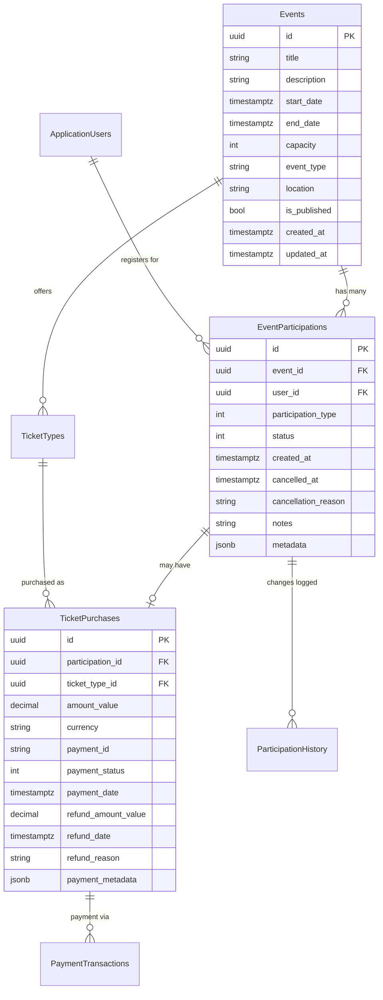

# Database Design: RSVP and Ticketing System
<!-- Date: 2025-01-19 -->
<!-- Version: 1.0 -->
<!-- Owner: Database Designer Agent -->
<!-- Status: Design Complete -->

## Executive Summary

This document defines the comprehensive database schema for the RSVP and Ticketing System, building on WitchCityRope's existing PostgreSQL architecture. The design implements a unified participation tracking system that supports both RSVP-only social events and ticket-based class events, with full PayPal integration, audit trails, and capacity management.

## Architecture Integration

### Existing Foundation
- **PostgreSQL 16** with Entity Framework Core 9
- **Existing Tables**: Events, ApplicationUsers (Identity), EventAttendees (check-in system)
- **PayPal Infrastructure**: Operational webhook processing with audit trails
- **UTC DateTime Handling**: Established patterns for timestamptz compatibility

### Design Principles Applied
- **Single Source of Truth**: One participation per user per event
- **Audit Trail Completeness**: Full lifecycle tracking for compliance
- **Performance Optimization**: Strategic indexing for real-time queries
- **Data Integrity**: Database-level constraints and business rules
- **Future Extensibility**: Design supports waitlists, refunds, and multi-session events

## Entity Relationship Overview



## Complete Schema Definition

### Core Tables

#### 1. EventParticipations Table
**Purpose**: Central participation tracking for both RSVPs and ticket purchases

```sql
CREATE TABLE "EventParticipations" (
    "Id" UUID NOT NULL DEFAULT gen_random_uuid(),
    "EventId" UUID NOT NULL,
    "UserId" UUID NOT NULL,
    "ParticipationType" INTEGER NOT NULL, -- 1=RSVP, 2=Ticket
    "Status" INTEGER NOT NULL DEFAULT 1, -- 1=Active, 2=Cancelled, 3=Refunded, 4=Waitlisted
    "CreatedAt" TIMESTAMPTZ NOT NULL DEFAULT NOW(),
    "CancelledAt" TIMESTAMPTZ NULL,
    "CancellationReason" TEXT NULL,
    "Notes" TEXT NULL,
    "Metadata" JSONB NOT NULL DEFAULT '{}',
    "CreatedBy" UUID NULL,
    "UpdatedBy" UUID NULL,
    "UpdatedAt" TIMESTAMPTZ NOT NULL DEFAULT NOW(),

    CONSTRAINT "PK_EventParticipations" PRIMARY KEY ("Id"),
    CONSTRAINT "FK_EventParticipations_Events"
        FOREIGN KEY ("EventId") REFERENCES "Events"("Id") ON DELETE CASCADE,
    CONSTRAINT "FK_EventParticipations_Users"
        FOREIGN KEY ("UserId") REFERENCES "AspNetUsers"("Id") ON DELETE CASCADE,
    CONSTRAINT "FK_EventParticipations_CreatedBy"
        FOREIGN KEY ("CreatedBy") REFERENCES "AspNetUsers"("Id") ON DELETE SET NULL,
    CONSTRAINT "FK_EventParticipations_UpdatedBy"
        FOREIGN KEY ("UpdatedBy") REFERENCES "AspNetUsers"("Id") ON DELETE SET NULL,

    -- Business Rules
    CONSTRAINT "CHK_EventParticipations_ParticipationType"
        CHECK ("ParticipationType" IN (1, 2)),
    CONSTRAINT "CHK_EventParticipations_Status"
        CHECK ("Status" IN (1, 2, 3, 4)),
    CONSTRAINT "CHK_EventParticipations_CancelledAt_Logic"
        CHECK (("Status" IN (2, 3) AND "CancelledAt" IS NOT NULL) OR
               ("Status" NOT IN (2, 3) AND "CancelledAt" IS NULL)),

    -- One participation per user per event (includes cancelled for audit trail)
    CONSTRAINT "UQ_EventParticipations_User_Event_Active"
        UNIQUE ("UserId", "EventId") DEFERRABLE INITIALLY DEFERRED
);
```

#### 2. TicketPurchases Table
**Purpose**: Payment and ticket details for ticket-based participations

```sql
CREATE TABLE "TicketPurchases" (
    "Id" UUID NOT NULL DEFAULT gen_random_uuid(),
    "ParticipationId" UUID NOT NULL,
    "TicketTypeId" UUID NOT NULL,
    "AmountValue" DECIMAL(10,2) NOT NULL CHECK ("AmountValue" >= 0),
    "Currency" VARCHAR(3) NOT NULL DEFAULT 'USD',
    "PaymentId" VARCHAR(100) NOT NULL, -- PayPal order ID
    "PaymentStatus" INTEGER NOT NULL DEFAULT 1, -- 1=Pending, 2=Completed, 3=Failed, 4=Refunded, 5=PartiallyRefunded
    "PaymentDate" TIMESTAMPTZ NULL,
    "RefundAmountValue" DECIMAL(10,2) NULL CHECK ("RefundAmountValue" >= 0),
    "RefundDate" TIMESTAMPTZ NULL,
    "RefundReason" TEXT NULL,
    "PaymentMetadata" JSONB NOT NULL DEFAULT '{}',
    "CreatedAt" TIMESTAMPTZ NOT NULL DEFAULT NOW(),
    "UpdatedAt" TIMESTAMPTZ NOT NULL DEFAULT NOW(),

    CONSTRAINT "PK_TicketPurchases" PRIMARY KEY ("Id"),
    CONSTRAINT "FK_TicketPurchases_Participation"
        FOREIGN KEY ("ParticipationId") REFERENCES "EventParticipations"("Id") ON DELETE CASCADE,
    CONSTRAINT "FK_TicketPurchases_TicketType"
        FOREIGN KEY ("TicketTypeId") REFERENCES "TicketTypes"("Id") ON DELETE RESTRICT,

    -- Business Rules
    CONSTRAINT "CHK_TicketPurchases_PaymentStatus"
        CHECK ("PaymentStatus" IN (1, 2, 3, 4, 5)),
    CONSTRAINT "CHK_TicketPurchases_RefundLogic"
        CHECK (("PaymentStatus" IN (4, 5) AND "RefundAmountValue" IS NOT NULL AND "RefundDate" IS NOT NULL) OR
               ("PaymentStatus" NOT IN (4, 5) AND "RefundAmountValue" IS NULL AND "RefundDate" IS NULL)),
    CONSTRAINT "CHK_TicketPurchases_RefundAmount"
        CHECK ("RefundAmountValue" IS NULL OR "RefundAmountValue" <= "AmountValue"),

    -- One ticket purchase per participation
    CONSTRAINT "UQ_TicketPurchases_Participation" UNIQUE ("ParticipationId")
);
```

#### 3. TicketTypes Table (Enhanced Existing)
**Purpose**: Defines available ticket options for events

```sql
-- Enhance existing TicketTypes table
ALTER TABLE "TicketTypes" ADD COLUMN IF NOT EXISTS "IsActive" BOOLEAN NOT NULL DEFAULT true;
ALTER TABLE "TicketTypes" ADD COLUMN IF NOT EXISTS "SortOrder" INTEGER NOT NULL DEFAULT 0;
ALTER TABLE "TicketTypes" ADD COLUMN IF NOT EXISTS "Metadata" JSONB NOT NULL DEFAULT '{}';

-- Add constraints if not exists
ALTER TABLE "TicketTypes" ADD CONSTRAINT IF NOT EXISTS "CHK_TicketTypes_Price"
    CHECK ("Price" >= 0);
ALTER TABLE "TicketTypes" ADD CONSTRAINT IF NOT EXISTS "CHK_TicketTypes_SortOrder"
    CHECK ("SortOrder" >= 0);
```

#### 4. ParticipationHistory Table
**Purpose**: Comprehensive audit trail for all participation changes

```sql
CREATE TABLE "ParticipationHistory" (
    "Id" UUID NOT NULL DEFAULT gen_random_uuid(),
    "ParticipationId" UUID NOT NULL,
    "ActionType" VARCHAR(50) NOT NULL, -- Created, Updated, Cancelled, Refunded, StatusChanged
    "OldValues" JSONB NULL,
    "NewValues" JSONB NULL,
    "ChangedBy" UUID NULL,
    "ChangeReason" TEXT NULL,
    "IpAddress" INET NULL,
    "UserAgent" TEXT NULL,
    "CreatedAt" TIMESTAMPTZ NOT NULL DEFAULT NOW(),

    CONSTRAINT "PK_ParticipationHistory" PRIMARY KEY ("Id"),
    CONSTRAINT "FK_ParticipationHistory_Participation"
        FOREIGN KEY ("ParticipationId") REFERENCES "EventParticipations"("Id") ON DELETE CASCADE,
    CONSTRAINT "FK_ParticipationHistory_ChangedBy"
        FOREIGN KEY ("ChangedBy") REFERENCES "AspNetUsers"("Id") ON DELETE SET NULL,

    -- Business Rules
    CONSTRAINT "CHK_ParticipationHistory_ActionType"
        CHECK ("ActionType" IN ('Created', 'Updated', 'Cancelled', 'Refunded', 'StatusChanged', 'PaymentUpdated'))
);
```

#### 5. PaymentTransactions Table
**Purpose**: Links to PayPal payment processing with audit trail

```sql
CREATE TABLE "PaymentTransactions" (
    "Id" UUID NOT NULL DEFAULT gen_random_uuid(),
    "TicketPurchaseId" UUID NOT NULL,
    "PayPalOrderId" VARCHAR(100) NOT NULL,
    "PayPalPaymentId" VARCHAR(100) NULL,
    "TransactionType" VARCHAR(20) NOT NULL, -- Payment, Refund, Chargeback
    "Amount" DECIMAL(10,2) NOT NULL,
    "Currency" VARCHAR(3) NOT NULL DEFAULT 'USD',
    "Status" VARCHAR(20) NOT NULL, -- Pending, Completed, Failed, Cancelled
    "PayPalResponse" JSONB NOT NULL DEFAULT '{}',
    "ProcessedAt" TIMESTAMPTZ NULL,
    "CreatedAt" TIMESTAMPTZ NOT NULL DEFAULT NOW(),

    CONSTRAINT "PK_PaymentTransactions" PRIMARY KEY ("Id"),
    CONSTRAINT "FK_PaymentTransactions_TicketPurchase"
        FOREIGN KEY ("TicketPurchaseId") REFERENCES "TicketPurchases"("Id") ON DELETE CASCADE,

    -- Business Rules
    CONSTRAINT "CHK_PaymentTransactions_TransactionType"
        CHECK ("TransactionType" IN ('Payment', 'Refund', 'Chargeback')),
    CONSTRAINT "CHK_PaymentTransactions_Status"
        CHECK ("Status" IN ('Pending', 'Completed', 'Failed', 'Cancelled')),
    CONSTRAINT "CHK_PaymentTransactions_Amount"
        CHECK ("Amount" > 0)
);
```

## Index Strategy

### Performance-Critical Indexes

```sql
-- Primary performance indexes for real-time queries
CREATE INDEX "IX_EventParticipations_EventId_Status"
    ON "EventParticipations"("EventId", "Status")
    WHERE "Status" = 1; -- Active participations only

CREATE INDEX "IX_EventParticipations_UserId_Status"
    ON "EventParticipations"("UserId", "Status")
    WHERE "Status" = 1;

CREATE INDEX "IX_EventParticipations_CreatedAt"
    ON "EventParticipations"("CreatedAt" DESC);

-- Ticket purchase optimization
CREATE INDEX "IX_TicketPurchases_PaymentId"
    ON "TicketPurchases"("PaymentId");

CREATE INDEX "IX_TicketPurchases_PaymentStatus_PaymentDate"
    ON "TicketPurchases"("PaymentStatus", "PaymentDate" DESC);

-- Partial indexes for specific use cases
CREATE INDEX "IX_TicketPurchases_PendingPayments"
    ON "TicketPurchases"("CreatedAt" DESC)
    WHERE "PaymentStatus" = 1; -- Pending payments

CREATE INDEX "IX_TicketPurchases_FailedPayments"
    ON "TicketPurchases"("CreatedAt" DESC)
    WHERE "PaymentStatus" = 3; -- Failed payments

-- JSONB indexes for metadata queries
CREATE INDEX "IX_EventParticipations_Metadata_Gin"
    ON "EventParticipations" USING GIN ("Metadata");

CREATE INDEX "IX_ParticipationHistory_OldValues_Gin"
    ON "ParticipationHistory" USING GIN ("OldValues");

CREATE INDEX "IX_ParticipationHistory_NewValues_Gin"
    ON "ParticipationHistory" USING GIN ("NewValues");

-- Audit trail performance
CREATE INDEX "IX_ParticipationHistory_ParticipationId_CreatedAt"
    ON "ParticipationHistory"("ParticipationId", "CreatedAt" DESC);

CREATE INDEX "IX_PaymentTransactions_PayPalOrderId"
    ON "PaymentTransactions"("PayPalOrderId");

CREATE INDEX "IX_PaymentTransactions_ProcessedAt"
    ON "PaymentTransactions"("ProcessedAt" DESC);
```

### Composite Indexes for Complex Queries

```sql
-- Admin participant list queries
CREATE INDEX "IX_EventParticipations_Event_Type_Status_Created"
    ON "EventParticipations"("EventId", "ParticipationType", "Status", "CreatedAt" DESC);

-- User dashboard queries
CREATE INDEX "IX_EventParticipations_User_Created_Status"
    ON "EventParticipations"("UserId", "CreatedAt" DESC, "Status");

-- Capacity tracking queries
CREATE INDEX "IX_EventParticipations_Event_Status_Count"
    ON "EventParticipations"("EventId", "Status")
    WHERE "Status" IN (1, 4); -- Active and Waitlisted
```

## Business Rules Implementation

### Database-Level Constraints

```sql
-- Trigger for automatic audit logging
CREATE OR REPLACE FUNCTION log_participation_changes()
RETURNS TRIGGER AS $$
BEGIN
    IF TG_OP = 'INSERT' THEN
        INSERT INTO "ParticipationHistory" (
            "ParticipationId", "ActionType", "NewValues", "CreatedAt"
        ) VALUES (
            NEW."Id", 'Created', to_jsonb(NEW), NOW()
        );
        RETURN NEW;
    ELSIF TG_OP = 'UPDATE' THEN
        INSERT INTO "ParticipationHistory" (
            "ParticipationId", "ActionType", "OldValues", "NewValues", "CreatedAt"
        ) VALUES (
            NEW."Id", 'Updated', to_jsonb(OLD), to_jsonb(NEW), NOW()
        );
        RETURN NEW;
    END IF;
    RETURN NULL;
END;
$$ LANGUAGE plpgsql;

CREATE TRIGGER trigger_participation_audit
    AFTER INSERT OR UPDATE ON "EventParticipations"
    FOR EACH ROW EXECUTE FUNCTION log_participation_changes();

-- Trigger for UpdatedAt timestamp
CREATE OR REPLACE FUNCTION update_updated_at_column()
RETURNS TRIGGER AS $$
BEGIN
    NEW."UpdatedAt" = NOW();
    RETURN NEW;
END;
$$ LANGUAGE plpgsql;

CREATE TRIGGER trigger_participation_updated_at
    BEFORE UPDATE ON "EventParticipations"
    FOR EACH ROW EXECUTE FUNCTION update_updated_at_column();

CREATE TRIGGER trigger_ticket_purchase_updated_at
    BEFORE UPDATE ON "TicketPurchases"
    FOR EACH ROW EXECUTE FUNCTION update_updated_at_column();
```

### Capacity Tracking Function

```sql
-- Function to get current event participation count
CREATE OR REPLACE FUNCTION get_event_participation_count(event_uuid UUID)
RETURNS INTEGER AS $$
BEGIN
    RETURN (
        SELECT COUNT(*)
        FROM "EventParticipations"
        WHERE "EventId" = event_uuid
        AND "Status" = 1 -- Active only
    );
END;
$$ LANGUAGE plpgsql;

-- Function to check if event has capacity
CREATE OR REPLACE FUNCTION has_event_capacity(event_uuid UUID, required_spots INTEGER DEFAULT 1)
RETURNS BOOLEAN AS $$
DECLARE
    current_count INTEGER;
    max_capacity INTEGER;
BEGIN
    SELECT get_event_participation_count(event_uuid) INTO current_count;
    SELECT "Capacity" INTO max_capacity FROM "Events" WHERE "Id" = event_uuid;

    RETURN (current_count + required_spots) <= max_capacity;
END;
$$ LANGUAGE plpgsql;
```

## Sample Queries for Common Operations

### 1. Check User's Participation Status
```sql
-- Get user's current participation for an event
SELECT
    ep."Id" as participation_id,
    ep."ParticipationType",
    ep."Status",
    ep."CreatedAt" as participation_date,
    tp."AmountValue" as paid_amount,
    tp."PaymentId",
    tp."PaymentStatus"
FROM "EventParticipations" ep
LEFT JOIN "TicketPurchases" tp ON ep."Id" = tp."ParticipationId"
WHERE ep."EventId" = $1
AND ep."UserId" = $2
AND ep."Status" = 1; -- Active
```

### 2. Get Event Participant List for Admin
```sql
-- Admin view of all event participants
SELECT
    u."SceneName",
    u."Email",
    ep."ParticipationType",
    ep."Status",
    ep."CreatedAt" as registered_at,
    tp."AmountValue" as amount_paid,
    tp."PaymentStatus",
    COALESCE(ci."CheckInTime", NULL) as checked_in_at
FROM "EventParticipations" ep
JOIN "AspNetUsers" u ON ep."UserId" = u."Id"
LEFT JOIN "TicketPurchases" tp ON ep."Id" = tp."ParticipationId"
LEFT JOIN "EventAttendees" ea ON ea."EventId" = ep."EventId" AND ea."UserId" = ep."UserId"
LEFT JOIN "CheckIns" ci ON ea."Id" = ci."EventAttendeeId"
WHERE ep."EventId" = $1
AND ep."Status" = 1
ORDER BY ep."CreatedAt";
```

### 3. User Dashboard Participations
```sql
-- User's upcoming events with participation details
SELECT
    e."Title",
    e."StartDate",
    e."Location",
    ep."ParticipationType",
    ep."Status",
    tp."AmountValue",
    tp."PaymentStatus",
    (e."StartDate" - INTERVAL '24 hours') as cancellation_deadline
FROM "EventParticipations" ep
JOIN "Events" e ON ep."EventId" = e."Id"
LEFT JOIN "TicketPurchases" tp ON ep."Id" = tp."ParticipationId"
WHERE ep."UserId" = $1
AND ep."Status" = 1
AND e."StartDate" > NOW()
ORDER BY e."StartDate";
```

### 4. Real-time Capacity Check
```sql
-- Check current capacity and availability
SELECT
    e."Id",
    e."Title",
    e."Capacity",
    get_event_participation_count(e."Id") as current_participants,
    (e."Capacity" - get_event_participation_count(e."Id")) as available_spots,
    has_event_capacity(e."Id", 1) as has_capacity
FROM "Events" e
WHERE e."Id" = $1;
```

### 5. Payment Transaction History
```sql
-- Complete payment history for a ticket purchase
SELECT
    pt."TransactionType",
    pt."Amount",
    pt."Status",
    pt."ProcessedAt",
    pt."PayPalResponse"->'status' as paypal_status,
    pt."PayPalResponse"->'intent' as payment_intent
FROM "PaymentTransactions" pt
JOIN "TicketPurchases" tp ON pt."TicketPurchaseId" = tp."Id"
WHERE tp."ParticipationId" = $1
ORDER BY pt."CreatedAt" DESC;
```

## Data Retention and Archival

### Retention Policies

```sql
-- Archive old participation history (older than 2 years)
CREATE TABLE "ParticipationHistoryArchive" (LIKE "ParticipationHistory" INCLUDING ALL);

-- Function to archive old history records
CREATE OR REPLACE FUNCTION archive_old_participation_history()
RETURNS INTEGER AS $$
DECLARE
    archived_count INTEGER;
BEGIN
    -- Move records older than 2 years to archive
    WITH archived AS (
        DELETE FROM "ParticipationHistory"
        WHERE "CreatedAt" < NOW() - INTERVAL '2 years'
        RETURNING *
    )
    INSERT INTO "ParticipationHistoryArchive"
    SELECT * FROM archived;

    GET DIAGNOSTICS archived_count = ROW_COUNT;
    RETURN archived_count;
END;
$$ LANGUAGE plpgsql;

-- Archive completed payment transactions (older than 7 years for compliance)
CREATE TABLE "PaymentTransactionsArchive" (LIKE "PaymentTransactions" INCLUDING ALL);

CREATE OR REPLACE FUNCTION archive_old_payment_transactions()
RETURNS INTEGER AS $$
DECLARE
    archived_count INTEGER;
BEGIN
    WITH archived AS (
        DELETE FROM "PaymentTransactions"
        WHERE "ProcessedAt" < NOW() - INTERVAL '7 years'
        AND "Status" = 'Completed'
        RETURNING *
    )
    INSERT INTO "PaymentTransactionsArchive"
    SELECT * FROM archived;

    GET DIAGNOSTICS archived_count = ROW_COUNT;
    RETURN archived_count;
END;
$$ LANGUAGE plpgsql;
```

## Migration Scripts

### Entity Framework Core Migration Commands

```bash
# Create new migration for RSVP and Ticketing system
dotnet ef migrations add AddRsvpTicketingSystem --project apps/api --startup-project apps/api

# Review generated migration
code apps/api/Migrations/[timestamp]_AddRsvpTicketingSystem.cs

# Apply migration to development database
dotnet ef database update --project apps/api --startup-project apps/api

# Generate SQL script for production deployment
dotnet ef migrations script --project apps/api --startup-project apps/api --idempotent --output migration-scripts/rsvp-ticketing-system.sql
```

### Manual Migration Verification

```sql
-- Verify all tables were created
SELECT table_name, table_type
FROM information_schema.tables
WHERE table_schema = 'public'
AND table_name IN (
    'EventParticipations',
    'TicketPurchases',
    'ParticipationHistory',
    'PaymentTransactions'
);

-- Verify all indexes were created
SELECT indexname, tablename
FROM pg_indexes
WHERE schemaname = 'public'
AND tablename IN (
    'EventParticipations',
    'TicketPurchases',
    'ParticipationHistory',
    'PaymentTransactions'
);

-- Verify foreign key constraints
SELECT
    tc.constraint_name,
    tc.table_name,
    kcu.column_name,
    ccu.table_name AS foreign_table_name,
    ccu.column_name AS foreign_column_name
FROM information_schema.table_constraints AS tc
JOIN information_schema.key_column_usage AS kcu
    ON tc.constraint_name = kcu.constraint_name
JOIN information_schema.constraint_column_usage AS ccu
    ON ccu.constraint_name = tc.constraint_name
WHERE tc.constraint_type = 'FOREIGN KEY'
AND tc.table_name IN (
    'EventParticipations',
    'TicketPurchases',
    'ParticipationHistory',
    'PaymentTransactions'
);
```

## Performance Benchmarks

### Expected Query Performance

| Query Type | Target Response Time | Index Strategy |
|------------|---------------------|----------------|
| Participation Status Check | < 50ms | Primary key lookup with LEFT JOIN |
| Event Capacity Check | < 100ms | Partial index on active participations |
| User Dashboard Load | < 200ms | Composite index on UserId + CreatedAt |
| Admin Participant List | < 500ms | Composite index on EventId + Status |
| Payment Transaction History | < 300ms | Index on ParticipationId + CreatedAt |

### Capacity Planning

| Event Size | Expected Participations | Query Performance Impact |
|------------|------------------------|-------------------------|
| Small (< 50) | < 50 participations | Minimal impact |
| Medium (50-200) | 50-200 participations | 10-20ms query overhead |
| Large (200-500) | 200-500 participations | 20-50ms query overhead |
| Very Large (> 500) | > 500 participations | Consider pagination |

## Security Considerations

### Data Protection
- **PII Encryption**: Participation notes may contain sensitive information
- **Payment Data**: Only store PayPal order IDs, never card numbers
- **Audit Trail**: Complete change tracking for compliance
- **Access Control**: Role-based access to participation data

### Database Security
```sql
-- Row Level Security for participation data (if multi-tenant)
ALTER TABLE "EventParticipations" ENABLE ROW LEVEL SECURITY;

-- Users can only see their own participations
CREATE POLICY participation_user_policy ON "EventParticipations"
    FOR ALL TO authenticated_users
    USING ("UserId" = current_user_id());

-- Admins can see all participations
CREATE POLICY participation_admin_policy ON "EventParticipations"
    FOR ALL TO admin_users
    USING (true);
```

## Monitoring and Health Checks

### Key Metrics to Monitor
- **Participation Creation Rate**: Spike detection for popular events
- **Payment Success Rate**: PayPal integration health
- **Cancellation Rate**: Business metric tracking
- **Database Performance**: Query execution times
- **Capacity Utilization**: Event fill rates

### Health Check Queries
```sql
-- Database health check
SELECT
    'EventParticipations' as table_name,
    COUNT(*) as total_records,
    COUNT(*) FILTER (WHERE "Status" = 1) as active_participations,
    COUNT(*) FILTER (WHERE "CreatedAt" > NOW() - INTERVAL '1 day') as recent_participations
FROM "EventParticipations"
UNION ALL
SELECT
    'TicketPurchases',
    COUNT(*),
    COUNT(*) FILTER (WHERE "PaymentStatus" = 2),
    COUNT(*) FILTER (WHERE "CreatedAt" > NOW() - INTERVAL '1 day')
FROM "TicketPurchases";

-- Payment processing health
SELECT
    "PaymentStatus",
    COUNT(*) as count,
    AVG(EXTRACT(EPOCH FROM ("PaymentDate" - "CreatedAt"))/60) as avg_processing_minutes
FROM "TicketPurchases"
WHERE "CreatedAt" > NOW() - INTERVAL '7 days'
GROUP BY "PaymentStatus";
```

## Integration with Existing Systems

### EventAttendee Relationship
The new `EventParticipations` table complements the existing `EventAttendees` table:
- **EventParticipations**: Registration and payment tracking
- **EventAttendees**: Check-in and attendance tracking

### Data Flow Integration
```sql
-- Link participation to check-in system
CREATE VIEW "ParticipationAttendeeView" AS
SELECT
    ep."Id" as participation_id,
    ep."EventId",
    ep."UserId",
    ep."ParticipationType",
    ep."Status" as participation_status,
    ea."Id" as attendee_id,
    ea."RegistrationStatus" as checkin_status,
    ci."CheckInTime"
FROM "EventParticipations" ep
LEFT JOIN "EventAttendees" ea ON ea."EventId" = ep."EventId" AND ea."UserId" = ep."UserId"
LEFT JOIN "CheckIns" ci ON ea."Id" = ci."EventAttendeeId"
WHERE ep."Status" = 1; -- Active participations only
```

## Future Enhancements

### Planned Extensions
1. **Waitlist Management**: Automatic promotion when capacity opens
2. **Multi-Session Events**: Support for events with multiple sessions
3. **Group Registrations**: Family/partner registration support
4. **Dynamic Pricing**: Time-based pricing tiers
5. **Scholarship Program**: Discounted/free ticket allocation

### Database Design Considerations
- **Partition Strategy**: For high-volume events (>10k participants)
- **Read Replicas**: For reporting and analytics
- **Event Sourcing**: Consider for complete audit trail
- **CQRS Implementation**: Separate read/write models for performance

## Conclusion

This database design provides a robust, scalable foundation for the RSVP and Ticketing System. The schema supports all functional requirements while maintaining data integrity, performance, and auditability. The design integrates seamlessly with existing WitchCityRope infrastructure and PayPal webhook processing, providing a solid foundation for current needs and future enhancements.

### Key Success Factors
- **Single Source of Truth**: Unified participation tracking
- **Performance Optimized**: Strategic indexing for real-time queries
- **Audit Compliant**: Complete change tracking
- **Payment Secure**: PCI-compliant data handling
- **Future Ready**: Extensible design for enhancement