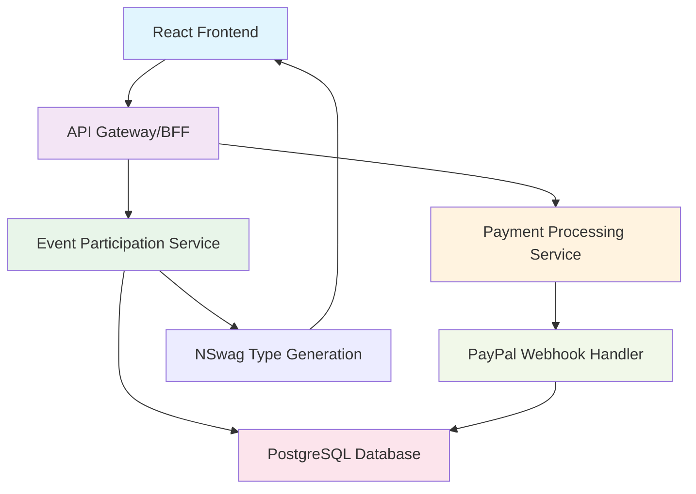

# Functional Specification: RSVP and Ticketing System
<!-- Last Updated: 2025-01-19 -->
<!-- Version: 1.0 -->
<!-- Owner: Business Requirements Agent -->
<!-- Status: Draft -->

## Executive Summary

The RSVP and Ticketing System provides comprehensive event participation management for WitchCityRope, enabling secure registration workflows, payment processing integration, and real-time capacity management. The system implements a dual-path approach where social events support RSVP with optional ticketing, while classes require ticket purchases, all built on the established PayPal webhook infrastructure and NSwag type generation pipeline.

## Architecture Discovery Results

### Documents Reviewed:
- **domain-layer-architecture.md**: Lines 725-997 - NSwag auto-generation pipeline confirmed
- **DTO-ALIGNMENT-STRATEGY.md**: Lines 85-213 - API DTOs as source of truth requirement
- **functional-area-master-index.md**: Lines 24, 35-61 - PayPal webhook integration operational
- **events/business-requirements.md**: Session-based event management with RSVP/ticket distinction

### Existing Architecture Integration:
- Builds on operational PayPal webhook infrastructure
- Uses established NSwag type generation for all DTOs
- Integrates with BFF authentication pattern (httpOnly cookies)
- Leverages session-based event management foundation

## System Architecture Overview

### Technology Stack
- **Frontend**: React 18 + TypeScript + Mantine v7 + TanStack Query v5
- **Backend**: .NET 8 Minimal API + Entity Framework Core + PostgreSQL
- **Type Generation**: NSwag (automated C# DTO → TypeScript interface)
- **Authentication**: BFF pattern with httpOnly cookies + JWT
- **Payment Processing**: PayPal webhooks (operational infrastructure)
- **State Management**: React Query (server state) + Zustand (client state)

### Core Components


## API Contract Specifications

### Core Participation Endpoints

#### GET /api/events/{id}/participation
**Purpose**: Check user's current RSVP/ticket status for specific event
**Authentication**: Required (httpOnly cookie)
**Response**: ParticipationStatusDto

```csharp
// C# DTO (Source of Truth for NSwag)
public class ParticipationStatusDto
{
    public Guid EventId { get; set; }
    public Guid? UserId { get; set; }
    public ParticipationType Type { get; set; } // None, RSVP, Ticket
    public ParticipationStatus Status { get; set; } // Active, Cancelled, Refunded
    public DateTime? ParticipationDate { get; set; }
    public decimal? PaidAmount { get; set; }
    public string? PaymentId { get; set; }
    public bool CanCancel { get; set; }
    public DateTime? RefundDeadline { get; set; }
}
```

#### POST /api/events/{id}/rsvp
**Purpose**: Create RSVP for social event (vetted members only)
**Authentication**: Required (vetted member role check)
**Request Body**: RsvpRequestDto
**Response**: ParticipationDto

```csharp
public class RsvpRequestDto
{
    public Guid EventId { get; set; }
    public string? Notes { get; set; } // Optional attendee notes
}

public class ParticipationDto
{
    public Guid Id { get; set; }
    public Guid EventId { get; set; }
    public Guid UserId { get; set; }
    public ParticipationType Type { get; set; }
    public ParticipationStatus Status { get; set; }
    public DateTime CreatedAt { get; set; }
    public DateTime? CancelledAt { get; set; }
    public decimal? Amount { get; set; }
    public string? PaymentId { get; set; }
    public string? Notes { get; set; }
}
```

#### DELETE /api/events/{id}/rsvp
**Purpose**: Cancel RSVP for social event
**Authentication**: Required (own RSVP only)
**Response**: CancellationResultDto

```csharp
public class CancellationResultDto
{
    public bool Success { get; set; }
    public string Message { get; set; }
    public decimal? RefundAmount { get; set; }
    public string? RefundStatus { get; set; }
}
```

#### POST /api/events/{id}/tickets
**Purpose**: Purchase ticket for event (creates PayPal order)
**Authentication**: Required
**Request Body**: TicketPurchaseRequestDto
**Response**: PayPalOrderDto

```csharp
public class TicketPurchaseRequestDto
{
    public Guid EventId { get; set; }
    public Guid TicketTypeId { get; set; }
    public int Quantity { get; set; } = 1;
    public string ReturnUrl { get; set; }
    public string CancelUrl { get; set; }
}

public class PayPalOrderDto
{
    public string OrderId { get; set; }
    public string ApprovalUrl { get; set; }
    public decimal Amount { get; set; }
    public string Currency { get; set; } = "USD";
    public PayPalOrderStatus Status { get; set; }
}
```

### User Participation Management

#### GET /api/user/participations
**Purpose**: Get user's all RSVPs and tickets
**Authentication**: Required
**Query Parameters**: EventStatus? status, int page = 1, int pageSize = 20
**Response**: PaginatedResult<ParticipationDto>

```csharp
public class PaginatedResult<T>
{
    public List<T> Items { get; set; }
    public int TotalCount { get; set; }
    public int Page { get; set; }
    public int PageSize { get; set; }
    public int TotalPages { get; set; }
    public bool HasNextPage { get; set; }
    public bool HasPreviousPage { get; set; }
}
```

### Admin Participation Management

#### GET /api/admin/events/{id}/participants
**Purpose**: Admin view of all event participants
**Authentication**: Required (Admin/Event Organizer role)
**Response**: EventParticipantsDto

```csharp
public class EventParticipantsDto
{
    public Guid EventId { get; set; }
    public string EventTitle { get; set; }
    public int TotalCapacity { get; set; }
    public int TotalParticipants { get; set; }
    public List<ParticipantDetailDto> Participants { get; set; }
    public List<ParticipantDetailDto> Waitlist { get; set; }
    public ParticipationSummaryDto Summary { get; set; }
}

public class ParticipantDetailDto
{
    public Guid UserId { get; set; }
    public string SceneName { get; set; }
    public string Email { get; set; }
    public ParticipationType Type { get; set; }
    public ParticipationStatus Status { get; set; }
    public DateTime RegisteredAt { get; set; }
    public decimal? AmountPaid { get; set; }
    public bool CheckedIn { get; set; }
    public DateTime? CheckInTime { get; set; }
}

public class ParticipationSummaryDto
{
    public int TotalRSVPs { get; set; }
    public int TotalTicketsSold { get; set; }
    public decimal TotalRevenue { get; set; }
    public int WaitlistCount { get; set; }
    public int CheckedInCount { get; set; }
}
```

## Data Model Definitions

### Core Entities (C# DTOs for NSwag)

#### EventParticipation Entity
```csharp
public class EventParticipation : BaseEntity
{
    public Guid EventId { get; set; }
    public Guid UserId { get; set; }
    public ParticipationType Type { get; set; }
    public ParticipationStatus Status { get; set; }
    public DateTime CreatedAt { get; set; }
    public DateTime? CancelledAt { get; set; }
    public string? CancellationReason { get; set; }
    public string? Notes { get; set; }

    // Navigation Properties
    public Event Event { get; set; }
    public User User { get; set; }
    public TicketPurchase? TicketPurchase { get; set; }
}
```

#### TicketPurchase Entity (Extends Participation)
```csharp
public class TicketPurchase : BaseEntity
{
    public Guid ParticipationId { get; set; }
    public Guid TicketTypeId { get; set; }
    public decimal Amount { get; set; }
    public string PaymentId { get; set; } // PayPal order ID
    public PaymentStatus PaymentStatus { get; set; }
    public DateTime? PaymentDate { get; set; }
    public decimal? RefundAmount { get; set; }
    public DateTime? RefundDate { get; set; }
    public string? RefundReason { get; set; }

    // Navigation Properties
    public EventParticipation Participation { get; set; }
    public TicketType TicketType { get; set; }
}
```

### Enumerations
```csharp
public enum ParticipationType
{
    RSVP = 1,
    Ticket = 2
}

public enum ParticipationStatus
{
    Active = 1,
    Cancelled = 2,
    Refunded = 3,
    Waitlisted = 4
}

public enum PaymentStatus
{
    Pending = 1,
    Completed = 2,
    Failed = 3,
    Refunded = 4,
    PartiallyRefunded = 5
}
```

## Business Logic Implementation

### Core Business Rules Engine

#### RSVP Business Logic
```csharp
public class RsvpBusinessLogic
{
    public async Task<OperationResult<ParticipationDto>> CreateRsvp(
        Guid eventId,
        Guid userId,
        string? notes)
    {
        // 1. Validate user is vetted member
        var user = await _userService.GetByIdAsync(userId);
        if (!user.IsVetted)
            return OperationResult<ParticipationDto>.Failure(
                "Only vetted members can RSVP for social events");

        // 2. Check event allows RSVPs
        var eventEntity = await _eventService.GetByIdAsync(eventId);
        if (eventEntity.Type != EventType.SocialEvent)
            return OperationResult<ParticipationDto>.Failure(
                "RSVP is only available for social events");

        // 3. Check capacity
        var currentParticipants = await _participationService
            .GetActiveParticipantCountAsync(eventId);
        if (currentParticipants >= eventEntity.MaxCapacity)
            return OperationResult<ParticipationDto>.Failure(
                "Event is at capacity");

        // 4. Check for existing participation
        var existing = await _participationService
            .GetByUserAndEventAsync(userId, eventId);
        if (existing != null && existing.Status == ParticipationStatus.Active)
            return OperationResult<ParticipationDto>.Failure(
                "User already has active participation");

        // 5. Create RSVP
        var participation = new EventParticipation
        {
            EventId = eventId,
            UserId = userId,
            Type = ParticipationType.RSVP,
            Status = ParticipationStatus.Active,
            CreatedAt = DateTime.UtcNow,
            Notes = notes
        };

        await _participationService.CreateAsync(participation);

        // 6. Send confirmation email
        await _emailService.SendRsvpConfirmationAsync(participation);

        return OperationResult<ParticipationDto>.Success(
            _mapper.Map<ParticipationDto>(participation));
    }
}
```

#### Ticket Purchase Business Logic
```csharp
public class TicketPurchaseBusinessLogic
{
    public async Task<OperationResult<PayPalOrderDto>> CreateTicketOrder(
        Guid eventId,
        Guid userId,
        Guid ticketTypeId,
        int quantity,
        string returnUrl,
        string cancelUrl)
    {
        // 1. Validate event and ticket type
        var eventEntity = await _eventService.GetByIdAsync(eventId);
        var ticketType = await _ticketTypeService.GetByIdAsync(ticketTypeId);

        if (ticketType.EventId != eventId)
            return OperationResult<PayPalOrderDto>.Failure(
                "Ticket type does not belong to event");

        // 2. Check capacity for all included sessions
        foreach (var sessionId in ticketType.IncludedSessions)
        {
            var sessionCapacity = await _sessionService
                .GetAvailableCapacityAsync(sessionId);
            if (sessionCapacity < quantity)
                return OperationResult<PayPalOrderDto>.Failure(
                    $"Insufficient capacity for session {sessionId}");
        }

        // 3. Check for existing active participation
        var existing = await _participationService
            .GetByUserAndEventAsync(userId, eventId);
        if (existing?.Status == ParticipationStatus.Active)
            return OperationResult<PayPalOrderDto>.Failure(
                "User already has active participation");

        // 4. Calculate total amount
        var totalAmount = ticketType.Price * quantity;

        // 5. Create PayPal order
        var paypalOrder = await _paypalService.CreateOrderAsync(new PayPalOrderRequest
        {
            Amount = totalAmount,
            Currency = "USD",
            Description = $"{eventEntity.Title} - {ticketType.Name}",
            ReturnUrl = returnUrl,
            CancelUrl = cancelUrl,
            Metadata = new Dictionary<string, string>
            {
                ["eventId"] = eventId.ToString(),
                ["userId"] = userId.ToString(),
                ["ticketTypeId"] = ticketTypeId.ToString(),
                ["quantity"] = quantity.ToString()
            }
        });

        // 6. Create pending participation record
        var participation = new EventParticipation
        {
            EventId = eventId,
            UserId = userId,
            Type = ParticipationType.Ticket,
            Status = ParticipationStatus.Active, // Will be confirmed by webhook
            CreatedAt = DateTime.UtcNow
        };

        var ticketPurchase = new TicketPurchase
        {
            ParticipationId = participation.Id,
            TicketTypeId = ticketTypeId,
            Amount = totalAmount,
            PaymentId = paypalOrder.OrderId,
            PaymentStatus = PaymentStatus.Pending
        };

        await _participationService.CreateWithTicketAsync(participation, ticketPurchase);

        return OperationResult<PayPalOrderDto>.Success(new PayPalOrderDto
        {
            OrderId = paypalOrder.OrderId,
            ApprovalUrl = paypalOrder.ApprovalUrl,
            Amount = totalAmount,
            Currency = "USD",
            Status = PayPalOrderStatus.Created
        });
    }
}
```

### PayPal Webhook Integration
```csharp
public class PayPalWebhookHandler
{
    public async Task HandlePaymentCompleted(PayPalWebhookEvent webhookEvent)
    {
        var paymentId = webhookEvent.Resource.Id;
        var ticketPurchase = await _ticketPurchaseService
            .GetByPaymentIdAsync(paymentId);

        if (ticketPurchase == null)
        {
            _logger.LogWarning("Received webhook for unknown payment: {PaymentId}", paymentId);
            return;
        }

        // Update payment status
        ticketPurchase.PaymentStatus = PaymentStatus.Completed;
        ticketPurchase.PaymentDate = DateTime.UtcNow;

        // Confirm participation
        var participation = ticketPurchase.Participation;
        participation.Status = ParticipationStatus.Active;

        await _ticketPurchaseService.UpdateAsync(ticketPurchase);

        // Send confirmation email
        await _emailService.SendTicketConfirmationAsync(participation);

        // Update event capacity tracking
        await _eventCapacityService.UpdateCapacityAsync(participation.EventId);
    }

    public async Task HandlePaymentFailed(PayPalWebhookEvent webhookEvent)
    {
        var paymentId = webhookEvent.Resource.Id;
        var ticketPurchase = await _ticketPurchaseService
            .GetByPaymentIdAsync(paymentId);

        if (ticketPurchase != null)
        {
            ticketPurchase.PaymentStatus = PaymentStatus.Failed;
            var participation = ticketPurchase.Participation;
            participation.Status = ParticipationStatus.Cancelled;
            participation.CancelledAt = DateTime.UtcNow;
            participation.CancellationReason = "Payment failed";

            await _ticketPurchaseService.UpdateAsync(ticketPurchase);
        }
    }
}
```

## Frontend Implementation Architecture

### React Query Integration
```typescript
// Generated from NSwag
import {
    ParticipationStatusDto,
    ParticipationDto,
    TicketPurchaseRequestDto,
    PayPalOrderDto
} from '@witchcityrope/shared-types';

// Event participation hooks
export const useEventParticipation = (eventId: string) => {
    return useQuery({
        queryKey: ['participation', eventId],
        queryFn: () => api.events.getParticipation(eventId),
        staleTime: 30000, // 30 seconds
    });
};

export const useCreateRsvp = () => {
    const queryClient = useQueryClient();

    return useMutation({
        mutationFn: (request: { eventId: string; notes?: string }) =>
            api.events.createRsvp(request.eventId, { notes: request.notes }),
        onSuccess: (data, variables) => {
            // Invalidate participation status
            queryClient.invalidateQueries(['participation', variables.eventId]);
            // Update user participations
            queryClient.invalidateQueries(['user', 'participations']);
        },
    });
};

export const usePurchaseTicket = () => {
    const queryClient = useQueryClient();

    return useMutation({
        mutationFn: (request: TicketPurchaseRequestDto) =>
            api.events.purchaseTicket(request.eventId, request),
        onSuccess: (data, variables) => {
            // Redirect to PayPal
            window.location.href = data.approvalUrl;
        },
    });
};
```

### State Management with Zustand
```typescript
interface ParticipationStore {
    currentParticipation: ParticipationStatusDto | null;
    isLoading: boolean;
    error: string | null;

    // Actions
    setParticipation: (participation: ParticipationStatusDto) => void;
    clearParticipation: () => void;
    setLoading: (loading: boolean) => void;
    setError: (error: string | null) => void;
}

export const useParticipationStore = create<ParticipationStore>((set) => ({
    currentParticipation: null,
    isLoading: false,
    error: null,

    setParticipation: (participation) => set({ currentParticipation: participation }),
    clearParticipation: () => set({ currentParticipation: null }),
    setLoading: (loading) => set({ isLoading: loading }),
    setError: (error) => set({ error }),
}));
```

### Real-Time Capacity Updates
```typescript
// Real-time capacity monitoring
export const useEventCapacity = (eventId: string) => {
    const { data: participation } = useEventParticipation(eventId);

    // Poll for capacity updates every 30 seconds
    const { data: capacity } = useQuery({
        queryKey: ['capacity', eventId],
        queryFn: () => api.events.getCapacity(eventId),
        refetchInterval: 30000,
        enabled: !!participation,
    });

    return {
        current: capacity?.current || 0,
        maximum: capacity?.maximum || 0,
        available: (capacity?.maximum || 0) - (capacity?.current || 0),
        isNearCapacity: capacity ? (capacity.current / capacity.maximum) > 0.8 : false,
        isFull: capacity ? capacity.current >= capacity.maximum : false,
    };
};
```

## Error Handling Patterns

### API Error Response Format
```csharp
public class ApiErrorResponse
{
    public string Message { get; set; }
    public string Code { get; set; }
    public List<ValidationError>? ValidationErrors { get; set; }
    public string? TraceId { get; set; }
}

public class ValidationError
{
    public string Property { get; set; }
    public string Message { get; set; }
}
```

### Frontend Error Handling
```typescript
// Error boundary for participation components
export const ParticipationErrorBoundary: React.FC<{ children: React.ReactNode }> = ({ children }) => {
    return (
        <ErrorBoundary
            FallbackComponent={({ error, resetErrorBoundary }) => (
                <Alert color="red" title="Participation Error">
                    <Text>{error.message}</Text>
                    <Button onClick={resetErrorBoundary} mt="sm">
                        Try Again
                    </Button>
                </Alert>
            )}
            onError={(error) => {
                console.error('Participation error:', error);
                // Send to monitoring service
            }}
        >
            {children}
        </ErrorBoundary>
    );
};

// Error handling in mutations
const createRsvpMutation = useCreateRsvp();

const handleRsvp = async () => {
    try {
        await createRsvpMutation.mutateAsync({ eventId, notes });
        notifications.show({
            title: 'RSVP Confirmed',
            message: 'Your RSVP has been confirmed!',
            color: 'green',
        });
    } catch (error) {
        const apiError = error as ApiError;
        notifications.show({
            title: 'RSVP Failed',
            message: apiError.message || 'Failed to create RSVP',
            color: 'red',
        });
    }
};
```

## Security Considerations

### Authentication & Authorization
- **httpOnly Cookies**: All API calls authenticated via secure cookies
- **Role-Based Access**: RSVP limited to vetted members, admin endpoints protected
- **CSRF Protection**: Anti-forgery tokens for state-changing operations
- **Rate Limiting**: API endpoints rate-limited to prevent abuse

### Payment Security
- **No Card Storage**: Zero credit card data stored in WitchCityRope systems
- **PayPal Integration**: All payment processing through PayPal's secure infrastructure
- **Webhook Validation**: PayPal webhooks validated with signature verification
- **Audit Logging**: All payment actions logged for compliance

### Data Protection
- **Personal Data**: Participant lists restricted to authorized users only
- **Data Retention**: Cancelled participations retained for refund processing
- **Anonymization**: Option for anonymous event participation where appropriate

## Performance Requirements

### API Performance Targets
- **Participation Check**: < 200ms response time
- **RSVP Creation**: < 500ms response time
- **Ticket Purchase**: < 1000ms response time (includes PayPal order creation)
- **Admin Participant List**: < 1000ms for events with up to 200 participants

### Caching Strategy
- **Participation Status**: Cached for 30 seconds
- **Event Capacity**: Real-time polling every 30 seconds
- **User Participations**: Cached until mutation occurs
- **Static Event Data**: Cached for 5 minutes

### Database Optimization
- **Indexes**: Composite indexes on (UserId, EventId, Status)
- **Query Optimization**: Efficient joins for participant lists
- **Connection Pooling**: Managed by Entity Framework Core
- **Read Replicas**: Consider for high-traffic events (future enhancement)

## Monitoring & Observability

### Key Metrics
- **RSVP Success Rate**: Target > 99%
- **Payment Success Rate**: Target > 95%
- **API Response Times**: All endpoints under target times
- **Error Rates**: < 1% for participation operations

### Logging
- **Structured Logging**: JSON format with correlation IDs
- **Payment Auditing**: Comprehensive logging of all payment events
- **Performance Tracking**: Response time and error tracking
- **Business Events**: RSVP/ticket creations, cancellations, refunds

### Alerting
- **Payment Failures**: Immediate alert for payment processing errors
- **Capacity Issues**: Alert when events near capacity
- **API Errors**: Alert on elevated error rates
- **Performance Degradation**: Alert on response time threshold breaches

## Testing Strategy

### Unit Testing
- **Business Logic**: 100% coverage of RSVP and ticket purchase logic
- **Validation**: All DTO validation rules tested
- **Error Scenarios**: Comprehensive error condition testing

### Integration Testing
- **API Endpoints**: Full CRUD operations for all endpoints
- **PayPal Integration**: Mock PayPal webhook testing
- **Database Operations**: Entity Framework Core integration tests
- **Authentication**: BFF authentication flow testing

### End-to-End Testing
- **RSVP Flow**: Complete RSVP creation and cancellation
- **Ticket Purchase Flow**: Full payment process with PayPal sandbox
- **Admin Management**: Participant list management and check-in
- **Capacity Management**: Event capacity enforcement testing

## Deployment Considerations

### Database Migrations
```sql
-- EventParticipation table
CREATE TABLE EventParticipations (
    Id UUID PRIMARY KEY DEFAULT gen_random_uuid(),
    EventId UUID NOT NULL REFERENCES Events(Id),
    UserId UUID NOT NULL REFERENCES Users(Id),
    Type INTEGER NOT NULL, -- 1=RSVP, 2=Ticket
    Status INTEGER NOT NULL, -- 1=Active, 2=Cancelled, 3=Refunded, 4=Waitlisted
    CreatedAt TIMESTAMP WITH TIME ZONE NOT NULL DEFAULT NOW(),
    CancelledAt TIMESTAMP WITH TIME ZONE NULL,
    CancellationReason TEXT NULL,
    Notes TEXT NULL,

    UNIQUE(UserId, EventId) -- One participation per user per event
);

-- TicketPurchases table
CREATE TABLE TicketPurchases (
    Id UUID PRIMARY KEY DEFAULT gen_random_uuid(),
    ParticipationId UUID NOT NULL REFERENCES EventParticipations(Id),
    TicketTypeId UUID NOT NULL REFERENCES TicketTypes(Id),
    Amount DECIMAL(10,2) NOT NULL,
    PaymentId VARCHAR(100) NOT NULL, -- PayPal order ID
    PaymentStatus INTEGER NOT NULL, -- 1=Pending, 2=Completed, 3=Failed, 4=Refunded
    PaymentDate TIMESTAMP WITH TIME ZONE NULL,
    RefundAmount DECIMAL(10,2) NULL,
    RefundDate TIMESTAMP WITH TIME ZONE NULL,
    RefundReason TEXT NULL
);

-- Indexes for performance
CREATE INDEX IX_EventParticipations_EventId ON EventParticipations(EventId);
CREATE INDEX IX_EventParticipations_UserId ON EventParticipations(UserId);
CREATE INDEX IX_EventParticipations_Status ON EventParticipations(Status);
CREATE INDEX IX_TicketPurchases_PaymentId ON TicketPurchases(PaymentId);
```

### Configuration Management
```json
{
  "PayPal": {
    "ClientId": "#{PayPal.ClientId}#",
    "ClientSecret": "#{PayPal.ClientSecret}#",
    "Environment": "#{PayPal.Environment}#", // "sandbox" or "live"
    "WebhookId": "#{PayPal.WebhookId}#"
  },
  "Email": {
    "SendGrid": {
      "ApiKey": "#{SendGrid.ApiKey}#",
      "SandboxMode": "#{SendGrid.SandboxMode}#"
    }
  },
  "Features": {
    "RsvpSystem": true,
    "TicketPurchases": true,
    "RefundProcessing": true
  }
}
```

### Rollout Strategy
1. **Phase 1**: Deploy RSVP functionality for social events
2. **Phase 2**: Deploy ticket purchasing with PayPal integration
3. **Phase 3**: Deploy admin management features
4. **Phase 4**: Deploy advanced features (waitlists, refund automation)

## Future Enhancements

### Planned Features
- **Waitlist Management**: Automatic promotion when capacity opens
- **Refund Automation**: Automatic refunds within refund window
- **Email Templates**: Customizable email templates per event
- **Mobile App**: Native mobile application
- **Analytics Dashboard**: Comprehensive participation analytics

### Technical Debt Items
- **Performance Optimization**: Database query optimization for large events
- **Caching Layer**: Redis implementation for high-traffic scenarios
- **Event Sourcing**: Consider event sourcing for audit trail
- **Microservices**: Potential split into dedicated participation service

---

This functional specification provides a comprehensive technical foundation for implementing the RSVP and Ticketing System, building on WitchCityRope's established architectural patterns and operational PayPal infrastructure while ensuring type safety through NSwag generation and security through the proven BFF authentication pattern.