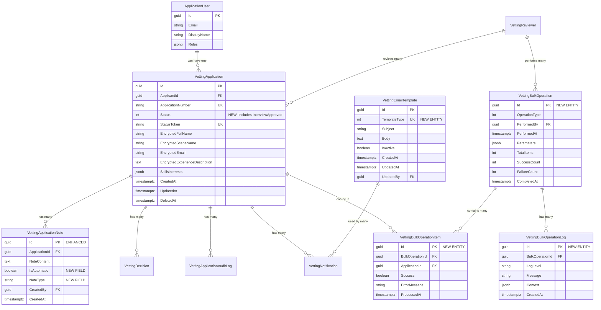

# Database Design: WitchCityRope Vetting System Implementation
<!-- Last Updated: 2025-09-22 -->
<!-- Version: 1.0 -->
<!-- Owner: Database Designer -->
<!-- Status: Complete -->

## Executive Summary

This document provides the complete database schema design for the WitchCityRope Vetting System implementation. Building upon the existing September 13, 2025 entities, this design adds new requirements for email templates, bulk operations, enhanced notes system, and the new "Interview Approved" status workflow while maintaining performance, security, and audit trail standards.

## Current State Analysis

### Existing Schema (September 13, 2025)

The vetting system already has a comprehensive 11-entity database schema with:

**Core Entities**:
- `VettingApplication` - Primary application entity with encrypted PII
- `VettingReference` - Reference system (simplified in new requirements)
- `VettingReferenceResponse` - Reference responses (simplified)
- `VettingReviewer` - Admin reviewer management
- `VettingApplicationNote` - Manual and automatic notes
- `VettingDecision` - Approval/denial decisions
- `VettingApplicationAuditLog` - Status change tracking
- `VettingReferenceAuditLog` - Reference audit trail
- `VettingDecisionAuditLog` - Decision audit trail
- `VettingNotification` - Email notifications
- `VettingNoteAttachment` - File attachments for notes

**Strong Points**:
- Comprehensive audit trail system
- Encrypted PII protection with AES-256-GCM
- PostgreSQL-optimized with JSONB, partial indexes
- Proper foreign key relationships
- UTC timestamp handling

### Gap Analysis

| Component | Current State | Required State | Action |
|-----------|---------------|----------------|--------|
| **Email Templates** | Not implemented | Admin-managed templates storage | **NEW** Add template entities |
| **Bulk Operations** | Not implemented | Operation tracking and history | **NEW** Add bulk operation entities |
| **Application Status** | Missing "Interview Approved" | Enhanced workflow with new status | **MODIFY** Update enum |
| **Notes System** | Basic notes | Enhanced with manual/automatic distinction | **ENHANCE** Existing entity |
| **Single Application Rule** | Not enforced | Database constraint enforcement | **ADD** Unique constraint |

## Enhanced Entity Relationship Diagram



## New Entity Specifications

### 1. VettingEmailTemplate Entity

**Purpose**: Store admin-manageable email templates for vetting notifications

```sql
CREATE TABLE "VettingEmailTemplates" (
    "Id" UUID NOT NULL DEFAULT gen_random_uuid(),
    "TemplateType" INTEGER NOT NULL,
    "Subject" VARCHAR(200) NOT NULL,
    "Body" TEXT NOT NULL,
    "IsActive" BOOLEAN NOT NULL DEFAULT TRUE,
    "LastModified" TIMESTAMPTZ NOT NULL DEFAULT NOW(),
    "CreatedAt" TIMESTAMPTZ NOT NULL DEFAULT NOW(),
    "UpdatedAt" TIMESTAMPTZ NOT NULL DEFAULT NOW(),
    "UpdatedBy" UUID NOT NULL,
    "Version" INTEGER NOT NULL DEFAULT 1,

    CONSTRAINT "PK_VettingEmailTemplates" PRIMARY KEY ("Id"),
    CONSTRAINT "UQ_VettingEmailTemplates_TemplateType" UNIQUE ("TemplateType"),
    CONSTRAINT "FK_VettingEmailTemplates_UpdatedBy"
        FOREIGN KEY ("UpdatedBy") REFERENCES "AspNetUsers"("Id") ON DELETE RESTRICT,
    CONSTRAINT "CHK_VettingEmailTemplates_Subject_Length"
        CHECK (LENGTH("Subject") BETWEEN 5 AND 200),
    CONSTRAINT "CHK_VettingEmailTemplates_Body_Length"
        CHECK (LENGTH("Body") >= 10)
);

-- Performance indexes
CREATE INDEX "IX_VettingEmailTemplates_TemplateType"
    ON "VettingEmailTemplates"("TemplateType");
CREATE INDEX "IX_VettingEmailTemplates_IsActive"
    ON "VettingEmailTemplates"("IsActive") WHERE "IsActive" = TRUE;
CREATE INDEX "IX_VettingEmailTemplates_UpdatedAt"
    ON "VettingEmailTemplates"("UpdatedAt" DESC);
```

**Template Types Enum**:
```sql
-- EmailTemplateType enum values
-- 1 = ApplicationReceived
-- 2 = InterviewApproved (NEW)
-- 3 = ApplicationApproved
-- 4 = ApplicationOnHold
-- 5 = ApplicationDenied
-- 6 = InterviewReminder (NEW)
```

### 2. VettingBulkOperation Entity

**Purpose**: Track bulk administrative operations for audit and performance monitoring

```sql
CREATE TABLE "VettingBulkOperations" (
    "Id" UUID NOT NULL DEFAULT gen_random_uuid(),
    "OperationType" INTEGER NOT NULL,
    "PerformedBy" UUID NOT NULL,
    "PerformedAt" TIMESTAMPTZ NOT NULL DEFAULT NOW(),
    "Parameters" JSONB NOT NULL DEFAULT '{}',
    "TotalItems" INTEGER NOT NULL,
    "SuccessCount" INTEGER NOT NULL DEFAULT 0,
    "FailureCount" INTEGER NOT NULL DEFAULT 0,
    "StartedAt" TIMESTAMPTZ NOT NULL DEFAULT NOW(),
    "CompletedAt" TIMESTAMPTZ NULL,
    "Status" INTEGER NOT NULL DEFAULT 1, -- Running, Completed, Failed
    "ErrorSummary" TEXT NULL,

    CONSTRAINT "PK_VettingBulkOperations" PRIMARY KEY ("Id"),
    CONSTRAINT "FK_VettingBulkOperations_PerformedBy"
        FOREIGN KEY ("PerformedBy") REFERENCES "AspNetUsers"("Id") ON DELETE RESTRICT,
    CONSTRAINT "CHK_VettingBulkOperations_TotalItems"
        CHECK ("TotalItems" > 0),
    CONSTRAINT "CHK_VettingBulkOperations_Counts"
        CHECK ("SuccessCount" + "FailureCount" <= "TotalItems")
);

-- Performance indexes
CREATE INDEX "IX_VettingBulkOperations_PerformedBy_PerformedAt"
    ON "VettingBulkOperations"("PerformedBy", "PerformedAt" DESC);
CREATE INDEX "IX_VettingBulkOperations_OperationType_PerformedAt"
    ON "VettingBulkOperations"("OperationType", "PerformedAt" DESC);
CREATE INDEX "IX_VettingBulkOperations_Status"
    ON "VettingBulkOperations"("Status") WHERE "Status" = 1; -- Running operations only

-- GIN index for JSONB parameters
CREATE INDEX "IX_VettingBulkOperations_Parameters"
    ON "VettingBulkOperations" USING GIN ("Parameters");
```

**Bulk Operation Types Enum**:
```sql
-- BulkOperationType enum values
-- 1 = SendReminderEmails
-- 2 = ChangeStatusToOnHold
-- 3 = AssignReviewer (future)
-- 4 = ExportApplications (future)
```

### 3. VettingBulkOperationItem Entity

**Purpose**: Track individual application processing within bulk operations

```sql
CREATE TABLE "VettingBulkOperationItems" (
    "Id" UUID NOT NULL DEFAULT gen_random_uuid(),
    "BulkOperationId" UUID NOT NULL,
    "ApplicationId" UUID NOT NULL,
    "Success" BOOLEAN NOT NULL DEFAULT FALSE,
    "ErrorMessage" TEXT NULL,
    "ProcessedAt" TIMESTAMPTZ NULL,
    "AttemptCount" INTEGER NOT NULL DEFAULT 1,
    "RetryAt" TIMESTAMPTZ NULL,

    CONSTRAINT "PK_VettingBulkOperationItems" PRIMARY KEY ("Id"),
    CONSTRAINT "FK_VettingBulkOperationItems_BulkOperation"
        FOREIGN KEY ("BulkOperationId") REFERENCES "VettingBulkOperations"("Id") ON DELETE CASCADE,
    CONSTRAINT "FK_VettingBulkOperationItems_Application"
        FOREIGN KEY ("ApplicationId") REFERENCES "VettingApplications"("Id") ON DELETE CASCADE,
    CONSTRAINT "UQ_VettingBulkOperationItems_Operation_Application"
        UNIQUE ("BulkOperationId", "ApplicationId")
);

-- Performance indexes
CREATE INDEX "IX_VettingBulkOperationItems_BulkOperationId"
    ON "VettingBulkOperationItems"("BulkOperationId");
CREATE INDEX "IX_VettingBulkOperationItems_ApplicationId"
    ON "VettingBulkOperationItems"("ApplicationId");
CREATE INDEX "IX_VettingBulkOperationItems_Success_ProcessedAt"
    ON "VettingBulkOperationItems"("Success", "ProcessedAt");
CREATE INDEX "IX_VettingBulkOperationItems_RetryAt"
    ON "VettingBulkOperationItems"("RetryAt") WHERE "RetryAt" IS NOT NULL;
```

### 4. VettingBulkOperationLog Entity

**Purpose**: Detailed logging for bulk operation debugging and monitoring

```sql
CREATE TABLE "VettingBulkOperationLogs" (
    "Id" UUID NOT NULL DEFAULT gen_random_uuid(),
    "BulkOperationId" UUID NOT NULL,
    "LogLevel" VARCHAR(20) NOT NULL,
    "Message" TEXT NOT NULL,
    "Context" JSONB NOT NULL DEFAULT '{}',
    "CreatedAt" TIMESTAMPTZ NOT NULL DEFAULT NOW(),
    "ApplicationId" UUID NULL, -- Optional reference to specific application

    CONSTRAINT "PK_VettingBulkOperationLogs" PRIMARY KEY ("Id"),
    CONSTRAINT "FK_VettingBulkOperationLogs_BulkOperation"
        FOREIGN KEY ("BulkOperationId") REFERENCES "VettingBulkOperations"("Id") ON DELETE CASCADE,
    CONSTRAINT "FK_VettingBulkOperationLogs_Application"
        FOREIGN KEY ("ApplicationId") REFERENCES "VettingApplications"("Id") ON DELETE CASCADE,
    CONSTRAINT "CHK_VettingBulkOperationLogs_LogLevel"
        CHECK ("LogLevel" IN ('Debug', 'Info', 'Warning', 'Error', 'Critical'))
);

-- Performance indexes
CREATE INDEX "IX_VettingBulkOperationLogs_BulkOperationId_CreatedAt"
    ON "VettingBulkOperationLogs"("BulkOperationId", "CreatedAt" DESC);
CREATE INDEX "IX_VettingBulkOperationLogs_LogLevel"
    ON "VettingBulkOperationLogs"("LogLevel") WHERE "LogLevel" IN ('Error', 'Critical');

-- GIN index for JSONB context
CREATE INDEX "IX_VettingBulkOperationLogs_Context"
    ON "VettingBulkOperationLogs" USING GIN ("Context");
```

## Enhanced Existing Entities

### 1. VettingApplication Status Enhancement

**New Status**: Add "Interview Approved" to existing ApplicationStatus enum

```sql
-- Update existing ApplicationStatus enum to include:
-- 1 = Draft
-- 2 = Submitted
-- 3 = UnderReview
-- 4 = PendingReferences
-- 5 = InterviewApproved (NEW)
-- 6 = PendingInterview (renamed to InterviewScheduled)
-- 7 = PendingAdditionalInfo
-- 8 = Approved
-- 9 = Denied
-- 10 = Withdrawn
-- 11 = Expired
-- 12 = OnHold (NEW)
```

**Single Application Constraint**:
```sql
-- Add unique constraint to enforce one application per user
ALTER TABLE "VettingApplications"
ADD CONSTRAINT "UQ_VettingApplications_ApplicantId_Active"
UNIQUE ("ApplicantId")
WHERE "DeletedAt" IS NULL;
```

### 2. VettingApplicationNote Enhancement

**New Fields**: Add distinction between manual and automatic notes

```sql
-- Add new columns to existing VettingApplicationNote table
ALTER TABLE "VettingApplicationNotes"
ADD COLUMN "IsAutomatic" BOOLEAN NOT NULL DEFAULT FALSE;

ALTER TABLE "VettingApplicationNotes"
ADD COLUMN "NoteType" VARCHAR(50) NOT NULL DEFAULT 'Manual';

-- Add check constraint for note types
ALTER TABLE "VettingApplicationNotes"
ADD CONSTRAINT "CHK_VettingApplicationNotes_NoteType"
CHECK ("NoteType" IN ('Manual', 'StatusChange', 'BulkOperation', 'System', 'EmailSent', 'EmailFailed'));

-- Add index for note type queries
CREATE INDEX "IX_VettingApplicationNotes_NoteType"
    ON "VettingApplicationNotes"("NoteType");
CREATE INDEX "IX_VettingApplicationNotes_IsAutomatic"
    ON "VettingApplicationNotes"("IsAutomatic");
```

## Entity Framework Core Configurations

### 1. VettingEmailTemplateConfiguration

```csharp
public class VettingEmailTemplateConfiguration : IEntityTypeConfiguration<VettingEmailTemplate>
{
    public void Configure(EntityTypeBuilder<VettingEmailTemplate> builder)
    {
        // Table mapping
        builder.ToTable("VettingEmailTemplates", "public");
        builder.HasKey(e => e.Id);

        // Properties
        builder.Property(e => e.Id)
               .ValueGeneratedNever(); // Simple property per lessons learned

        builder.Property(e => e.TemplateType)
               .IsRequired()
               .HasConversion<int>();

        builder.Property(e => e.Subject)
               .IsRequired()
               .HasMaxLength(200);

        builder.Property(e => e.Body)
               .IsRequired()
               .HasColumnType("text");

        builder.Property(e => e.IsActive)
               .IsRequired()
               .HasDefaultValue(true);

        // DateTime properties - CRITICAL: Use timestamptz for PostgreSQL
        builder.Property(e => e.CreatedAt)
               .IsRequired()
               .HasColumnType("timestamptz");

        builder.Property(e => e.UpdatedAt)
               .IsRequired()
               .HasColumnType("timestamptz");

        builder.Property(e => e.LastModified)
               .IsRequired()
               .HasColumnType("timestamptz");

        builder.Property(e => e.Version)
               .IsRequired()
               .HasDefaultValue(1);

        // Indexes
        builder.HasIndex(e => e.TemplateType)
               .IsUnique()
               .HasDatabaseName("UQ_VettingEmailTemplates_TemplateType");

        builder.HasIndex(e => e.IsActive)
               .HasDatabaseName("IX_VettingEmailTemplates_IsActive")
               .HasFilter("\"IsActive\" = TRUE");

        builder.HasIndex(e => e.UpdatedAt)
               .HasDatabaseName("IX_VettingEmailTemplates_UpdatedAt");

        // Relationships
        builder.HasOne(e => e.UpdatedByUser)
               .WithMany()
               .HasForeignKey(e => e.UpdatedBy)
               .OnDelete(DeleteBehavior.Restrict);

        // Check constraints
        builder.ToTable("VettingEmailTemplates", t => t.HasCheckConstraint(
            "CHK_VettingEmailTemplates_Subject_Length",
            "LENGTH(\"Subject\") BETWEEN 5 AND 200"
        ));

        builder.ToTable("VettingEmailTemplates", t => t.HasCheckConstraint(
            "CHK_VettingEmailTemplates_Body_Length",
            "LENGTH(\"Body\") >= 10"
        ));
    }
}
```

### 2. VettingBulkOperationConfiguration

```csharp
public class VettingBulkOperationConfiguration : IEntityTypeConfiguration<VettingBulkOperation>
{
    public void Configure(EntityTypeBuilder<VettingBulkOperation> builder)
    {
        // Table mapping
        builder.ToTable("VettingBulkOperations", "public");
        builder.HasKey(e => e.Id);

        // Properties
        builder.Property(e => e.Id)
               .ValueGeneratedNever(); // Simple property per lessons learned

        builder.Property(e => e.OperationType)
               .IsRequired()
               .HasConversion<int>();

        builder.Property(e => e.Status)
               .IsRequired()
               .HasConversion<int>()
               .HasDefaultValue(1); // Running

        // JSONB for flexible parameters - using PostgreSQL JSONB
        builder.Property(e => e.Parameters)
               .IsRequired()
               .HasColumnType("jsonb")
               .HasDefaultValue("{}");

        builder.Property(e => e.TotalItems)
               .IsRequired();

        builder.Property(e => e.SuccessCount)
               .IsRequired()
               .HasDefaultValue(0);

        builder.Property(e => e.FailureCount)
               .IsRequired()
               .HasDefaultValue(0);

        builder.Property(e => e.ErrorSummary)
               .HasColumnType("text");

        // DateTime properties - CRITICAL: Use timestamptz for PostgreSQL
        builder.Property(e => e.PerformedAt)
               .IsRequired()
               .HasColumnType("timestamptz");

        builder.Property(e => e.StartedAt)
               .IsRequired()
               .HasColumnType("timestamptz");

        builder.Property(e => e.CompletedAt)
               .HasColumnType("timestamptz");

        // Indexes
        builder.HasIndex(e => new { e.PerformedBy, e.PerformedAt })
               .HasDatabaseName("IX_VettingBulkOperations_PerformedBy_PerformedAt");

        builder.HasIndex(e => new { e.OperationType, e.PerformedAt })
               .HasDatabaseName("IX_VettingBulkOperations_OperationType_PerformedAt");

        builder.HasIndex(e => e.Status)
               .HasDatabaseName("IX_VettingBulkOperations_Status")
               .HasFilter("\"Status\" = 1"); // Running operations only

        // GIN index for JSONB parameters
        builder.HasIndex(e => e.Parameters)
               .HasDatabaseName("IX_VettingBulkOperations_Parameters")
               .HasMethod("gin");

        // Relationships
        builder.HasOne(e => e.PerformedByUser)
               .WithMany()
               .HasForeignKey(e => e.PerformedBy)
               .OnDelete(DeleteBehavior.Restrict);

        builder.HasMany(e => e.Items)
               .WithOne(i => i.BulkOperation)
               .HasForeignKey(i => i.BulkOperationId)
               .OnDelete(DeleteBehavior.Cascade);

        builder.HasMany(e => e.Logs)
               .WithOne(l => l.BulkOperation)
               .HasForeignKey(l => l.BulkOperationId)
               .OnDelete(DeleteBehavior.Cascade);

        // Check constraints
        builder.ToTable("VettingBulkOperations", t => t.HasCheckConstraint(
            "CHK_VettingBulkOperations_TotalItems",
            "\"TotalItems\" > 0"
        ));

        builder.ToTable("VettingBulkOperations", t => t.HasCheckConstraint(
            "CHK_VettingBulkOperations_Counts",
            "\"SuccessCount\" + \"FailureCount\" <= \"TotalItems\""
        ));
    }
}
```

### 3. Enhanced VettingApplicationNoteConfiguration

```csharp
public class VettingApplicationNoteConfiguration : IEntityTypeConfiguration<VettingApplicationNote>
{
    public void Configure(EntityTypeBuilder<VettingApplicationNote> builder)
    {
        // Existing configuration...

        // New properties for enhanced notes system
        builder.Property(e => e.IsAutomatic)
               .IsRequired()
               .HasDefaultValue(false);

        builder.Property(e => e.NoteType)
               .IsRequired()
               .HasMaxLength(50)
               .HasDefaultValue("Manual");

        // New indexes for enhanced functionality
        builder.HasIndex(e => e.NoteType)
               .HasDatabaseName("IX_VettingApplicationNotes_NoteType");

        builder.HasIndex(e => e.IsAutomatic)
               .HasDatabaseName("IX_VettingApplicationNotes_IsAutomatic");

        builder.HasIndex(e => new { e.ApplicationId, e.IsAutomatic, e.CreatedAt })
               .HasDatabaseName("IX_VettingApplicationNotes_Application_Automatic_Created");

        // Check constraint for note types
        builder.ToTable("VettingApplicationNotes", t => t.HasCheckConstraint(
            "CHK_VettingApplicationNotes_NoteType",
            "\"NoteType\" IN ('Manual', 'StatusChange', 'BulkOperation', 'System', 'EmailSent', 'EmailFailed')"
        ));
    }
}
```

## Performance Optimization Strategy

### 1. Index Strategy

**Bulk Operation Queries**:
```sql
-- Efficient bulk operation history queries
CREATE INDEX "IX_VettingBulkOperations_Admin_Dashboard"
    ON "VettingBulkOperations"("PerformedAt" DESC, "OperationType", "Status")
    WHERE "Status" IN (2, 3); -- Completed or Failed only

-- Application eligibility for bulk operations
CREATE INDEX "IX_VettingApplications_Bulk_Eligibility"
    ON "VettingApplications"("Status", "UpdatedAt")
    WHERE "DeletedAt" IS NULL AND "Status" IN (5, 6); -- InterviewApproved, InterviewScheduled
```

**Email Template Queries**:
```sql
-- Active template retrieval
CREATE INDEX "IX_VettingEmailTemplates_Active_Type"
    ON "VettingEmailTemplates"("TemplateType")
    WHERE "IsActive" = TRUE;
```

**Enhanced Application Grid Queries**:
```sql
-- Admin grid with enhanced filtering
CREATE INDEX "IX_VettingApplications_Admin_Grid"
    ON "VettingApplications"("Status", "Priority", "CreatedAt" DESC, "UpdatedAt" DESC)
    WHERE "DeletedAt" IS NULL;

-- Search optimization for encrypted fields (by application number)
CREATE INDEX "IX_VettingApplications_Search"
    ON "VettingApplications"("ApplicationNumber", "CreatedAt" DESC)
    WHERE "DeletedAt" IS NULL;
```

### 2. Query Optimization Patterns

**Bulk Operation Performance**:
```sql
-- Efficient bulk reminder candidate selection
SELECT a."Id", a."EncryptedEmail", a."UpdatedAt"
FROM "VettingApplications" a
LEFT JOIN "VettingBulkOperationItems" bi ON a."Id" = bi."ApplicationId"
LEFT JOIN "VettingBulkOperations" bo ON bi."BulkOperationId" = bo."Id"
    AND bo."OperationType" = 1 -- SendReminderEmails
    AND bo."PerformedAt" > NOW() - INTERVAL '7 days'
WHERE a."Status" = 5 -- InterviewApproved
    AND a."UpdatedAt" < NOW() - INTERVAL '7 days'
    AND a."DeletedAt" IS NULL
    AND bo."Id" IS NULL; -- No recent reminder sent
```

**Template Management Performance**:
```sql
-- Efficient template retrieval with caching
SELECT "TemplateType", "Subject", "Body", "Version"
FROM "VettingEmailTemplates"
WHERE "IsActive" = TRUE
ORDER BY "TemplateType";
```

### 3. Materialized Views for Reporting

**Application Statistics View**:
```sql
CREATE MATERIALIZED VIEW "VettingApplicationStats" AS
SELECT
    DATE_TRUNC('day', "CreatedAt") as "Date",
    "Status",
    COUNT(*) as "ApplicationCount",
    AVG(EXTRACT(DAYS FROM (COALESCE("DecisionMadeAt", NOW()) - "CreatedAt"))) as "AvgProcessingDays"
FROM "VettingApplications"
WHERE "DeletedAt" IS NULL
GROUP BY DATE_TRUNC('day', "CreatedAt"), "Status";

CREATE UNIQUE INDEX "UQ_VettingApplicationStats_Date_Status"
    ON "VettingApplicationStats"("Date", "Status");

-- Refresh strategy (daily via background job)
-- REFRESH MATERIALIZED VIEW CONCURRENTLY "VettingApplicationStats";
```

## Migration Strategy

### 1. Schema Migration Phases

**Phase 1: Core Schema Updates**
```sql
-- Add new email template table
-- Add bulk operation tables
-- Add enhanced note fields
-- Add new status values
-- Add single application constraint
```

**Phase 2: Index Creation**
```sql
-- Create performance indexes
-- Create partial indexes for sparse data
-- Create GIN indexes for JSONB fields
-- Create composite indexes for common queries
```

**Phase 3: Data Migration**
```sql
-- Seed default email templates
-- Update existing notes with IsAutomatic = false
-- Set default NoteType = 'Manual' for existing notes
-- Create initial audit entries for template creation
```

**Phase 4: Constraint Application**
```sql
-- Apply check constraints
-- Apply foreign key constraints
-- Apply unique constraints
-- Validate data integrity
```

### 2. Seed Data Requirements

**Default Email Templates**:
```sql
INSERT INTO "VettingEmailTemplates" ("Id", "TemplateType", "Subject", "Body", "UpdatedBy") VALUES
(gen_random_uuid(), 1, 'Application Received - {{applicant_name}}',
 'Dear {{applicant_name}},\n\nWe have received your vetting application...',
 'system-seed-user-id'),
(gen_random_uuid(), 2, 'Interview Approved - {{applicant_name}}',
 'Dear {{applicant_name}},\n\nYour application has been approved for interview...',
 'system-seed-user-id'),
-- Additional templates...
```

**Configuration Settings**:
```sql
-- Default bulk operation thresholds could be stored in app settings
-- Or in a separate configuration table if database-driven config is preferred
```

### 3. Rollback Strategy

**Rollback Procedures**:
1. **Drop new tables** in reverse order (logs → items → operations → templates)
2. **Remove new columns** from enhanced entities
3. **Remove new constraints** and indexes
4. **Restore original enum values** for ApplicationStatus
5. **Validate original functionality** is intact

**Data Preservation**:
- All rollback operations preserve existing application data
- New features can be disabled via feature flags without data loss
- Audit trails for migration operations maintained

## Security Considerations

### 1. Data Protection

**PII Encryption Continuation**:
- All existing PII encryption patterns maintained
- New template data does NOT contain PII (only template text)
- Bulk operation logs may contain application IDs but no PII
- Email template variables replaced at send time, not storage time

**Access Control**:
```sql
-- Row Level Security could be added for multi-tenant scenarios
-- Currently using application-level role-based access control

-- Example RLS for future consideration:
-- ALTER TABLE "VettingEmailTemplates" ENABLE ROW LEVEL SECURITY;
-- CREATE POLICY "VettingEmailTemplates_Admin_Only" ON "VettingEmailTemplates"
--     FOR ALL TO application_user
--     USING (current_setting('app.user_role') = 'Admin');
```

### 2. Audit Trail Enhancement

**Comprehensive Logging**:
- All bulk operations fully audited with before/after states
- Email template changes tracked with versions
- Enhanced note system tracks automatic vs manual entries
- Performance monitoring without exposing sensitive data

**Data Retention**:
```sql
-- Bulk operation logs retention policy
-- Consider partitioning by date for large-scale operations
CREATE TABLE "VettingBulkOperationLogs_2025_Q4"
    PARTITION OF "VettingBulkOperationLogs"
    FOR VALUES FROM ('2025-10-01') TO ('2026-01-01');
```

## Monitoring and Maintenance

### 1. Health Checks

**Database Health Monitoring**:
```sql
-- Check for stuck bulk operations
SELECT COUNT(*) as "StuckOperations"
FROM "VettingBulkOperations"
WHERE "Status" = 1 -- Running
    AND "StartedAt" < NOW() - INTERVAL '1 hour';

-- Check template availability
SELECT COUNT(*) as "ActiveTemplates"
FROM "VettingEmailTemplates"
WHERE "IsActive" = TRUE;

-- Check application processing backlog
SELECT COUNT(*) as "PendingApplications"
FROM "VettingApplications"
WHERE "Status" IN (2, 3) -- Submitted, UnderReview
    AND "DeletedAt" IS NULL
    AND "CreatedAt" < NOW() - INTERVAL '7 days';
```

### 2. Performance Monitoring

**Key Metrics**:
- Bulk operation execution times
- Email template rendering performance
- Application grid query performance
- Database connection pool utilization

**Optimization Triggers**:
- Bulk operations taking >10 minutes for 100 items
- Template queries taking >500ms
- Application grid taking >2 seconds to load
- Index usage below 80% for critical queries

### 3. Maintenance Procedures

**Regular Maintenance**:
```sql
-- Vacuum and analyze for JSONB performance
VACUUM ANALYZE "VettingBulkOperations";
VACUUM ANALYZE "VettingApplications";

-- Update statistics for query planner
ANALYZE "VettingEmailTemplates";
ANALYZE "VettingBulkOperationItems";

-- Check index usage efficiency
SELECT schemaname, tablename, attname, n_distinct, correlation
FROM pg_stats
WHERE tablename LIKE 'Vetting%'
ORDER BY tablename, attname;
```

## Integration Points

### 1. Existing Systems Integration

**Authentication System**:
- Foreign keys to AspNetUsers maintained
- Role-based access control leveraged
- No changes to existing authentication patterns

**Audit System**:
- Builds upon existing VettingApplicationAuditLog pattern
- Extends audit trails to bulk operations
- Maintains existing audit data integrity

**Email System**:
- Integrates with existing SendGrid configuration
- Template storage in database (not SendGrid)
- Leverages existing email service patterns

### 2. Future Extension Points

**Scalability Considerations**:
- Bulk operation framework supports new operation types
- Email template system supports additional template types
- Audit system scales to high-volume operations
- Index strategy supports larger datasets

**API Extension Points**:
- Bulk operation status API for real-time progress
- Template preview API for admin testing
- Enhanced search API with full-text capabilities
- Reporting API for analytics dashboard

## Conclusion

This database design provides a comprehensive foundation for the WitchCityRope Vetting System implementation while maintaining:

**Performance Excellence**:
- Strategic indexing for all query patterns
- JSONB optimization for flexible data
- Bulk operation efficiency at scale
- Real-time UI support with caching

**Security Standards**:
- Continued PII encryption protection
- Comprehensive audit trails
- Role-based access control
- Data retention compliance

**Maintainability**:
- Clear entity relationships
- Consistent naming conventions
- PostgreSQL best practices
- Migration safety procedures

**Extensibility**:
- Framework for future bulk operations
- Template system supporting new types
- Audit system scaling to enterprise needs
- Integration points for additional features

The design builds strategically upon the existing September 13, 2025 implementation while adding the critical capabilities identified in the business requirements and functional specification, positioning the system for long-term success and growth.

---

## Handoff Checklist

**✅ Entity Definitions**: All 11 existing + 4 new entities specified with relationships
**✅ Schema Updates**: Comprehensive DDL for new tables and enhanced existing tables
**✅ EF Core Configurations**: Complete C# configuration classes following WitchCityRope patterns
**✅ Performance Indexes**: Strategic indexing for all anticipated query patterns
**✅ Migration Strategy**: Phased approach with rollback procedures
**✅ Security Compliance**: PII protection, audit trails, and access control maintained
**✅ Integration Points**: Clear interfaces with existing authentication and email systems
**✅ Monitoring Strategy**: Health checks, performance metrics, and maintenance procedures

**Ready for Implementation**: Backend developers can proceed with Entity Framework Core model implementation and migration creation.