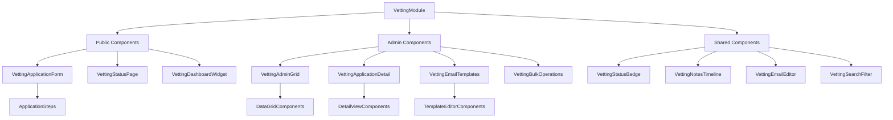

# Technical Architecture: WitchCityRope Vetting System React Implementation
<!-- Last Updated: 2025-09-22 -->
<!-- Version: 1.0 -->
<!-- Owner: React Developer -->
<!-- Status: Complete -->

## Executive Summary

This technical architecture document provides the complete React frontend implementation strategy for the WitchCityRope Vetting System. Building upon the approved functional specification, UI mockups, and database design, this document details the React component architecture, state management patterns, API integration layer, and implementation phases following established WitchCityRope conventions.

## Document Scope

**Primary Focus**: React + TypeScript frontend implementation
**Technology Stack**: React 18, TypeScript 5+, Mantine v7, TanStack Query v5, Zustand, React Router v7
**Architecture Pattern**: Feature-based organization with clean separation of concerns
**Integration Points**: NSwag-generated types, SendGrid email service, PostgreSQL database

## 1. React Component Architecture

### 1.1 Component Hierarchy Overview



### 1.2 Core Component Specifications

#### VettingApplicationForm Component

**Location**: `/apps/web/src/features/vetting/components/VettingApplicationForm.tsx`

**Purpose**: Complete application form with enhanced workflow based on functional specification

**Props Interface**:
```typescript
interface VettingApplicationFormProps {
  onSubmitSuccess?: (applicationId: string, statusUrl: string) => void;
  onSubmitError?: (error: Error) => void;
  className?: string;
}
```

**Key Enhancements from Current Implementation**:
- Single-session form (remove auto-save draft functionality per spec)
- Simplified reference system (per mockups)
- Pre-populated email from authenticated user
- Enhanced validation with Zod schema matching API DTOs
- Immediate email confirmation on submission

**State Management Pattern**:
```typescript
const VettingApplicationForm: React.FC<VettingApplicationFormProps> = ({
  onSubmitSuccess,
  onSubmitError
}) => {
  // Form state using Mantine useForm + Zod validation
  const form = useForm({
    resolver: zodResolver(vettingApplicationSchema),
    defaultValues: {
      realName: '',
      sceneName: '',
      email: '', // Pre-filled from auth context
      // ... other fields per functional spec
    }
  });

  // Server state with TanStack Query
  const submitMutation = useMutation({
    mutationFn: vettingService.submitApplication,
    onSuccess: (result) => {
      onSubmitSuccess?.(result.applicationId, result.statusUrl);
    },
    onError: (error) => {
      onSubmitError?.(error);
    }
  });

  // Component implementation...
};
```

#### VettingAdminGrid Component

**Location**: `/apps/web/src/features/vetting/components/VettingAdminGrid.tsx`

**Purpose**: Admin interface for reviewing applications with bulk operations

**Props Interface**:
```typescript
interface VettingAdminGridProps {
  onApplicationSelect?: (applicationId: string) => void;
  defaultFilters?: VettingGridFilters;
  className?: string;
}
```

**Enhanced Features**:
- Bulk selection with always-visible operations bar (per mockups)
- Real-time status updates via TanStack Query
- Advanced filtering with URL state synchronization
- Sortable columns with PostgreSQL optimization
- Responsive design matching events admin styling

**State Management Pattern**:
```typescript
const VettingAdminGrid: React.FC<VettingAdminGridProps> = ({
  onApplicationSelect
}) => {
  // Server state with intelligent caching
  const { data: applications, isLoading, refetch } = useQuery({
    queryKey: ['vetting', 'applications', filters],
    queryFn: () => vettingService.getApplications(filters),
    staleTime: 2 * 60 * 1000, // 2 minutes for admin data
    refetchOnWindowFocus: true,
  });

  // Bulk selection state
  const [selectedIds, setSelectedIds] = useState<Set<string>>(new Set());

  // URL-synchronized filter state
  const [searchParams, setSearchParams] = useSearchParams();
  const filters = useMemo(() =>
    parseFiltersFromParams(searchParams), [searchParams]);

  // Component implementation...
};
```

#### VettingApplicationDetail Component

**Location**: `/apps/web/src/features/vetting/components/VettingApplicationDetail.tsx`

**Purpose**: Detailed application view with status management and notes

**Props Interface**:
```typescript
interface VettingApplicationDetailProps {
  applicationId: string;
  onStatusChange?: (newStatus: VettingStatus, applicationId: string) => void;
  onNotesAdd?: (note: string, applicationId: string) => void;
  className?: string;
}
```

**Advanced Features**:
- Context-sensitive action buttons based on current status
- Real-time notes timeline with automatic/manual distinction
- Status transition validation (per database design)
- Audit trail display with enhanced filtering

**State Management Pattern**:
```typescript
const VettingApplicationDetail: React.FC<VettingApplicationDetailProps> = ({
  applicationId
}) => {
  // Application data with real-time updates
  const { data: application, isLoading } = useQuery({
    queryKey: ['vetting', 'application', applicationId],
    queryFn: () => vettingService.getApplication(applicationId),
    refetchInterval: 30000, // Refresh every 30 seconds
  });

  // Status change mutations
  const statusMutation = useMutation({
    mutationFn: vettingService.updateApplicationStatus,
    onSuccess: () => {
      queryClient.invalidateQueries(['vetting', 'applications']);
      queryClient.invalidateQueries(['vetting', 'application', applicationId]);
    }
  });

  // Notes addition mutation
  const notesMutation = useMutation({
    mutationFn: vettingService.addApplicationNote,
    onSuccess: () => {
      queryClient.invalidateQueries(['vetting', 'application', applicationId]);
    }
  });

  // Component implementation...
};
```

#### VettingEmailTemplates Component

**Location**: `/apps/web/src/features/vetting/components/VettingEmailTemplates.tsx`

**Purpose**: Admin interface for managing email templates

**Props Interface**:
```typescript
interface VettingEmailTemplatesProps {
  onTemplateUpdate?: (templateType: EmailTemplateType) => void;
  defaultTemplate?: EmailTemplateType;
  className?: string;
}
```

**Advanced Features**:
- Rich text editor with variable insertion dropdown
- Template preview functionality with sample data
- Auto-save drafts to localStorage with unsaved changes warning
- Version control and rollback capabilities

#### VettingBulkOperations Component

**Location**: `/apps/web/src/features/vetting/components/VettingBulkOperations.tsx`

**Purpose**: Modal dialogs for bulk administrative operations

**Props Interface**:
```typescript
interface VettingBulkOperationsProps {
  selectedApplicationIds: string[];
  operationType: 'reminder' | 'status-change';
  isOpen: boolean;
  onClose: () => void;
  onComplete?: (results: BulkOperationResult) => void;
}
```

**Advanced Features**:
- Real-time progress tracking for long operations
- Configurable time thresholds with validation
- Detailed results summary with partial success handling
- Error reporting with retry capabilities

### 1.3 Shared Component Library

#### VettingStatusBadge Component

**Location**: `/apps/web/src/features/vetting/components/shared/VettingStatusBadge.tsx`

```typescript
interface VettingStatusBadgeProps {
  status: VettingStatus;
  size?: 'xs' | 'sm' | 'md' | 'lg';
  variant?: 'light' | 'filled' | 'outline';
  showIcon?: boolean;
}

const VettingStatusBadge: React.FC<VettingStatusBadgeProps> = ({
  status,
  size = 'sm',
  variant = 'light',
  showIcon = false
}) => {
  const config = VETTING_STATUS_CONFIGS[status];

  return (
    <Badge
      color={config.color}
      variant={variant}
      size={size}
      leftSection={showIcon ? <config.icon size={12} /> : undefined}
    >
      {config.label}
    </Badge>
  );
};
```

#### VettingNotesTimeline Component

**Location**: `/apps/web/src/features/vetting/components/shared/VettingNotesTimeline.tsx`

```typescript
interface VettingNotesTimelineProps {
  applicationId: string;
  showAddNote?: boolean;
  onNoteAdd?: (note: string) => void;
  maxHeight?: number;
}

const VettingNotesTimeline: React.FC<VettingNotesTimelineProps> = ({
  applicationId,
  showAddNote = true
}) => {
  const { data: notes } = useQuery({
    queryKey: ['vetting', 'notes', applicationId],
    queryFn: () => vettingService.getApplicationNotes(applicationId),
  });

  return (
    <Timeline bulletSize={16} lineWidth={2}>
      {showAddNote && <AddNoteForm onSubmit={handleNoteAdd} />}
      {notes?.map((note) => (
        <Timeline.Item
          key={note.id}
          bullet={note.isAutomatic ? <IconRobot size={12} /> : <IconUser size={12} />}
          title={formatNoteTitle(note)}
        >
          <Text size="sm">{note.content}</Text>
          <Text size="xs" c="dimmed">{formatTimestamp(note.createdAt)}</Text>
        </Timeline.Item>
      ))}
    </Timeline>
  );
};
```

## 2. File Structure Organization

### 2.1 Feature-Based Architecture

Following WitchCityRope conventions with feature-based organization:

```
/apps/web/src/features/vetting/
├── components/
│   ├── application/
│   │   ├── VettingApplicationForm.tsx
│   │   ├── ApplicationStepPersonal.tsx
│   │   ├── ApplicationStepExperience.tsx
│   │   └── ApplicationStepReview.tsx
│   ├── admin/
│   │   ├── VettingAdminGrid.tsx
│   │   ├── VettingApplicationDetail.tsx
│   │   ├── VettingEmailTemplates.tsx
│   │   └── VettingBulkOperations.tsx
│   ├── dashboard/
│   │   ├── VettingDashboardWidget.tsx
│   │   └── VettingStatusPage.tsx
│   └── shared/
│       ├── VettingStatusBadge.tsx
│       ├── VettingNotesTimeline.tsx
│       ├── VettingEmailEditor.tsx
│       └── VettingSearchFilter.tsx
├── hooks/
│   ├── useVettingApplication.ts
│   ├── useVettingAdmin.ts
│   ├── useVettingEmailTemplates.ts
│   ├── useVettingBulkOperations.ts
│   └── useVettingDashboard.ts
├── services/
│   ├── vettingApiService.ts
│   ├── vettingEmailService.ts
│   └── vettingValidationService.ts
├── stores/
│   ├── vettingApplicationStore.ts
│   └── vettingAdminStore.ts
├── types/
│   ├── vetting.types.ts
│   ├── vettingApi.types.ts        # NSwag generated
│   └── vettingForm.types.ts
├── utils/
│   ├── vettingValidators.ts
│   ├── vettingFormatters.ts
│   └── vettingConstants.ts
└── pages/
    ├── VettingApplicationPage.tsx
    ├── VettingStatusPage.tsx
    ├── VettingAdminPage.tsx
    └── VettingTemplatesPage.tsx
```

### 2.2 Component Organization Principles

**Separation of Concerns**:
- **Components**: Pure UI components with minimal business logic
- **Hooks**: Encapsulate business logic and API interactions
- **Services**: API calls and external service integration
- **Stores**: Global state management for cross-component data
- **Types**: TypeScript interfaces and type definitions
- **Utils**: Pure functions for data transformation and validation

**Reusability Patterns**:
- **Shared Components**: Common UI elements used across features
- **Custom Hooks**: Reusable business logic patterns
- **Type Definitions**: Consistent typing across the application
- **Constants**: Centralized configuration and magic numbers

## 3. State Management Design

### 3.1 TanStack Query for Server State

**Query Key Strategy**:
```typescript
// Hierarchical query keys for intelligent caching
const vettingQueryKeys = {
  all: ['vetting'] as const,
  applications: () => [...vettingQueryKeys.all, 'applications'] as const,
  applicationsList: (filters: VettingFilters) =>
    [...vettingQueryKeys.applications(), 'list', filters] as const,
  applicationDetail: (id: string) =>
    [...vettingQueryKeys.applications(), 'detail', id] as const,
  applicationNotes: (id: string) =>
    [...vettingQueryKeys.applications(), 'notes', id] as const,
  templates: () => [...vettingQueryKeys.all, 'templates'] as const,
  templatesList: () => [...vettingQueryKeys.templates(), 'list'] as const,
  templateDetail: (type: EmailTemplateType) =>
    [...vettingQueryKeys.templates(), 'detail', type] as const,
  bulkOperations: () => [...vettingQueryKeys.all, 'bulk-operations'] as const,
};
```

**Cache Invalidation Strategy**:
```typescript
// Smart cache invalidation for optimal UX
const useVettingMutations = () => {
  const queryClient = useQueryClient();

  const updateApplicationStatus = useMutation({
    mutationFn: vettingService.updateApplicationStatus,
    onSuccess: (data, variables) => {
      // Invalidate related queries
      queryClient.invalidateQueries({
        queryKey: vettingQueryKeys.applicationsList({}),
      });
      queryClient.invalidateQueries({
        queryKey: vettingQueryKeys.applicationDetail(variables.applicationId),
      });

      // Update specific cache entries
      queryClient.setQueryData(
        vettingQueryKeys.applicationDetail(variables.applicationId),
        (old: any) => ({ ...old, status: variables.newStatus })
      );
    },
  });

  return { updateApplicationStatus };
};
```

**Optimistic Updates Pattern**:
```typescript
const useOptimisticStatusUpdate = () => {
  const queryClient = useQueryClient();

  return useMutation({
    mutationFn: vettingService.updateApplicationStatus,
    onMutate: async (variables) => {
      // Cancel outgoing refetches
      await queryClient.cancelQueries({
        queryKey: vettingQueryKeys.applicationDetail(variables.applicationId),
      });

      // Snapshot current value
      const previousData = queryClient.getQueryData(
        vettingQueryKeys.applicationDetail(variables.applicationId)
      );

      // Optimistically update
      queryClient.setQueryData(
        vettingQueryKeys.applicationDetail(variables.applicationId),
        (old: any) => ({ ...old, status: variables.newStatus })
      );

      return { previousData };
    },
    onError: (err, variables, context) => {
      // Rollback on error
      if (context?.previousData) {
        queryClient.setQueryData(
          vettingQueryKeys.applicationDetail(variables.applicationId),
          context.previousData
        );
      }
    },
    onSettled: (data, error, variables) => {
      // Always refetch after mutation
      queryClient.invalidateQueries({
        queryKey: vettingQueryKeys.applicationDetail(variables.applicationId),
      });
    },
  });
};
```

### 3.2 Zustand for Client State

**Vetting Admin Store**:
```typescript
interface VettingAdminState {
  // Filter state
  filters: VettingGridFilters;
  updateFilters: (filters: Partial<VettingGridFilters>) => void;
  resetFilters: () => void;

  // Bulk selection state
  selectedApplicationIds: Set<string>;
  selectApplication: (id: string) => void;
  deselectApplication: (id: string) => void;
  selectAll: (ids: string[]) => void;
  clearSelection: () => void;

  // UI state
  viewMode: 'grid' | 'table';
  setViewMode: (mode: 'grid' | 'table') => void;

  // Bulk operation state
  bulkOperation: {
    type: BulkOperationType | null;
    isOpen: boolean;
    progress: number;
  };
  startBulkOperation: (type: BulkOperationType) => void;
  closeBulkOperation: () => void;
  updateBulkProgress: (progress: number) => void;
}

export const useVettingAdminStore = create<VettingAdminState>()(
  devtools(
    (set, get) => ({
      // Initial state
      filters: {
        search: '',
        status: 'all',
        dateRange: 'all',
        page: 1,
        pageSize: 25,
      },
      selectedApplicationIds: new Set(),
      viewMode: 'grid',
      bulkOperation: {
        type: null,
        isOpen: false,
        progress: 0,
      },

      // Actions
      updateFilters: (newFilters) =>
        set((state) => ({
          filters: { ...state.filters, ...newFilters, page: 1 }, // Reset to page 1
        })),

      resetFilters: () =>
        set(() => ({
          filters: {
            search: '',
            status: 'all',
            dateRange: 'all',
            page: 1,
            pageSize: 25,
          },
        })),

      selectApplication: (id) =>
        set((state) => ({
          selectedApplicationIds: new Set([...state.selectedApplicationIds, id]),
        })),

      deselectApplication: (id) =>
        set((state) => {
          const newSelection = new Set(state.selectedApplicationIds);
          newSelection.delete(id);
          return { selectedApplicationIds: newSelection };
        }),

      selectAll: (ids) =>
        set(() => ({
          selectedApplicationIds: new Set(ids),
        })),

      clearSelection: () =>
        set(() => ({
          selectedApplicationIds: new Set(),
        })),

      setViewMode: (mode) => set(() => ({ viewMode: mode })),

      startBulkOperation: (type) =>
        set(() => ({
          bulkOperation: { type, isOpen: true, progress: 0 },
        })),

      closeBulkOperation: () =>
        set(() => ({
          bulkOperation: { type: null, isOpen: false, progress: 0 },
        })),

      updateBulkProgress: (progress) =>
        set((state) => ({
          bulkOperation: { ...state.bulkOperation, progress },
        })),
    }),
    { name: 'vetting-admin-store' }
  )
);
```

**Email Template Store**:
```typescript
interface VettingTemplateState {
  // Current editing state
  currentTemplate: EmailTemplateType | null;
  setCurrentTemplate: (type: EmailTemplateType) => void;

  // Draft management
  drafts: Record<EmailTemplateType, {
    subject: string;
    body: string;
    hasUnsavedChanges: boolean;
  }>;
  updateDraft: (type: EmailTemplateType, changes: Partial<TemplateDraft>) => void;
  saveDraft: (type: EmailTemplateType) => void;
  discardDraft: (type: EmailTemplateType) => void;

  // Template variables
  availableVariables: TemplateVariable[];
  insertVariable: (variable: string) => void;
}

export const useVettingTemplateStore = create<VettingTemplateState>()(
  persist(
    devtools(
      (set, get) => ({
        currentTemplate: null,
        drafts: {},
        availableVariables: [
          { name: 'applicant_name', description: 'Applicant real name or scene name' },
          { name: 'application_date', description: 'Application submission date' },
          { name: 'application_id', description: 'Unique application identifier' },
          { name: 'contact_email', description: 'Support contact email' },
          { name: 'status_change_date', description: 'Date of status change' },
        ],

        setCurrentTemplate: (type) => set(() => ({ currentTemplate: type })),

        updateDraft: (type, changes) =>
          set((state) => ({
            drafts: {
              ...state.drafts,
              [type]: {
                ...state.drafts[type],
                ...changes,
                hasUnsavedChanges: true,
              },
            },
          })),

        saveDraft: (type) =>
          set((state) => ({
            drafts: {
              ...state.drafts,
              [type]: {
                ...state.drafts[type],
                hasUnsavedChanges: false,
              },
            },
          })),

        discardDraft: (type) =>
          set((state) => {
            const newDrafts = { ...state.drafts };
            delete newDrafts[type];
            return { drafts: newDrafts };
          }),

        insertVariable: (variable) => {
          // This would trigger insertion in the active editor
          // Implementation depends on editor component
        },
      }),
      { name: 'vetting-template-store' }
    ),
    {
      name: 'vetting-template-drafts',
      partialize: (state) => ({ drafts: state.drafts }), // Only persist drafts
    }
  )
);
```

### 3.3 URL State Synchronization

**Search Params Integration**:
```typescript
const useVettingFiltersFromUrl = () => {
  const [searchParams, setSearchParams] = useSearchParams();

  const filters = useMemo(() => {
    return {
      search: searchParams.get('search') || '',
      status: searchParams.get('status') || 'all',
      dateRange: searchParams.get('dateRange') || 'all',
      page: parseInt(searchParams.get('page') || '1'),
      pageSize: parseInt(searchParams.get('pageSize') || '25'),
    };
  }, [searchParams]);

  const updateFilters = useCallback((newFilters: Partial<VettingGridFilters>) => {
    const updatedFilters = { ...filters, ...newFilters };
    const params = new URLSearchParams();

    Object.entries(updatedFilters).forEach(([key, value]) => {
      if (value && value !== 'all' && value !== '') {
        params.set(key, value.toString());
      }
    });

    setSearchParams(params);
  }, [filters, setSearchParams]);

  return { filters, updateFilters };
};
```

## 4. API Integration Layer

### 4.1 Service Architecture

**Base API Service**:
```typescript
// Base service with authentication and error handling
class BaseApiService {
  protected readonly baseURL: string;

  constructor() {
    this.baseURL = import.meta.env.VITE_API_BASE_URL || 'http://localhost:5655';
  }

  protected async request<T>(
    endpoint: string,
    options: RequestInit = {}
  ): Promise<T> {
    const url = `${this.baseURL}${endpoint}`;

    const config: RequestInit = {
      ...options,
      headers: {
        'Content-Type': 'application/json',
        ...options.headers,
      },
      credentials: 'include', // For httpOnly cookies
    };

    try {
      const response = await fetch(url, config);

      if (!response.ok) {
        throw new ApiError(
          response.status,
          await response.text(),
          endpoint
        );
      }

      return await response.json();
    } catch (error) {
      if (error instanceof ApiError) throw error;
      throw new NetworkError(error.message, endpoint);
    }
  }
}

class ApiError extends Error {
  constructor(
    public status: number,
    public message: string,
    public endpoint: string
  ) {
    super(`API Error ${status}: ${message}`);
    this.name = 'ApiError';
  }
}

class NetworkError extends Error {
  constructor(public message: string, public endpoint: string) {
    super(`Network Error: ${message}`);
    this.name = 'NetworkError';
  }
}
```

**Vetting API Service**:
```typescript
class VettingApiService extends BaseApiService {
  // Application submission
  async submitApplication(data: CreateApplicationRequest): Promise<ApplicationSubmissionResponse> {
    return this.request<ApplicationSubmissionResponse>('/api/vetting/applications', {
      method: 'POST',
      body: JSON.stringify(data),
    });
  }

  // Get user's application status
  async getMyApplicationStatus(): Promise<VettingStatusResponse> {
    return this.request<VettingStatusResponse>('/api/vetting/applications/my-status');
  }

  // Admin: Get applications with filtering
  async getApplications(filters: VettingApplicationsQuery): Promise<VettingApplicationsResponse> {
    const params = new URLSearchParams();
    Object.entries(filters).forEach(([key, value]) => {
      if (value !== undefined && value !== null) {
        params.append(key, value.toString());
      }
    });

    return this.request<VettingApplicationsResponse>(
      `/api/admin/vetting/applications?${params.toString()}`
    );
  }

  // Admin: Get application detail
  async getApplication(id: string): Promise<VettingApplicationDetail> {
    return this.request<VettingApplicationDetail>(`/api/admin/vetting/applications/${id}`);
  }

  // Admin: Update application status
  async updateApplicationStatus(
    id: string,
    data: StatusUpdateRequest
  ): Promise<StatusUpdateResponse> {
    return this.request<StatusUpdateResponse>(`/api/admin/vetting/applications/${id}/status`, {
      method: 'PUT',
      body: JSON.stringify(data),
    });
  }

  // Admin: Add note to application
  async addApplicationNote(id: string, note: string): Promise<void> {
    return this.request<void>(`/api/admin/vetting/applications/${id}/notes`, {
      method: 'POST',
      body: JSON.stringify({ note }),
    });
  }

  // Admin: Get email templates
  async getEmailTemplates(): Promise<EmailTemplatesResponse> {
    return this.request<EmailTemplatesResponse>('/api/admin/vetting/templates');
  }

  // Admin: Update email template
  async updateEmailTemplate(
    type: EmailTemplateType,
    data: UpdateTemplateRequest
  ): Promise<void> {
    return this.request<void>(`/api/admin/vetting/templates/${type}`, {
      method: 'PUT',
      body: JSON.stringify(data),
    });
  }

  // Admin: Bulk operations
  async sendBulkReminders(data: BulkReminderRequest): Promise<BulkOperationResponse> {
    return this.request<BulkOperationResponse>('/api/admin/vetting/applications/bulk-reminder', {
      method: 'POST',
      body: JSON.stringify(data),
    });
  }

  async bulkStatusChange(data: BulkStatusChangeRequest): Promise<BulkOperationResponse> {
    return this.request<BulkOperationResponse>('/api/admin/vetting/applications/bulk-status-change', {
      method: 'POST',
      body: JSON.stringify(data),
    });
  }

  // Admin: Preview email template
  async previewTemplate(
    type: EmailTemplateType,
    templateData: { subject: string; body: string },
    sampleData?: any
  ): Promise<{ renderedSubject: string; renderedBody: string }> {
    return this.request<{ renderedSubject: string; renderedBody: string }>(
      `/api/admin/vetting/templates/${type}/preview`,
      {
        method: 'POST',
        body: JSON.stringify({ ...templateData, sampleData }),
      }
    );
  }
}

export const vettingApiService = new VettingApiService();
```

### 4.2 Type Generation with NSwag

**Critical Lesson from Lessons Learned**: Always use NSwag-generated types to prevent DTO misalignment

**Generated Types Usage**:
```typescript
// Import generated types from shared package
import {
  CreateApplicationRequest,
  VettingApplicationDetail,
  VettingStatus,
  EmailTemplateType,
  BulkOperationResponse
} from '@witchcityrope/shared-types';

// Helper to extract amount from metadata (critical lesson from lessons learned)
const extractAmountFromMetadata = (metadata?: string): number => {
  if (!metadata) return 0;
  try {
    const parsed = JSON.parse(metadata);
    return parsed.purchaseAmount || parsed.amount || parsed.ticketAmount || 0;
  } catch (error) {
    console.warn('Failed to parse metadata:', metadata, error);
    return 0;
  }
};

// Type-safe data transformation
const transformApiApplicationToDisplayModel = (
  apiData: VettingApplicationDetail
): ApplicationDisplayModel => {
  return {
    id: apiData.applicationId,
    applicant: {
      realName: apiData.applicant.realName,
      sceneName: apiData.applicant.sceneName,
      email: apiData.applicant.email,
      // ... other fields
    },
    status: apiData.metadata.status,
    submittedAt: new Date(apiData.metadata.submittedAt),
    lastUpdated: new Date(apiData.metadata.lastUpdated),
    // Avoid hardcoded values - use actual data
    notes: apiData.notes.map(note => ({
      id: note.id,
      content: note.content,
      isAutomatic: note.isAutomatic,
      createdAt: new Date(note.createdAt),
      createdBy: note.createdBy,
    })),
  };
};
```

### 4.3 Error Handling Patterns

**Centralized Error Handling**:
```typescript
// Error handling hook
const useApiErrorHandler = () => {
  const { toast } = useMantineToast();

  const handleError = useCallback((error: unknown, context?: string) => {
    let title = 'An error occurred';
    let message = 'Please try again later';

    if (error instanceof ApiError) {
      switch (error.status) {
        case 400:
          title = 'Invalid Request';
          message = 'Please check your input and try again';
          break;
        case 401:
          title = 'Authentication Required';
          message = 'Please log in to continue';
          // Redirect to login
          break;
        case 403:
          title = 'Access Denied';
          message = 'You do not have permission to perform this action';
          break;
        case 409:
          title = 'Conflict';
          message = 'This action conflicts with existing data';
          break;
        case 500:
          title = 'Server Error';
          message = 'Our servers are experiencing issues. Please try again later';
          break;
      }
    } else if (error instanceof NetworkError) {
      title = 'Connection Error';
      message = 'Please check your internet connection and try again';
    }

    toast.error({
      title,
      message: context ? `${context}: ${message}` : message,
    });
  }, [toast]);

  return { handleError };
};

// Usage in mutations
const useSubmitApplication = () => {
  const { handleError } = useApiErrorHandler();

  return useMutation({
    mutationFn: vettingApiService.submitApplication,
    onError: (error) => handleError(error, 'Application submission failed'),
  });
};
```

**React Query Error Boundaries**:
```typescript
// Error boundary for vetting feature
export const VettingErrorBoundary: React.FC<{ children: React.ReactNode }> = ({
  children
}) => {
  return (
    <ErrorBoundary
      fallback={({ error, resetError }) => (
        <Container py="xl">
          <Alert
            color="red"
            title="Vetting System Error"
            icon={<IconAlertCircle />}
          >
            <Stack gap="md">
              <Text>
                The vetting system encountered an unexpected error. Please try again or contact support if the problem persists.
              </Text>
              <Group>
                <Button onClick={resetError} variant="outline">
                  Try Again
                </Button>
                <Button component="a" href="mailto:support@witchcityrope.com" variant="light">
                  Contact Support
                </Button>
              </Group>
            </Stack>
          </Alert>
        </Container>
      )}
      onError={(error, errorInfo) => {
        console.error('Vetting Error Boundary:', error, errorInfo);
        // Log to error reporting service
      }}
    >
      {children}
    </ErrorBoundary>
  );
};
```

## 5. Routing Structure

### 5.1 React Router v7 Implementation

**Route Configuration**:
```typescript
// Vetting routes configuration
export const vettingRoutes = {
  path: '/vetting',
  element: <VettingLayout />,
  children: [
    {
      index: true,
      element: <Navigate to="/vetting/apply" replace />,
    },
    {
      path: 'apply',
      element: (
        <ProtectedRoute requiredRoles={['Member']}>
          <VettingApplicationPage />
        </ProtectedRoute>
      ),
    },
    {
      path: 'status',
      element: (
        <ProtectedRoute requiredRoles={['Member']}>
          <VettingStatusPage />
        </ProtectedRoute>
      ),
    },
    {
      path: 'status/:token',
      element: <VettingPublicStatusPage />, // Public status check
    },
    {
      path: 'admin',
      element: (
        <ProtectedRoute requiredRoles={['Admin']}>
          <VettingAdminLayout />
        </ProtectedRoute>
      ),
      children: [
        {
          index: true,
          element: <VettingAdminDashboard />,
        },
        {
          path: 'applications',
          element: <VettingAdminGrid />,
        },
        {
          path: 'applications/:id',
          element: <VettingApplicationDetail />,
        },
        {
          path: 'templates',
          element: <VettingEmailTemplates />,
        },
        {
          path: 'bulk-operations',
          element: <VettingBulkOperationsPage />,
        },
      ],
    },
  ],
};
```

**Route Guards and Context**:
```typescript
// Protected route component with role-based access
const ProtectedRoute: React.FC<{
  children: React.ReactNode;
  requiredRoles: string[];
}> = ({ children, requiredRoles }) => {
  const { user, isAuthenticated } = useAuthStore();
  const navigate = useNavigate();

  useEffect(() => {
    if (!isAuthenticated) {
      navigate('/auth/login', { replace: true });
      return;
    }

    const hasRequiredRole = requiredRoles.some(role =>
      user?.roles.includes(role)
    );

    if (!hasRequiredRole) {
      navigate('/unauthorized', { replace: true });
      return;
    }
  }, [isAuthenticated, user, requiredRoles, navigate]);

  if (!isAuthenticated || !user) {
    return <LoadingSpinner />;
  }

  return <>{children}</>;
};

// Vetting context provider
const VettingContextProvider: React.FC<{ children: React.ReactNode }> = ({
  children
}) => {
  return (
    <VettingErrorBoundary>
      <QueryErrorResetBoundary>
        {({ reset }) => (
          <ErrorBoundary
            onReset={reset}
            fallbackRender={({ resetErrorBoundary }) => (
              <VettingErrorFallback onReset={resetErrorBoundary} />
            )}
          >
            {children}
          </ErrorBoundary>
        )}
      </QueryErrorResetBoundary>
    </VettingErrorBoundary>
  );
};
```

### 5.2 Navigation Patterns

**Breadcrumb Implementation**:
```typescript
// Dynamic breadcrumbs for vetting pages
const useVettingBreadcrumbs = () => {
  const location = useLocation();
  const { data: application } = useQuery({
    queryKey: ['vetting', 'application', applicationId],
    queryFn: () => vettingApiService.getApplication(applicationId),
    enabled: !!applicationId,
  });

  return useMemo(() => {
    const path = location.pathname;
    const segments = [];

    if (path.includes('/vetting/admin')) {
      segments.push({ title: 'Admin', href: '/admin' });
      segments.push({ title: 'Vetting', href: '/vetting/admin' });

      if (path.includes('/applications/')) {
        segments.push({ title: 'Applications', href: '/vetting/admin/applications' });
        if (application) {
          segments.push({
            title: application.applicant.sceneName || 'Application Detail',
            href: path
          });
        }
      } else if (path.includes('/templates')) {
        segments.push({ title: 'Email Templates', href: '/vetting/admin/templates' });
      }
    } else {
      segments.push({ title: 'Vetting', href: '/vetting' });

      if (path.includes('/apply')) {
        segments.push({ title: 'Apply', href: '/vetting/apply' });
      } else if (path.includes('/status')) {
        segments.push({ title: 'Application Status', href: '/vetting/status' });
      }
    }

    return segments;
  }, [location.pathname, application]);
};
```

## 6. UI Component Library Integration

### 6.1 Mantine v7 Component Mapping

**Design System Extensions**:
```typescript
// Custom theme extensions for vetting
export const vettingThemeExtensions = {
  components: {
    Badge: {
      variants: {
        'vetting-status': (theme: MantineTheme) => ({
          root: {
            fontFamily: theme.headings.fontFamily,
            fontWeight: 600,
            textTransform: 'uppercase',
            letterSpacing: '0.5px',
          },
        }),
      },
    },
    Card: {
      variants: {
        'application-card': (theme: MantineTheme) => ({
          root: {
            transition: 'all 0.2s ease',
            cursor: 'pointer',
            '&:hover': {
              transform: 'translateY(-2px)',
              boxShadow: '0 8px 24px rgba(136, 1, 36, 0.15)',
            },
          },
        }),
      },
    },
    Button: {
      variants: {
        'vetting-primary': (theme: MantineTheme) => ({
          root: {
            borderRadius: '12px 6px 12px 6px',
            fontFamily: theme.headings.fontFamily,
            fontWeight: 600,
            textTransform: 'uppercase',
            letterSpacing: '1px',
            transition: 'all 0.3s ease',
            '&:hover': {
              borderRadius: '6px 12px 6px 12px',
            },
          },
        }),
      },
    },
  },
};
```

**Consistent Component Usage**:
```typescript
// Reusable vetting-specific components with consistent styling
export const VettingCard: React.FC<{
  children: React.ReactNode;
  onClick?: () => void;
  variant?: 'default' | 'application' | 'admin';
}> = ({ children, onClick, variant = 'default' }) => {
  return (
    <Card
      variant={variant === 'application' ? 'application-card' : undefined}
      padding="lg"
      shadow="sm"
      withBorder
      onClick={onClick}
      style={{
        minHeight: TOUCH_TARGETS.CARD_MIN_HEIGHT,
      }}
    >
      {children}
    </Card>
  );
};

export const VettingButton: React.FC<ButtonProps & {
  variant?: 'primary' | 'secondary' | 'danger';
}> = ({ variant = 'primary', children, ...props }) => {
  const getVariantProps = () => {
    switch (variant) {
      case 'primary':
        return {
          variant: 'vetting-primary' as const,
          color: 'wcr.7',
        };
      case 'secondary':
        return {
          variant: 'outline' as const,
          color: 'wcr.7',
        };
      case 'danger':
        return {
          variant: 'filled' as const,
          color: 'red',
        };
      default:
        return {};
    }
  };

  return (
    <Button
      {...getVariantProps()}
      {...props}
      style={{
        minHeight: TOUCH_TARGETS.BUTTON_HEIGHT,
        ...props.style,
      }}
    >
      {children}
    </Button>
  );
};
```

### 6.2 Custom Component Requirements

**Rich Text Email Editor**:
```typescript
// Custom email template editor with variable insertion
interface VettingEmailEditorProps {
  value: string;
  onChange: (value: string) => void;
  availableVariables: TemplateVariable[];
  placeholder?: string;
  minHeight?: number;
}

export const VettingEmailEditor: React.FC<VettingEmailEditorProps> = ({
  value,
  onChange,
  availableVariables,
  placeholder,
  minHeight = 300,
}) => {
  const [cursorPosition, setCursorPosition] = useState(0);
  const textareaRef = useRef<HTMLTextAreaElement>(null);

  const insertVariable = (variable: string) => {
    const before = value.substring(0, cursorPosition);
    const after = value.substring(cursorPosition);
    const newValue = `${before}{{${variable}}}${after}`;
    onChange(newValue);

    // Focus and set cursor position after insertion
    setTimeout(() => {
      if (textareaRef.current) {
        const newPosition = cursorPosition + variable.length + 4; // {{}}
        textareaRef.current.focus();
        textareaRef.current.setSelectionRange(newPosition, newPosition);
      }
    }, 0);
  };

  return (
    <Stack gap="xs">
      {/* Variable insertion toolbar */}
      <Group gap="xs">
        <Text size="sm" fw={500}>Insert Variable:</Text>
        {availableVariables.map((variable) => (
          <Button
            key={variable.name}
            size="xs"
            variant="light"
            onClick={() => insertVariable(variable.name)}
            title={variable.description}
          >
            {variable.name}
          </Button>
        ))}
      </Group>

      {/* Rich text editor */}
      <Textarea
        ref={textareaRef}
        value={value}
        onChange={(e) => onChange(e.target.value)}
        placeholder={placeholder}
        minRows={Math.ceil(minHeight / 24)}
        autosize
        maxRows={20}
        onSelect={(e) => {
          const target = e.target as HTMLTextAreaElement;
          setCursorPosition(target.selectionStart);
        }}
        styles={(theme) => ({
          input: {
            fontFamily: 'monospace',
            fontSize: theme.fontSizes.sm,
          },
        })}
      />

      {/* Variable reference */}
      <Collapse in={availableVariables.length > 0}>
        <Paper p="xs" bg="gray.0">
          <Text size="xs" c="dimmed" mb="xs">Available Variables:</Text>
          <SimpleGrid cols={2}>
            {availableVariables.map((variable) => (
              <Group key={variable.name} gap={4}>
                <Code>{`{{${variable.name}}}`}</Code>
                <Text size="xs" c="dimmed">{variable.description}</Text>
              </Group>
            ))}
          </SimpleGrid>
        </Paper>
      </Collapse>
    </Stack>
  );
};
```

**Advanced Data Grid Component**:
```typescript
// Reusable data grid for vetting applications
interface VettingDataGridProps<T> {
  data: T[];
  columns: GridColumn<T>[];
  loading?: boolean;
  pagination?: PaginationConfig;
  selection?: {
    selectedIds: Set<string>;
    onSelect: (id: string) => void;
    onSelectAll: (ids: string[]) => void;
    onClearSelection: () => void;
  };
  sorting?: {
    sortBy: string;
    sortDirection: 'asc' | 'desc';
    onSort: (column: string) => void;
  };
  onRowClick?: (item: T) => void;
}

export function VettingDataGrid<T extends { id: string }>({
  data,
  columns,
  loading,
  pagination,
  selection,
  sorting,
  onRowClick,
}: VettingDataGridProps<T>) {
  return (
    <Box>
      {/* Selection toolbar - always visible when selection enabled */}
      {selection && (
        <Paper p="md" bg="gray.0" mb="xs">
          <Group justify="space-between">
            <Group gap="xs">
              <Checkbox
                checked={selection.selectedIds.size === data.length && data.length > 0}
                indeterminate={selection.selectedIds.size > 0 && selection.selectedIds.size < data.length}
                onChange={(e) => {
                  if (e.currentTarget.checked) {
                    selection.onSelectAll(data.map(item => item.id));
                  } else {
                    selection.onClearSelection();
                  }
                }}
              />
              <Text size="sm">
                {selection.selectedIds.size > 0
                  ? `${selection.selectedIds.size} selected`
                  : 'Select all'
                }
              </Text>
            </Group>

            {selection.selectedIds.size > 0 && (
              <Group gap="xs">
                <Button size="xs" variant="light">Send Reminder</Button>
                <Button size="xs" variant="light">Change Status</Button>
              </Group>
            )}
          </Group>
        </Paper>
      )}

      {/* Data table */}
      <ScrollArea>
        <Table striped highlightOnHover>
          <Table.Thead>
            <Table.Tr>
              {selection && (
                <Table.Th width={40}>
                  <Checkbox
                    checked={selection.selectedIds.size === data.length && data.length > 0}
                    indeterminate={selection.selectedIds.size > 0 && selection.selectedIds.size < data.length}
                    onChange={(e) => {
                      if (e.currentTarget.checked) {
                        selection.onSelectAll(data.map(item => item.id));
                      } else {
                        selection.onClearSelection();
                      }
                    }}
                  />
                </Table.Th>
              )}
              {columns.map((column) => (
                <Table.Th
                  key={column.key}
                  style={{
                    cursor: column.sortable && sorting ? 'pointer' : 'default',
                    width: column.width,
                  }}
                  onClick={() => {
                    if (column.sortable && sorting) {
                      sorting.onSort(column.key);
                    }
                  }}
                >
                  <Group gap="xs" justify="space-between">
                    <Text fw={600}>{column.title}</Text>
                    {column.sortable && sorting && (
                      <Box>
                        {sorting.sortBy === column.key ? (
                          sorting.sortDirection === 'asc' ? (
                            <IconChevronUp size={14} />
                          ) : (
                            <IconChevronDown size={14} />
                          )
                        ) : (
                          <IconSelector size={14} opacity={0.5} />
                        )}
                      </Box>
                    )}
                  </Group>
                </Table.Th>
              ))}
            </Table.Tr>
          </Table.Thead>

          <Table.Tbody>
            {loading ? (
              <Table.Tr>
                <Table.Td colSpan={columns.length + (selection ? 1 : 0)}>
                  <Center py="xl">
                    <Loader />
                  </Center>
                </Table.Td>
              </Table.Tr>
            ) : data.length === 0 ? (
              <Table.Tr>
                <Table.Td colSpan={columns.length + (selection ? 1 : 0)}>
                  <Center py="xl">
                    <Stack align="center" gap="sm">
                      <Text c="dimmed">No data available</Text>
                    </Stack>
                  </Center>
                </Table.Td>
              </Table.Tr>
            ) : (
              data.map((item) => (
                <Table.Tr
                  key={item.id}
                  style={{
                    cursor: onRowClick ? 'pointer' : 'default',
                  }}
                  onClick={() => onRowClick?.(item)}
                >
                  {selection && (
                    <Table.Td>
                      <Checkbox
                        checked={selection.selectedIds.has(item.id)}
                        onChange={() => selection.onSelect(item.id)}
                        onClick={(e) => e.stopPropagation()}
                      />
                    </Table.Td>
                  )}
                  {columns.map((column) => (
                    <Table.Td key={column.key}>
                      {column.render ? column.render(item) : String(item[column.key as keyof T])}
                    </Table.Td>
                  ))}
                </Table.Tr>
              ))
            )}
          </Table.Tbody>
        </Table>
      </ScrollArea>

      {/* Pagination */}
      {pagination && pagination.totalPages > 1 && (
        <Group justify="space-between" mt="md">
          <Text size="sm" c="dimmed">
            Showing {((pagination.currentPage - 1) * pagination.pageSize) + 1} to{' '}
            {Math.min(pagination.currentPage * pagination.pageSize, pagination.totalCount)} of{' '}
            {pagination.totalCount} results
          </Text>

          <Group gap="sm">
            <Select
              value={pagination.pageSize.toString()}
              onChange={(value) => pagination.onPageSizeChange?.(parseInt(value!))}
              data={['10', '25', '50', '100']}
              size="xs"
              w={80}
            />
            <Pagination
              total={pagination.totalPages}
              value={pagination.currentPage}
              onChange={pagination.onPageChange}
              size="sm"
            />
          </Group>
        </Group>
      )}
    </Box>
  );
}
```

## 7. Form Management

### 7.1 React Hook Form + Zod Integration

**Enhanced Form Schema**:
```typescript
// Comprehensive validation schema matching API requirements
const vettingApplicationSchema = z.object({
  // Personal Information - simplified per functional spec
  realName: z.string()
    .min(2, 'Real name must be at least 2 characters')
    .max(100, 'Real name must be less than 100 characters'),

  sceneName: z.string()
    .min(2, 'Scene name must be at least 2 characters')
    .max(50, 'Scene name must be less than 50 characters')
    .refine(async (value) => {
      // Check scene name uniqueness
      const isUnique = await vettingApiService.checkSceneNameUniqueness(value);
      return isUnique;
    }, 'This scene name is already taken'),

  email: z.string()
    .email('Please enter a valid email address')
    .readonly(), // Pre-filled from auth, read-only

  pronouns: z.string().optional(),

  fetLifeHandle: z.string()
    .max(100, 'FetLife handle must be less than 100 characters')
    .optional(),

  otherNames: z.string()
    .max(1000, 'Other names must be less than 1000 characters')
    .optional(),

  // Experience & Background - enhanced per spec
  experience: z.string()
    .min(500, 'Please provide at least 500 characters describing your experience')
    .max(2000, 'Experience description must be less than 2000 characters'),

  howFoundUs: z.string()
    .min(1, 'Please tell us how you found WitchCityRope')
    .max(500, 'Response must be less than 500 characters'),

  // Agreement - required per spec
  agreementAccepted: z.boolean()
    .refine(val => val === true, 'You must agree to the community standards'),
});

type VettingApplicationFormData = z.infer<typeof vettingApplicationSchema>;
```

**Enhanced Form Hook**:
```typescript
// Custom hook for vetting application form management
export const useVettingApplicationForm = () => {
  const { user } = useAuthStore();
  const { handleError } = useApiErrorHandler();

  const form = useForm<VettingApplicationFormData>({
    resolver: zodResolver(vettingApplicationSchema),
    defaultValues: {
      realName: '',
      sceneName: '',
      email: user?.email || '', // Pre-fill from auth
      pronouns: '',
      fetLifeHandle: '',
      otherNames: '',
      experience: '',
      howFoundUs: '',
      agreementAccepted: false,
    },
    mode: 'onChange', // Real-time validation
  });

  // Submission mutation
  const submitMutation = useMutation({
    mutationFn: async (data: VettingApplicationFormData) => {
      // Transform form data to API format
      const apiData: CreateApplicationRequest = {
        realName: data.realName,
        sceneName: data.sceneName,
        pronouns: data.pronouns,
        fetLifeHandle: data.fetLifeHandle,
        otherNames: data.otherNames,
        experience: data.experience,
        howFoundUs: data.howFoundUs,
        agreementAccepted: data.agreementAccepted,
      };

      return vettingApiService.submitApplication(apiData);
    },
    onError: (error) => {
      handleError(error, 'Application submission failed');
    },
  });

  // Scene name uniqueness check with debouncing
  const [sceneNameDebounced] = useDebouncedValue(form.watch('sceneName'), 500);

  const { data: isSceneNameUnique } = useQuery({
    queryKey: ['vetting', 'scene-name-check', sceneNameDebounced],
    queryFn: () => vettingApiService.checkSceneNameUniqueness(sceneNameDebounced),
    enabled: sceneNameDebounced.length >= 2,
    staleTime: 30000, // Cache for 30 seconds
  });

  // Update form error when scene name is not unique
  useEffect(() => {
    if (sceneNameDebounced && isSceneNameUnique === false) {
      form.setError('sceneName', {
        message: 'This scene name is already taken',
      });
    } else if (sceneNameDebounced && isSceneNameUnique === true) {
      form.clearErrors('sceneName');
    }
  }, [sceneNameDebounced, isSceneNameUnique, form]);

  const handleSubmit = form.handleSubmit((data) => {
    submitMutation.mutate(data);
  });

  return {
    form,
    handleSubmit,
    isSubmitting: submitMutation.isPending,
    submissionResult: submitMutation.data,
    submissionError: submitMutation.error,
    isSceneNameUnique,
  };
};
```

### 7.2 Form Validation Patterns

**Real-time Validation with User Feedback**:
```typescript
// Enhanced input component with real-time validation feedback
interface VettingTextInputProps extends TextInputProps {
  form: UseFormReturn<any>;
  name: string;
  asyncValidation?: {
    isLoading: boolean;
    isValid?: boolean;
    message?: string;
  };
}

export const VettingTextInput: React.FC<VettingTextInputProps> = ({
  form,
  name,
  asyncValidation,
  ...props
}) => {
  const fieldState = form.getFieldState(name);
  const hasError = !!fieldState.error;
  const hasAsyncError = asyncValidation?.isValid === false;

  return (
    <TextInput
      {...form.register(name)}
      error={
        hasError
          ? fieldState.error?.message
          : hasAsyncError
          ? asyncValidation.message
          : undefined
      }
      rightSection={
        asyncValidation?.isLoading ? (
          <Loader size="xs" />
        ) : asyncValidation?.isValid === true ? (
          <IconCheck size={16} color="green" />
        ) : hasAsyncError ? (
          <IconX size={16} color="red" />
        ) : undefined
      }
      {...props}
    />
  );
};

// Usage in form
const VettingApplicationForm = () => {
  const { form, isSceneNameUnique } = useVettingApplicationForm();

  return (
    <form>
      <VettingTextInput
        form={form}
        name="sceneName"
        label="Scene Name"
        placeholder="Enter your scene name"
        asyncValidation={{
          isLoading: isSceneNameUnique === undefined,
          isValid: isSceneNameUnique,
          message: 'This scene name is already taken',
        }}
      />
      {/* Other form fields... */}
    </form>
  );
};
```

**Progressive Form Validation**:
```typescript
// Step-by-step validation for better UX
export const useFormStepValidation = <T extends FieldValues>(
  form: UseFormReturn<T>,
  steps: Array<{
    name: string;
    fields: (keyof T)[];
  }>
) => {
  const [currentStep, setCurrentStep] = useState(0);
  const [completedSteps, setCompletedSteps] = useState<Set<number>>(new Set());

  // Validate current step
  const validateStep = async (stepIndex: number): Promise<boolean> => {
    const step = steps[stepIndex];
    const isValid = await form.trigger(step.fields);

    if (isValid) {
      setCompletedSteps(prev => new Set([...prev, stepIndex]));
    } else {
      setCompletedSteps(prev => {
        const next = new Set(prev);
        next.delete(stepIndex);
        return next;
      });
    }

    return isValid;
  };

  const nextStep = async () => {
    const isCurrentStepValid = await validateStep(currentStep);
    if (isCurrentStepValid && currentStep < steps.length - 1) {
      setCurrentStep(prev => prev + 1);
    }
    return isCurrentStepValid;
  };

  const prevStep = () => {
    if (currentStep > 0) {
      setCurrentStep(prev => prev - 1);
    }
  };

  const goToStep = async (stepIndex: number) => {
    // Validate all previous steps before allowing navigation
    let canNavigate = true;
    for (let i = 0; i < stepIndex; i++) {
      const isStepValid = await validateStep(i);
      if (!isStepValid) {
        canNavigate = false;
        break;
      }
    }

    if (canNavigate) {
      setCurrentStep(stepIndex);
    }

    return canNavigate;
  };

  return {
    currentStep,
    completedSteps,
    nextStep,
    prevStep,
    goToStep,
    validateStep,
    canSubmit: completedSteps.size === steps.length,
  };
};
```

## 8. Performance Optimization

### 8.1 React.memo and Optimization Patterns

**Memoized Components**:
```typescript
// Optimized application card component
export const VettingApplicationCard = React.memo<{
  application: ApplicationSummaryDto;
  onSelect: (id: string) => void;
  isSelected: boolean;
}>(({ application, onSelect, isSelected }) => {
  // Memoize expensive calculations
  const statusConfig = useMemo(() =>
    VETTING_STATUS_CONFIGS[application.status],
    [application.status]
  );

  const daysOld = useMemo(() =>
    Math.floor((Date.now() - new Date(application.submittedAt).getTime()) / (1000 * 60 * 60 * 24)),
    [application.submittedAt]
  );

  // Memoize click handler
  const handleClick = useCallback(() => {
    onSelect(application.id);
  }, [application.id, onSelect]);

  return (
    <VettingCard onClick={handleClick} variant="application">
      {/* Card content... */}
    </VettingCard>
  );
});

VettingApplicationCard.displayName = 'VettingApplicationCard';
```

**Virtualized Lists for Large Datasets**:
```typescript
// Virtual scrolling for large application lists
import { VariableSizeList as List } from 'react-window';

interface VirtualizedApplicationListProps {
  applications: ApplicationSummaryDto[];
  onApplicationSelect: (application: ApplicationSummaryDto) => void;
  selectedIds: Set<string>;
}

export const VirtualizedApplicationList: React.FC<VirtualizedApplicationListProps> = ({
  applications,
  onApplicationSelect,
  selectedIds,
}) => {
  const listRef = useRef<List>(null);

  // Item size estimator for variable height items
  const getItemSize = useCallback((index: number) => {
    const application = applications[index];
    // Estimate height based on content
    const baseHeight = 200;
    const extraHeight = application.notes?.length * 20 || 0;
    return baseHeight + extraHeight;
  }, [applications]);

  // Rendered item component
  const ApplicationItem = React.memo<{
    index: number;
    style: React.CSSProperties;
  }>(({ index, style }) => {
    const application = applications[index];

    return (
      <div style={style}>
        <Box p="xs">
          <VettingApplicationCard
            application={application}
            onSelect={onApplicationSelect}
            isSelected={selectedIds.has(application.id)}
          />
        </Box>
      </div>
    );
  });

  return (
    <Box h={600}>
      <List
        ref={listRef}
        height={600}
        itemCount={applications.length}
        itemSize={getItemSize}
        overscanCount={5}
      >
        {ApplicationItem}
      </List>
    </Box>
  );
};
```

### 8.2 Code Splitting Strategy

**Route-Level Code Splitting**:
```typescript
// Lazy load vetting components
const VettingApplicationPage = lazy(() =>
  import('../pages/VettingApplicationPage').then(module => ({
    default: module.VettingApplicationPage
  }))
);

const VettingAdminGrid = lazy(() =>
  import('../components/admin/VettingAdminGrid').then(module => ({
    default: module.VettingAdminGrid
  }))
);

const VettingEmailTemplates = lazy(() =>
  import('../components/admin/VettingEmailTemplates').then(module => ({
    default: module.VettingEmailTemplates
  }))
);

// Route configuration with suspense boundaries
export const vettingRoutes = {
  path: '/vetting',
  element: <VettingLayout />,
  children: [
    {
      path: 'apply',
      element: (
        <ProtectedRoute requiredRoles={['Member']}>
          <Suspense fallback={<VettingPageSkeleton />}>
            <VettingApplicationPage />
          </Suspense>
        </ProtectedRoute>
      ),
    },
    {
      path: 'admin/applications',
      element: (
        <ProtectedRoute requiredRoles={['Admin']}>
          <Suspense fallback={<VettingGridSkeleton />}>
            <VettingAdminGrid />
          </Suspense>
        </ProtectedRoute>
      ),
    },
    // More routes...
  ],
};
```

**Component-Level Code Splitting**:
```typescript
// Dynamic imports for heavy components
const useDynamicComponent = <T extends React.ComponentType<any>>(
  importFn: () => Promise<{ default: T }>
) => {
  const [Component, setComponent] = useState<T | null>(null);
  const [loading, setLoading] = useState(false);
  const [error, setError] = useState<Error | null>(null);

  const loadComponent = useCallback(async () => {
    if (Component) return Component;

    setLoading(true);
    setError(null);

    try {
      const module = await importFn();
      setComponent(() => module.default);
      return module.default;
    } catch (err) {
      setError(err as Error);
      return null;
    } finally {
      setLoading(false);
    }
  }, [Component, importFn]);

  return { Component, loading, error, loadComponent };
};

// Usage for heavy email editor
const VettingEmailTemplates = () => {
  const [showEditor, setShowEditor] = useState(false);

  const {
    Component: EmailEditor,
    loading: editorLoading,
    loadComponent: loadEditor
  } = useDynamicComponent(() =>
    import('../components/VettingEmailEditor').then(m => ({ default: m.VettingEmailEditor }))
  );

  const handleEditTemplate = async () => {
    setShowEditor(true);
    await loadEditor();
  };

  return (
    <Box>
      {/* Template list... */}

      {showEditor && (
        <Modal opened={showEditor} onClose={() => setShowEditor(false)} size="xl">
          {editorLoading ? (
            <Center py="xl">
              <Loader />
            </Center>
          ) : EmailEditor ? (
            <EmailEditor {...editorProps} />
          ) : (
            <Text c="red">Failed to load editor</Text>
          )}
        </Modal>
      )}
    </Box>
  );
};
```

### 8.3 Memoization Patterns

**Query Result Memoization**:
```typescript
// Memoized selectors for derived data
export const useVettingDashboardStats = () => {
  const { data: applications } = useQuery({
    queryKey: vettingQueryKeys.applicationsList({}),
    queryFn: () => vettingApiService.getApplications({}),
  });

  return useMemo(() => {
    if (!applications?.applications) {
      return {
        total: 0,
        byStatus: {},
        recentActivity: [],
        avgProcessingTime: 0,
      };
    }

    const byStatus = applications.applications.reduce((acc, app) => {
      acc[app.status] = (acc[app.status] || 0) + 1;
      return acc;
    }, {} as Record<string, number>);

    const recentActivity = applications.applications
      .filter(app => {
        const daysSinceUpdate = (Date.now() - new Date(app.lastUpdated).getTime()) / (1000 * 60 * 60 * 24);
        return daysSinceUpdate <= 7;
      })
      .sort((a, b) => new Date(b.lastUpdated).getTime() - new Date(a.lastUpdated).getTime())
      .slice(0, 10);

    const avgProcessingTime = applications.applications
      .filter(app => app.status === 'Approved' || app.status === 'Denied')
      .reduce((sum, app) => {
        const processingTime = (new Date(app.lastUpdated).getTime() - new Date(app.submittedAt).getTime()) / (1000 * 60 * 60);
        return sum + processingTime;
      }, 0) / applications.applications.filter(app => app.status === 'Approved' || app.status === 'Denied').length || 0;

    return {
      total: applications.applications.length,
      byStatus,
      recentActivity,
      avgProcessingTime,
    };
  }, [applications]);
};
```

## 9. Testing Strategy

### 9.1 Unit Testing Patterns

**Component Testing with MSW**:
```typescript
// Mock service worker setup for vetting API
import { setupServer } from 'msw/node';
import { rest } from 'msw';

const vettingApiMocks = [
  rest.post('/api/vetting/applications', (req, res, ctx) => {
    return res(
      ctx.json({
        applicationId: 'test-app-id',
        statusUrl: '/vetting/status/test-token',
        confirmationEmailSent: true,
      })
    );
  }),

  rest.get('/api/admin/vetting/applications', (req, res, ctx) => {
    const page = req.url.searchParams.get('page') || '1';
    const pageSize = req.url.searchParams.get('pageSize') || '25';

    return res(
      ctx.json({
        applications: mockApplications.slice(
          (parseInt(page) - 1) * parseInt(pageSize),
          parseInt(page) * parseInt(pageSize)
        ),
        totalCount: mockApplications.length,
        pageCount: Math.ceil(mockApplications.length / parseInt(pageSize)),
        currentPage: parseInt(page),
      })
    );
  }),

  rest.put('/api/admin/vetting/applications/:id/status', (req, res, ctx) => {
    return res(
      ctx.json({
        success: true,
        emailSent: true,
        auditLogId: 'test-audit-id',
      })
    );
  }),
];

export const server = setupServer(...vettingApiMocks);

// Test utilities
export const renderWithProviders = (
  ui: React.ReactElement,
  options: {
    initialEntries?: string[];
    user?: Partial<User>;
  } = {}
) => {
  const { initialEntries = ['/'], user = mockUser } = options;

  function Wrapper({ children }: { children: React.ReactNode }) {
    return (
      <BrowserRouter>
        <QueryClient>
          <MantineProvider theme={wcrTheme}>
            <AuthProvider initialUser={user}>
              <VettingContextProvider>
                {children}
              </VettingContextProvider>
            </AuthProvider>
          </MantineProvider>
        </QueryClient>
      </BrowserRouter>
    );
  }

  return {
    ...render(ui, { wrapper: Wrapper }),
    user: user as User,
  };
};
```

**Component Test Examples**:
```typescript
// VettingApplicationForm tests
describe('VettingApplicationForm', () => {
  beforeEach(() => {
    server.listen();
  });

  afterEach(() => {
    server.resetHandlers();
  });

  afterAll(() => {
    server.close();
  });

  test('renders form with all required fields', () => {
    renderWithProviders(<VettingApplicationForm />);

    expect(screen.getByLabelText(/real name/i)).toBeInTheDocument();
    expect(screen.getByLabelText(/scene name/i)).toBeInTheDocument();
    expect(screen.getByLabelText(/email/i)).toBeInTheDocument();
    expect(screen.getByLabelText(/experience/i)).toBeInTheDocument();
    expect(screen.getByLabelText(/how did you find us/i)).toBeInTheDocument();
    expect(screen.getByRole('checkbox', { name: /agree to community standards/i })).toBeInTheDocument();
  });

  test('validates required fields', async () => {
    const user = userEvent.setup();
    renderWithProviders(<VettingApplicationForm />);

    const submitButton = screen.getByRole('button', { name: /submit application/i });
    await user.click(submitButton);

    expect(await screen.findByText(/real name must be at least 2 characters/i)).toBeInTheDocument();
    expect(await screen.findByText(/scene name must be at least 2 characters/i)).toBeInTheDocument();
    expect(await screen.findByText(/please provide at least 500 characters/i)).toBeInTheDocument();
  });

  test('checks scene name uniqueness', async () => {
    const user = userEvent.setup();

    // Mock scene name check to return false (not unique)
    server.use(
      rest.get('/api/vetting/scene-name-check', (req, res, ctx) => {
        return res(ctx.json({ isUnique: false }));
      })
    );

    renderWithProviders(<VettingApplicationForm />);

    const sceneNameInput = screen.getByLabelText(/scene name/i);
    await user.type(sceneNameInput, 'ExistingSceneName');

    // Wait for debounced validation
    await waitFor(() => {
      expect(screen.getByText(/this scene name is already taken/i)).toBeInTheDocument();
    });
  });

  test('submits form successfully', async () => {
    const user = userEvent.setup();
    const mockOnSuccess = jest.fn();

    renderWithProviders(
      <VettingApplicationForm onSubmitSuccess={mockOnSuccess} />
    );

    // Fill out form
    await user.type(screen.getByLabelText(/real name/i), 'Test User');
    await user.type(screen.getByLabelText(/scene name/i), 'TestScene');
    await user.type(screen.getByLabelText(/experience/i), 'A'.repeat(500));
    await user.type(screen.getByLabelText(/how did you find us/i), 'Google search');
    await user.click(screen.getByRole('checkbox', { name: /agree to community standards/i }));

    // Submit form
    await user.click(screen.getByRole('button', { name: /submit application/i }));

    // Wait for submission to complete
    await waitFor(() => {
      expect(mockOnSuccess).toHaveBeenCalledWith('test-app-id', '/vetting/status/test-token');
    });
  });
});
```

### 9.2 Integration Testing

**API Integration Tests**:
```typescript
// End-to-end workflow tests
describe('Vetting Workflow Integration', () => {
  test('complete application submission and admin review workflow', async () => {
    const user = userEvent.setup();

    // Start as regular user submitting application
    renderWithProviders(<VettingApplicationPage />, {
      user: { ...mockUser, roles: ['Member'] }
    });

    // Fill and submit application
    await user.type(screen.getByLabelText(/real name/i), 'Jane Doe');
    await user.type(screen.getByLabelText(/scene name/i), 'JaneRope');
    await user.type(screen.getByLabelText(/experience/i), 'I have been practicing shibari for 2 years...');
    await user.type(screen.getByLabelText(/how did you find us/i), 'FetLife recommendation');
    await user.click(screen.getByRole('checkbox', { name: /agree/i }));

    await user.click(screen.getByRole('button', { name: /submit/i }));

    // Verify success state
    await waitFor(() => {
      expect(screen.getByText(/application submitted successfully/i)).toBeInTheDocument();
    });

    // Switch to admin view
    renderWithProviders(<VettingAdminGrid />, {
      user: { ...mockUser, roles: ['Admin'] }
    });

    // Find and select the new application
    const applicationCard = await screen.findByText('JaneRope');
    await user.click(applicationCard);

    // Verify detail view loads
    await waitFor(() => {
      expect(screen.getByText(/jane doe/i)).toBeInTheDocument();
    });

    // Change status to Interview Approved
    const approveButton = screen.getByRole('button', { name: /approve for interview/i });
    await user.click(approveButton);

    // Verify status change
    await waitFor(() => {
      expect(screen.getByText(/interview approved/i)).toBeInTheDocument();
    });
  });
});
```

### 9.3 Performance Testing

**Load Testing Components**:
```typescript
// Performance benchmarks for heavy components
describe('VettingAdminGrid Performance', () => {
  test('renders large dataset efficiently', async () => {
    const largeDataset = Array.from({ length: 1000 }, (_, i) => ({
      ...mockApplication,
      id: `app-${i}`,
      sceneName: `User${i}`,
    }));

    server.use(
      rest.get('/api/admin/vetting/applications', (req, res, ctx) => {
        return res(ctx.json({
          applications: largeDataset.slice(0, 25), // First page
          totalCount: largeDataset.length,
          pageCount: 40,
          currentPage: 1,
        }));
      })
    );

    const startTime = performance.now();

    renderWithProviders(<VettingAdminGrid />);

    // Wait for first page to load
    await waitFor(() => {
      expect(screen.getAllByTestId('application-card')).toHaveLength(25);
    });

    const endTime = performance.now();
    const renderTime = endTime - startTime;

    // Assert reasonable render time (under 1 second)
    expect(renderTime).toBeLessThan(1000);
  });

  test('bulk operations handle large selections', async () => {
    const user = userEvent.setup();
    const applications = Array.from({ length: 100 }, (_, i) => mockApplication);

    renderWithProviders(<VettingAdminGrid />);

    // Select all applications
    const selectAllCheckbox = screen.getByRole('checkbox', { name: /select all/i });

    const startTime = performance.now();
    await user.click(selectAllCheckbox);
    const endTime = performance.now();

    // Assert selection operation is fast
    expect(endTime - startTime).toBeLessThan(100);

    // Verify all applications are selected
    expect(screen.getByText(/100 selected/i)).toBeInTheDocument();
  });
});
```

## 10. Security Considerations

### 10.1 Authentication Integration

**Role-Based Component Access**:
```typescript
// Higher-order component for role-based access control
export const withRoleGuard = <P extends object>(
  Component: React.ComponentType<P>,
  requiredRoles: string[]
) => {
  return React.forwardRef<any, P>((props, ref) => {
    const { user, isAuthenticated } = useAuthStore();

    if (!isAuthenticated || !user) {
      return <Redirect to="/auth/login" />;
    }

    const hasRequiredRole = requiredRoles.some(role =>
      user.roles.includes(role)
    );

    if (!hasRequiredRole) {
      return (
        <Alert color="red" title="Access Denied">
          You do not have permission to access this feature.
        </Alert>
      );
    }

    return <Component {...props} ref={ref} />;
  });
};

// Usage
export const VettingAdminGrid = withRoleGuard(
  VettingAdminGridComponent,
  ['Admin']
);

export const VettingApplicationForm = withRoleGuard(
  VettingApplicationFormComponent,
  ['Member']
);
```

**Secure API Communication**:
```typescript
// Request interceptor for security headers
class SecureApiService extends BaseApiService {
  protected async request<T>(
    endpoint: string,
    options: RequestInit = {}
  ): Promise<T> {
    // Add security headers
    const secureOptions: RequestInit = {
      ...options,
      headers: {
        'Content-Type': 'application/json',
        'X-Requested-With': 'XMLHttpRequest', // CSRF protection
        'X-Content-Type-Options': 'nosniff',
        ...options.headers,
      },
      credentials: 'include', // Include httpOnly cookies
    };

    // Add CSRF token if available
    const csrfToken = document.querySelector('meta[name="csrf-token"]')?.getAttribute('content');
    if (csrfToken) {
      (secureOptions.headers as Record<string, string>)['X-CSRF-TOKEN'] = csrfToken;
    }

    return super.request<T>(endpoint, secureOptions);
  }
}
```

### 10.2 Data Protection

**PII Handling in Components**:
```typescript
// Secure data display component
interface SecureDataDisplayProps {
  data: string;
  isEncrypted?: boolean;
  isSensitive?: boolean;
  maskLevel?: 'none' | 'partial' | 'full';
  onlyForRoles?: string[];
}

export const SecureDataDisplay: React.FC<SecureDataDisplayProps> = ({
  data,
  isEncrypted = false,
  isSensitive = false,
  maskLevel = 'none',
  onlyForRoles,
}) => {
  const { user } = useAuthStore();

  // Check role-based access
  const hasAccess = useMemo(() => {
    if (!onlyForRoles) return true;
    return onlyForRoles.some(role => user?.roles.includes(role));
  }, [onlyForRoles, user?.roles]);

  // Mask sensitive data
  const displayData = useMemo(() => {
    if (!hasAccess) return '[RESTRICTED]';

    if (!isSensitive && maskLevel === 'none') {
      return data;
    }

    switch (maskLevel) {
      case 'full':
        return '*'.repeat(data.length);
      case 'partial':
        if (data.length <= 4) return '*'.repeat(data.length);
        return data.substring(0, 2) + '*'.repeat(data.length - 4) + data.substring(data.length - 2);
      default:
        return data;
    }
  }, [data, hasAccess, isSensitive, maskLevel]);

  if (!hasAccess) {
    return (
      <Text size="sm" c="dimmed" fs="italic">
        [Access Restricted]
      </Text>
    );
  }

  return (
    <Group gap="xs">
      <Text>{displayData}</Text>
      {isSensitive && (
        <Tooltip label="Sensitive information">
          <IconShield size={14} color="orange" />
        </Tooltip>
      )}
    </Group>
  );
};

// Usage in application detail
const ApplicationDetail = ({ application }) => {
  return (
    <Stack>
      <SecureDataDisplay
        data={application.realName}
        isSensitive
        maskLevel="partial"
        onlyForRoles={['Admin']}
      />

      <SecureDataDisplay
        data={application.email}
        isSensitive
        onlyForRoles={['Admin']}
      />

      <SecureDataDisplay
        data={application.sceneName}
        // Scene name is not sensitive for admins
      />
    </Stack>
  );
};
```

### 10.3 XSS Prevention

**Input Sanitization**:
```typescript
// Secure text input component with XSS prevention
import DOMPurify from 'dompurify';

interface SecureTextInputProps extends TextInputProps {
  allowHtml?: boolean;
  sanitizeOnBlur?: boolean;
}

export const SecureTextInput: React.FC<SecureTextInputProps> = ({
  allowHtml = false,
  sanitizeOnBlur = true,
  onChange,
  onBlur,
  ...props
}) => {
  const [internalValue, setInternalValue] = useState(props.value || '');

  const sanitizeValue = useCallback((value: string) => {
    if (!allowHtml) {
      // Strip all HTML tags
      return DOMPurify.sanitize(value, { ALLOWED_TAGS: [] });
    } else {
      // Allow safe HTML only
      return DOMPurify.sanitize(value, {
        ALLOWED_TAGS: ['b', 'i', 'em', 'strong', 'p', 'br'],
        ALLOWED_ATTR: []
      });
    }
  }, [allowHtml]);

  const handleChange = useCallback((event: React.ChangeEvent<HTMLInputElement>) => {
    const value = event.target.value;
    setInternalValue(value);

    if (onChange) {
      // Pass through raw value for controlled components
      onChange(event);
    }
  }, [onChange]);

  const handleBlur = useCallback((event: React.FocusEvent<HTMLInputElement>) => {
    if (sanitizeOnBlur) {
      const sanitized = sanitizeValue(event.target.value);
      setInternalValue(sanitized);

      if (onChange) {
        // Update with sanitized value
        const syntheticEvent = {
          ...event,
          target: { ...event.target, value: sanitized }
        } as React.ChangeEvent<HTMLInputElement>;
        onChange(syntheticEvent);
      }
    }

    if (onBlur) {
      onBlur(event);
    }
  }, [sanitizeOnBlur, sanitizeValue, onChange, onBlur]);

  return (
    <TextInput
      {...props}
      value={internalValue}
      onChange={handleChange}
      onBlur={handleBlur}
    />
  );
};
```

## 11. Error Boundary Design

### 11.1 Hierarchical Error Boundaries

**Feature-Level Error Boundary**:
```typescript
// Comprehensive error boundary for vetting feature
interface VettingErrorBoundaryState {
  hasError: boolean;
  error: Error | null;
  errorInfo: React.ErrorInfo | null;
  errorId: string | null;
}

export class VettingErrorBoundary extends React.Component<
  { children: React.ReactNode; fallback?: React.ComponentType<any> },
  VettingErrorBoundaryState
> {
  constructor(props: { children: React.ReactNode }) {
    super(props);
    this.state = {
      hasError: false,
      error: null,
      errorInfo: null,
      errorId: null,
    };
  }

  static getDerivedStateFromError(error: Error): Partial<VettingErrorBoundaryState> {
    const errorId = `vetting-error-${Date.now()}-${Math.random().toString(36).substr(2, 9)}`;

    return {
      hasError: true,
      error,
      errorId,
    };
  }

  componentDidCatch(error: Error, errorInfo: React.ErrorInfo) {
    this.setState({ errorInfo });

    // Log error to monitoring service
    console.error('Vetting Error Boundary caught an error:', error, errorInfo);

    // Report to error tracking service (e.g., Sentry)
    if (typeof window !== 'undefined' && window.Sentry) {
      window.Sentry.captureException(error, {
        contexts: {
          react: {
            componentStack: errorInfo.componentStack,
          },
        },
        tags: {
          feature: 'vetting',
          errorBoundary: 'VettingErrorBoundary',
        },
        extra: {
          errorInfo,
          errorId: this.state.errorId,
        },
      });
    }
  }

  render() {
    if (this.state.hasError) {
      const FallbackComponent = this.props.fallback || VettingErrorFallback;

      return (
        <FallbackComponent
          error={this.state.error}
          errorInfo={this.state.errorInfo}
          errorId={this.state.errorId}
          onReset={() => this.setState({
            hasError: false,
            error: null,
            errorInfo: null,
            errorId: null,
          })}
        />
      );
    }

    return this.props.children;
  }
}
```

**Specialized Error Fallbacks**:
```typescript
// Error fallback component for vetting features
interface VettingErrorFallbackProps {
  error: Error | null;
  errorInfo: React.ErrorInfo | null;
  errorId: string | null;
  onReset: () => void;
}

export const VettingErrorFallback: React.FC<VettingErrorFallbackProps> = ({
  error,
  errorInfo,
  errorId,
  onReset,
}) => {
  const [showDetails, setShowDetails] = useState(false);
  const [reportSent, setReportSent] = useState(false);

  const sendErrorReport = async () => {
    try {
      await vettingApiService.reportClientError({
        errorId: errorId!,
        error: error?.message || 'Unknown error',
        stack: error?.stack,
        componentStack: errorInfo?.componentStack,
        userAgent: navigator.userAgent,
        url: window.location.href,
        timestamp: new Date().toISOString(),
      });
      setReportSent(true);
    } catch (err) {
      console.error('Failed to send error report:', err);
    }
  };

  return (
    <Container py="xl">
      <Alert
        color="red"
        title="Vetting System Error"
        icon={<IconAlertTriangle />}
      >
        <Stack gap="md">
          <Text>
            The vetting system encountered an unexpected error. This has been
            logged and our team will investigate.
          </Text>

          {errorId && (
            <Text size="sm" c="dimmed">
              Error ID: <Code>{errorId}</Code>
            </Text>
          )}

          <Group>
            <Button onClick={onReset} variant="outline">
              Try Again
            </Button>

            <Button
              component="a"
              href="/vetting"
              variant="light"
            >
              Return to Vetting Home
            </Button>

            {!reportSent && (
              <Button
                onClick={sendErrorReport}
                variant="subtle"
                size="sm"
              >
                Send Error Report
              </Button>
            )}
          </Group>

          {reportSent && (
            <Text size="sm" c="green">
              ✓ Error report sent successfully
            </Text>
          )}

          <Button
            variant="subtle"
            size="sm"
            onClick={() => setShowDetails(!showDetails)}
          >
            {showDetails ? 'Hide' : 'Show'} Technical Details
          </Button>

          <Collapse in={showDetails}>
            <Stack gap="xs">
              <Text size="sm" fw={600}>Error Message:</Text>
              <Code block>{error?.message}</Code>

              {process.env.NODE_ENV === 'development' && (
                <>
                  <Text size="sm" fw={600}>Stack Trace:</Text>
                  <Code block style={{ fontSize: '10px', maxHeight: '200px', overflow: 'auto' }}>
                    {error?.stack}
                  </Code>

                  <Text size="sm" fw={600}>Component Stack:</Text>
                  <Code block style={{ fontSize: '10px', maxHeight: '200px', overflow: 'auto' }}>
                    {errorInfo?.componentStack}
                  </Code>
                </>
              )}
            </Stack>
          </Collapse>
        </Stack>
      </Alert>
    </Container>
  );
};
```

### 11.2 Query Error Boundaries

**TanStack Query Error Integration**:
```typescript
// Query-specific error boundaries
export const VettingQueryErrorBoundary: React.FC<{
  children: React.ReactNode;
  fallback?: React.ComponentType<any>;
}> = ({ children, fallback = QueryErrorFallback }) => {
  return (
    <QueryErrorResetBoundary>
      {({ reset }) => (
        <ErrorBoundary
          onReset={reset}
          fallbackRender={({ error, resetErrorBoundary }) => {
            const FallbackComponent = fallback;
            return (
              <FallbackComponent
                error={error}
                onReset={resetErrorBoundary}
                isQueryError={true}
              />
            );
          }}
        >
          {children}
        </ErrorBoundary>
      )}
    </QueryErrorResetBoundary>
  );
};

// Query-specific error fallback
const QueryErrorFallback: React.FC<{
  error: Error;
  onReset: () => void;
  isQueryError?: boolean;
}> = ({ error, onReset, isQueryError = false }) => {
  const getErrorMessage = () => {
    if (error instanceof ApiError) {
      switch (error.status) {
        case 401:
          return 'Your session has expired. Please log in again.';
        case 403:
          return 'You do not have permission to access this information.';
        case 404:
          return 'The requested information could not be found.';
        case 500:
          return 'Our servers are experiencing issues. Please try again later.';
        default:
          return 'An error occurred while loading data.';
      }
    }

    if (error instanceof NetworkError) {
      return 'Network connection error. Please check your internet connection.';
    }

    return isQueryError
      ? 'Failed to load data. Please try again.'
      : 'An unexpected error occurred.';
  };

  const getActionButton = () => {
    if (error instanceof ApiError && error.status === 401) {
      return (
        <Button component="a" href="/auth/login">
          Log In
        </Button>
      );
    }

    return (
      <Button onClick={onReset}>
        Try Again
      </Button>
    );
  };

  return (
    <Center py="xl">
      <Stack align="center" gap="md">
        <ThemeIcon size="xl" color="red" variant="light">
          <IconAlertCircle />
        </ThemeIcon>

        <Text size="lg" fw={500} ta="center">
          {getErrorMessage()}
        </Text>

        <Group>
          {getActionButton()}

          <Button variant="subtle" component="a" href="mailto:support@witchcityrope.com">
            Contact Support
          </Button>
        </Group>
      </Stack>
    </Center>
  );
};
```

## 12. Implementation Phases

### 12.1 Phase 1: Core Foundation (Week 1)

**Deliverables**:
- [ ] Basic project structure and file organization
- [ ] NSwag type generation and API service setup
- [ ] Authentication integration and route guards
- [ ] Basic VettingApplicationForm component (simplified)
- [ ] VettingStatusPage for user dashboard integration
- [ ] Email confirmation workflow

**Success Criteria**:
- Users can submit vetting applications
- Email confirmations are sent successfully
- Application status is displayed on user dashboard
- All TypeScript types are properly generated from API

**Testing Checkpoints**:
- [ ] Form submission works end-to-end
- [ ] Email service integration functional
- [ ] User dashboard displays application status
- [ ] Route protection working for authenticated users

### 12.2 Phase 2: Admin Interface (Week 2)

**Deliverables**:
- [ ] VettingAdminGrid with filtering and search
- [ ] VettingApplicationDetail with status management
- [ ] VettingNotesTimeline with manual/automatic distinction
- [ ] Status change workflow with email notifications
- [ ] Enhanced error handling and validation

**Success Criteria**:
- Admins can review and manage applications
- Status changes trigger appropriate emails
- Notes system tracks all changes
- Search and filtering work efficiently

**Testing Checkpoints**:
- [ ] Admin grid loads and displays applications correctly
- [ ] Status changes work with email notifications
- [ ] Notes timeline displays properly
- [ ] Performance acceptable with large datasets

### 12.3 Phase 3: Advanced Features (Week 3)

**Deliverables**:
- [ ] VettingEmailTemplates with rich text editor
- [ ] VettingBulkOperations with progress tracking
- [ ] Advanced search and filtering
- [ ] Performance optimizations and code splitting
- [ ] Comprehensive error boundaries

**Success Criteria**:
- Email templates can be customized by admins
- Bulk operations work efficiently for large datasets
- Application performance meets targets
- Error handling provides good user experience

**Testing Checkpoints**:
- [ ] Email template editing and preview working
- [ ] Bulk operations complete successfully
- [ ] Performance benchmarks met
- [ ] Error boundaries catch and handle errors gracefully

## 13. Dependencies and Integration Points

### 13.1 Critical Path Dependencies

**High Priority**:
1. **Database Schema Deployment** - Required for all API integration
2. **NSwag Type Generation** - Must be completed before component development
3. **SendGrid Configuration** - Required for email functionality
4. **Authentication System Integration** - Required for route protection

**Medium Priority**:
1. **Mantine v7 Theme Extensions** - Required for consistent styling
2. **Error Monitoring Setup** - Required for production error tracking
3. **Performance Monitoring** - Required for optimization validation

### 13.2 External Service Integration

**SendGrid Email Service**:
- API key configuration and testing
- Template rendering service setup
- Delivery status webhook configuration (future)
- Rate limiting and retry logic implementation

**Authentication Service**:
- HttpOnly cookie integration verification
- Role-based access control testing
- Session management validation
- CSRF token integration

### 13.3 Parallel Development Opportunities

**Frontend Development** (can proceed with mocks):
- Component structure and styling
- Form validation and user experience
- Error handling and loading states
- Performance optimization patterns

**Backend Development** (can proceed independently):
- API endpoint implementation
- Email service integration
- Database operations optimization
- Audit logging implementation

## 14. Success Metrics and Validation

### 14.1 Performance Benchmarks

**Application Form**:
- [ ] Form loads in <2 seconds
- [ ] Validation feedback appears in <200ms
- [ ] Submission completes in <3 seconds
- [ ] Scene name uniqueness check in <500ms

**Admin Grid**:
- [ ] Initial load with 25 items in <2 seconds
- [ ] Search/filter response in <1 second
- [ ] Pagination navigation in <500ms
- [ ] Bulk selection of 100 items in <100ms

**Status Changes**:
- [ ] Status update in <1 second
- [ ] Email sending in <2 seconds (background)
- [ ] UI update in <100ms (optimistic)
- [ ] Audit log creation in <200ms

### 14.2 User Experience Validation

**Member Experience**:
- [ ] Form completion in <10 minutes
- [ ] Clear validation messages and guidance
- [ ] Mobile-friendly responsive design
- [ ] Accessible keyboard navigation

**Admin Experience**:
- [ ] Efficient application review workflow
- [ ] Bulk operations save significant time
- [ ] Clear status and progress indicators
- [ ] Intuitive email template editing

### 14.3 Technical Quality Gates

**Code Quality**:
- [ ] TypeScript strict mode with 0 errors
- [ ] Unit test coverage >80%
- [ ] Integration tests for critical workflows
- [ ] ESLint/Prettier compliance

**Security Validation**:
- [ ] Role-based access control enforced
- [ ] XSS prevention implemented
- [ ] PII protection measures active
- [ ] Error handling doesn't leak sensitive data

**Performance Validation**:
- [ ] Bundle size optimized with code splitting
- [ ] React DevTools Profiler shows efficient renders
- [ ] Lighthouse performance score >90
- [ ] Memory usage within acceptable limits

---

## Implementation Handoff Checklist

**✅ Architecture Documentation**: Complete React component hierarchy and patterns
**✅ State Management Strategy**: TanStack Query + Zustand patterns defined
**✅ API Integration Layer**: Service architecture with NSwag integration
**✅ UI Component Mapping**: Mantine v7 components and custom requirements
**✅ Form Management Strategy**: React Hook Form + Zod validation patterns
**✅ Performance Optimization**: Memoization, code splitting, and virtualization
**✅ Testing Strategy**: Unit, integration, and performance testing approaches
**✅ Security Implementation**: Authentication, data protection, and XSS prevention
**✅ Error Handling Design**: Hierarchical error boundaries and fallback components
**✅ Implementation Phases**: 3-week development plan with clear milestones

**Ready for Development**: React developers can proceed with implementation using this architecture as the definitive guide.

**Next Phase**: Begin Phase 1 implementation with regular check-ins against architecture guidelines and success metrics.