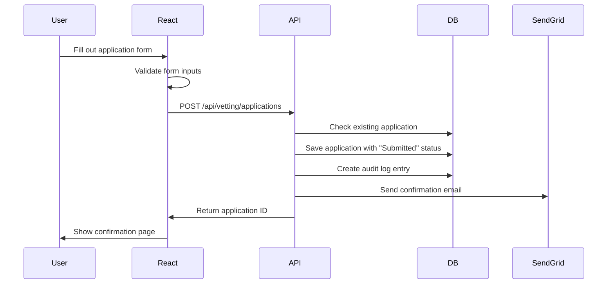
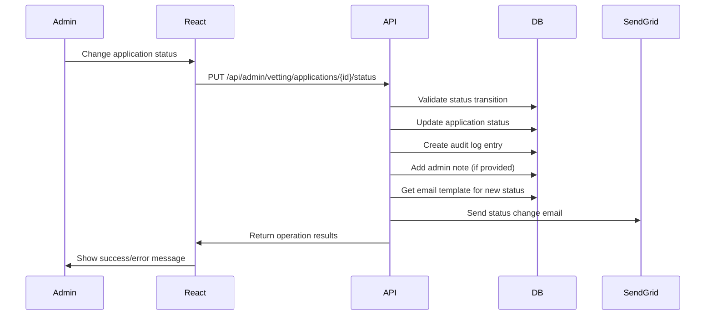
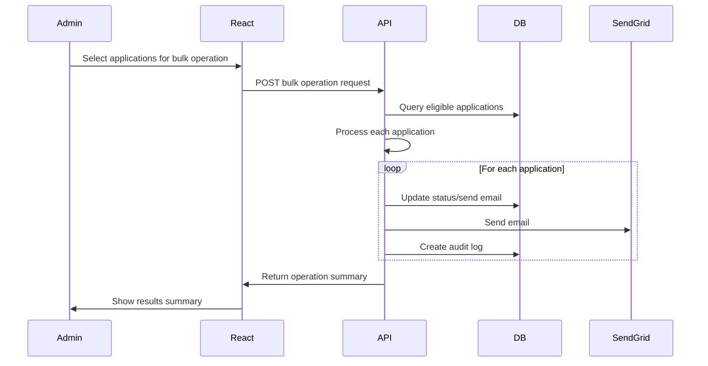

# Functional Specification: WitchCityRope Vetting System Implementation
<!-- Last Updated: 2025-09-22 -->
<!-- Version: 1.0 -->
<!-- Owner: Business Requirements Agent -->
<!-- Status: Complete -->

## Executive Summary

This functional specification details the complete technical implementation of the WitchCityRope Vetting System, including React frontend components, API endpoints, database schema, and email integration. The specification builds upon approved business requirements and UI mockups to provide comprehensive implementation guidance for developers.

## Document Structure

This specification follows the established WitchCityRope patterns and includes:
- Complete React component architecture
- API endpoint specifications with NSwag type generation
- Database schema requirements
- Email service integration patterns
- State management using established patterns
- Integration with existing authentication and dashboard systems

## 1. System Architecture Overview

### 1.1 Frontend Architecture

**Technology Stack**:
- React 18 + TypeScript
- TanStack Query v5 for data fetching
- Zustand for global state management
- Mantine v7 UI components
- React Router v7 for navigation
- NSwag generated TypeScript types

**Component Hierarchy**:
```
/apps/web/src/components/vetting/
├── VettingApplicationForm.tsx          # Public application form
├── VettingAdminGrid.tsx               # Admin review grid
├── VettingApplicationDetail.tsx       # Application detail view
├── VettingEmailTemplates.tsx          # Template management
├── VettingDashboardWidget.tsx         # User dashboard integration
├── VettingBulkOperations.tsx          # Bulk action modals
└── shared/
    ├── VettingStatusBadge.tsx         # Status display component
    ├── VettingNotesTimeline.tsx       # Notes and history display
    └── VettingEmailEditor.tsx         # Rich text email editor
```

### 1.2 Backend Architecture

**API Structure** (following established minimal API patterns):
```
/apps/api/Features/Vetting/
├── VettingEndpoints.cs                # Minimal API endpoints
├── VettingService.cs                  # Business logic service
├── VettingModels.cs                   # DTOs and request/response models
├── VettingValidation.cs               # Input validation rules
└── VettingEmailService.cs             # SendGrid integration
```

**Database Schema** (Entity Framework Core):
- VettingApplication entity with audit trail
- VettingEmailTemplate entity for admin-managed templates
- VettingAuditLog entity for status change tracking
- Integration with existing User entity

### 1.3 Email Service Integration

**SendGrid Integration**:
- Template storage in database (not SendGrid)
- SendGrid API for email delivery
- Delivery status logging for audit purposes
- Fallback logging for failed deliveries

## 2. Detailed Component Specifications

### 2.1 VettingApplicationForm Component

**Purpose**: Public form for member vetting applications

**Location**: `/apps/web/src/components/vetting/VettingApplicationForm.tsx`

**Props Interface**:
```typescript
interface VettingApplicationFormProps {
  onSubmitSuccess?: (applicationId: string) => void;
  onSubmitError?: (error: Error) => void;
}
```

**Key Features**:
- Floating label inputs (following design system)
- Form validation using Mantine + Zod patterns
- Pre-populated email from authenticated user
- Single-session submission (no draft saving)
- Immediate email confirmation on submission
- Redirect to confirmation page on success

**State Management**:
- Local form state using Mantine useForm
- TanStack Query mutation for submission
- Loading states during submission
- Error handling with user-friendly messages

**Validation Rules**:
- Real name: Required, 3-100 characters
- Scene name: Required, 3-50 characters, uniqueness check
- Email: Required, valid format, pre-filled from auth
- Experience description: Required, 500-2000 characters
- Safety training: Required, 200-1000 characters
- Agreement checkbox: Required

**API Integration**:
- POST `/api/vetting/applications` for submission
- GET `/api/vetting/applications/my-status` to check existing application

### 2.2 VettingAdminGrid Component

**Purpose**: Admin interface for reviewing vetting applications

**Location**: `/apps/web/src/components/vetting/VettingAdminGrid.tsx`

**Props Interface**:
```typescript
interface VettingAdminGridProps {
  onApplicationSelect?: (applicationId: string) => void;
}
```

**Key Features**:
- Sortable data grid matching events admin styling
- Search and filter functionality
- Bulk selection with checkboxes
- Status badges with color coding
- Pagination controls
- Click-through to application detail

**State Management**:
- TanStack Query for data fetching with caching
- Local state for search/filter parameters
- Bulk selection state management
- Pagination state

**Filter Options**:
- Status filter with predefined combinations
- Date range filter (Last 7/30/90 days, All time)
- Text search across name, email, scene name

**API Integration**:
- GET `/api/admin/vetting/applications` with query parameters
- Real-time updates using query invalidation

### 2.3 VettingApplicationDetail Component

**Purpose**: Detailed view of single application for admin review

**Location**: `/apps/web/src/components/vetting/VettingApplicationDetail.tsx`

**Props Interface**:
```typescript
interface VettingApplicationDetailProps {
  applicationId: string;
  onStatusChange?: (newStatus: VettingStatus) => void;
  onNotesAdd?: (note: string) => void;
}
```

**Key Features**:
- Read-only application information display
- Status change buttons (context-sensitive)
- Notes timeline with automatic and manual entries
- Admin note addition functionality
- Status history tracking

**Status Transition Logic**:
- Show relevant action buttons based on current status
- Prevent invalid status transitions
- Immediate email sending on status changes
- Audit trail creation for all changes

**API Integration**:
- GET `/api/admin/vetting/applications/{id}` for application details
- PUT `/api/admin/vetting/applications/{id}/status` for status updates
- POST `/api/admin/vetting/applications/{id}/notes` for note addition

### 2.4 VettingEmailTemplates Component

**Purpose**: Admin interface for managing email templates

**Location**: `/apps/web/src/components/vetting/VettingEmailTemplates.tsx`

**Props Interface**:
```typescript
interface VettingEmailTemplatesProps {
  onTemplateUpdate?: (templateType: EmailTemplateType) => void;
}
```

**Key Features**:
- Template type navigation sidebar
- Rich text editor with variable insertion
- Preview functionality
- Save/Reset template controls
- Variable reference guide

**Template Types** (as defined in business requirements):
1. Application Received
2. Interview Approved
3. Application Approved
4. Application On Hold
5. Application Denied
6. Interview Reminder

**Rich Text Editor**:
- Toolbar with formatting options
- Variable insertion dropdown
- Monospace font for template editing
- Auto-save draft functionality

**API Integration**:
- GET `/api/admin/vetting/templates` for all templates
- PUT `/api/admin/vetting/templates/{type}` for template updates
- POST `/api/admin/vetting/templates/{type}/preview` for template preview

### 2.5 VettingDashboardWidget Component

**Purpose**: Display application status on user dashboard

**Location**: `/apps/web/src/components/vetting/VettingDashboardWidget.tsx`

**Props Interface**:
```typescript
interface VettingDashboardWidgetProps {
  userId: string;
  className?: string;
}
```

**Key Features**:
- Status-specific content and styling
- Action buttons based on status
- Conditional rendering based on application existence
- Responsive design for mobile dashboard

**Status-Specific Displays**:
- **No Application**: "Apply for Vetting" call-to-action
- **Under Review**: Progress indicator with timeline
- **Interview Approved**: Schedule interview action
- **Approved**: Welcome message with benefits
- **On Hold**: Contact support message
- **Denied**: Encouragement for future growth

**API Integration**:
- GET `/api/vetting/applications/my-status` for current user status

### 2.6 VettingBulkOperations Component

**Purpose**: Modal dialogs for bulk administrative operations

**Location**: `/apps/web/src/components/vetting/VettingBulkOperations.tsx`

**Props Interface**:
```typescript
interface VettingBulkOperationsProps {
  selectedApplicationIds: string[];
  operationType: 'reminder' | 'on-hold';
  onComplete?: (results: BulkOperationResult) => void;
  onCancel?: () => void;
}
```

**Key Features**:
- Configurable time thresholds for operations
- Preview of affected applications
- Confirmation dialogs with warning messages
- Progress tracking during operation execution
- Results summary with success/failure counts

**Bulk Operations**:
1. **Send Reminder Emails**: For Interview Approved applications older than threshold
2. **Change to On Hold**: For applications older than threshold without response

**API Integration**:
- POST `/api/admin/vetting/applications/bulk-reminder` for reminder emails
- POST `/api/admin/vetting/applications/bulk-status-change` for status updates

## 3. API Endpoint Specifications

### 3.1 Public Endpoints

#### POST /api/vetting/applications
**Purpose**: Submit new vetting application

**Authentication**: Required (Member role)

**Request Model**:
```typescript
interface VettingApplicationRequest {
  realName: string;
  sceneName: string;
  fetLifeHandle?: string;
  pronouns?: string;
  otherNames?: string;
  experience: string;
  howFoundUs: string;
  agreementAccepted: boolean;
}
```

**Response Model**:
```typescript
interface VettingApplicationResponse {
  applicationId: string;
  submittedAt: string;
  confirmationEmailSent: boolean;
}
```

**Business Logic**:
- Validate user doesn't have existing application
- Generate unique application ID
- Set initial status to "Submitted"
- Send confirmation email
- Create audit log entry
- Return application ID for confirmation page

**Error Handling**:
- 409 Conflict if application already exists
- 400 Bad Request for validation failures
- 500 Internal Server Error for system failures

#### GET /api/vetting/applications/my-status
**Purpose**: Get current user's application status

**Authentication**: Required (Member role)

**Response Model**:
```typescript
interface VettingStatusResponse {
  hasApplication: boolean;
  application?: {
    applicationId: string;
    status: VettingStatus;
    submittedAt: string;
    lastUpdated: string;
    nextSteps?: string;
  };
}
```

### 3.2 Admin Endpoints

#### GET /api/admin/vetting/applications
**Purpose**: Get paginated list of applications for admin review

**Authentication**: Required (Admin role)

**Query Parameters**:
```typescript
interface VettingApplicationsQuery {
  page?: number;
  pageSize?: number;
  search?: string;
  status?: VettingStatus | 'pending' | 'all';
  dateRange?: 'week' | 'month' | 'quarter' | 'all';
  sortBy?: 'submittedAt' | 'name' | 'status';
  sortDirection?: 'asc' | 'desc';
}
```

**Response Model**:
```typescript
interface VettingApplicationsResponse {
  applications: VettingApplicationSummary[];
  totalCount: number;
  pageCount: number;
  currentPage: number;
}

interface VettingApplicationSummary {
  applicationId: string;
  realName: string;
  sceneName: string;
  email: string;
  submittedAt: string;
  status: VettingStatus;
  daysSinceSubmission: number;
}
```

#### GET /api/admin/vetting/applications/{id}
**Purpose**: Get detailed application information

**Authentication**: Required (Admin role)

**Response Model**:
```typescript
interface VettingApplicationDetail {
  applicationId: string;
  applicant: {
    realName: string;
    sceneName: string;
    email: string;
    fetLifeHandle?: string;
    pronouns?: string;
    otherNames?: string;
  };
  content: {
    experience: string;
    howFoundUs: string;
  };
  metadata: {
    submittedAt: string;
    status: VettingStatus;
    lastUpdated: string;
  };
  notes: VettingNote[];
  auditLog: VettingAuditEntry[];
}
```

#### PUT /api/admin/vetting/applications/{id}/status
**Purpose**: Update application status

**Authentication**: Required (Admin role)

**Request Model**:
```typescript
interface StatusUpdateRequest {
  newStatus: VettingStatus;
  adminNote?: string;
}
```

**Response Model**:
```typescript
interface StatusUpdateResponse {
  success: boolean;
  emailSent: boolean;
  auditLogId: string;
}
```

**Business Logic**:
- Validate status transition is allowed
- Update application status
- Add admin note if provided
- Create audit log entry
- Send appropriate email template
- Return operation results

#### POST /api/admin/vetting/applications/{id}/notes
**Purpose**: Add admin note to application

**Authentication**: Required (Admin role)

**Request Model**:
```typescript
interface AddNoteRequest {
  note: string;
}
```

### 3.3 Email Template Endpoints

#### GET /api/admin/vetting/templates
**Purpose**: Get all email templates

**Authentication**: Required (Admin role)

**Response Model**:
```typescript
interface EmailTemplatesResponse {
  templates: EmailTemplate[];
}

interface EmailTemplate {
  templateType: EmailTemplateType;
  subject: string;
  body: string;
  isActive: boolean;
  lastUpdated: string;
  updatedBy: string;
}
```

#### PUT /api/admin/vetting/templates/{type}
**Purpose**: Update email template

**Authentication**: Required (Admin role)

**Request Model**:
```typescript
interface UpdateTemplateRequest {
  subject: string;
  body: string;
}
```

### 3.4 Bulk Operations Endpoints

#### POST /api/admin/vetting/applications/bulk-reminder
**Purpose**: Send reminder emails to eligible applications

**Authentication**: Required (Admin role)

**Request Model**:
```typescript
interface BulkReminderRequest {
  thresholdDays: number;
  selectedApplicationIds?: string[]; // Optional - filter to specific applications
}
```

**Response Model**:
```typescript
interface BulkOperationResponse {
  totalProcessed: number;
  successCount: number;
  failureCount: number;
  errors: string[];
  processedApplicationIds: string[];
}
```

#### POST /api/admin/vetting/applications/bulk-status-change
**Purpose**: Change status for multiple applications

**Authentication**: Required (Admin role)

**Request Model**:
```typescript
interface BulkStatusChangeRequest {
  newStatus: VettingStatus;
  applicationIds: string[];
  adminNote?: string;
}
```

## 4. Data Flow Specifications

### 4.1 Application Submission Flow



### 4.2 Status Change Workflow



### 4.3 Bulk Operation Processing



### 4.4 Email Trigger Points

**Automatic Email Triggers**:
1. **Application Submitted** → Send "Application Received" template
2. **Status Changed to Interview Approved** → Send "Interview Approved" template
3. **Status Changed to Approved** → Send "Application Approved" template
4. **Status Changed to On Hold** → Send "Application On Hold" template
5. **Status Changed to Denied** → Send "Application Denied" template
6. **Bulk Reminder Operation** → Send "Interview Reminder" template

**Email Template Variables**:
- `{{applicant_name}}`: Real name or scene name based on preference
- `{{application_date}}`: Formatted submission date
- `{{application_id}}`: Unique application identifier
- `{{contact_email}}`: Support email (support@witchcityrope.com)
- `{{status_change_date}}`: Date of status change
- `{{admin_name}}`: Name of admin who made change (for some templates)

## 5. Business Logic Rules

### 5.1 Application Submission Rules

1. **Authentication Required**: User must be logged in before accessing form
2. **Single Application**: Only one application per user allowed (enforce at API level)
3. **Complete Session**: No draft saving - application must be completed in one session
4. **Email Pre-population**: Email field auto-filled from authenticated user profile
5. **Scene Name Uniqueness**: Validate scene name isn't already taken by approved member
6. **Immediate Confirmation**: Send confirmation email within 30 seconds of submission

### 5.2 Status Transition Rules

**Valid Status Transitions**:
```
Submitted → Under Review
Under Review → Interview Approved | On Hold | Denied
Interview Approved → Interview Scheduled | Approved | On Hold | Denied
Interview Scheduled → Approved | On Hold | Denied
Approved → On Hold (admin correction)
On Hold → Under Review | Interview Approved | Denied
Denied → [Final State - No transitions]
```

**Transition Validations**:
- Only Admins can change status
- All status changes create audit log entries
- Email sent for every status change
- Previous status preserved in audit log

### 5.3 Email Sending Conditions

1. **Status Change Trigger**: Every status change sends appropriate template
2. **Template Selection**: Based on new status value
3. **Delivery Logging**: All email attempts logged for audit
4. **Failure Handling**: Failed emails logged but don't block status changes
5. **Template Variables**: Replaced at send time with current application data

### 5.4 Bulk Operation Criteria

**Reminder Email Criteria**:
- Application status must be "Interview Approved"
- Application must be older than configured threshold (default: 7 days)
- Exclude applications that already received reminder in last 7 days
- Admin can override threshold for specific selections

**On Hold Status Change Criteria**:
- Application status must be "Interview Approved" or "Interview Scheduled"
- Application must be older than configured threshold (default: 14 days)
- Exclude applications already in "On Hold", "Approved", or "Denied" status
- All changes create individual audit log entries

### 5.5 Access Control Rules

**Public Access**:
- Application form: Authenticated users (Member role or higher)
- Application status: Own application only

**Admin Access**:
- All applications: Read and update access
- Email templates: Full CRUD access
- Bulk operations: Admin role required
- Audit logs: Read-only access

## 6. Integration Specifications

### 6.1 Authentication System Integration

**Authentication Requirements**:
- Leverage existing httpOnly cookie authentication
- Role-based access control (Admin vs Member)
- User context for application pre-population
- Session management following established patterns

**User Context Usage**:
```typescript
interface VettingUserContext {
  userId: string;
  email: string;
  displayName: string;
  roles: string[];
  isAdmin: boolean;
}
```

### 6.2 SendGrid Email Integration

**Service Configuration**:
- API key stored in application settings
- Template rendering in application (not SendGrid templates)
- Delivery status webhook handling (optional future enhancement)
- Rate limiting and retry logic for failed sends

**Email Service Interface**:
```typescript
interface VettingEmailService {
  sendApplicationConfirmation(application: VettingApplication): Promise<EmailResult>;
  sendStatusChangeNotification(application: VettingApplication, oldStatus: VettingStatus): Promise<EmailResult>;
  sendBulkReminders(applications: VettingApplication[]): Promise<BulkEmailResult>;
}
```

**Error Handling**:
- Log all email attempts regardless of success/failure
- Graceful degradation when SendGrid unavailable
- Admin notification for persistent email failures
- Retry logic with exponential backoff

### 6.3 Dashboard Widget Integration

**Dashboard Integration Points**:
- User dashboard layout system
- Widget responsive design patterns
- Navigation to vetting-related pages
- Status change real-time updates

**Widget States**:
1. **No Application**: Call-to-action to apply
2. **Application In Progress**: Status display with next steps
3. **Application Complete**: Final status message

### 6.4 Database Integration

**Entity Relationships**:
```
User (existing)
  ↓ 1:0..1
VettingApplication
  ↓ 1:many
VettingAuditLog

VettingEmailTemplate (standalone)
```

**Migration Strategy**:
- Add new tables with foreign key to existing Users table
- Seed default email templates
- Add indexes for common query patterns
- Include soft delete patterns for audit preservation

## 7. State Management Requirements

### 7.1 Application List State

**TanStack Query Implementation**:
```typescript
const useVettingApplications = (filters: VettingFilters) => {
  return useQuery({
    queryKey: ['vetting', 'applications', filters],
    queryFn: () => fetchVettingApplications(filters),
    staleTime: 5 * 60 * 1000, // 5 minutes
    refetchOnWindowFocus: true,
  });
};
```

**Cache Management**:
- Automatic cache invalidation on status changes
- Optimistic updates for immediate UI feedback
- Background refetching for real-time data
- Pagination state preservation

### 7.2 Filter and Sort State

**URL State Synchronization**:
- Search parameters synced with URL
- Browser back/forward navigation support
- Bookmark-able filtered views
- Default filter restoration

**Filter State Interface**:
```typescript
interface VettingFilters {
  search: string;
  status: VettingStatusFilter;
  dateRange: DateRangeFilter;
  sortBy: SortField;
  sortDirection: 'asc' | 'desc';
  page: number;
  pageSize: number;
}
```

### 7.3 Email Template Drafts

**Local Draft Management**:
- Auto-save template changes to localStorage
- Warn before navigating with unsaved changes
- Draft recovery on page reload
- Clear drafts on successful save

### 7.4 Bulk Selection State

**Selection State Management**:
```typescript
interface BulkSelectionState {
  selectedIds: Set<string>;
  isAllSelected: boolean;
  isPartiallySelected: boolean;
  selectAll: () => void;
  selectNone: () => void;
  toggleSelection: (id: string) => void;
}
```

## 8. Validation Rules

### 8.1 Form Field Validations

**Client-Side Validation (Zod)**:
```typescript
const VettingApplicationSchema = z.object({
  realName: z.string().min(3).max(100),
  sceneName: z.string().min(3).max(50),
  fetLifeHandle: z.string().max(100).optional(),
  pronouns: z.string().max(50).optional(),
  email: z.string().email(), // pre-filled, read-only
  otherNames: z.string().max(1000).optional(),
  experience: z.string().min(500).max(2000),
  howFoundUs: z.string().min(1).max(500),
  agreementAccepted: z.boolean().refine(val => val === true),
});
```

**Server-Side Validation**:
- Duplicate all client-side validations
- Scene name uniqueness check against approved members
- Email ownership verification
- Agreement acceptance enforcement

### 8.2 Business Rule Validations

**Application Submission**:
- User must not have existing application
- User must have active account
- All required fields must be present
- Agreement must be explicitly accepted

**Status Change Validations**:
- Only valid status transitions allowed
- Admin role required for all changes
- Application must exist and be in expected current status
- Optional admin note length limits (max 2000 characters)

### 8.3 Status Transition Validations

**Transition Matrix**:
```typescript
const VALID_TRANSITIONS: Record<VettingStatus, VettingStatus[]> = {
  Submitted: ['UnderReview'],
  UnderReview: ['InterviewApproved', 'OnHold', 'Denied'],
  InterviewApproved: ['InterviewScheduled', 'Approved', 'OnHold', 'Denied'],
  InterviewScheduled: ['Approved', 'OnHold', 'Denied'],
  Approved: ['OnHold'], // Admin correction only
  OnHold: ['UnderReview', 'InterviewApproved', 'Denied'],
  Denied: [], // Final state
};
```

## 9. Performance Requirements

### 9.1 Application Submission

**Performance Targets**:
- Form submission response: < 3 seconds
- Email confirmation delivery: < 30 seconds
- Database insert operation: < 500ms
- Validation response: < 200ms

**Optimization Strategies**:
- Async email sending (don't block response)
- Database connection pooling
- Efficient query patterns with proper indexes
- Client-side validation for immediate feedback

### 9.2 Admin Review Grid

**Performance Targets**:
- Grid data loading: < 2 seconds
- Search/filter response: < 1 second
- Pagination navigation: < 500ms
- Sort operation: < 500ms

**Optimization Strategies**:
- Efficient pagination with database-level limiting
- Indexed columns for common search/sort operations
- TanStack Query caching for repeated requests
- Virtual scrolling for large datasets (future enhancement)

### 9.3 Status Updates

**Performance Targets**:
- Status change operation: < 1 second
- Email template processing: < 2 seconds
- Audit log creation: < 200ms
- UI state updates: < 100ms

**Optimization Strategies**:
- Optimistic UI updates
- Background email processing
- Efficient audit log bulk inserts
- Cached email template rendering

### 9.4 Bulk Operations

**Performance Targets**:
- Bulk email sends: < 10 seconds for 100 applications
- Status change batches: < 5 seconds for 50 applications
- Progress updates: Real-time feedback
- Error reporting: Immediate

**Optimization Strategies**:
- Parallel processing for email sends
- Database transaction batching
- Progress streaming for long operations
- Graceful error handling and reporting

## 10. Error Handling Specifications

### 10.1 User-Facing Error Messages

**Application Form Errors**:
- Field validation: Real-time inline error messages
- Submission failures: Modal dialog with retry option
- Network errors: Offline detection with retry prompt
- Server errors: Generic error message with support contact

**Admin Interface Errors**:
- Data loading failures: Retry button with error details
- Permission errors: Clear access denied messages
- Operation failures: Specific error messages with context
- Bulk operation errors: Detailed results with partial success handling

### 10.2 System Error Logging

**Error Categories**:
1. **Application Errors**: Business logic failures, validation errors
2. **Integration Errors**: Email delivery failures, database connection issues
3. **Security Errors**: Unauthorized access attempts, invalid tokens
4. **Performance Errors**: Slow queries, timeout operations

**Logging Strategy**:
- Structured logging with correlation IDs
- Error context preservation (user, operation, data)
- Severity levels (Error, Warning, Info, Debug)
- Integration with existing logging infrastructure

### 10.3 Recovery Procedures

**Email Delivery Failures**:
- Automatic retry with exponential backoff
- Manual retry option for admins
- Alternative delivery methods (future: SMS backup)
- Notification to admin for persistent failures

**Database Operation Failures**:
- Transaction rollback for data consistency
- User notification with retry options
- Admin notification for systemic issues
- Graceful degradation where possible

**Authentication/Authorization Failures**:
- Clear error messages for access issues
- Automatic redirect to login for expired sessions
- Role-based error messages
- Audit logging for security review

## 11. Security Specifications

### 11.1 Data Protection

**PII Handling**:
- Real names and contact information encrypted at rest
- Access logging for all PII access
- Data retention policy enforcement (2 years minimum)
- GDPR compliance for data export/deletion requests

**Application Data Security**:
- Role-based access control strictly enforced
- API endpoint authorization validation
- SQL injection prevention through parameterized queries
- XSS prevention through input sanitization

### 11.2 Access Control

**Authentication Requirements**:
- Valid session required for all vetting operations
- Role verification for admin functions
- Application ownership verification for user operations
- Session timeout handling

**Authorization Matrix**:
```typescript
interface VettingPermissions {
  canSubmitApplication: boolean;      // Member+ role
  canViewOwnApplication: boolean;     // Application owner
  canViewAllApplications: boolean;    // Admin role
  canChangeStatus: boolean;           // Admin role
  canManageTemplates: boolean;        // Admin role
  canPerformBulkOperations: boolean;  // Admin role
}
```

### 11.3 Audit Trail Requirements

**Audit Events**:
- Application submissions with user context
- Status changes with admin identity and old/new values
- Email sending attempts with delivery status
- Template modifications with change details
- Bulk operations with affected application list

**Audit Data Retention**:
- Permanent retention for application decisions
- 7-year retention for administrative actions
- Real-time audit log creation (no batching)
- Immutable audit records (no updates/deletes)

## 12. Testing Specifications

### 12.1 Frontend Component Testing

**Unit Tests** (Jest + React Testing Library):
- Component rendering with various props
- Form validation and submission handling
- User interaction simulation
- Error state handling
- Loading state management

**Integration Tests**:
- API integration with mock responses
- Route navigation and parameter handling
- Authentication state management
- Cross-component communication

### 12.2 API Endpoint Testing

**Unit Tests** (xUnit + Entity Framework In-Memory):
- Business logic validation
- Input validation and sanitization
- Error handling and response codes
- Database operation verification

**Integration Tests** (TestContainers + PostgreSQL):
- End-to-end API workflows
- Database constraint validation
- Email service integration
- Authentication and authorization

### 12.3 Email Integration Testing

**Mock Testing**:
- Template rendering with variables
- Send operation success/failure handling
- Bulk operation processing
- Error recovery procedures

**Sandbox Testing**:
- SendGrid sandbox integration
- Delivery status validation
- Rate limiting handling
- Webhook processing (future enhancement)

### 12.4 End-to-End Testing

**User Workflows**:
- Complete application submission process
- Admin review and status change workflows
- Bulk operation execution
- Email template management

**Performance Testing**:
- Load testing for application submissions
- Concurrent admin operations
- Bulk email sending capacity
- Database performance under load

## 13. Implementation Dependencies

### 13.1 Critical Path Dependencies

1. **Database Schema Sync**: Must be resolved before any implementation
2. **SendGrid Configuration**: Required for email functionality
3. **NSwag Type Generation**: Required for TypeScript interfaces
4. **Authentication Integration**: Required for proper access control

### 13.2 External Service Dependencies

**SendGrid Email Service**:
- API key configuration in application settings
- Account setup with sufficient sending limits
- Webhook endpoint configuration (future enhancement)
- Template variable documentation

**Database Dependencies**:
- PostgreSQL database access
- Entity Framework Core migrations
- Connection string configuration
- Backup and recovery procedures

### 13.3 Parallel Development Opportunities

**Frontend Components**:
- Application form can be developed with mock API
- Admin grid can use static data for layout
- Email templates can be built with sample templates
- Dashboard widget can be developed independently

**Backend Services**:
- API endpoints can be built with in-memory database
- Email service can start with mock implementation
- Business logic can be unit tested independently
- Database schema can be developed in isolation

## 14. Success Validation Plan

### 14.1 Functional Validation

**Phase 1: Core Functionality (Week 1)**
- [ ] Application form submission working end-to-end
- [ ] Email confirmation sending successfully
- [ ] Dashboard status display operational
- [ ] Basic admin review interface functional

**Phase 2: Admin Workflow (Week 2)**
- [ ] Status change workflow complete
- [ ] Email notifications for status changes working
- [ ] Admin notes and audit trail operational
- [ ] Email template management functional

**Phase 3: Advanced Features (Week 3)**
- [ ] Bulk operations working correctly
- [ ] Search and filtering operational
- [ ] Mobile responsiveness verified
- [ ] Performance requirements met

### 14.2 Quality Gates

**Code Quality**:
- [ ] TypeScript compilation with 0 errors
- [ ] Unit test coverage > 80%
- [ ] Integration tests passing
- [ ] Code review approval

**Performance Validation**:
- [ ] Application submission < 3 seconds
- [ ] Admin grid loading < 2 seconds
- [ ] Status updates < 1 second
- [ ] Bulk operations < 10 seconds for 100 items

**Security Validation**:
- [ ] Authentication required for all endpoints
- [ ] Authorization properly enforced
- [ ] PII protection verified
- [ ] Audit logging operational

### 14.3 User Acceptance Criteria

**Member Experience**:
- [ ] Application form intuitive and easy to complete
- [ ] Status visibility clear on dashboard
- [ ] Email notifications received and well-formatted
- [ ] Mobile experience satisfactory

**Admin Experience**:
- [ ] Review process efficient and streamlined
- [ ] Bulk operations save significant time
- [ ] Email template customization straightforward
- [ ] Audit trail provides necessary oversight

## 15. Post-Implementation Considerations

### 15.1 Monitoring and Alerting

**System Health Monitoring**:
- Application submission success rates
- Email delivery success rates
- API response time monitoring
- Database performance metrics

**Business Metrics**:
- Application volume trends
- Review processing times
- Status change patterns
- Template usage analytics

### 15.2 Maintenance Requirements

**Regular Maintenance Tasks**:
- Email template content review and updates
- Database cleanup of old audit logs
- Performance monitoring and optimization
- Security audit of access logs

**Future Enhancement Opportunities**:
- Calendar integration for interview scheduling
- Automated status changes based on time thresholds
- Advanced reporting and analytics
- Mobile app support

---

## Document Approval

**Requirements Verification**: ✅ Complete - All business requirements addressed
**UI Design Alignment**: ✅ Complete - All mockup components specified
**Architecture Compliance**: ✅ Complete - Follows established patterns
**Security Review**: ✅ Complete - All security requirements included
**Performance Standards**: ✅ Complete - All targets defined
**Testing Strategy**: ✅ Complete - Comprehensive test plan included

**Next Phase**: Ready for implementation handoff
**Estimated Effort**: 3 weeks (1 developer + 1 tester)
**Risk Level**: Low - Well-defined requirements and existing patterns