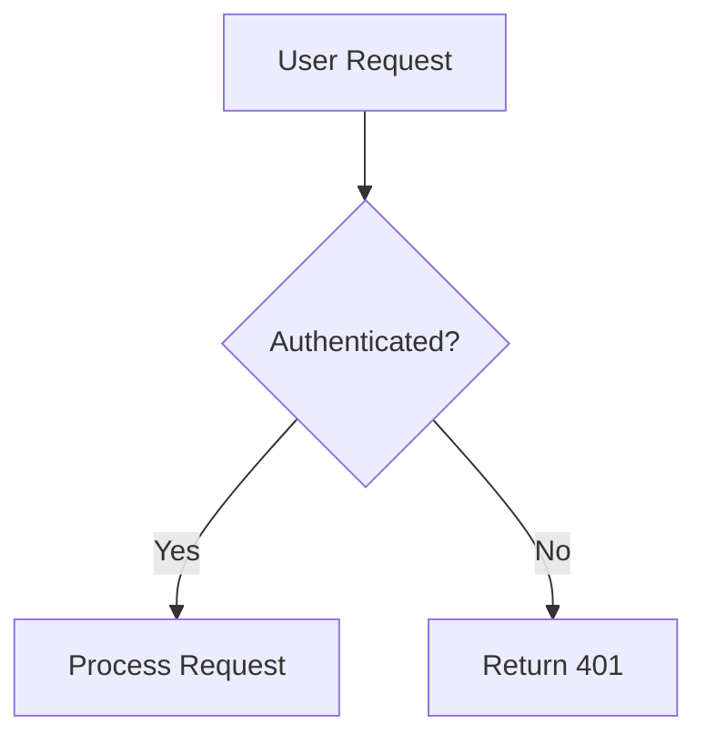

# Documentation Process Guide
<!-- Last Updated: 2025-08-04 -->
<!-- Version: 1.0 -->
<!-- Owner: Documentation Team -->
<!-- Status: Active -->

## Overview
This guide provides comprehensive instructions for creating, maintaining, and organizing documentation in the WitchCityRope project. Following these standards ensures consistency, discoverability, and maintainability across all documentation.

## Documentation Philosophy

### Core Principles
1. **Single Source of Truth**: Each piece of information should exist in exactly one place
2. **Discoverability**: Documentation should be easy to find and navigate
3. **Maintainability**: Documents should be easy to update and keep current
4. **Clarity**: Write for your audience - be clear, concise, and complete
5. **Versioning**: Track changes and maintain historical context

### Documentation as Code
- Documentation lives with the code it describes
- Changes to code require documentation updates
- Documentation is reviewed as part of PRs
- Automated validation where possible

## Documentation Structure

### Overall Organization
```
WitchCityRope/
├── README.md                    # Project overview and quick start
├── PROGRESS.md                  # Current project status
├── ARCHITECTURE.md              # System architecture overview
├── CLAUDE.md                    # AI assistant configuration
├── docs/
│   ├── 00-START-HERE.md        # Documentation navigation guide
│   ├── functional-areas/        # Feature-specific documentation
│   │   ├── _template/          # Template for new functional areas
│   │   ├── authentication/     # Auth system docs
│   │   ├── events-management/  # Events system docs
│   │   └── [area]/
│   │       ├── README.md       # Area overview
│   │       ├── current-state/  # Current implementation
│   │       └── new-work/       # Active development
│   ├── standards-processes/     # Development standards
│   │   ├── documentation-process/
│   │   ├── testing/
│   │   └── coding-standards/
│   ├── lessons-learned/         # Experience-based guidance
│   │   ├── ui-developers.md
│   │   ├── api-developers.md
│   │   └── test-writers.md
│   ├── architecture/           # System design docs
│   ├── guides-setup/           # Operational guides
│   └── _archive/               # Historical documentation
```

## Creating New Documentation

### 1. Functional Area Documentation

When documenting a new functional area:

```bash
# Copy the template
cp -r docs/functional-areas/_template docs/functional-areas/new-feature

# Update the following files:
# - README.md (overview)
# - current-state/business-requirements.md
# - current-state/functional-design.md
# - current-state/user-flows.md
# - current-state/test-coverage.md
# - current-state/wireframes.md (if applicable)
```

### 2. Document Headers

Every document should start with:

```markdown
# Document Title
<!-- Last Updated: YYYY-MM-DD -->
<!-- Version: X.Y -->
<!-- Owner: Team/Person Name -->
<!-- Status: Draft|Active|Deprecated -->

## Overview
Brief description of what this document covers and its purpose.
```

### 3. File Naming Conventions

- Use descriptive names: `authentication-flow.md` not `auth.md`
- Use hyphens for spaces: `user-registration-process.md`
- Use UPPERCASE for special files: `README.md`, `TODO.md`
- Include dates in status files: `status-2025-08-04.md`

## Documentation Types

### 1. Business Requirements
**Purpose**: Define what the system should do from a business perspective
**Audience**: Product owners, stakeholders, developers
**Contents**:
- User stories
- Acceptance criteria
- Business rules
- Constraints
- Examples

### 2. Technical Design
**Purpose**: Explain how the system implements requirements
**Audience**: Developers, architects
**Contents**:
- Architecture diagrams
- API specifications
- Data models
- Integration points
- Security considerations

### 3. User Flows
**Purpose**: Document user journeys through the system
**Audience**: UX designers, developers, testers
**Contents**:
- Step-by-step flows
- Decision points
- Error scenarios
- Mermaid diagrams

### 4. Test Documentation
**Purpose**: Ensure quality and coverage
**Audience**: Test engineers, developers
**Contents**:
- Test strategies
- Coverage reports
- Test data
- Known issues

### 5. Operational Guides
**Purpose**: Help users operate the system
**Audience**: Admins, support staff, end users
**Contents**:
- How-to guides
- Troubleshooting
- FAQs
- Best practices

## Writing Guidelines

### Style Guide

1. **Voice and Tone**
   - Professional but approachable
   - Direct and concise
   - Avoid jargon without explanation
   - Use active voice

2. **Formatting**
   - Use headers for structure (##, ###, ####)
   - Use bullet points for lists
   - Use code blocks for examples
   - Use tables for comparisons
   - Bold key terms on first use

3. **Code Examples**
   ```csharp
   // Good: Include context and explanation
   // This validates user input before processing
   public Result<User> ValidateUser(UserDto dto)
   {
       if (string.IsNullOrEmpty(dto.Email))
           return Result.Failure<User>("Email is required");
       
       // Additional validation...
   }
   ```

### Diagrams and Visuals

Use Mermaid for diagrams when possible:



For complex diagrams, use external tools and save as PNG/SVG in the same directory.

## Maintenance Process

### Regular Reviews

1. **Quarterly Reviews**
   - Verify accuracy against current code
   - Update outdated information
   - Archive obsolete documents
   - Check broken links

2. **With Each Release**
   - Update feature documentation
   - Add new functionality
   - Update PROGRESS.md
   - Review public-facing docs

### Change Management

1. **Before Making Changes**
   - Check if information exists elsewhere
   - Consider impact on related docs
   - Update version and date in header

2. **Making Updates**
   - Use clear commit messages
   - Reference related PRs/issues
   - Update cross-references
   - Notify document owner

3. **After Changes**
   - Verify all links work
   - Check formatting
   - Update navigation if needed

### Archiving Process

When documentation becomes obsolete:

1. **Move to Archive**
   ```bash
   mkdir -p docs/_archive/[area]/[year]
   git mv old-doc.md docs/_archive/[area]/[year]/
   ```

2. **Create Archive README**
   - Explain why archived
   - Reference replacement docs
   - Note consolidation efforts

3. **Update References**
   - Find all links to archived doc
   - Update to point to new location
   - Update navigation files

## Common Patterns

### API Documentation Template
```markdown
## Endpoint: [HTTP Method] /api/[resource]

### Description
Brief description of what this endpoint does

### Request
- **Headers**: Required headers
- **Body**: Request payload structure
- **Query Parameters**: Optional parameters

### Response
- **Success (200)**: Response structure
- **Errors**: Possible error codes and meanings

### Example
```

### Feature Documentation Template
```markdown
## Feature: [Name]

### Overview
What this feature does and why it exists

### User Stories
As a [role], I want to [action] so that [benefit]

### Technical Implementation
- Key components
- Data flow
- Integration points

### Testing
- Test scenarios
- Edge cases
- Performance considerations
```

## Tools and Automation

### Validation Tools
- Markdown linters for formatting
- Link checkers for broken references
- Spell checkers for typos
- Custom scripts for structure validation

### Generation Tools
- API documentation from OpenAPI specs
- Database schema docs from migrations
- Test coverage reports
- Dependency graphs

## Best Practices

### DO:
- ✅ Keep documents focused on a single topic
- ✅ Use examples to illustrate concepts
- ✅ Include "last updated" dates
- ✅ Cross-reference related documents
- ✅ Test your instructions
- ✅ Get reviews from your audience

### DON'T:
- ❌ Duplicate information
- ❌ Mix concerns in one document
- ❌ Use absolute paths in links
- ❌ Leave TODOs in documentation
- ❌ Include sensitive information
- ❌ Write walls of text

## Getting Help

### Documentation Questions
- Check `/docs/00-START-HERE.md` first
- Review this guide
- Ask in development chat
- Create an issue for gaps

### Contributing
1. Fork the repository
2. Create a feature branch
3. Follow these guidelines
4. Submit a PR with clear description
5. Address review feedback

---

*This guide is maintained by the Documentation Team. For questions or improvements, please create an issue or PR.*