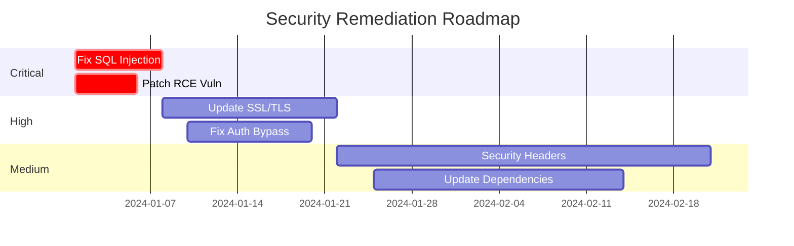

# Security Audit Report Template

**Document Classification:** [Confidential/Internal/Public]  
**Report Date:** [YYYY-MM-DD]  
**Report Version:** [1.0]  
**Prepared By:** [Auditor Name/Company]  
**Prepared For:** [Client Name/Company]

---

## Executive Summary

### Overview
[Brief description of the security audit scope, objectives, and high-level findings. This section should be readable by non-technical executives.]

### Key Findings
- **Critical Issues:** [Number]
- **High Risk Issues:** [Number]
- **Medium Risk Issues:** [Number]
- **Low Risk Issues:** [Number]
- **Informational Issues:** [Number]

### Overall Security Posture
[Overall assessment of the organization's security posture - use a rating system like: Excellent/Good/Fair/Poor]

### Business Impact Summary
[Brief description of potential business impacts if vulnerabilities are exploited]

### Priority Recommendations
1. [Most critical recommendation]
2. [Second priority recommendation]
3. [Third priority recommendation]

---

## 1. Introduction

### 1.1 Purpose
[Explain the purpose of this security audit and what it aims to achieve]

### 1.2 Scope
[Detailed description of what was included in the audit]

**In Scope:**
- [ ] Web Applications: [List URLs/domains]
- [ ] Network Infrastructure: [IP ranges]
- [ ] Mobile Applications: [App names/versions]
- [ ] APIs: [Endpoints]
- [ ] Cloud Infrastructure: [Providers/services]
- [ ] Physical Security: [Locations]

**Out of Scope:**
- [ ] [Explicitly excluded items]

### 1.3 Methodology
[Describe the testing methodology used]

- **Standards Followed:** [OWASP, NIST, ISO 27001, etc.]
- **Testing Type:** [Black box/Gray box/White box]
- **Tools Used:** [List of security tools]
- **Time Period:** [Start date - End date]

### 1.4 Limitations
[Any limitations encountered during the audit]

---

## 2. Risk Assessment Methodology

### Risk Rating Matrix

| Severity | CVSS Score | Business Impact | Exploitation Difficulty | Description |
|----------|------------|-----------------|------------------------|-------------|
| Critical | 9.0-10.0 | Severe | Trivial | Immediate action required |
| High | 7.0-8.9 | Major | Easy | Address within 7 days |
| Medium | 4.0-6.9 | Moderate | Moderate | Address within 30 days |
| Low | 0.1-3.9 | Minor | Difficult | Address within 90 days |
| Info | 0.0 | None | N/A | Best practice recommendation |

### Risk Calculation Formula
```
Risk Score = (Impact × Likelihood) / Mitigation Difficulty
```

---

## 3. Findings Summary

### 3.1 Vulnerability Distribution

| Category | Critical | High | Medium | Low | Info | Total |
|----------|----------|------|--------|-----|------|-------|
| Authentication | 0 | 0 | 0 | 0 | 0 | 0 |
| Authorization | 0 | 0 | 0 | 0 | 0 | 0 |
| Input Validation | 0 | 0 | 0 | 0 | 0 | 0 |
| Session Management | 0 | 0 | 0 | 0 | 0 | 0 |
| Configuration | 0 | 0 | 0 | 0 | 0 | 0 |
| Cryptography | 0 | 0 | 0 | 0 | 0 | 0 |
| Information Disclosure | 0 | 0 | 0 | 0 | 0 | 0 |
| **Total** | **0** | **0** | **0** | **0** | **0** | **0** |

### 3.2 Top 10 Vulnerabilities
1. [Vulnerability Name] - [Severity]
2. [Vulnerability Name] - [Severity]
3. [Vulnerability Name] - [Severity]
4. [Vulnerability Name] - [Severity]
5. [Vulnerability Name] - [Severity]
6. [Vulnerability Name] - [Severity]
7. [Vulnerability Name] - [Severity]
8. [Vulnerability Name] - [Severity]
9. [Vulnerability Name] - [Severity]
10. [Vulnerability Name] - [Severity]

---

## 4. Detailed Findings

### 4.1 Critical Vulnerabilities

#### CRIT-001: [Vulnerability Title]

**Severity:** Critical  
**CVSS Score:** [9.5]  
**CWE ID:** [CWE-XX]  
**OWASP Category:** [A01:2021]  

**Affected Assets:**
- [Asset 1]
- [Asset 2]

**Description:**
[Detailed description of the vulnerability and its technical details]

**Impact:**
[Description of the potential impact if this vulnerability is exploited]

**Proof of Concept:**
```
[Include code, screenshots, or steps to reproduce]
```

**Remediation:**
[Detailed steps to fix the vulnerability]

**References:**
- [Link to relevant documentation]
- [Link to patches or updates]

---

### 4.2 High Risk Vulnerabilities

#### HIGH-001: [Vulnerability Title]

**Severity:** High  
**CVSS Score:** [8.2]  
**CWE ID:** [CWE-XX]  
**OWASP Category:** [A02:2021]  

**Affected Assets:**
- [Asset 1]

**Description:**
[Detailed description]

**Impact:**
[Impact description]

**Proof of Concept:**
[Evidence/reproduction steps]

**Remediation:**
[Fix instructions]

---

### 4.3 Medium Risk Vulnerabilities

#### MED-001: [Vulnerability Title]

**Severity:** Medium  
**CVSS Score:** [5.3]  
**CWE ID:** [CWE-XX]  

[Follow same format as above]

---

### 4.4 Low Risk Vulnerabilities

#### LOW-001: [Vulnerability Title]

**Severity:** Low  
**CVSS Score:** [2.1]  
**CWE ID:** [CWE-XX]  

[Follow same format as above]

---

### 4.5 Informational Findings

#### INFO-001: [Finding Title]

**Severity:** Informational  
**Category:** [Best Practice/Configuration]  

[Description and recommendations]

---

## 5. Compliance Assessment

### 5.1 Regulatory Compliance

| Regulation | Status | Gaps Identified | Priority |
|------------|--------|-----------------|----------|
| PCI-DSS | [Compliant/Non-compliant] | [List gaps] | [High/Medium/Low] |
| GDPR | [Compliant/Non-compliant] | [List gaps] | [High/Medium/Low] |
| HIPAA | [Compliant/Non-compliant] | [List gaps] | [High/Medium/Low] |
| SOC 2 | [Compliant/Non-compliant] | [List gaps] | [High/Medium/Low] |

### 5.2 Industry Standards

| Standard | Compliance Level | Notes |
|----------|------------------|-------|
| ISO 27001 | [Percentage] | [Comments] |
| NIST CSF | [Percentage] | [Comments] |
| CIS Controls | [Percentage] | [Comments] |

---

## 6. Security Architecture Review

### 6.1 Network Architecture
[Assessment of network segmentation, firewall rules, DMZ implementation]

### 6.2 Application Architecture
[Assessment of application design, API security, data flow]

### 6.3 Cloud Architecture
[Assessment of cloud security controls, IAM, encryption]

### 6.4 Security Controls Assessment

| Control Category | Current State | Target State | Gap |
|-----------------|---------------|--------------|-----|
| Preventive Controls | [Assessment] | [Recommendation] | [Gap analysis] |
| Detective Controls | [Assessment] | [Recommendation] | [Gap analysis] |
| Corrective Controls | [Assessment] | [Recommendation] | [Gap analysis] |

---

## 7. Positive Findings

### 7.1 Security Strengths
- [Strong security control or practice observed]
- [Another positive finding]
- [Good implementation noted]

### 7.2 Compliance Achievements
- [Compliance standard met]
- [Security certification achieved]

---

## 8. Recommendations

### 8.1 Immediate Actions (0-7 days)
1. **[Critical Fix]**
   - Description: [What needs to be done]
   - Resources Required: [Team/tools needed]
   - Estimated Effort: [Hours/days]

### 8.2 Short-term Actions (7-30 days)
1. **[High Priority Fix]**
   - Description: [What needs to be done]
   - Resources Required: [Team/tools needed]
   - Estimated Effort: [Hours/days]

### 8.3 Medium-term Actions (30-90 days)
1. **[Medium Priority Fix]**
   - Description: [What needs to be done]
   - Resources Required: [Team/tools needed]
   - Estimated Effort: [Hours/days]

### 8.4 Long-term Strategic Recommendations
1. **[Strategic Initiative]**
   - Objective: [What to achieve]
   - Benefits: [Expected outcomes]
   - Investment Required: [Budget estimate]

---

## 9. Remediation Roadmap

### 9.1 Remediation Timeline



### 9.2 Resource Allocation

| Phase | Team Required | Estimated Hours | Cost Estimate |
|-------|---------------|-----------------|---------------|
| Phase 1: Critical | Security Team + Dev | 80 hrs | $[Amount] |
| Phase 2: High | Dev Team | 160 hrs | $[Amount] |
| Phase 3: Medium | Dev Team | 120 hrs | $[Amount] |
| Phase 4: Low | IT Team | 40 hrs | $[Amount] |

---

## 10. Testing Evidence

### 10.1 Screenshots
[Include relevant screenshots with captions]

### 10.2 Log Excerpts
```
[Include relevant log entries that support findings]
```

### 10.3 Tool Outputs
```
[Include sanitized tool outputs]
```

---

## 11. Conclusion

### 11.1 Overall Assessment
[Comprehensive summary of the security posture]

### 11.2 Risk Reduction Metrics
- Current Risk Score: [XX]
- Post-remediation Risk Score: [YY]
- Risk Reduction: [ZZ%]

### 11.3 Next Steps
1. [Immediate action item]
2. [Follow-up assessment recommendation]
3. [Ongoing monitoring suggestion]

---

## 12. Appendices

### Appendix A: Glossary
| Term | Definition |
|------|------------|
| [Term] | [Definition] |

### Appendix B: Tools Used
- **[Tool Name]** - Version [X.X] - [Purpose]
- **[Tool Name]** - Version [X.X] - [Purpose]

### Appendix C: References
1. [OWASP Top 10 2021](https://owasp.org/Top10/)
2. [NIST Cybersecurity Framework](https://www.nist.gov/cyberframework)
3. [CWE Top 25](https://cwe.mitre.org/top25/)

### Appendix D: Contact Information
**Audit Team:**
- Lead Auditor: [Name] - [Email]
- Security Analyst: [Name] - [Email]

**Client Contacts:**
- Technical Contact: [Name] - [Email]
- Business Contact: [Name] - [Email]

---

## Document Control

| Version | Date | Author | Changes |
|---------|------|--------|---------|
| 1.0 | [Date] | [Name] | Initial report |
| | | | |

**Disclaimer:** This report contains confidential information and is intended solely for the use of [Client Name]. Distribution is limited to authorized personnel only.

---

**Report Approval:**

Prepared By: _________________________ Date: _____________  
[Auditor Name]

Reviewed By: _________________________ Date: _____________  
[Reviewer Name]

Accepted By: _________________________ Date: _____________  
[Client Representative]